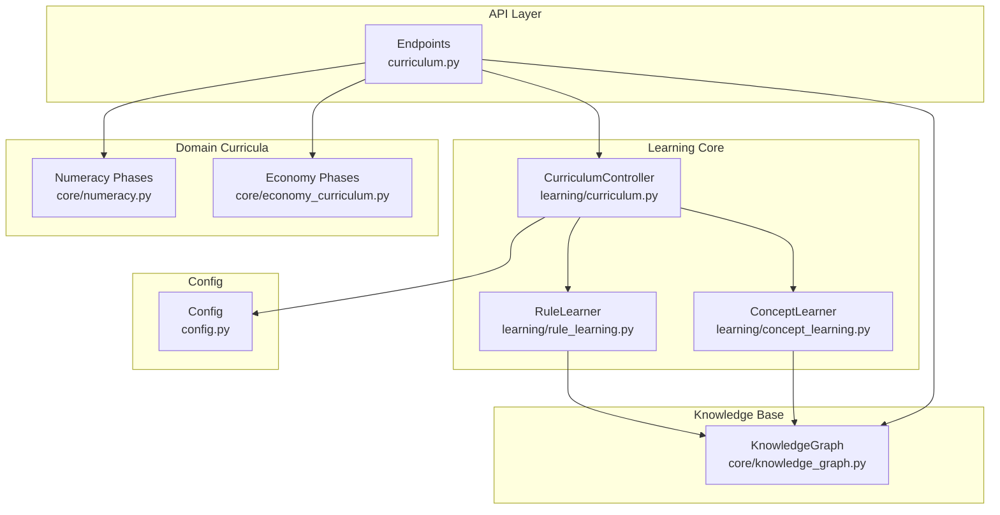
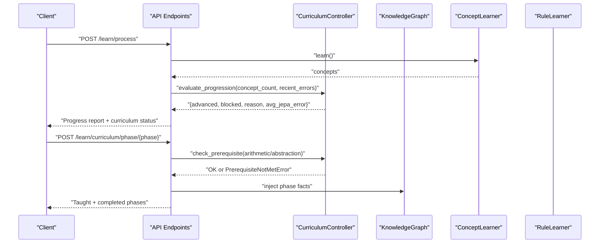
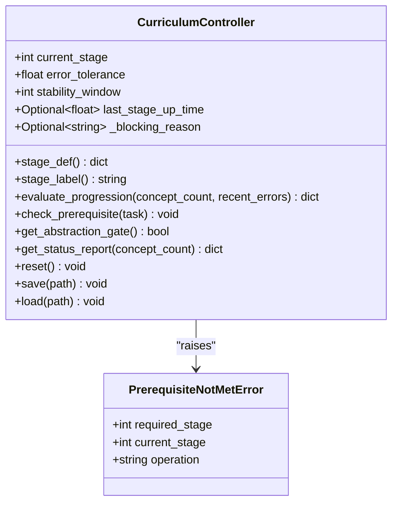
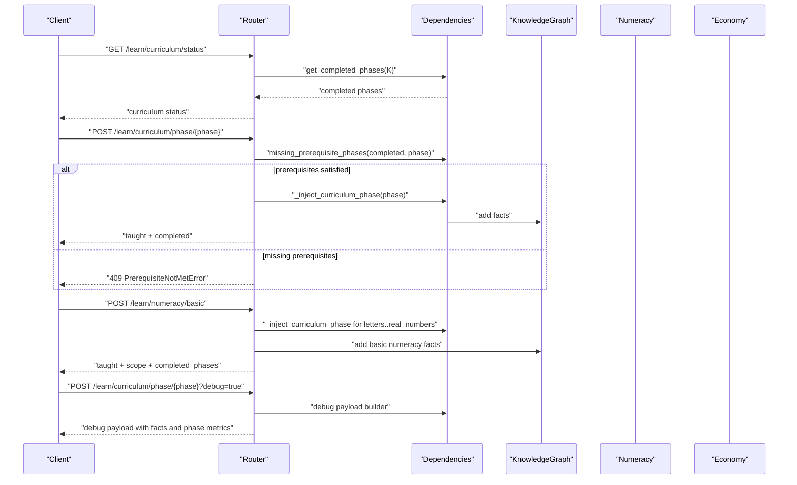
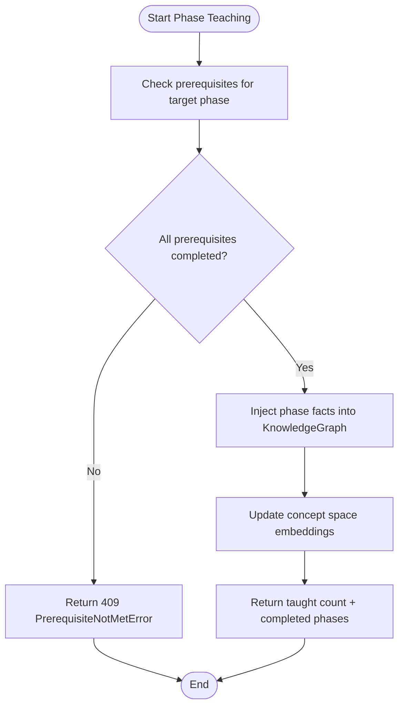
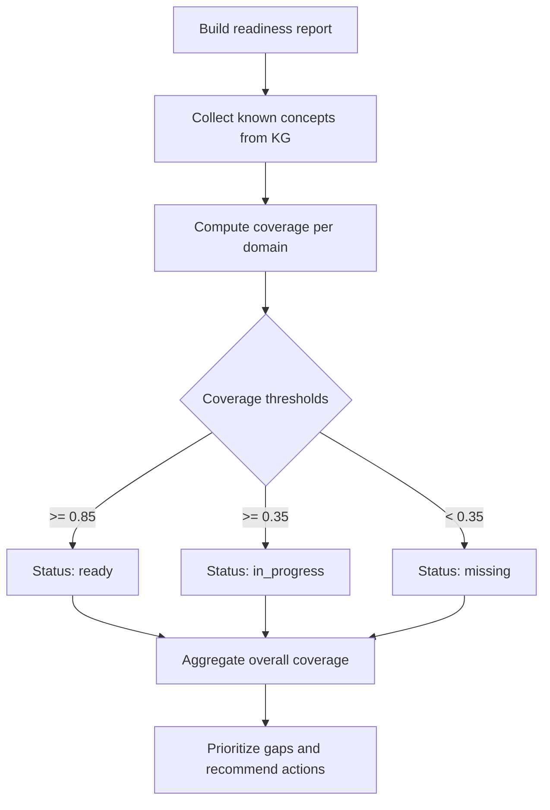
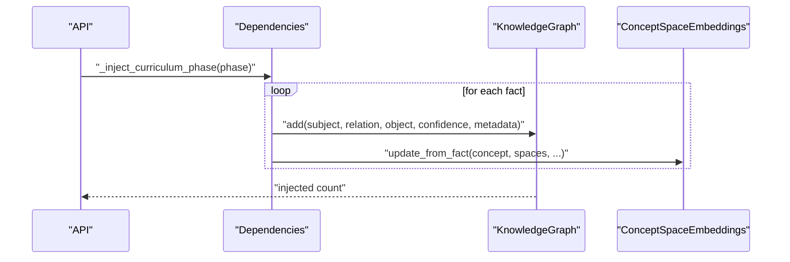
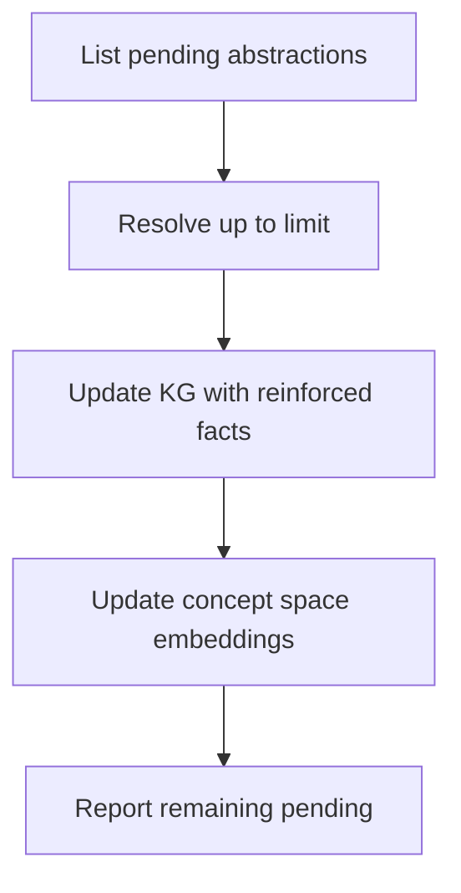
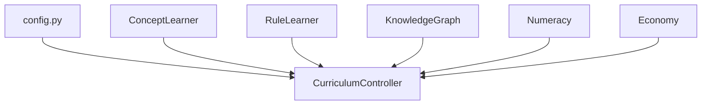

# Curriculum Controller

<cite>
**Referenced Files in This Document**
- [curriculum.py](file://learning/curriculum.py)
- [curriculum.py](file://api/endpoints/curriculum.py)
- [dependencies.py](file://api/dependencies.py)
- [numeracy.py](file://core/numeracy.py)
- [primary_readiness.py](file://core/primary_readiness.py)
- [economy_curriculum.py](file://core/economy_curriculum.py)
- [knowledge_graph.py](file://core/knowledge_graph.py)
- [concept_learning.py](file://learning/concept_learning.py)
- [rule_learning.py](file://learning/rule_learning.py)
- [config.py](file://config.py)
- [test_curriculum.py](file://tests/test_curriculum.py)
</cite>

## Table of Contents
1. [Introduction](#introduction)
2. [Project Structure](#project-structure)
3. [Core Components](#core-components)
4. [Architecture Overview](#architecture-overview)
5. [Detailed Component Analysis](#detailed-component-analysis)
6. [Dependency Analysis](#dependency-analysis)
7. [Performance Considerations](#performance-considerations)
8. [Troubleshooting Guide](#troubleshooting-guide)
9. [Conclusion](#conclusion)
10. [Appendices](#appendices)

## Introduction
This document explains the Curriculum Controller responsible for staged learning progression and concept acquisition. It covers:
- Phase-based learning architecture with prerequisite management and progression criteria
- Readiness assessment for student preparedness and concept mastery levels
- Curriculum mapping across domains (primary literacy, numeracy, and economic concepts)
- Integration with the knowledge graph for concept dependency tracking and learning path optimization
- Error handling for failed attempts and remediation strategies
- Practical examples of curriculum progression, concept injection, and readiness evaluation
- Configuration options for curriculum parameters and learning objectives
- Relationship between curriculum phases and the reinforcement learning system for adaptive difficulty adjustment

## Project Structure
The Curriculum Controller spans several modules:
- API endpoints orchestrate curriculum operations and expose readiness and progression reports
- The Curriculum Controller manages stages, prerequisites, and progression logic
- Numeracy and economy curricula define domain-specific phases and prerequisites
- The knowledge graph stores taught facts and concept dependencies
- Concept and rule learners feed the controller with concept counts and abstraction signals
- Configuration defines curriculum thresholds and stability windows

**Diagram sources**
- [curriculum.py:1-211](file://api/endpoints/curriculum.py#L1-L211)
- [curriculum.py:92-296](file://learning/curriculum.py#L92-L296)
- [numeracy.py:1-244](file://core/numeracy.py#L1-L244)
- [economy_curriculum.py:1-209](file://core/economy_curriculum.py#L1-L209)
- [knowledge_graph.py:1-34](file://core/knowledge_graph.py#L1-L34)
- [concept_learning.py:1-38](file://learning/concept_learning.py#L1-L38)
- [rule_learning.py:1-91](file://learning/rule_learning.py#L1-L91)
- [config.py:42-51](file://config.py#L42-L51)

**Section sources**
- [curriculum.py:1-211](file://api/endpoints/curriculum.py#L1-L211)
- [curriculum.py:1-296](file://learning/curriculum.py#L1-L296)
- [numeracy.py:1-244](file://core/numeracy.py#L1-L244)
- [economy_curriculum.py:1-209](file://core/economy_curriculum.py#L1-L209)
- [knowledge_graph.py:1-34](file://core/knowledge_graph.py#L1-L34)
- [concept_learning.py:1-38](file://learning/concept_learning.py#L1-L38)
- [rule_learning.py:1-91](file://learning/rule_learning.py#L1-L91)
- [config.py:42-51](file://config.py#L42-L51)

## Core Components
- CurriculumController: Enforces monotonic stage progression based on concept density and stability, gates tasks by curriculum phases, and exposes status reports.
- API endpoints: Provide operations to teach curriculum phases, evaluate readiness, and manage resets.
- Domain curriculum modules: Define curriculum phases, prerequisites, and phase facts for numeracy and economy.
- Knowledge Graph: Stores taught facts, metadata, and concept dependencies.
- Concept and Rule Learners: Extract concepts and rules from the knowledge base to drive progression.

Key responsibilities:
- Staged progression: Literacy → Numeracy → Reasoning with strict thresholds
- Prerequisite gating: Arithmetic requires Numeracy; Abstraction requires Reasoning
- Stability gating: Average JEPA prediction error must remain within tolerance
- Readiness reporting: Coverage across primary school graduation profiles
- Remediation: Pending abstraction resolution and drip plans

**Section sources**
- [curriculum.py:92-296](file://learning/curriculum.py#L92-L296)
- [curriculum.py:1-211](file://api/endpoints/curriculum.py#L1-L211)
- [numeracy.py:1-244](file://core/numeracy.py#L1-L244)
- [economy_curriculum.py:1-209](file://core/economy_curriculum.py#L1-L209)
- [primary_readiness.py:106-152](file://core/primary_readiness.py#L106-L152)
- [concept_learning.py:1-38](file://learning/concept_learning.py#L1-L38)
- [rule_learning.py:1-91](file://learning/rule_learning.py#L1-L91)

## Architecture Overview
The Curriculum Controller integrates with the knowledge graph and learners to:
- Track concept counts and abstraction levels
- Evaluate density and stability to decide stage advancement
- Gate operations by curriculum phases
- Provide readiness assessments and learning plans

**Diagram sources**
- [curriculum.py:57-74](file://api/endpoints/curriculum.py#L57-L74)
- [curriculum.py:128-202](file://learning/curriculum.py#L128-L202)
- [concept_learning.py:9-37](file://learning/concept_learning.py#L9-L37)
- [dependencies.py:264-324](file://api/dependencies.py#L264-L324)

## Detailed Component Analysis

### CurriculumController
The CurriculumController defines three curriculum phases with thresholds and gates:
- Literacy: minimal concept threshold; restricts arithmetic
- Numeracy: raises arithmetic allowance; maintains literacy threshold
- Reasoning: allows abstraction; raises arithmetic allowance

Progression requires:
- Density: learned concept count meets next stage’s minimum
- Stability: average JEPA error over a sliding window remains under tolerance

**Diagram sources**
- [curriculum.py:92-296](file://learning/curriculum.py#L92-L296)

**Section sources**
- [curriculum.py:32-54](file://learning/curriculum.py#L32-L54)
- [curriculum.py:128-202](file://learning/curriculum.py#L128-L202)
- [curriculum.py:228-261](file://learning/curriculum.py#L228-L261)
- [curriculum.py:265-296](file://learning/curriculum.py#L265-L296)

### API Endpoints for Curriculum Operations
Endpoints support:
- Status and reset of the curriculum
- Arithmetic calculations gated by Numeracy
- Learning process evaluation integrating concept counts and JEPA errors
- Teaching curriculum phases with prerequisite validation
- Basic numeracy injection and economy curriculum mapping
- Bootstrap plan for concept space activation

**Diagram sources**
- [curriculum.py:188-211](file://api/endpoints/curriculum.py#L188-L211)
- [curriculum.py:136-158](file://api/endpoints/curriculum.py#L136-L158)
- [curriculum.py:103-133](file://api/endpoints/curriculum.py#L103-L133)
- [dependencies.py:264-324](file://api/dependencies.py#L264-L324)
- [numeracy.py:130-235](file://core/numeracy.py#L130-L235)

**Section sources**
- [curriculum.py:8-26](file://api/endpoints/curriculum.py#L8-L26)
- [curriculum.py:57-74](file://api/endpoints/curriculum.py#L57-L74)
- [curriculum.py:103-133](file://api/endpoints/curriculum.py#L103-L133)
- [curriculum.py:136-158](file://api/endpoints/curriculum.py#L136-L158)
- [curriculum.py:188-211](file://api/endpoints/curriculum.py#L188-L211)

### Prerequisites and Curriculum Phases
- Numeracy phases: letters → digits → operations → real_numbers → calculus → logarithms
- Economy curriculum phases: foundations → demand_supply → elasticity → cost_revenue_profit → market_structures → macro_graphs → policy_shocks
- Prerequisite validation ensures earlier phases are completed before advancing

**Diagram sources**
- [numeracy.py:35-40](file://core/numeracy.py#L35-L40)
- [economy_curriculum.py:32-37](file://core/economy_curriculum.py#L32-L37)
- [dependencies.py:264-324](file://api/dependencies.py#L264-L324)

**Section sources**
- [numeracy.py:9-9](file://core/numeracy.py#L9-L9)
- [economy_curriculum.py:6-14](file://core/economy_curriculum.py#L6-L14)
- [numeracy.py:35-40](file://core/numeracy.py#L35-L40)
- [economy_curriculum.py:32-37](file://core/economy_curriculum.py#L32-L37)

### Readiness Assessment for Primary Domains
Primary readiness builds a profile across domains and computes coverage:
- Domains include literacy, mathematics, science, social studies, economy, digital and life skills
- Coverage thresholds determine readiness status (ready, in_progress, missing)
- Weekly and drip plans suggest targeted actions to address gaps

**Diagram sources**
- [primary_readiness.py:106-152](file://core/primary_readiness.py#L106-L152)
- [primary_readiness.py:155-206](file://core/primary_readiness.py#L155-L206)
- [primary_readiness.py:209-266](file://core/primary_readiness.py#L209-L266)

**Section sources**
- [primary_readiness.py:6-66](file://core/primary_readiness.py#L6-L66)
- [primary_readiness.py:106-152](file://core/primary_readiness.py#L106-L152)
- [primary_readiness.py:155-206](file://core/primary_readiness.py#L155-L206)
- [primary_readiness.py:209-266](file://core/primary_readiness.py#L209-L266)

### Integration with Knowledge Graph and Concept Injection
- Phase facts are injected into the knowledge graph with metadata indicating source, stage, and curriculum phase
- Concept space embeddings are updated to reflect newly learned concepts across relevant spaces
- Pending abstraction concepts can be resolved to higher-level rules

**Diagram sources**
- [dependencies.py:264-324](file://api/dependencies.py#L264-L324)
- [knowledge_graph.py:6-29](file://core/knowledge_graph.py#L6-L29)

**Section sources**
- [dependencies.py:264-324](file://api/dependencies.py#L264-L324)
- [knowledge_graph.py:1-34](file://core/knowledge_graph.py#L1-L34)

### Remediation Strategies and Abstraction Resolution
- Pending abstraction concepts are identified and can be reinforced to promote to rule-level knowledge
- Remediation increases confidence and removes abstraction_pending flag
- Drip plans and weekly plans help maintain coverage and address gaps systematically

**Diagram sources**
- [dependencies.py:506-535](file://api/dependencies.py#L506-L535)

**Section sources**
- [dependencies.py:506-535](file://api/dependencies.py#L506-L535)

### Practical Examples
- Curriculum progression: After sufficient concepts and stable JEPA error, the controller advances from Literacy to Numeracy, then to Reasoning.
- Concept injection: Teaching numeracy phases injects facts into the knowledge graph and updates embeddings.
- Readiness evaluation: Using primary readiness endpoints to assess coverage and receive recommended actions.

**Section sources**
- [test_curriculum.py:63-124](file://tests/test_curriculum.py#L63-L124)
- [curriculum.py:57-74](file://api/endpoints/curriculum.py#L57-L74)
- [curriculum.py:103-133](file://api/endpoints/curriculum.py#L103-L133)
- [primary_readiness.py:106-152](file://core/primary_readiness.py#L106-L152)

## Dependency Analysis
The Curriculum Controller depends on:
- Configuration for error tolerance and stability window
- Concept and rule learners for concept density and abstraction signals
- Knowledge graph for storing taught facts and concept dependencies
- Numeracy and economy curriculum modules for phase definitions and prerequisites

**Diagram sources**
- [config.py:42-51](file://config.py#L42-L51)
- [curriculum.py:102-108](file://learning/curriculum.py#L102-L108)
- [concept_learning.py:6-7](file://learning/concept_learning.py#L6-L7)
- [rule_learning.py:6-7](file://learning/rule_learning.py#L6-L7)
- [knowledge_graph.py:1-34](file://core/knowledge_graph.py#L1-L34)
- [numeracy.py:1-9](file://core/numeracy.py#L1-L9)
- [economy_curriculum.py:1-14](file://core/economy_curriculum.py#L1-L14)

**Section sources**
- [config.py:42-51](file://config.py#L42-L51)
- [curriculum.py:102-108](file://learning/curriculum.py#L102-L108)
- [concept_learning.py:6-7](file://learning/concept_learning.py#L6-L7)
- [rule_learning.py:6-7](file://learning/rule_learning.py#L6-L7)
- [knowledge_graph.py:1-34](file://core/knowledge_graph.py#L1-L34)
- [numeracy.py:1-9](file://core/numeracy.py#L1-L9)
- [economy_curriculum.py:1-14](file://core/economy_curriculum.py#L1-L14)

## Performance Considerations
- JEPA stability window controls how many recent updates contribute to the average error; larger windows smooth out volatility but delay responsiveness
- Error tolerance determines how tolerant the system is of prediction uncertainty before blocking progression
- Concept density thresholds should balance depth of knowledge with stability to avoid premature advancement
- Embedding updates occur per injected fact; batching injections can reduce overhead

[No sources needed since this section provides general guidance]

## Troubleshooting Guide
Common issues and resolutions:
- PrerequisiteNotMetError: Ensure earlier curriculum phases are completed before advancing
- High JEPA error blocks progression: Reduce error tolerance or increase stability window; review concept quality and injection completeness
- Division by zero in arithmetic: Validate inputs before invoking math operations
- Unknown operation in math calculator: Confirm supported operations and casing
- Rate limiting on ingestion: Respect ingest limits and retry after the window elapses

**Section sources**
- [curriculum.py:32-54](file://api/endpoints/curriculum.py#L32-L54)
- [curriculum.py:143-145](file://api/endpoints/curriculum.py#L143-L145)
- [config.py:89-91](file://config.py#L89-L91)

## Conclusion
The Curriculum Controller provides a robust, staged learning framework that:
- Ensures prerequisite mastery before enabling advanced capabilities
- Uses concept density and JEPA stability to guide progression
- Integrates with the knowledge graph to track dependencies and optimize learning paths
- Offers readiness assessments and remediation strategies for continuous improvement
- Supports configuration-driven tuning for curriculum parameters and adaptive difficulty

[No sources needed since this section summarizes without analyzing specific files]

## Appendices

### Configuration Options for Curriculum Parameters
- Curriculum state file: persists stage and related parameters
- Error tolerance: maximum average JEPA loss to allow stage advancement
- Stability window: number of recent JEPA updates to average

**Section sources**
- [config.py:48-51](file://config.py#L48-L51)

### Learning Objectives by Curriculum Phase
- Literacy: foundational symbol recognition and letter knowledge
- Numeracy: digits, operations, real numbers, calculus, logarithms
- Reasoning: abstraction and higher-order symbolic reasoning

**Section sources**
- [curriculum.py:32-54](file://learning/curriculum.py#L32-L54)
- [numeracy.py:130-235](file://core/numeracy.py#L130-L235)