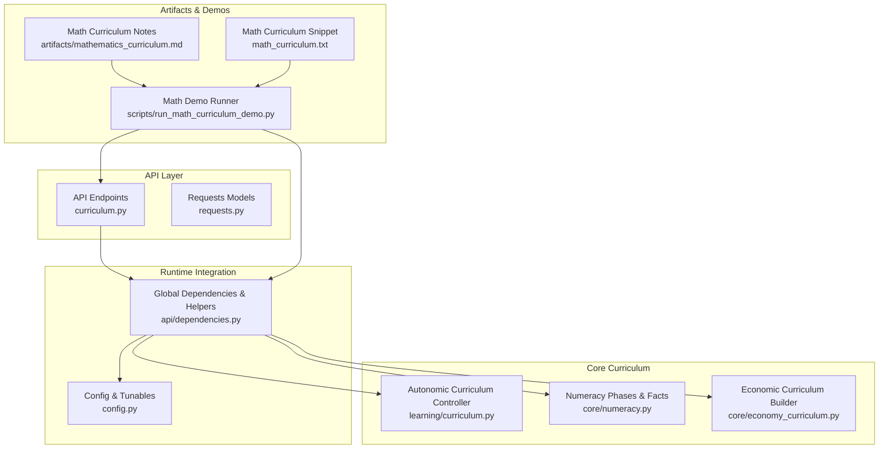
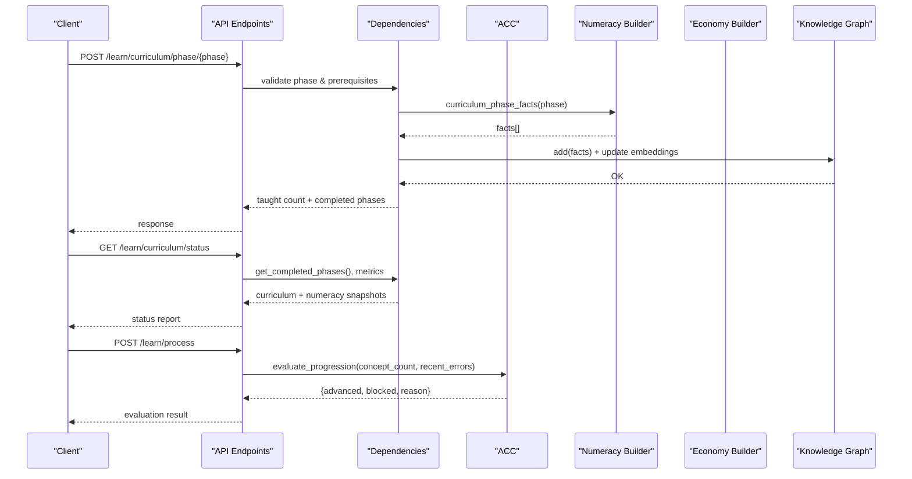
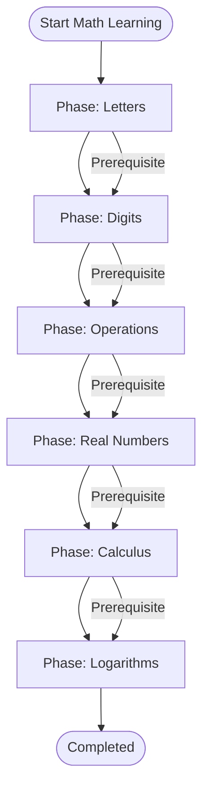
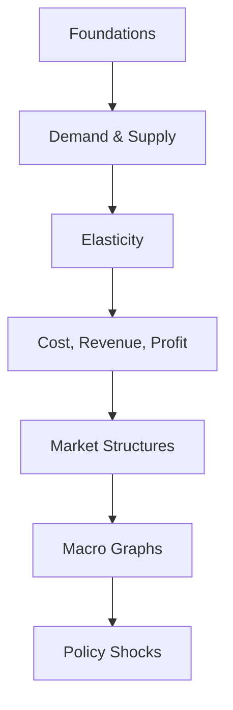
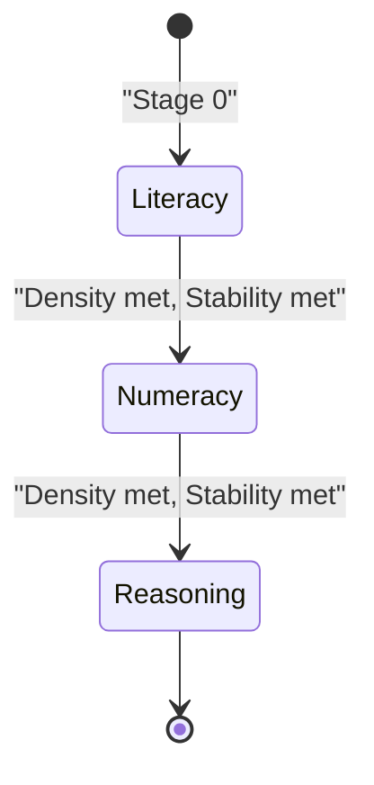
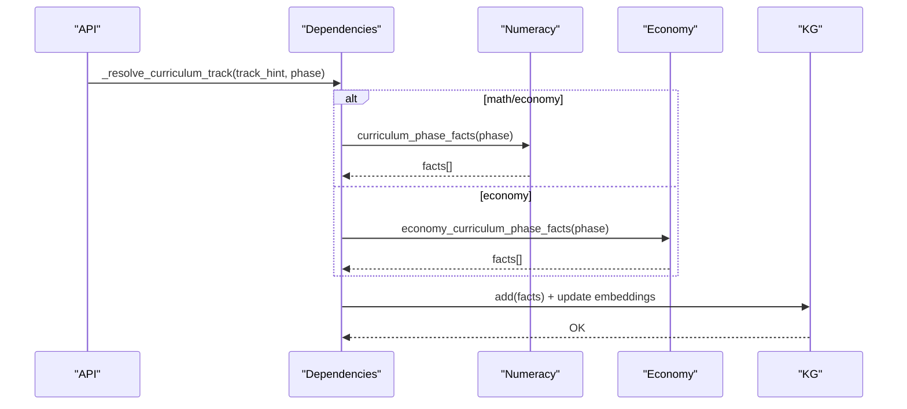
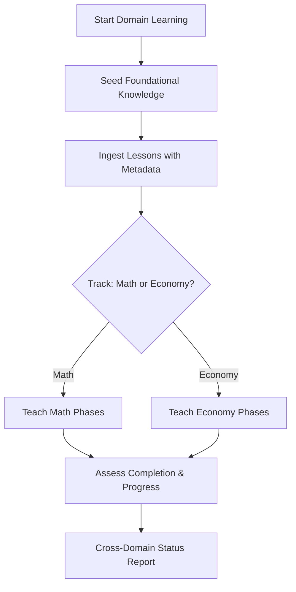
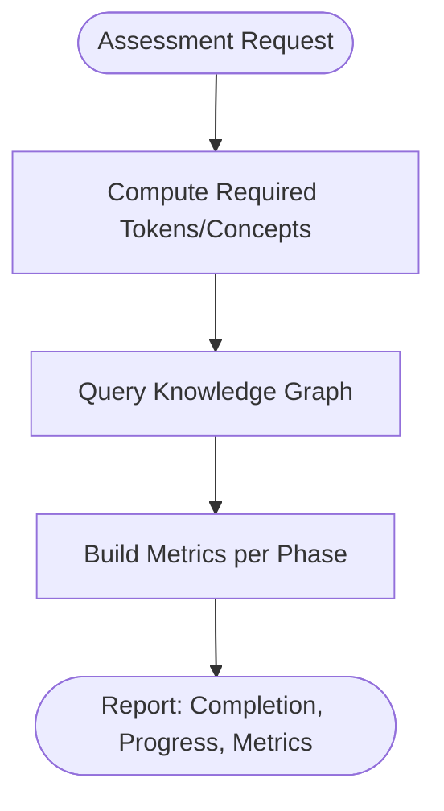
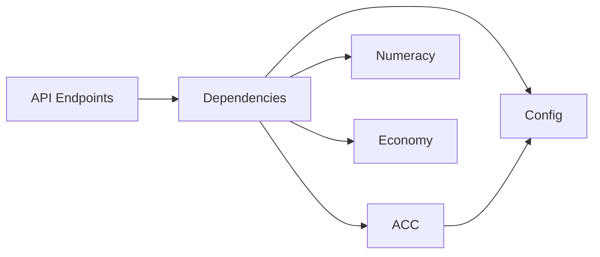

# Domain-Specific Curricula

<cite>
**Referenced Files in This Document**
- [curriculum.py](file://api/endpoints/curriculum.py)
- [economy_curriculum.py](file://core/economy_curriculum.py)
- [curriculum.py](file://learning/curriculum.py)
- [numeracy.py](file://core/numeracy.py)
- [dependencies.py](file://api/dependencies.py)
- [mathematics_curriculum.md](file://artifacts/mathematics_curriculum.md)
- [math_curriculum.txt](file://math_curriculum.txt)
- [run_math_curriculum_demo.py](file://scripts/run_math_curriculum_demo.py)
- [config.py](file://config.py)
- [primary_readiness.py](file://core/primary_readiness.py)
- [requests.py](file://api/models/requests.py)
</cite>

## Table of Contents
1. [Introduction](#introduction)
2. [Project Structure](#project-structure)
3. [Core Components](#core-components)
4. [Architecture Overview](#architecture-overview)
5. [Detailed Component Analysis](#detailed-component-analysis)
6. [Dependency Analysis](#dependency-analysis)
7. [Performance Considerations](#performance-considerations)
8. [Troubleshooting Guide](#troubleshooting-guide)
9. [Conclusion](#conclusion)
10. [Appendices](#appendices)

## Introduction
This document explains the domain-specific curriculum implementations in the system, focusing on how mathematics, economics, and related cognitive development stages are orchestrated. It details:
- Economic curriculum phases and prerequisites
- Mathematics curriculum phases and concept hierarchies
- Cross-domain integration via a unified curriculum controller
- Practical examples for adapting curricula across subjects
- Specialized assessment and progression validation
- Alignment with general cognitive development stages

## Project Structure
The curriculum system spans API endpoints, core curriculum logic, domain-specific curriculum builders, and supporting utilities. The following diagram maps major components and their relationships.

**Diagram sources**
- [curriculum.py:1-211](file://api/endpoints/curriculum.py#L1-L211)
- [curriculum.py:92-296](file://learning/curriculum.py#L92-L296)
- [numeracy.py:1-244](file://core/numeracy.py#L1-L244)
- [economy_curriculum.py:1-209](file://core/economy_curriculum.py#L1-L209)
- [dependencies.py:1-800](file://api/dependencies.py#L1-L800)
- [config.py:48-51](file://config.py#L48-L51)
- [run_math_curriculum_demo.py:1-176](file://scripts/run_math_curriculum_demo.py#L1-L176)
- [mathematics_curriculum.md:1-105](file://artifacts/mathematics_curriculum.md#L1-L105)
- [math_curriculum.txt:1-34](file://math_curriculum.txt#L1-L34)

**Section sources**
- [curriculum.py:1-211](file://api/endpoints/curriculum.py#L1-L211)
- [curriculum.py:1-296](file://learning/curriculum.py#L1-L296)
- [numeracy.py:1-244](file://core/numeracy.py#L1-L244)
- [economy_curriculum.py:1-209](file://core/economy_curriculum.py#L1-L209)
- [dependencies.py:1-800](file://api/dependencies.py#L1-L800)
- [config.py:1-106](file://config.py#L1-L106)
- [run_math_curriculum_demo.py:1-176](file://scripts/run_math_curriculum_demo.py#L1-L176)
- [mathematics_curriculum.md:1-105](file://artifacts/mathematics_curriculum.md#L1-L105)
- [math_curriculum.txt:1-34](file://math_curriculum.txt#L1-L34)

## Core Components
- Autonomic Curriculum Controller (ACC): Enforces monotonic progression across cognitive stages, gates tasks by required stage, and reports status with stability thresholds.
- Numeracy Curriculum Builder: Defines mathematics curriculum phases, prerequisite chains, and generates facts for ingestion.
- Economic Curriculum Builder: Defines economic curriculum phases, prerequisite chains, and generates facts for ingestion.
- API Endpoints: Expose curriculum orchestration, prerequisite checks, and status reporting.
- Runtime Integration: Provides helpers for curriculum tracks, prerequisite validation, and concept-space embeddings updates.

Key responsibilities:
- Stage gating for arithmetic and abstraction
- Phase-based curriculum delivery with prerequisite enforcement
- Metrics and debug payloads for curriculum phases
- Concept-space-aware fact injection across curriculum, arithmetic, and calculus spaces

**Section sources**
- [curriculum.py:92-296](file://learning/curriculum.py#L92-L296)
- [numeracy.py:1-244](file://core/numeracy.py#L1-L244)
- [economy_curriculum.py:1-209](file://core/economy_curriculum.py#L1-L209)
- [curriculum.py:1-211](file://api/endpoints/curriculum.py#L1-L211)
- [dependencies.py:264-324](file://api/dependencies.py#L264-L324)

## Architecture Overview
The curriculum architecture integrates API endpoints, the ACC, and domain-specific curriculum builders. The runtime depends on a shared Knowledge Graph and concept-space embeddings to maintain coherent cross-domain learning.

**Diagram sources**
- [curriculum.py:136-158](file://api/endpoints/curriculum.py#L136-L158)
- [dependencies.py:264-324](file://api/dependencies.py#L264-L324)
- [numeracy.py:130-235](file://core/numeracy.py#L130-L235)
- [curriculum.py:128-202](file://learning/curriculum.py#L128-L202)

## Detailed Component Analysis

### Mathematics Curriculum System
- Curriculum phases and prerequisites:
  - Letters → Digits → Operations → Real Numbers → Calculus → Logarithms
  - Prerequisite detection ensures learners master earlier phases before advancing.
- Concept hierarchies:
  - Letters: alphabetic symbols
  - Digits: numeric symbols and the concept of number
  - Operations: arithmetic symbols and operation concepts
  - Real Numbers: decimal/fraction symbols and real number concepts
  - Calculus: derivatives, integrals, limits, functions
  - Logarithms: logarithmic concepts, base, change-of-base, exponents, inverse functions
- Practical examples:
  - Basic arithmetic facts and curriculum completeness are demonstrated in artifacts and demos.
  - The math demo script generates phase-wise lessons and ingests them with metadata to drive curriculum completion.

**Diagram sources**
- [numeracy.py:9-90](file://core/numeracy.py#L9-L90)
- [numeracy.py:130-235](file://core/numeracy.py#L130-L235)

**Section sources**
- [numeracy.py:1-244](file://core/numeracy.py#L1-L244)
- [mathematics_curriculum.md:1-105](file://artifacts/mathematics_curriculum.md#L1-L105)
- [math_curriculum.txt:1-34](file://math_curriculum.txt#L1-L34)
- [run_math_curriculum_demo.py:32-63](file://scripts/run_math_curriculum_demo.py#L32-L63)

### Economic Curriculum System
- Curriculum phases and prerequisites:
  - Foundations → Demand and Supply → Elasticity → Cost, Revenue, Profit → Market Structures → Macro Graphs → Policy Shocks
- Concept mapping:
  - Foundations: scarcity, choice, opportunity cost, incentives, ceteris paribus, equilibrium
  - Demand and Supply: demand, supply, price, quantity, market, shift, movement
  - Elasticity: elasticity, price elasticity, income elasticity, cross-price elasticity, sensitivity
  - Cost, Revenue, Profit: fixed cost, variable cost, total cost, revenue, profit, marginal cost, marginal revenue
  - Market Structures: perfect competition, monopoly, oligopoly, monopolistic competition, market power
  - Macro Graphs: AD-AS, aggregate demand, aggregate supply, GDP, inflation, unemployment, interest rate
  - Policy Shocks: monetary policy, fiscal policy, tax, subsidy, tariff, regulation, expectations
- Assessment and status:
  - Completed phases and knowledge counts are computed from the Knowledge Graph.
  - Phase metrics indicate completion status and missing prerequisites.

**Diagram sources**
- [economy_curriculum.py:6-14](file://core/economy_curriculum.py#L6-L14)
- [economy_curriculum.py:40-167](file://core/economy_curriculum.py#L40-L167)
- [economy_curriculum.py:170-209](file://core/economy_curriculum.py#L170-L209)

**Section sources**
- [economy_curriculum.py:1-209](file://core/economy_curriculum.py#L1-L209)

### Cognitive Development Stages and Curriculum Gating
- Stages:
  - Literacy: minimal concept threshold, disallows arithmetic
  - Numeracy: concept threshold met, allows arithmetic
  - Reasoning: concept threshold met, allows arithmetic and abstraction
- Progression criteria:
  - Density: learned concept count meets next-stage threshold
  - Stability: average JEPA prediction error within tolerance
- Task gating:
  - Arithmetic requires numeracy
  - Abstraction requires reasoning

**Diagram sources**
- [curriculum.py:32-54](file://learning/curriculum.py#L32-L54)
- [curriculum.py:128-202](file://learning/curriculum.py#L128-L202)

**Section sources**
- [curriculum.py:1-296](file://learning/curriculum.py#L1-L296)
- [config.py:48-51](file://config.py#L48-L51)

### Cross-Domain Learning Progression and Integration
- Track resolution:
  - The system resolves whether a phase belongs to math or economy and injects facts accordingly.
- Prerequisite enforcement:
  - Per-track prerequisite checks ensure learners complete prior phases before advancing.
- Concept-space embeddings:
  - Fact injection updates concept embeddings across relevant spaces (curriculum, arithmetic, calculus, etc.).

**Diagram sources**
- [dependencies.py:280-324](file://api/dependencies.py#L280-L324)
- [numeracy.py:130-235](file://core/numeracy.py#L130-L235)
- [economy_curriculum.py:40-167](file://core/economy_curriculum.py#L40-L167)

**Section sources**
- [dependencies.py:280-324](file://api/dependencies.py#L280-L324)

### Practical Examples: Curriculum Adaptation Across Subjects
- Mathematics:
  - Use basic numeracy endpoint to seed foundational knowledge, then teach ordered phases.
  - Ingest lessons with metadata indicating curriculum phase to persist training materials.
- Economics:
  - Teach economy graph phases via dedicated endpoints.
  - Ingest lessons with metadata indicating curriculum track and phase.

**Diagram sources**
- [curriculum.py:103-133](file://api/endpoints/curriculum.py#L103-L133)
- [curriculum.py:136-158](file://api/endpoints/curriculum.py#L136-L158)
- [dependencies.py:280-324](file://api/dependencies.py#L280-L324)
- [primary_readiness.py:86-103](file://core/primary_readiness.py#L86-L103)

**Section sources**
- [curriculum.py:103-158](file://api/endpoints/curriculum.py#L103-L158)
- [dependencies.py:280-324](file://api/dependencies.py#L280-L324)
- [primary_readiness.py:86-103](file://core/primary_readiness.py#L86-L103)

### Specialized Assessment Methods for Domain Expertise Validation
- Mathematics:
  - Expression readiness: determines missing digits, symbols, and concepts required for computation.
  - Phase metrics: knowledge counts per phase derived from the Knowledge Graph.
- Economics:
  - Phase metrics: knowledge counts per phase derived from the Knowledge Graph.
- General:
  - Curriculum status: completed and missing phases, progress percentage, and phase metrics.
  - Debug payloads: detailed logs of taught facts and state changes for auditing.

**Diagram sources**
- [numeracy.py:58-95](file://core/numeracy.py#L58-L95)
- [dependencies.py:326-350](file://api/dependencies.py#L326-L350)
- [economy_curriculum.py:170-191](file://core/economy_curriculum.py#L170-L191)

**Section sources**
- [numeracy.py:58-95](file://core/numeracy.py#L58-L95)
- [dependencies.py:326-350](file://api/dependencies.py#L326-L350)
- [economy_curriculum.py:170-191](file://core/economy_curriculum.py#L170-L191)

## Dependency Analysis
- API endpoints depend on global dependencies for curriculum tracking, prerequisite checks, and fact injection.
- Numeracy and economy builders provide structured facts for each phase.
- ACC integrates with JEPA to enforce stability-based progression.
- Config defines curriculum-related tunables such as error tolerance and stability window.

**Diagram sources**
- [curriculum.py:1-211](file://api/endpoints/curriculum.py#L1-L211)
- [dependencies.py:1-800](file://api/dependencies.py#L1-L800)
- [curriculum.py:1-296](file://learning/curriculum.py#L1-L296)
- [config.py:48-51](file://config.py#L48-L51)

**Section sources**
- [curriculum.py:1-211](file://api/endpoints/curriculum.py#L1-L211)
- [dependencies.py:1-800](file://api/dependencies.py#L1-L800)
- [curriculum.py:1-296](file://learning/curriculum.py#L1-L296)
- [config.py:48-51](file://config.py#L48-L51)

## Performance Considerations
- Stability window and error tolerance balance progression speed with system stability.
- Concept-space embeddings updates occur upon fact injection; batching and deduplication reduce overhead.
- Phase metrics aggregation is lightweight and cached via Knowledge Graph snapshots.

[No sources needed since this section provides general guidance]

## Troubleshooting Guide
Common issues and resolutions:
- Prerequisite violations:
  - Symptom: 409 Conflict with missing prerequisites.
  - Resolution: Complete earlier phases before advancing.
- Division by zero:
  - Symptom: 400 Bad Request on arithmetic endpoint.
  - Resolution: Ensure divisor is non-zero.
- Unknown phase or track:
  - Symptom: 400 Bad Request for unknown phase or mismatched track.
  - Resolution: Verify phase exists in the appropriate curriculum and track.
- Progression blocked:
  - Symptom: Blocked with high latent uncertainty.
  - Resolution: Increase concept density or improve stability (reduce recent JEPA errors).

**Section sources**
- [curriculum.py:29-54](file://api/endpoints/curriculum.py#L29-L54)
- [curriculum.py:136-158](file://api/endpoints/curriculum.py#L136-L158)
- [curriculum.py:128-202](file://learning/curriculum.py#L128-L202)

## Conclusion
The domain-specific curriculum system integrates mathematics and economics with a robust progression engine. Learners advance through staged cognitive development gated by both density and stability. Domain builders generate structured facts, while API endpoints orchestrate ingestion, prerequisite enforcement, and status reporting. This design enables cross-domain learning with clear progression criteria and specialized assessments.

[No sources needed since this section summarizes without analyzing specific files]

## Appendices

### API Definitions: Curriculum Endpoints
- GET /learn/curriculum/status
  - Returns curriculum and numeracy snapshots, progress metrics.
- POST /learn/curriculum/phase/{phase}
  - Validates prerequisites and injects phase facts; returns taught count and updated phases.
- POST /learn/numeracy/basic
  - Seeds foundational numeracy knowledge; returns completed phases and optional debug payload.
- POST /learn/process
  - Evaluates progression using concept count and recent JEPA errors; returns advanced/blocked/reason.
- POST /learn/abstraction/trigger
  - Promotes concepts meeting abstraction thresholds; returns promoted counts and items.
- POST /math/calculate
  - Performs arithmetic with prerequisite gating; validates operation and handles division by zero.

**Section sources**
- [curriculum.py:8-211](file://api/endpoints/curriculum.py#L8-L211)
- [requests.py:28-32](file://api/models/requests.py#L28-L32)

### Curriculum Tracks and Prerequisites
- Mathematics:
  - Letters → Digits → Operations → Real Numbers → Calculus → Logarithms
- Economics:
  - Foundations → Demand and Supply → Elasticity → Cost, Revenue, Profit → Market Structures → Macro Graphs → Policy Shocks

**Section sources**
- [numeracy.py:9-90](file://core/numeracy.py#L9-L90)
- [economy_curriculum.py:6-14](file://core/economy_curriculum.py#L6-L14)