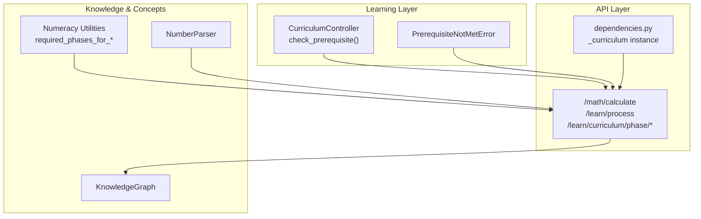
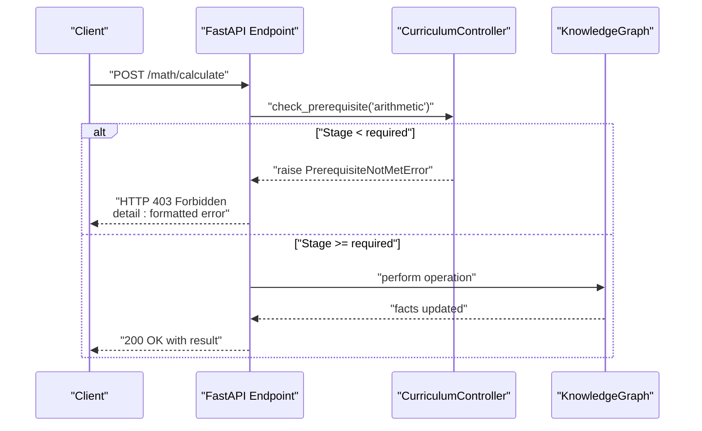
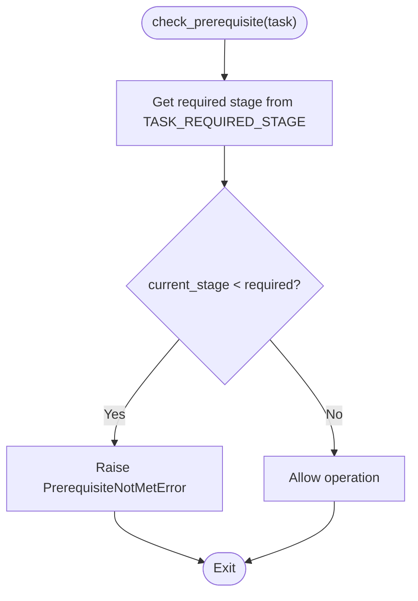
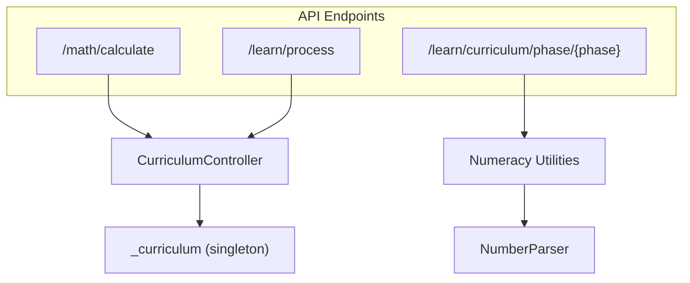
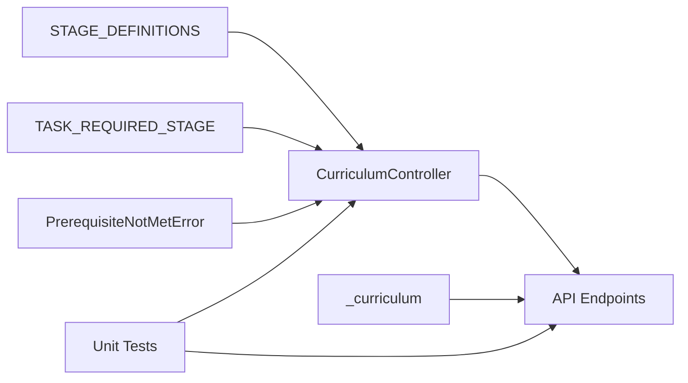

# Prerequisite Management

<cite>
**Referenced Files in This Document**
- [curriculum.py](file://learning/curriculum.py)
- [curriculum.py](file://api/endpoints/curriculum.py)
- [dependencies.py](file://api/dependencies.py)
- [test_curriculum.py](file://tests/test_curriculum.py)
- [numeracy.py](file://core/numeracy.py)
- [number_parser.py](file://core/number_parser.py)
</cite>

## Table of Contents
1. [Introduction](#introduction)
2. [Project Structure](#project-structure)
3. [Core Components](#core-components)
4. [Architecture Overview](#architecture-overview)
5. [Detailed Component Analysis](#detailed-component-analysis)
6. [Dependency Analysis](#dependency-analysis)
7. [Performance Considerations](#performance-considerations)
8. [Troubleshooting Guide](#troubleshooting-guide)
9. [Conclusion](#conclusion)

## Introduction
This document explains the prerequisite management system that gates operations based on curriculum stage progression. It covers the task-based gating mechanism, the TASK_REQUIRED_STAGE mapping for arithmetic and abstraction tasks, the PrerequisiteNotMetError exception handling and messaging, practical examples of how tasks are gated, the check_prerequisite method implementation, and how the system integrates with the broader curriculum and concept mastery verification pipeline.

## Project Structure
The prerequisite management system spans several modules:
- Curriculum controller and gating logic
- API endpoints that enforce prerequisites
- Dependencies that wire the controller into the runtime
- Tests validating gating behavior and error messages
- Numeracy and number parsing utilities that underpin concept mastery checks

**Diagram sources**
- [curriculum.py:206-221](file://learning/curriculum.py#L206-L221)
- [curriculum.py:29-54](file://api/endpoints/curriculum.py#L29-L54)
- [dependencies.py:538-541](file://api/dependencies.py#L538-L541)
- [numeracy.py:77-90](file://core/numeracy.py#L77-L90)
- [number_parser.py:1-127](file://core/number_parser.py#L1-L127)

**Section sources**
- [curriculum.py:1-296](file://learning/curriculum.py#L1-L296)
- [curriculum.py:1-211](file://api/endpoints/curriculum.py#L1-L211)
- [dependencies.py:538-541](file://api/dependencies.py#L538-L541)
- [numeracy.py:1-244](file://core/numeracy.py#L1-L244)
- [number_parser.py:1-127](file://core/number_parser.py#L1-L127)

## Core Components
- CurriculumController: Maintains current stage, evaluates progression, and enforces task gating via check_prerequisite.
- TASK_REQUIRED_STAGE: Maps task identifiers to minimum required stages.
- PrerequisiteNotMetError: Exception raised when a task requires a higher stage than current.
- API endpoints: Gate operations (e.g., arithmetic calculations) using check_prerequisite and translate exceptions to HTTP responses.
- Dependencies: Initialize and expose a singleton CurriculumController instance to the API.

Key responsibilities:
- Enforce monotonic stage progression based on concept density and stability.
- Gate operations by task type and current stage.
- Provide status reports and persistence for curriculum state.

**Section sources**
- [curriculum.py:32-67](file://learning/curriculum.py#L32-L67)
- [curriculum.py:71-87](file://learning/curriculum.py#L71-L87)
- [curriculum.py:206-221](file://learning/curriculum.py#L206-L221)
- [dependencies.py:538-541](file://api/dependencies.py#L538-L541)

## Architecture Overview
The prerequisite system sits between the API and the learning engine. API endpoints call the controller’s check_prerequisite before executing operations. The controller raises PrerequisiteNotMetError when the current stage is insufficient. The API catches this exception and returns a 403 Forbidden with the formatted error message.

**Diagram sources**
- [curriculum.py:29-54](file://api/endpoints/curriculum.py#L29-L54)
- [curriculum.py:206-221](file://learning/curriculum.py#L206-L221)
- [curriculum.py:71-87](file://learning/curriculum.py#L71-L87)

**Section sources**
- [curriculum.py:29-54](file://api/endpoints/curriculum.py#L29-L54)
- [curriculum.py:206-221](file://learning/curriculum.py#L206-L221)

## Detailed Component Analysis

### Task-Based Gating Mechanism and TASK_REQUIRED_STAGE
- TASK_REQUIRED_STAGE defines the minimum stage required for each task:
  - arithmetic: stage 1 (NUMERACY)
  - abstraction: stage 2 (REASONING)
- Unknown tasks are treated as allowed (no gating), enabling forward compatibility.

Behavior:
- check_prerequisite compares current stage against required stage for the task.
- If current stage is less than required, PrerequisiteNotMetError is raised with structured attributes and a human-readable message.

Practical examples:
- Arithmetic is blocked at stage 0; allowed at stage 1 and above.
- Abstraction is blocked at stage 1; allowed only at stage 2 and above.
- Unknown tasks are always allowed.

**Section sources**
- [curriculum.py:57-60](file://learning/curriculum.py#L57-L60)
- [curriculum.py:206-221](file://learning/curriculum.py#L206-L221)
- [test_curriculum.py:126-162](file://tests/test_curriculum.py#L126-L162)

### PrerequisiteNotMetError Exception Handling and Messaging
- Exception carries:
  - required_stage
  - current_stage
  - operation
- Message includes both stage IDs and labels for clarity.
- API translates this exception into HTTP 403 Forbidden with the exception detail.

Validation:
- Tests assert the exception fields and the exact error message content.

**Section sources**
- [curriculum.py:71-87](file://learning/curriculum.py#L71-L87)
- [curriculum.py:33-34](file://api/endpoints/curriculum.py#L33-L34)
- [test_curriculum.py:130-137](file://tests/test_curriculum.py#L130-L137)

### check_prerequisite Method Implementation
Responsibilities:
- Determine required stage from TASK_REQUIRED_STAGE for the given task.
- Compare with current_stage.
- Raise PrerequisiteNotMetError if gating applies.

Integration points:
- Called by API endpoints before executing operations.
- Used internally by the controller to gate higher-level capabilities (e.g., abstraction gate).

**Diagram sources**
- [curriculum.py:206-221](file://learning/curriculum.py#L206-L221)

**Section sources**
- [curriculum.py:206-221](file://learning/curriculum.py#L206-L221)

### Integration with the Broader System
- API endpoints:
  - /math/calculate: Gates arithmetic operations using check_prerequisite and converts PrerequisiteNotMetError to HTTP 403.
  - /learn/process: Drives curriculum progression by evaluating concept density and stability.
  - /learn/curriculum/phase/{phase}: Validates prerequisite phases before injecting curriculum facts.
- Dependencies:
  - Initializes a singleton CurriculumController instance shared across endpoints.
- Concept mastery verification:
  - Numeracy utilities define required phases for arithmetic and higher math.
  - NumberParser supports number decomposition and parsing, enabling arithmetic readiness.

**Diagram sources**
- [curriculum.py:29-158](file://api/endpoints/curriculum.py#L29-L158)
- [dependencies.py:538-541](file://api/dependencies.py#L538-L541)
- [numeracy.py:77-90](file://core/numeracy.py#L77-L90)
- [number_parser.py:1-127](file://core/number_parser.py#L1-L127)

**Section sources**
- [curriculum.py:29-158](file://api/endpoints/curriculum.py#L29-L158)
- [dependencies.py:538-541](file://api/dependencies.py#L538-L541)
- [numeracy.py:77-90](file://core/numeracy.py#L77-L90)
- [number_parser.py:1-127](file://core/number_parser.py#L1-L127)

### Practical Examples of Task Gating
- Arithmetic blocked at stage 0:
  - Request to /math/calculate returns HTTP 403 with PrerequisiteNotMetError detail.
- Arithmetic allowed at stage 1 and above:
  - Same endpoint succeeds and returns computed result.
- Abstraction blocked at stage 1:
  - Attempting to trigger abstraction-related operations fails until stage 2.
- Unknown tasks:
  - Always allowed to prevent breaking new task types.

These behaviors are validated by unit tests that assert exception fields and HTTP responses.

**Section sources**
- [test_curriculum.py:395-446](file://tests/test_curriculum.py#L395-L446)
- [test_curriculum.py:126-162](file://tests/test_curriculum.py#L126-L162)

### Relationship Between Prerequisites and Concept Mastery Verification
- Numeracy utilities define required phases for arithmetic:
  - Letters, digits, operations, and optionally real_numbers depending on expression content.
- Higher math (calculus, logarithms) require additional phases.
- These phase requirements complement the stage-gating mechanism:
  - Even if stage allows arithmetic, prerequisite curriculum phases must be completed before enabling advanced operations.
- NumberParser supports readiness checks for numeric expressions, aiding concept mastery verification.

**Section sources**
- [numeracy.py:77-90](file://core/numeracy.py#L77-L90)
- [numeracy.py:238-244](file://core/numeracy.py#L238-L244)

## Dependency Analysis
- CurriculumController depends on:
  - STAGE_DEFINITIONS and TASK_REQUIRED_STAGE for gating decisions.
  - PrerequisiteNotMetError for signaling violations.
- API endpoints depend on:
  - CurriculumController.check_prerequisite for runtime gating.
  - Dependencies for the singleton controller instance.
- Tests validate:
  - Stage definitions and progression logic.
  - Prerequisite enforcement and error messaging.
  - API endpoint behavior under different stages.

**Diagram sources**
- [curriculum.py:32-67](file://learning/curriculum.py#L32-L67)
- [curriculum.py:57-60](file://learning/curriculum.py#L57-L60)
- [curriculum.py:71-87](file://learning/curriculum.py#L71-L87)
- [curriculum.py:29-54](file://api/endpoints/curriculum.py#L29-L54)
- [dependencies.py:538-541](file://api/dependencies.py#L538-L541)
- [test_curriculum.py:126-162](file://tests/test_curriculum.py#L126-L162)

**Section sources**
- [curriculum.py:32-87](file://learning/curriculum.py#L32-L87)
- [curriculum.py:29-54](file://api/endpoints/curriculum.py#L29-L54)
- [dependencies.py:538-541](file://api/dependencies.py#L538-L541)
- [test_curriculum.py:126-162](file://tests/test_curriculum.py#L126-L162)

## Performance Considerations
- check_prerequisite is O(1) with dictionary lookups.
- API-level gating adds negligible overhead compared to computation.
- Staged progression prevents premature exposure to complex tasks, reducing error rates and rework.

## Troubleshooting Guide
Common issues and resolutions:
- HTTP 403 Forbidden on arithmetic:
  - Cause: Current stage below required stage for arithmetic.
  - Resolution: Advance curriculum via /learn/process until stage 1 is reached.
- Unknown task always allowed:
  - Behavior: Unknown tasks bypass gating by design.
  - Resolution: Ensure task identifiers match known keys or extend TASK_REQUIRED_STAGE.
- API endpoint prerequisites:
  - For /learn/curriculum/phase/{phase}, ensure prerequisite phases are completed before requesting injection.
- Concept mastery mismatch:
  - Use /learn/curriculum/status to inspect completed phases and missing prerequisites.

**Section sources**
- [curriculum.py:136-158](file://api/endpoints/curriculum.py#L136-L158)
- [test_curriculum.py:395-446](file://tests/test_curriculum.py#L395-L446)

## Conclusion
The prerequisite management system enforces a robust, stage-based gating mechanism for curriculum-aligned operations. TASK_REQUIRED_STAGE ensures arithmetic and abstraction tasks are executed only when appropriate, while PrerequisiteNotMetError provides clear, actionable feedback. Integration with API endpoints and concept mastery utilities guarantees that students progress through foundational skills before advancing to higher-order reasoning, maintaining system coherence and reliability.