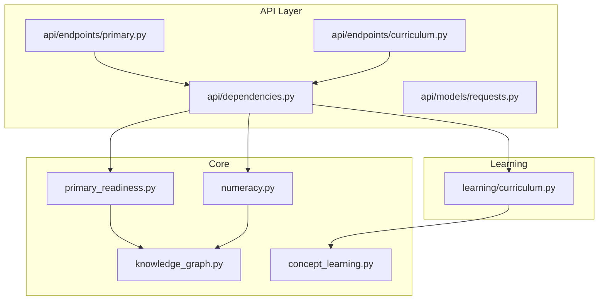
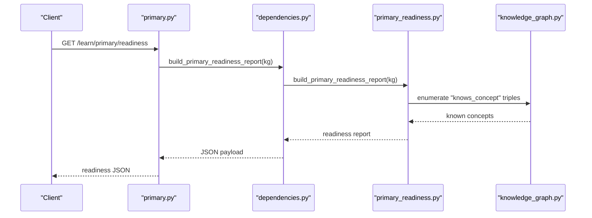
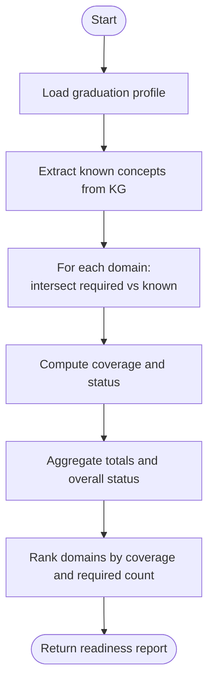
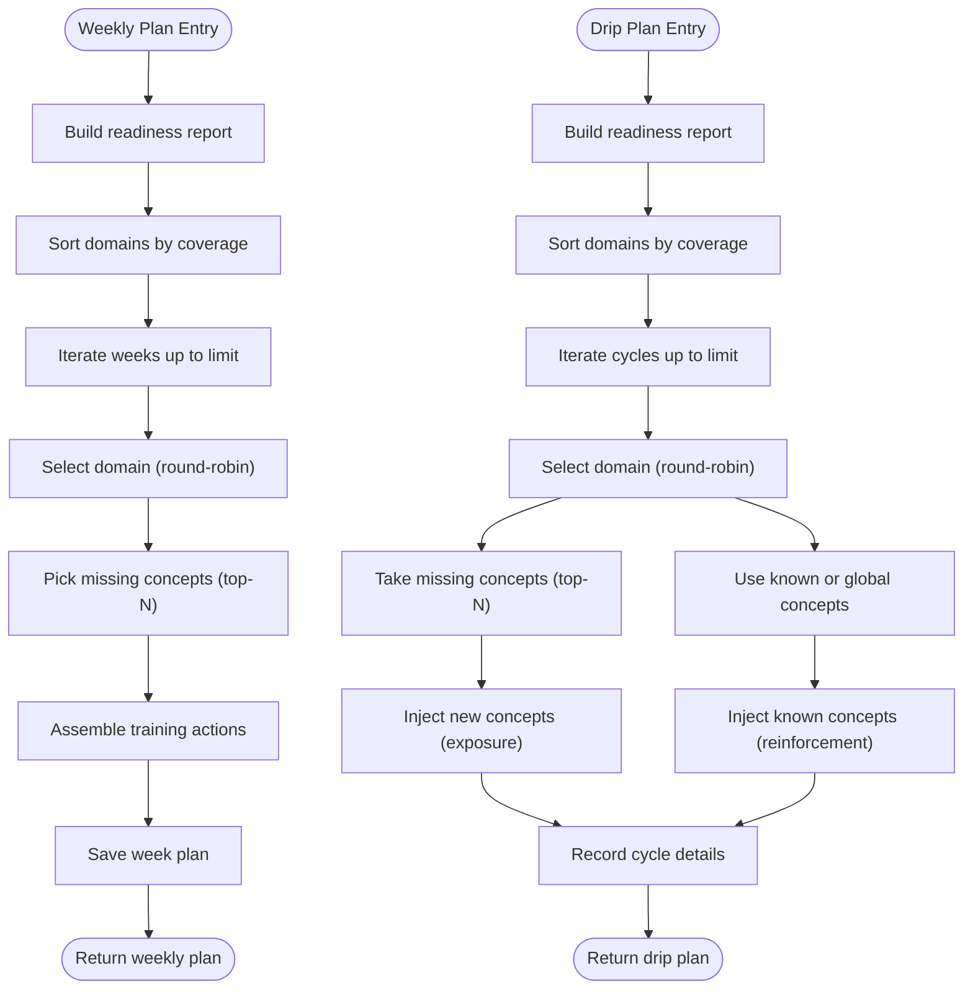
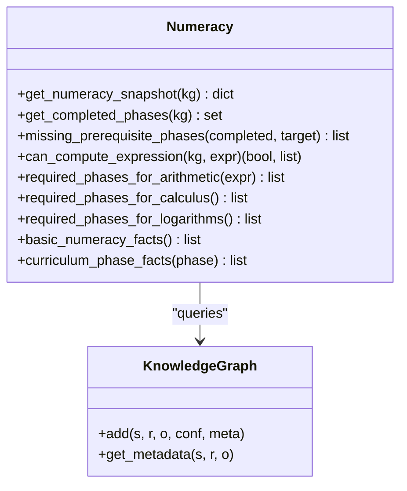
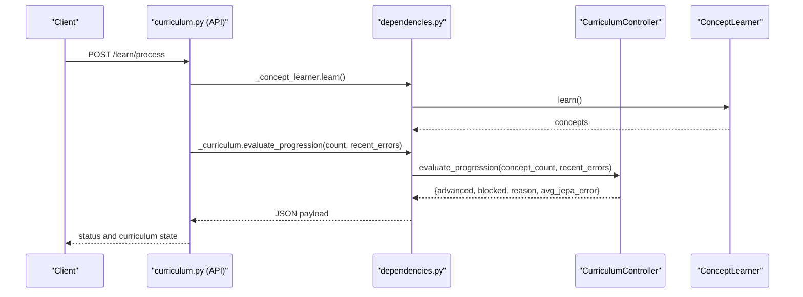
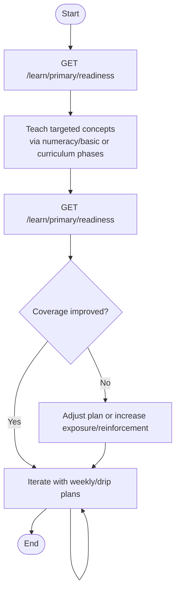
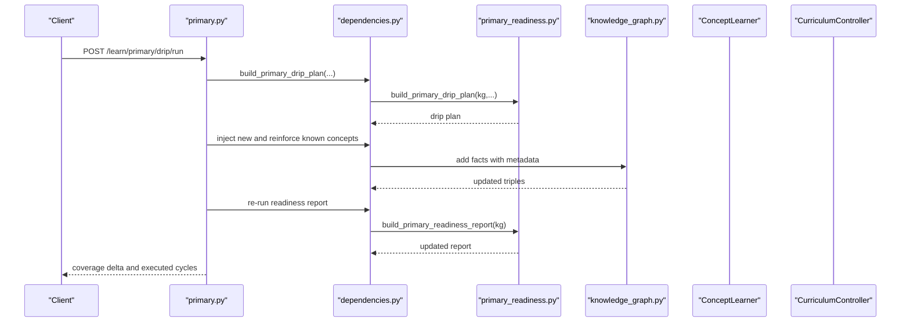
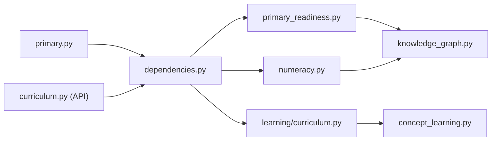

# Readiness Assessment

<cite>
**Referenced Files in This Document**
- [primary_readiness.py](file://core/primary_readiness.py)
- [curriculum.py](file://learning/curriculum.py)
- [numeracy.py](file://core/numeracy.py)
- [curriculum.py (API)](file://api/endpoints/curriculum.py)
- [primary.py (API)](file://api/endpoints/primary.py)
- [dependencies.py](file://api/dependencies.py)
- [knowledge_graph.py](file://core/knowledge_graph.py)
- [concept_learning.py](file://learning/concept_learning.py)
- [requests.py](file://api/models/requests.py)
- [test_api.py](file://tests/test_api.py)
- [test_curriculum.py](file://tests/test_curriculum.py)
</cite>

## Table of Contents
1. [Introduction](#introduction)
2. [Project Structure](#project-structure)
3. [Core Components](#core-components)
4. [Architecture Overview](#architecture-overview)
5. [Detailed Component Analysis](#detailed-component-analysis)
6. [Dependency Analysis](#dependency-analysis)
7. [Performance Considerations](#performance-considerations)
8. [Troubleshooting Guide](#troubleshooting-guide)
9. [Conclusion](#conclusion)
10. [Appendices](#appendices)

## Introduction
This document describes the readiness assessment system for literacy and numeracy preparedness in the semantic AI system. It explains how readiness is evaluated against a primary school graduation profile, how assessment criteria and thresholds are defined, and how the system integrates with the curriculum controller to drive readiness-based progression. It also documents assessment data structures, reporting mechanisms, and feedback loops between readiness assessment and concept learning.

## Project Structure
The readiness assessment spans several modules:
- Core readiness computation and planning logic
- Numeracy-specific primitives for prerequisite gating and curriculum phases
- API endpoints exposing readiness reports, plans, and drip runs
- Dependencies wiring KG, concept learner, and curriculum controller
- Knowledge graph storage and retrieval of learned facts
- Tests validating readiness behavior and curriculum progression

**Diagram sources**
- [primary_readiness.py:1-266](file://core/primary_readiness.py#L1-L266)
- [numeracy.py:1-244](file://core/numeracy.py#L1-L244)
- [knowledge_graph.py:1-34](file://core/knowledge_graph.py#L1-L34)
- [concept_learning.py:1-38](file://learning/concept_learning.py#L1-L38)
- [curriculum.py (API):1-211](file://api/endpoints/curriculum.py#L1-L211)
- [primary.py (API):1-119](file://api/endpoints/primary.py#L1-L119)
- [dependencies.py:1-800](file://api/dependencies.py#L1-L800)
- [curriculum.py:1-296](file://learning/curriculum.py#L1-L296)

**Section sources**
- [primary_readiness.py:1-266](file://core/primary_readiness.py#L1-L266)
- [numeracy.py:1-244](file://core/numeracy.py#L1-L244)
- [curriculum.py (API):1-211](file://api/endpoints/curriculum.py#L1-L211)
- [primary.py (API):1-119](file://api/endpoints/primary.py#L1-L119)
- [dependencies.py:1-800](file://api/dependencies.py#L1-L800)
- [knowledge_graph.py:1-34](file://core/knowledge_graph.py#L1-L34)
- [concept_learning.py:1-38](file://learning/concept_learning.py#L1-L38)
- [curriculum.py:1-296](file://learning/curriculum.py#L1-L296)

## Core Components
- Primary readiness report builder: Computes domain-wise and overall coverage against a primary-school graduation profile, assigns statuses, and surfaces priority gaps.
- Weekly and drip learning plans: Generate actionable plans to address readiness gaps with recommended next actions and optional targets.
- Numeracy primitives: Provide curriculum phase tracking, prerequisite checks, and numeracy snapshot queries used by readiness and curriculum progression.
- Curriculum controller: Enforces monotonic stage progression gated by concept density and JEPA stability, and exposes prerequisite checks for tasks.
- API endpoints: Expose readiness status, weekly/drip plans, and continuous drip runs; integrate with ingestion and curriculum endpoints.

**Section sources**
- [primary_readiness.py:69-152](file://core/primary_readiness.py#L69-L152)
- [primary_readiness.py:155-206](file://core/primary_readiness.py#L155-L206)
- [primary_readiness.py:209-266](file://core/primary_readiness.py#L209-L266)
- [numeracy.py:23-96](file://core/numeracy.py#L23-L96)
- [curriculum.py:92-296](file://learning/curriculum.py#L92-L296)
- [curriculum.py (API):8-74](file://api/endpoints/curriculum.py#L8-L74)
- [primary.py (API):7-119](file://api/endpoints/primary.py#L7-L119)

## Architecture Overview
The readiness assessment is driven by the knowledge graph’s “knows_concept” relations. The system:
- Builds a readiness report by intersecting learned concepts with a predefined graduation profile.
- Generates weekly and drip plans to improve readiness.
- Integrates with the curriculum controller to gate operations and decide progression.
- Uses numeracy phase facts and prerequisite checks to enable arithmetic and higher math.

**Diagram sources**
- [primary.py (API):7-13](file://api/endpoints/primary.py#L7-L13)
- [dependencies.py:68-72](file://api/dependencies.py#L68-L72)
- [primary_readiness.py:106-152](file://core/primary_readiness.py#L106-L152)
- [knowledge_graph.py:6-29](file://core/knowledge_graph.py#L6-L29)

## Detailed Component Analysis

### Readiness Report Builder
- Graduation profile: Defines required concepts per domain (literacy, mathematics, science, social studies, economy, digital and life skills).
- Coverage computation: Domain coverage equals matched concepts divided by required; overall coverage aggregates across domains.
- Status assignment: Based on thresholds, domains and overall readiness receive “ready”, “in_progress”, or “missing”.
- Priority gaps: Domains ranked by coverage and required count to highlight priority gaps.
- Recommendations: Domain-specific guidance derived from missing concepts.

**Diagram sources**
- [primary_readiness.py:6-66](file://core/primary_readiness.py#L6-L66)
- [primary_readiness.py:106-152](file://core/primary_readiness.py#L106-L152)

**Section sources**
- [primary_readiness.py:6-66](file://core/primary_readiness.py#L6-L66)
- [primary_readiness.py:69-84](file://core/primary_readiness.py#L69-L84)
- [primary_readiness.py:106-152](file://core/primary_readiness.py#L106-L152)

### Weekly and Drip Learning Plans
- Weekly plan: Spreads remediation across domains, focusing on those with lowest coverage, and suggests lessons and ingestion actions.
- Drip plan: Iteratively introduces new concepts and reinforces known ones across cycles, configurable by cycle counts and concept counts per cycle.

**Diagram sources**
- [primary_readiness.py:155-206](file://core/primary_readiness.py#L155-L206)
- [primary_readiness.py:209-266](file://core/primary_readiness.py#L209-L266)

**Section sources**
- [primary_readiness.py:155-206](file://core/primary_readiness.py#L155-L206)
- [primary_readiness.py:209-266](file://core/primary_readiness.py#L209-L266)

### Numeracy Primitives and Curriculum Phase Tracking
- Snapshot: Retrieves digits, symbols, and concepts known in the numeracy domain.
- Completed phases: Tracks curriculum phases completed in the curriculum domain.
- Prerequisite checks: Computes missing prerequisite phases for a target phase.
- Expression feasibility: Determines if an expression can be computed given known digits, symbols, and concepts.
- Basic numeracy facts and phase facts: Provide canonical facts to bootstrap numeracy and math foundations.

**Diagram sources**
- [numeracy.py:23-235](file://core/numeracy.py#L23-L235)
- [knowledge_graph.py:1-34](file://core/knowledge_graph.py#L1-L34)

**Section sources**
- [numeracy.py:23-96](file://core/numeracy.py#L23-L96)
- [numeracy.py:98-235](file://core/numeracy.py#L98-L235)

### Integration with Curriculum Controller
- Prerequisite gating: Arithmetic requires at least numeracy stage; abstraction requires reasoning stage.
- Progression evaluation: Requires both concept density and JEPA stability; stage is monotonic.
- API integration: POST /learn/process triggers concept learning and evaluates progression; GET /curriculum/status returns current status.

**Diagram sources**
- [curriculum.py (API):57-74](file://api/endpoints/curriculum.py#L57-L74)
- [dependencies.py:538-541](file://api/dependencies.py#L538-L541)
- [curriculum.py:128-202](file://learning/curriculum.py#L128-L202)
- [concept_learning.py:9-37](file://learning/concept_learning.py#L9-L37)

**Section sources**
- [curriculum.py (API):8-74](file://api/endpoints/curriculum.py#L8-L74)
- [dependencies.py:538-541](file://api/dependencies.py#L538-L541)
- [curriculum.py:92-296](file://learning/curriculum.py#L92-L296)
- [concept_learning.py:1-38](file://learning/concept_learning.py#L1-L38)

### Readiness Evaluation Workflows and Scoring Systems
- Readiness scoring:
  - Domain coverage = matched concepts / required concepts.
  - Overall coverage = total matched / total required.
  - Status thresholds:
    - Ready: coverage >= 0.85
    - In progress: coverage >= 0.35
    - Missing: coverage < 0.35
- Priority gaps: Top domains with the lowest coverage and highest requirement counts.
- Practical example:
  - Baseline readiness: GET /learn/primary/readiness
  - Teach numeracy basics: POST /learn/numeracy/basic
  - Advance economy phases: POST /learn/curriculum/economy/phase/{phase}
  - Re-check readiness: GET /learn/primary/readiness and compare coverage deltas

**Diagram sources**
- [primary.py (API):7-13](file://api/endpoints/primary.py#L7-L13)
- [curriculum.py (API):103-133](file://api/endpoints/curriculum.py#L103-L133)
- [curriculum.py (API):136-158](file://api/endpoints/curriculum.py#L136-L158)
- [primary_readiness.py:106-152](file://core/primary_readiness.py#L106-L152)

**Section sources**
- [primary_readiness.py:78-84](file://core/primary_readiness.py#L78-L84)
- [primary_readiness.py:106-152](file://core/primary_readiness.py#L106-L152)
- [primary.py (API):7-13](file://api/endpoints/primary.py#L7-L13)
- [curriculum.py (API):103-158](file://api/endpoints/curriculum.py#L103-L158)

### Relationship Between Readiness Scores and Learning Pathway Recommendations
- Readiness scores inform:
  - Which domains to prioritize (lowest coverage).
  - How to distribute weekly remediation across domains.
  - Whether to expose new concepts or reinforce known ones (drip).
- Recommendations:
  - Domain-specific actions based on missing concepts.
  - Numeracy prerequisites unlocking arithmetic.
  - Economy phase advancement before graph-heavy topics.

**Section sources**
- [primary_readiness.py:86-103](file://core/primary_readiness.py#L86-L103)
- [primary_readiness.py:155-206](file://core/primary_readiness.py#L155-L206)
- [primary_readiness.py:209-266](file://core/primary_readiness.py#L209-L266)
- [curriculum.py (API):136-158](file://api/endpoints/curriculum.py#L136-L158)

### Assessment Data Structures and Reporting Mechanisms
- Readiness report:
  - Target, overall coverage, overall status, known concept count.
  - Per-domain: domain, status, coverage, counts, known and missing concepts, recommendations.
  - Priority gaps: top domains with missing concepts.
- Weekly plan:
  - Weeks, overall status, overall coverage, per-week focus and actions.
- Drip plan:
  - Cycles, new/reinforcement counts per cycle, per-cycle domain and concepts.
- API payloads:
  - JSON responses for readiness, plans, and drip runs; ingestion endpoints support persistence of lessons.

**Section sources**
- [primary_readiness.py:106-152](file://core/primary_readiness.py#L106-L152)
- [primary_readiness.py:155-206](file://core/primary_readiness.py#L155-L206)
- [primary_readiness.py:209-266](file://core/primary_readiness.py#L209-L266)
- [primary.py (API):7-119](file://api/endpoints/primary.py#L7-L119)
- [curriculum.py (API):161-210](file://api/endpoints/curriculum.py#L161-L210)

### Feedback Loops Between Readiness Assessment and Concept Learning Systems
- Concept learner:
  - Learns patterns from TMS beliefs and produces concepts with abstraction levels.
- JEPA stability:
  - Curriculum progression depends on recent average JEPA error; readiness improvements should reduce uncertainty.
- Continuous drip:
  - Run cycles to expose new concepts and reinforce known ones; re-evaluate readiness and adjust targets.

**Diagram sources**
- [primary.py (API):61-118](file://api/endpoints/primary.py#L61-L118)
- [dependencies.py:68-72](file://api/dependencies.py#L68-L72)
- [primary_readiness.py:209-266](file://core/primary_readiness.py#L209-L266)
- [knowledge_graph.py:6-29](file://core/knowledge_graph.py#L6-L29)
- [concept_learning.py:9-37](file://learning/concept_learning.py#L9-L37)
- [curriculum.py:128-202](file://learning/curriculum.py#L128-L202)

**Section sources**
- [primary.py (API):61-118](file://api/endpoints/primary.py#L61-L118)
- [dependencies.py:68-72](file://api/dependencies.py#L68-L72)
- [primary_readiness.py:209-266](file://core/primary_readiness.py#L209-L266)
- [knowledge_graph.py:6-29](file://core/knowledge_graph.py#L6-L29)
- [concept_learning.py:1-38](file://learning/concept_learning.py#L1-L38)
- [curriculum.py:128-202](file://learning/curriculum.py#L128-L202)

## Dependency Analysis
- API endpoints depend on dependencies to orchestrate readiness computations, numeracy facts, and curriculum state.
- Readiness relies on the knowledge graph for concept coverage.
- Curriculum controller depends on concept count and recent JEPA errors.

**Diagram sources**
- [primary.py (API):1-119](file://api/endpoints/primary.py#L1-L119)
- [curriculum.py (API):1-211](file://api/endpoints/curriculum.py#L1-L211)
- [dependencies.py:1-800](file://api/dependencies.py#L1-L800)
- [primary_readiness.py:1-266](file://core/primary_readiness.py#L1-L266)
- [numeracy.py:1-244](file://core/numeracy.py#L1-L244)
- [knowledge_graph.py:1-34](file://core/knowledge_graph.py#L1-L34)
- [concept_learning.py:1-38](file://learning/concept_learning.py#L1-L38)
- [curriculum.py:1-296](file://learning/curriculum.py#L1-L296)

**Section sources**
- [dependencies.py:1-800](file://api/dependencies.py#L1-L800)
- [primary_readiness.py:1-266](file://core/primary_readiness.py#L1-L266)
- [numeracy.py:1-244](file://core/numeracy.py#L1-L244)
- [knowledge_graph.py:1-34](file://core/knowledge_graph.py#L1-L34)
- [concept_learning.py:1-38](file://learning/concept_learning.py#L1-L38)
- [curriculum.py:1-296](file://learning/curriculum.py#L1-L296)

## Performance Considerations
- Readiness computations scale linearly with the number of “knows_concept” triples and required concepts per domain.
- Drip runs add and update facts; batching and limiting cycles prevents excessive KG growth.
- JEPA stability window determines how quickly progression can advance; tuning error tolerance affects readiness-to-progression alignment.

## Troubleshooting Guide
- Readiness endpoint failures: Check API logs for exceptions during readiness computation.
- Curriculum progression blocked: Inspect blocking reason indicating high latent uncertainty (average JEPA error above tolerance).
- Prerequisite violations: Arithmetic requires numeracy stage; abstraction requires reasoning stage.
- Tests validation:
  - Readiness shape and coverage improvement after teaching.
  - Curriculum progression thresholds and prerequisite gates.

**Section sources**
- [primary.py (API):11-13](file://api/endpoints/primary.py#L11-L13)
- [curriculum.py (API):32-34](file://api/endpoints/curriculum.py#L32-L34)
- [curriculum.py:186-194](file://learning/curriculum.py#L186-L194)
- [test_api.py:655-680](file://tests/test_api.py#L655-L680)
- [test_curriculum.py:126-133](file://tests/test_curriculum.py#L126-L133)

## Conclusion
The readiness assessment system provides a structured, data-driven method to measure literacy and numeracy preparedness against a primary-school profile, quantify gaps, and generate actionable plans. It integrates tightly with the curriculum controller to ensure readiness-based progression, and with numeracy primitives to unlock arithmetic and advanced math. Continuous feedback loops through drip runs and re-assessment refine readiness and guide learning pathways.

## Appendices
- Example API requests:
  - GET /learn/primary/readiness
  - GET /learn/primary/plan?weeks=6
  - GET /learn/primary/drip/plan?cycles=12&new_concepts_per_cycle=3&reinforcement_concepts_per_cycle=2
  - POST /learn/primary/drip/run?cycles=12&new_concepts_per_cycle=3&reinforcement_concepts_per_cycle=2&target_coverage=0.85
  - POST /learn/numeracy/basic
  - POST /learn/curriculum/economy/phase/{phase}

**Section sources**
- [primary.py (API):7-119](file://api/endpoints/primary.py#L7-L119)
- [curriculum.py (API):103-158](file://api/endpoints/curriculum.py#L103-L158)