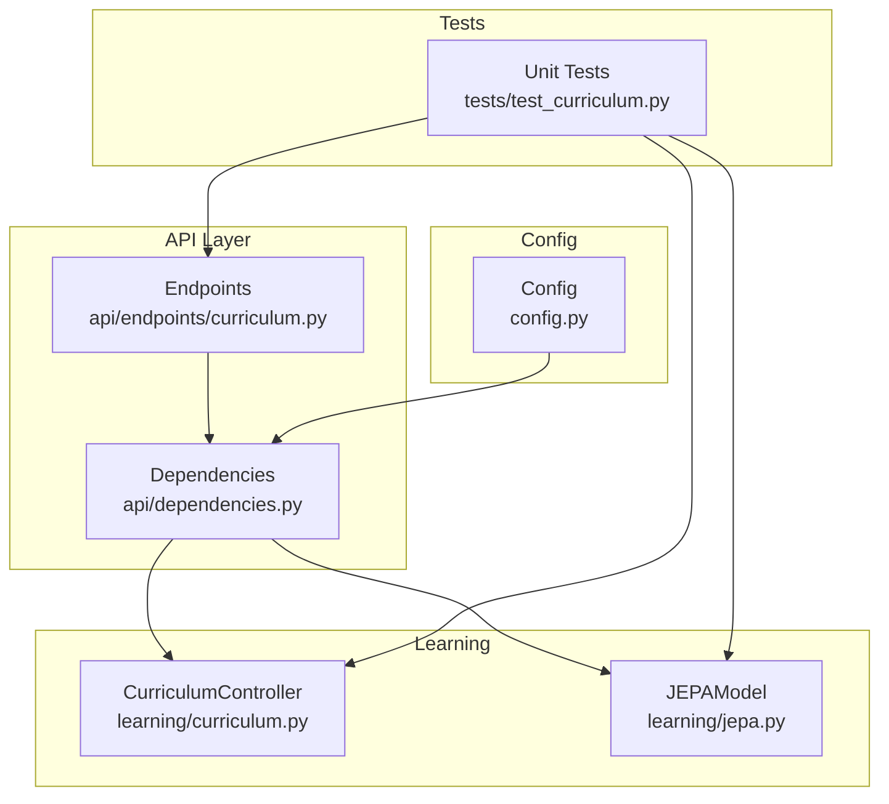
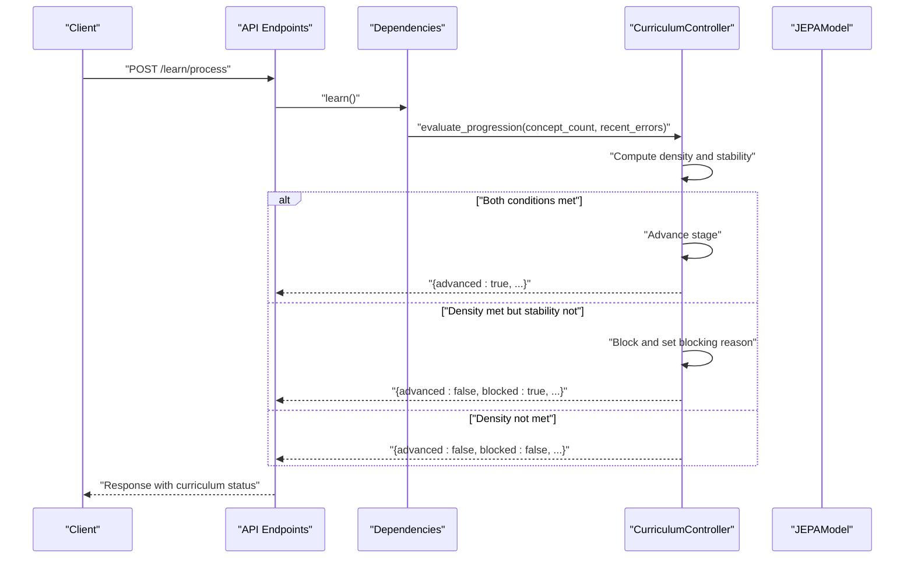
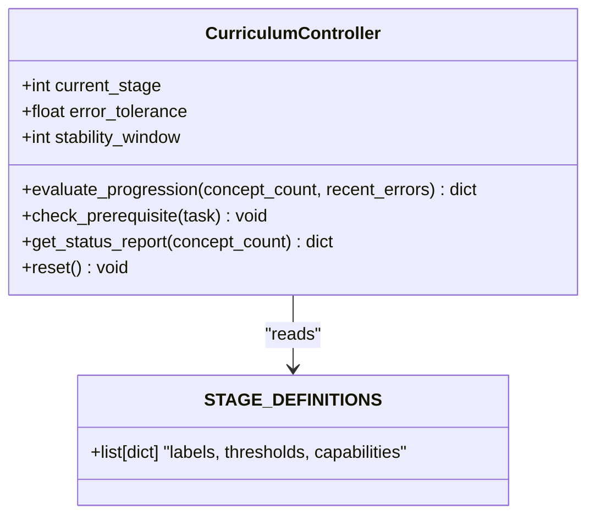
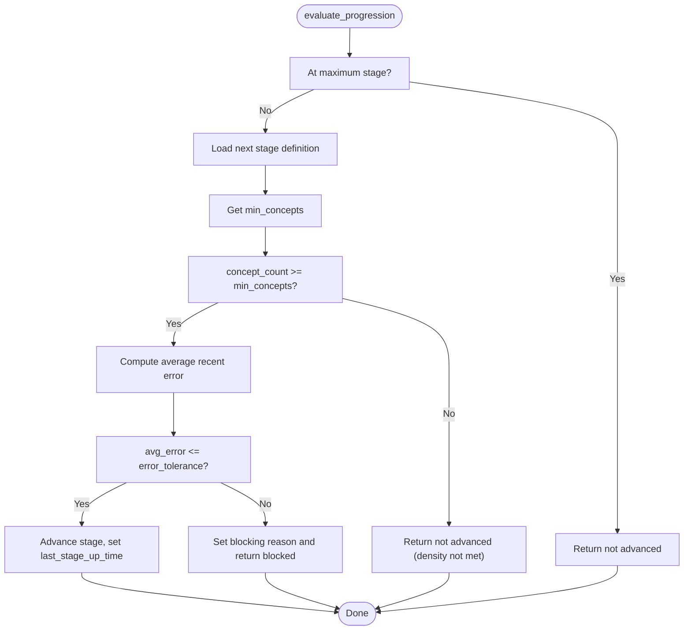
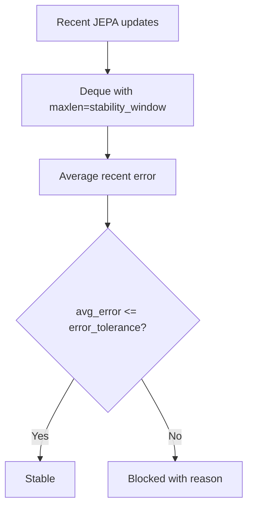
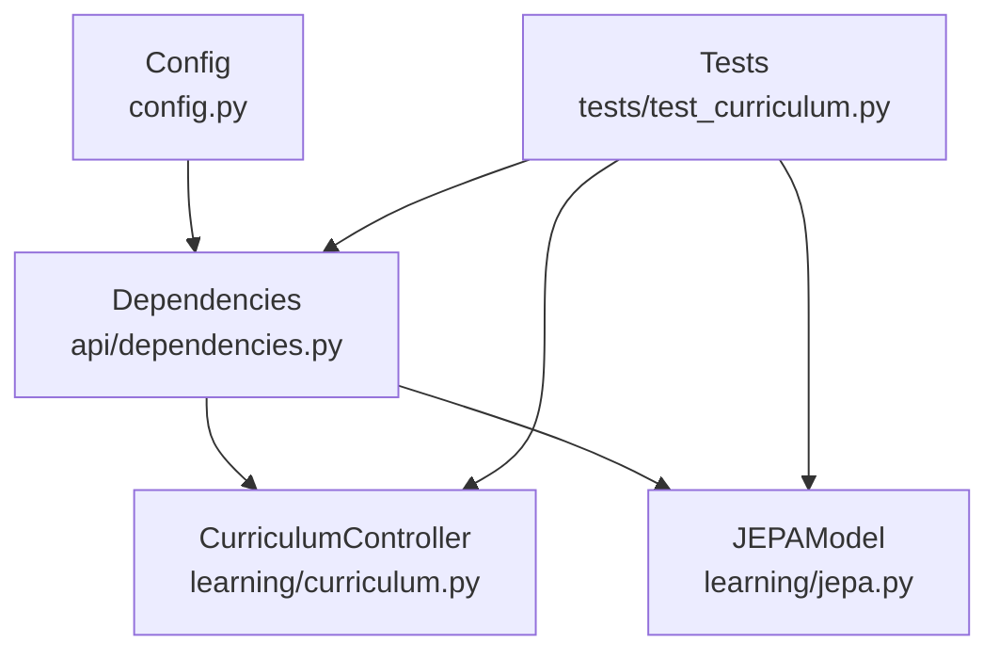

# Staged Learning Progression

<cite>
**Referenced Files in This Document**
- [curriculum.py](file://learning/curriculum.py)
- [test_curriculum.py](file://tests/test_curriculum.py)
- [config.py](file://config.py)
- [dependencies.py](file://api/dependencies.py)
- [curriculum.py (API endpoints)](file://api/endpoints/curriculum.py)
- [jepa.py](file://learning/jepa.py)
</cite>

## Table of Contents
1. [Introduction](#introduction)
2. [Project Structure](#project-structure)
3. [Core Components](#core-components)
4. [Architecture Overview](#architecture-overview)
5. [Detailed Component Analysis](#detailed-component-analysis)
6. [Dependency Analysis](#dependency-analysis)
7. [Performance Considerations](#performance-considerations)
8. [Troubleshooting Guide](#troubleshooting-guide)
9. [Conclusion](#conclusion)
10. [Appendices](#appendices)

## Introduction
This document describes the staged learning progression system that governs how the agent advances through three cognitive stages: Literacy, Numeracy, and Reasoning. The system enforces both density and stability conditions to ensure robust progression, and it integrates tightly with the reinforcement learning system’s JEPA model to maintain stability during curriculum transitions. The document explains the three-stage architecture, thresholds, capability restrictions, progression evaluation algorithm, monotonic progression mechanism, blocking reasons, stability window configuration, and the relationship between curriculum stages and adaptive difficulty.

## Project Structure
The staged learning progression spans several modules:
- Curriculum controller and stage definitions
- API endpoints that expose progression and status
- Configuration for error tolerance and stability window
- JEPA model and online update pipeline feeding error metrics
- Tests validating behavior and integration

**Diagram sources**
- [curriculum.py:92-296](file://learning/curriculum.py#L92-L296)
- [dependencies.py:18-28](file://api/dependencies.py#L18-L28)
- [curriculum.py (API endpoints):1-211](file://api/endpoints/curriculum.py#L1-L211)
- [config.py:48-51](file://config.py#L48-L51)
- [test_curriculum.py:1-450](file://tests/test_curriculum.py#L1-L450)
- [jepa.py:66-152](file://learning/jepa.py#L66-L152)

**Section sources**
- [curriculum.py:1-296](file://learning/curriculum.py#L1-L296)
- [dependencies.py:18-28](file://api/dependencies.py#L18-L28)
- [curriculum.py (API endpoints):1-211](file://api/endpoints/curriculum.py#L1-L211)
- [config.py:48-51](file://config.py#L48-L51)
- [test_curriculum.py:1-450](file://tests/test_curriculum.py#L1-L450)
- [jepa.py:66-152](file://learning/jepa.py#L66-L152)

## Core Components
- Three-stage architecture with concept thresholds and capability restrictions:
  - Literacy: minimal concept threshold; arithmetic not allowed.
  - Numeracy: moderate threshold; arithmetic allowed.
  - Reasoning: higher threshold; arithmetic and abstraction allowed.
- Progression evaluation algorithm:
  - Density condition: concept count meets or exceeds the next stage’s threshold.
  - Stability condition: average recent JEPA prediction error is within tolerance.
- Monotonic progression: stage can only increase; resets are manual.
- Blocking reasons: when density is met but stability is not; otherwise no blocking.
- Stability window configuration: controls how many recent JEPA updates contribute to the average error.
- Relationship to adaptive difficulty: JEPA’s stability informs whether the system advances to a more demanding stage.

**Section sources**
- [curriculum.py:30-67](file://learning/curriculum.py#L30-L67)
- [curriculum.py:128-202](file://learning/curriculum.py#L128-L202)
- [test_curriculum.py:63-124](file://tests/test_curriculum.py#L63-L124)

## Architecture Overview
The progression system is orchestrated by the CurriculumController, which:
- Receives concept count and recent JEPA errors from the API layer.
- Evaluates density and stability conditions.
- Updates stage and records blocking reasons.
- Exposes status reports and persistence.

**Diagram sources**
- [curriculum.py (API endpoints):57-74](file://api/endpoints/curriculum.py#L57-L74)
- [dependencies.py:760-769](file://api/dependencies.py#L760-L769)
- [curriculum.py:128-202](file://learning/curriculum.py#L128-L202)

## Detailed Component Analysis

### Three-Stage Architecture and Capability Restrictions
- Stage definitions include:
  - Literacy: minimal concept threshold; arithmetic and abstraction disallowed.
  - Numeracy: moderate threshold; arithmetic allowed.
  - Reasoning: higher threshold; arithmetic and abstraction allowed.
- Prerequisite gating ensures tasks requiring higher stages are blocked until prerequisites are met.

**Diagram sources**
- [curriculum.py:30-67](file://learning/curriculum.py#L30-L67)
- [curriculum.py:92-296](file://learning/curriculum.py#L92-L296)

**Section sources**
- [curriculum.py:30-67](file://learning/curriculum.py#L30-L67)
- [curriculum.py:206-227](file://learning/curriculum.py#L206-L227)
- [test_curriculum.py:25-47](file://tests/test_curriculum.py#L25-L47)

### Progression Evaluation Algorithm
- Inputs:
  - concept_count: number of learned concepts.
  - recent_errors: recent JEPA MSE losses from online updates.
- Conditions:
  - Density: concept_count ≥ next stage threshold.
  - Stability: average recent error ≤ error tolerance.
- Outcomes:
  - If both met: advance stage, clear blocking reason, record stage-up time.
  - If density met but stability not: block, set blocking reason.
  - Otherwise: no advancement.

**Diagram sources**
- [curriculum.py:128-202](file://learning/curriculum.py#L128-L202)

**Section sources**
- [curriculum.py:128-202](file://learning/curriculum.py#L128-L202)
- [test_curriculum.py:63-124](file://tests/test_curriculum.py#L63-L124)

### Monotonic Progression Mechanism and Automatic Advancement
- Stage progression is monotonic: once advanced, stage does not decrease automatically.
- Manual reset reverts to stage 0 (Literacy).
- Status reporting includes progress percentage toward the next stage threshold.

**Section sources**
- [curriculum.py:128-202](file://learning/curriculum.py#L128-L202)
- [curriculum.py:228-252](file://learning/curriculum.py#L228-L252)
- [test_curriculum.py:118-124](file://tests/test_curriculum.py#L118-L124)

### Practical Examples: Literacy → Numeracy → Reasoning
- From Literacy to Numeracy:
  - Requires meeting the Numeracy threshold while maintaining stability.
  - Example: concept_count ≥ Numeracy threshold and average JEPA error ≤ tolerance.
- From Numeracy to Reasoning:
  - Requires meeting the Reasoning threshold while maintaining stability.
  - Example: concept_count ≥ Reasoning threshold and average JEPA error ≤ tolerance.

These scenarios are validated by tests that assert advancement and blocking behavior under various combinations of concept counts and recent errors.

**Section sources**
- [test_curriculum.py:73-111](file://tests/test_curriculum.py#L73-L111)

### Blocking Reasons and Stability Window Configuration
- Blocking occurs when density is met but stability is not:
  - The system records a human-readable reason indicating high latent uncertainty.
- Stability window:
  - Controls how many recent JEPA updates are averaged to compute stability.
  - Configured via a dedicated setting and enforced by a bounded deque.

**Diagram sources**
- [dependencies.py:110-110](file://api/dependencies.py#L110-L110)
- [config.py:50-51](file://config.py#L50-L51)
- [dependencies.py:760-769](file://api/dependencies.py#L760-L769)

**Section sources**
- [curriculum.py:163-194](file://learning/curriculum.py#L163-L194)
- [dependencies.py:110-110](file://api/dependencies.py#L110-L110)
- [config.py:50-51](file://config.py#L50-L51)
- [test_curriculum.py:331-352](file://tests/test_curriculum.py#L331-L352)

### Relationship Between Curriculum Stages and Adaptive Difficulty
- JEPA’s stability informs whether the system can safely advance to a more demanding stage.
- As the agent progresses, the system expects fewer prediction surprises (lower average error) to justify increased difficulty.
- The API layer triggers JEPA online updates during decisions, feeding the deque used for stability calculations.

**Section sources**
- [dependencies.py:760-769](file://api/dependencies.py#L760-L769)
- [jepa.py:66-152](file://learning/jepa.py#L66-L152)

### Configuration Parameters
- Error tolerance:
  - Maximum acceptable average JEPA prediction error to allow stage advancement.
- Stability window:
  - Number of recent JEPA updates considered for computing the average error.
- These parameters are defined centrally and consumed by the API layer and curriculum controller.

**Section sources**
- [config.py:48-51](file://config.py#L48-L51)
- [dependencies.py:18-28](file://api/dependencies.py#L18-L28)
- [curriculum.py:64-66](file://learning/curriculum.py#L64-L66)

## Dependency Analysis
The progression system depends on:
- CurriculumController for stage logic and gating.
- API endpoints for exposing progression and status.
- Dependencies module for wiring JEPA updates and stability metrics.
- Configuration for global parameters.
- Tests for validating behavior across scenarios.

**Diagram sources**
- [curriculum.py:92-296](file://learning/curriculum.py#L92-L296)
- [dependencies.py:18-28](file://api/dependencies.py#L18-L28)
- [config.py:48-51](file://config.py#L48-L51)
- [test_curriculum.py:1-450](file://tests/test_curriculum.py#L1-L450)
- [jepa.py:66-152](file://learning/jepa.py#L66-L152)

**Section sources**
- [curriculum.py:92-296](file://learning/curriculum.py#L92-L296)
- [dependencies.py:18-28](file://api/dependencies.py#L18-L28)
- [config.py:48-51](file://config.py#L48-L51)
- [test_curriculum.py:1-450](file://tests/test_curriculum.py#L1-L450)
- [jepa.py:66-152](file://learning/jepa.py#L66-L152)

## Performance Considerations
- The stability computation uses a bounded deque to cap memory and computational overhead.
- Average error calculation is O(n) over the stability window; keep window sizes reasonable for responsiveness.
- Monotonic progression avoids oscillations and reduces unnecessary re-evaluations.

[No sources needed since this section provides general guidance]

## Troubleshooting Guide
Common issues and resolutions:
- Stage not advancing despite sufficient concepts:
  - Verify that recent JEPA error average is within tolerance.
  - Confirm the stability window is configured appropriately.
- Frequent blocking with “high latent uncertainty”:
  - Investigate recent JEPA updates and model training status.
  - Consider increasing error tolerance or expanding the stability window cautiously.
- Arithmetic or abstraction requests failing:
  - Ensure the current stage allows the requested capability.
  - Use prerequisite checks to guard restricted operations.

**Section sources**
- [curriculum.py:163-194](file://learning/curriculum.py#L163-L194)
- [curriculum.py (API endpoints):29-54](file://api/endpoints/curriculum.py#L29-L54)
- [test_curriculum.py:126-162](file://tests/test_curriculum.py#L126-L162)

## Conclusion
The staged learning progression system enforces robust, monotonic advancement across Literacy, Numeracy, and Reasoning by combining concept density thresholds with JEPA-based stability checks. The API layer integrates JEPA updates and exposes progression and status endpoints, while configuration centralizes error tolerance and stability window settings. This design ensures that the system adapts difficulty in tandem with learning stability, preventing premature exposure to higher demands.

[No sources needed since this section summarizes without analyzing specific files]

## Appendices

### Appendix A: API Integration Details
- Endpoints:
  - GET /curriculum/status: returns current stage and progress.
  - POST /curriculum/reset: resets to stage 0.
  - POST /learn/process: evaluates progression and returns results.
  - POST /math/calculate: gated by arithmetic prerequisite.
- The learn endpoint feeds concept count and recent JEPA errors to the controller.

**Section sources**
- [curriculum.py (API endpoints):8-74](file://api/endpoints/curriculum.py#L8-L74)
- [curriculum.py (API endpoints):29-54](file://api/endpoints/curriculum.py#L29-L54)

### Appendix B: Persistence and Reset
- CurriculumController supports saving and loading state, including error tolerance and stability window.
- Manual reset reverts to stage 0 and clears blocking reason.

**Section sources**
- [curriculum.py:265-296](file://learning/curriculum.py#L265-L296)
- [test_curriculum.py:197-211](file://tests/test_curriculum.py#L197-L211)