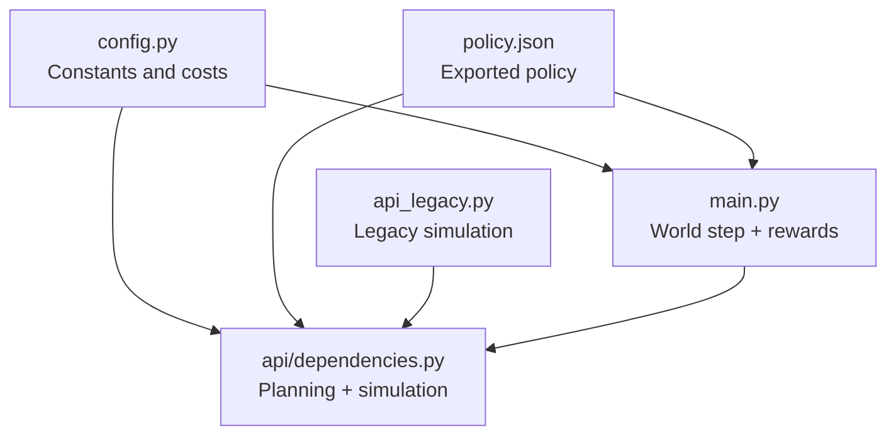
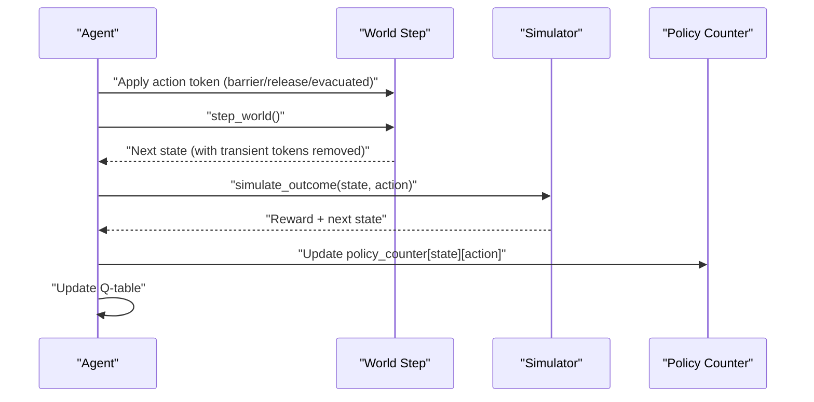
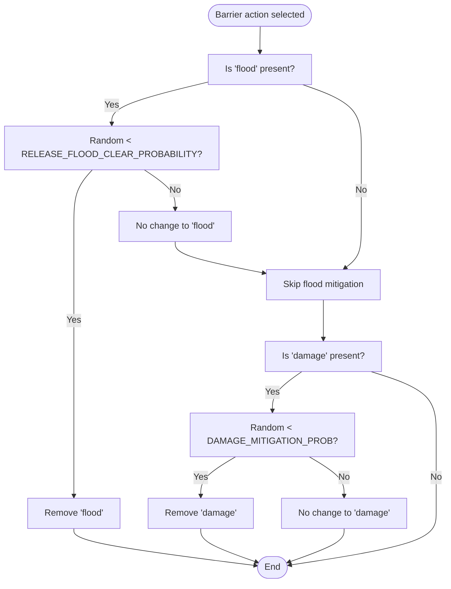
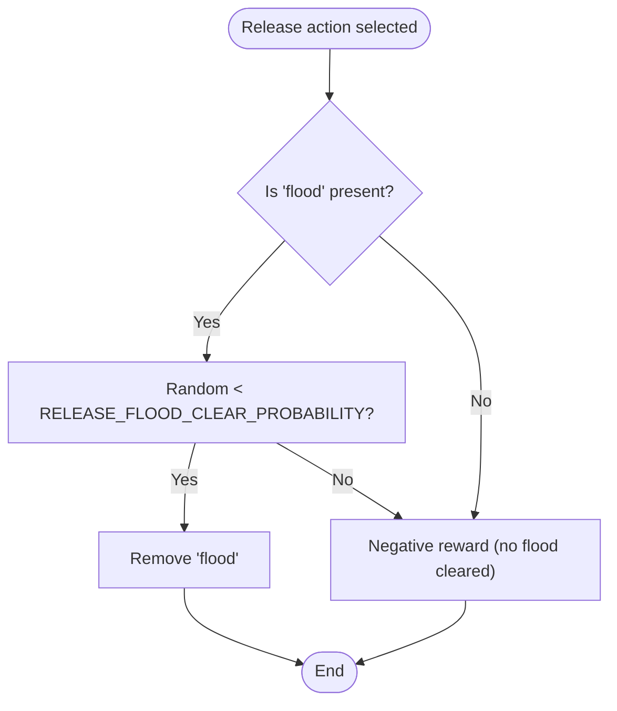
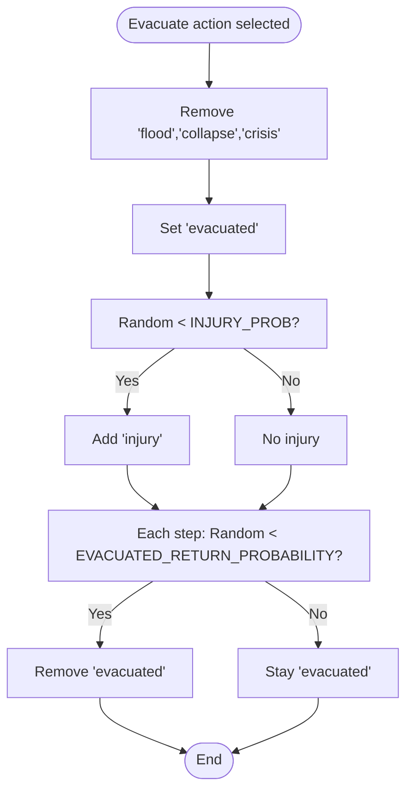
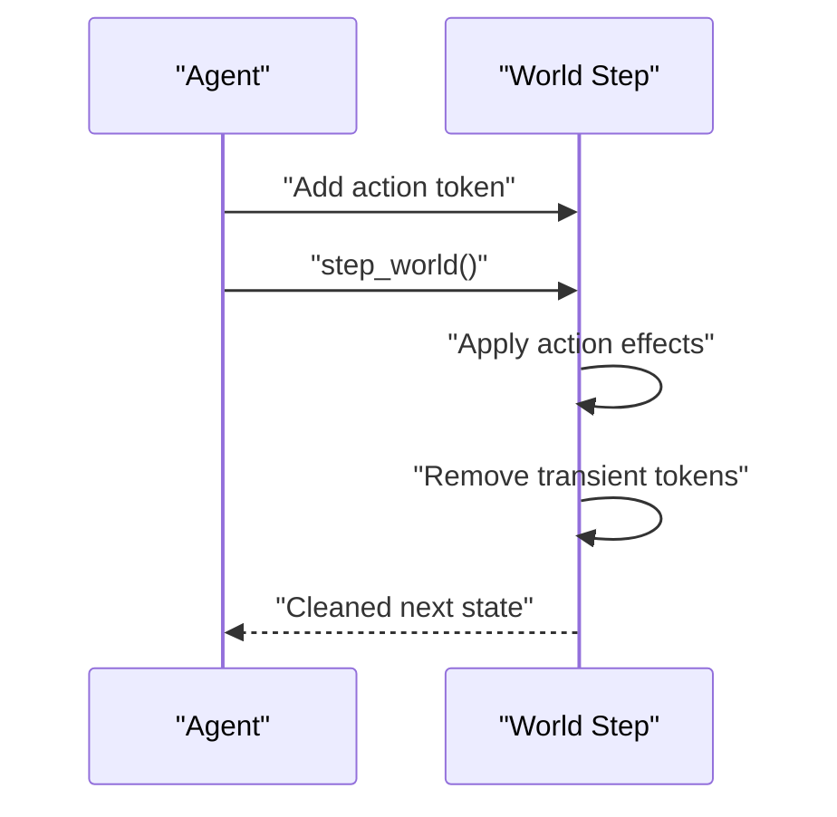
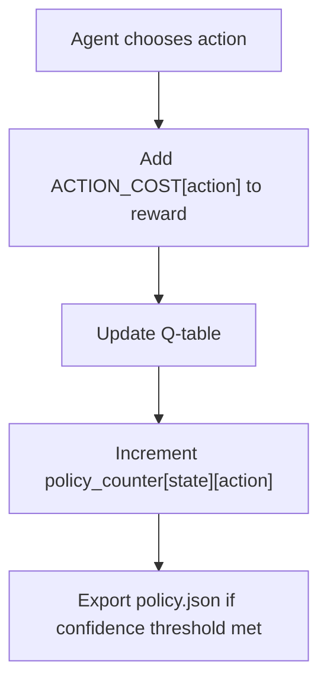
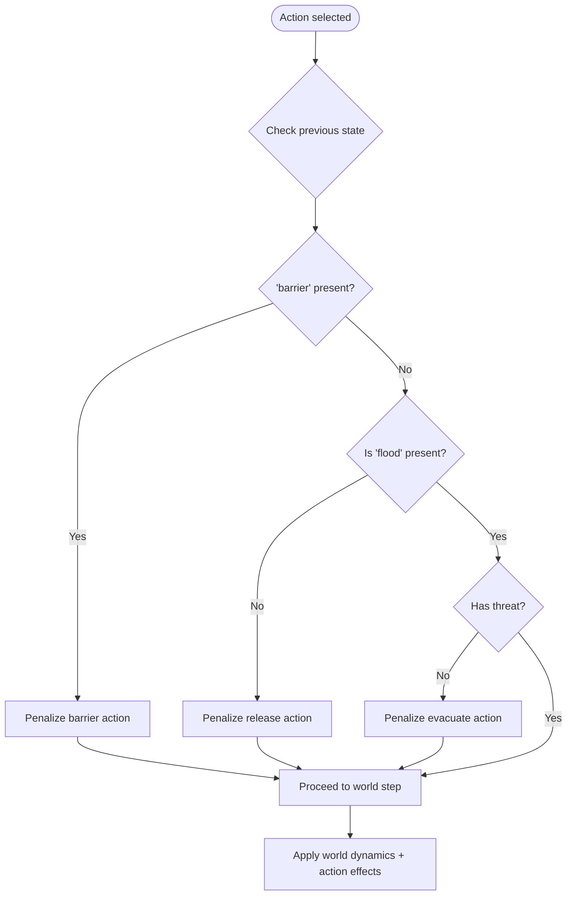
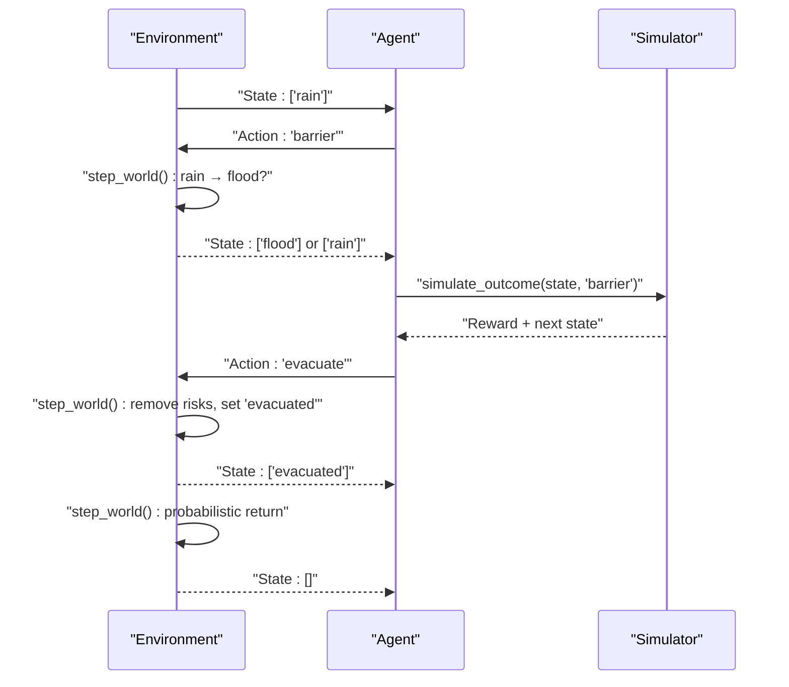
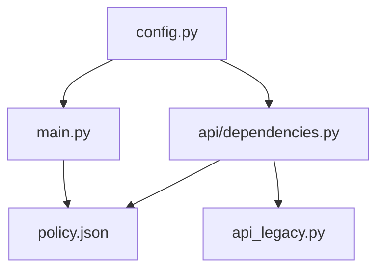

# Action Effects System

<cite>
**Referenced Files in This Document**
- [main.py](file://main.py)
- [config.py](file://config.py)
- [api/dependencies.py](file://api/dependencies.py)
- [policy.json](file://policy.json)
- [api_legacy.py](file://api_legacy.py)
</cite>

## Table of Contents
1. [Introduction](#introduction)
2. [Project Structure](#project-structure)
3. [Core Components](#core-components)
4. [Architecture Overview](#architecture-overview)
5. [Detailed Component Analysis](#detailed-component-analysis)
6. [Dependency Analysis](#dependency-analysis)
7. [Performance Considerations](#performance-considerations)
8. [Troubleshooting Guide](#troubleshooting-guide)
9. [Conclusion](#conclusion)

## Introduction
This document describes the action effects system governing three intervention actions—barrier, release, and evacuate—and their conditional effects within a disaster response scenario. It explains how each action mitigates threats, introduces unintended consequences, manages transient action tokens, and integrates costs and policy counters for confidence assessment. It also covers feasibility checks, constraint enforcement, and provides examples of action sequences, effect chains, and counterproductive scenarios.

## Project Structure
The action effects system spans several modules:
- Core world dynamics and action application logic
- Configuration constants controlling probabilities and costs
- Policy-driven action selection
- Simulation utilities for planning and confidence assessment
- Legacy simulation for comparison

**Diagram sources**
- [config.py:1-106](file://config.py#L1-L106)
- [main.py:1-401](file://main.py#L1-L401)
- [api/dependencies.py:631-758](file://api/dependencies.py#L631-L758)
- [policy.json:1-47](file://policy.json#L1-L47)
- [api_legacy.py:818-1017](file://api_legacy.py#L818-L1017)

**Section sources**
- [config.py:1-106](file://config.py#L1-L106)
- [main.py:1-401](file://main.py#L1-L401)
- [api/dependencies.py:631-758](file://api/dependencies.py#L631-L758)
- [policy.json:1-47](file://policy.json#L1-L47)
- [api_legacy.py:818-1017](file://api_legacy.py#L818-L1017)

## Core Components
- Actions: barrier, release, evacuate, none
- World step: stochastic transitions between flood, damage, collapse, crisis, and rain
- Action effects: conditional mitigation, unintended consequences, and probabilistic recovery
- Reward function: incorporates action costs and state penalties
- Policy counter: tracks action frequencies per state for exporting a confidence-based policy
- Simulation utilities: planning, risk scoring, and confidence assessment

**Section sources**
- [config.py:5-13](file://config.py#L5-L13)
- [main.py:43-111](file://main.py#L43-L111)
- [main.py:194-207](file://main.py#L194-L207)
- [api/dependencies.py:631-758](file://api/dependencies.py#L631-L758)

## Architecture Overview
The system combines:
- Q-learning with action costs and state penalties
- Stochastic world dynamics with cascading effects
- Transient action tokens cleared after effects
- Policy export with confidence threshold
- Planning utilities for confidence assessment

**Diagram sources**
- [main.py:143-169](file://main.py#L143-L169)
- [main.py:43-80](file://main.py#L43-L80)
- [api/dependencies.py:631-675](file://api/dependencies.py#L631-L675)
- [main.py:194-207](file://main.py#L194-L207)

## Detailed Component Analysis

### Barrier Action (Prevent Flood/Damage Spread)
- Effect: removes flood and damage when present
- Conditional mitigation: probabilistic depending on configuration
- Unintended consequences: none explicitly modeled
- Cost: integrated into reward via ACTION_COST

**Diagram sources**
- [main.py:59-61](file://main.py#L59-L61)
- [config.py:32](file://config.py#L32)
- [config.py:28-29](file://config.py#L28-L29)

**Section sources**
- [main.py:59-61](file://main.py#L59-L61)
- [config.py:32](file://config.py#L32)
- [config.py:28-29](file://config.py#L28-L29)

### Release Action (Controlled Water Discharge)
- Effect: probabilistically removes flood when present
- Unintended consequences: if no flood is present, incurs a negative reward penalty
- Cost: integrated into reward via ACTION_COST

**Diagram sources**
- [main.py:63-64](file://main.py#L63-L64)
- [config.py:32](file://config.py#L32)
- [main.py:90](file://main.py#L90)

**Section sources**
- [main.py:63-64](file://main.py#L63-L64)
- [config.py:32](file://config.py#L32)
- [main.py:90](file://main.py#L90)

### Evacuate Action (Population Relocation)
- Effect: removes major risks (flood, collapse, crisis) and sets evacuated state
- Unintended consequences: probabilistic injury addition
- Recovery: evacuated state probabilistically clears back to normal each step
- Cost: integrated into reward via ACTION_COST

**Diagram sources**
- [main.py:66-71](file://main.py#L66-L71)
- [config.py:34](file://config.py#L34)
- [api/dependencies.py:651-657](file://api/dependencies.py#L651-L657)

**Section sources**
- [main.py:66-71](file://main.py#L66-L71)
- [config.py:34](file://config.py#L34)
- [api/dependencies.py:651-657](file://api/dependencies.py#L651-L657)

### Action Token Management and Cleanup
- Transient tokens: barrier, release, evacuated are added when an action is taken
- After effects are applied, tokens are removed regardless of outcome
- This ensures deterministic cleanup and prevents token stacking

**Diagram sources**
- [main.py:154-159](file://main.py#L154-L159)
- [main.py:161](file://main.py#L161)
- [main.py:77-78](file://main.py#L77-L78)

**Section sources**
- [main.py:154-159](file://main.py#L154-L159)
- [main.py:161](file://main.py#L161)
- [main.py:77-78](file://main.py#L77-L78)

### Action Cost Integration and Policy Counter Tracking
- Action costs are added to the reward function
- Policy counter records action frequencies per state for export
- Exported policy.json includes only states meeting confidence threshold

**Diagram sources**
- [main.py:111](file://main.py#L111)
- [config.py:8-13](file://config.py#L8-L13)
- [main.py:167](file://main.py#L167)
- [main.py:194-207](file://main.py#L194-L207)
- [policy.json:1-47](file://policy.json#L1-47)

**Section sources**
- [main.py:111](file://main.py#L111)
- [config.py:8-13](file://config.py#L8-L13)
- [main.py:167](file://main.py#L167)
- [main.py:194-207](file://main.py#L194-L207)
- [policy.json:1-47](file://policy.json#L1-47)

### Action Feasibility Checking and Constraint Enforcement
- Feasibility checks embedded in reward function:
  - Barrier action penalized if already present
  - Release action penalized if no flood is present
  - Evacuate action penalized if no threat exists
- World step enforces conditional effects and cascading transitions
- Policy export filters out low-confidence state-action pairs

**Diagram sources**
- [main.py:87-94](file://main.py#L87-L94)
- [main.py:43-80](file://main.py#L43-L80)
- [main.py:194-207](file://main.py#L194-L207)

**Section sources**
- [main.py:87-94](file://main.py#L87-L94)
- [main.py:43-80](file://main.py#L43-L80)
- [main.py:194-207](file://main.py#L194-L207)

### Examples of Action Sequences, Effect Chains, and Counterproductive Scenarios
- Example sequence: rain → flood → damage → collapse → crisis → evacuate → probabilistic return to normal
- Effect chain: flood → damage → collapse → crisis with fixed probabilities
- Counterproductive scenario: release without flood leads to negative reward; barrier already present incurs penalty

**Diagram sources**
- [main.py:43-80](file://main.py#L43-L80)
- [api/dependencies.py:631-675](file://api/dependencies.py#L631-L675)
- [config.py:26-34](file://config.py#L26-L34)

**Section sources**
- [main.py:43-80](file://main.py#L43-L80)
- [api/dependencies.py:631-675](file://api/dependencies.py#L631-L675)
- [config.py:26-34](file://config.py#L26-L34)

## Dependency Analysis
- Constants and costs originate from config.py and are consumed by main.py and api/dependencies.py
- Policy.json is generated by main.py and consumed by DeployAgent for deployment
- Legacy simulation in api_legacy.py provides an alternate implementation for comparison

**Diagram sources**
- [config.py:1-106](file://config.py#L1-L106)
- [main.py:1-401](file://main.py#L1-L401)
- [api/dependencies.py:631-758](file://api/dependencies.py#L631-L758)
- [policy.json:1-47](file://policy.json#L1-L47)
- [api_legacy.py:818-1017](file://api_legacy.py#L818-L1017)

**Section sources**
- [config.py:1-106](file://config.py#L1-L106)
- [main.py:1-401](file://main.py#L1-L401)
- [api/dependencies.py:631-758](file://api/dependencies.py#L631-L758)
- [policy.json:1-47](file://policy.json#L1-L47)
- [api_legacy.py:818-1017](file://api_legacy.py#L818-L1017)

## Performance Considerations
- Simulation averaging: planning utilities average outcomes over multiple simulations to estimate expected rewards
- Early stopping: JEPA training uses early stopping to reduce compute overhead
- Confidence-based policy export: reduces policy size and improves runtime decisions by filtering low-confidence entries

[No sources needed since this section provides general guidance]

## Troubleshooting Guide
- Unexpected penalties: verify feasibility checks in reward function and ensure action tokens are correctly added and removed
- Low policy confidence: adjust confidence threshold or increase training episodes
- Simulation divergence: review probabilities and ensure they reflect intended dynamics

**Section sources**
- [main.py:87-94](file://main.py#L87-L94)
- [main.py:194-207](file://main.py#L194-L207)
- [api/dependencies.py:696-701](file://api/dependencies.py#L696-L701)

## Conclusion
The action effects system integrates probabilistic intervention actions with stochastic world dynamics, transient token management, and cost-aware reward shaping. It provides structured mechanisms for feasibility checking, unintended consequence modeling, and confidence-based policy export. The system balances mitigation effectiveness against potential downsides and supports robust decision-making under uncertainty.