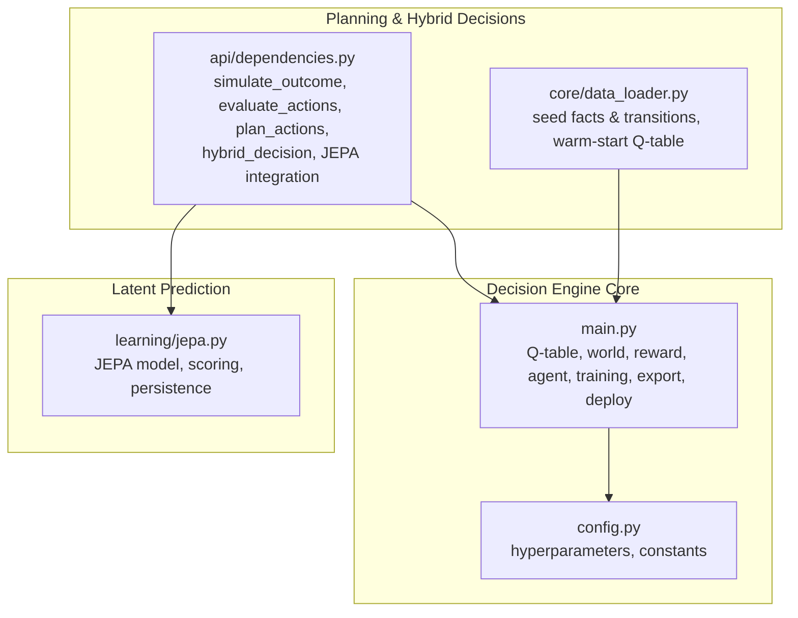
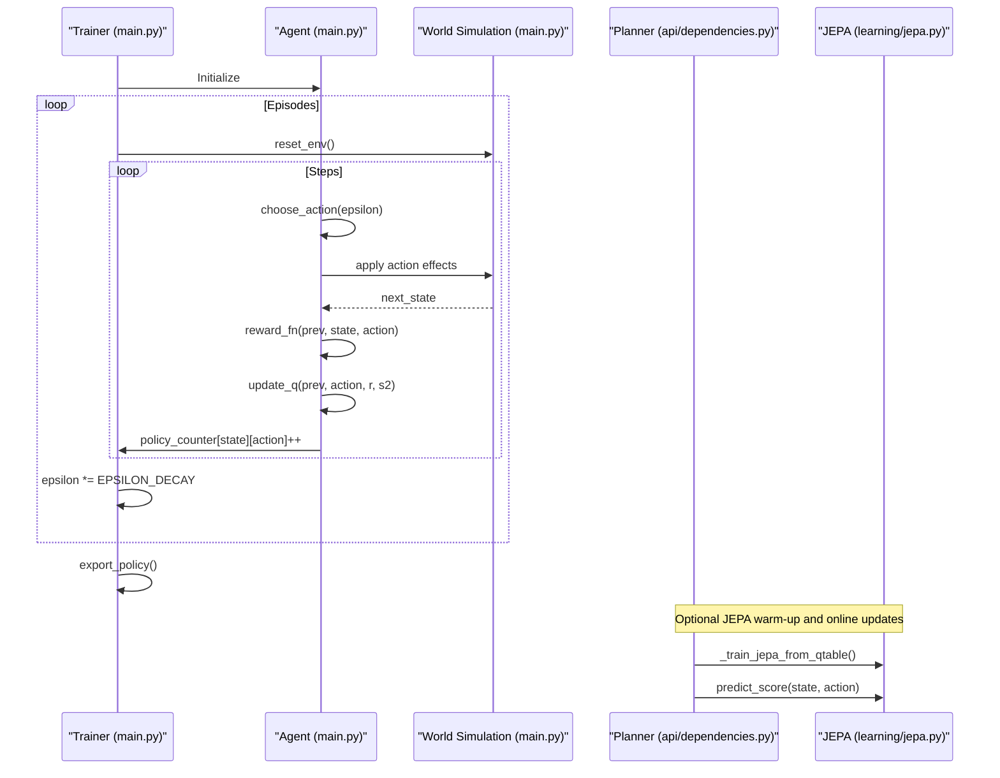
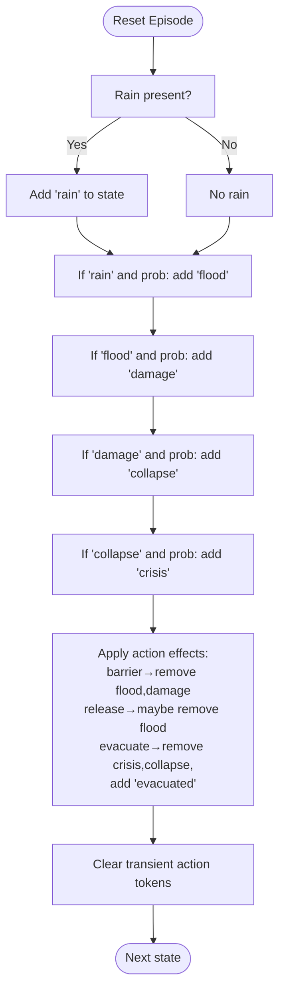
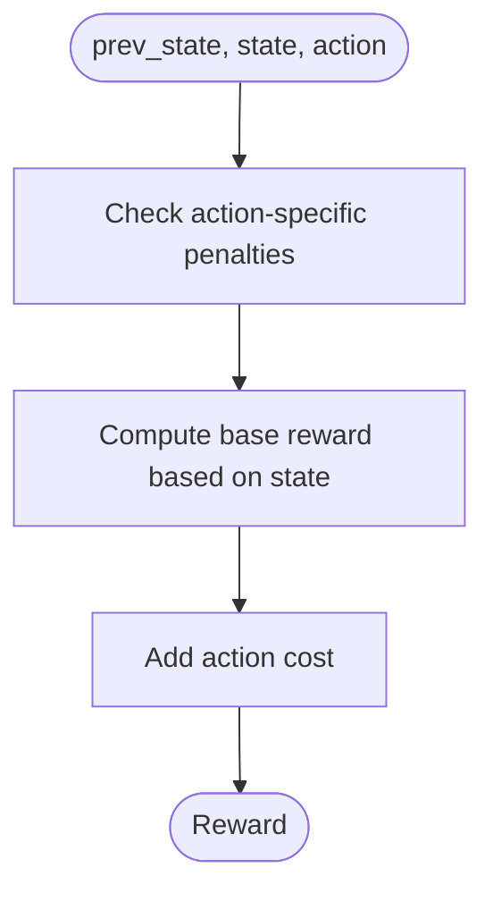
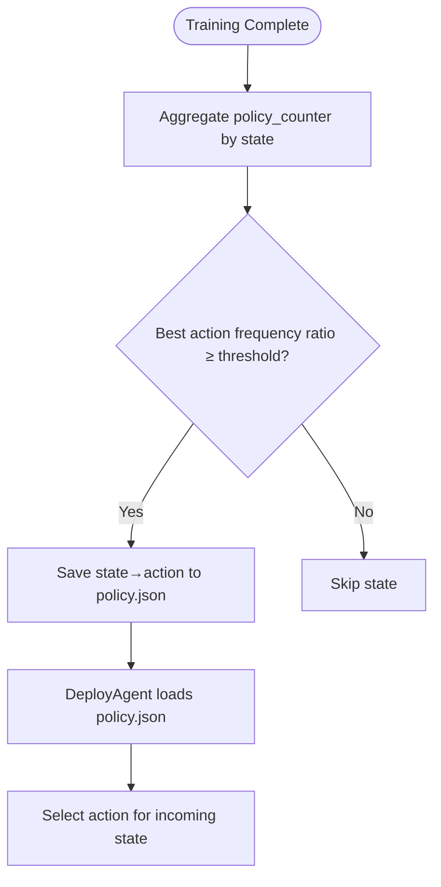
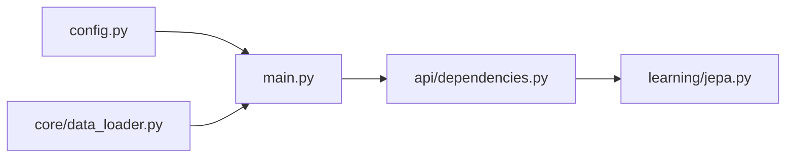

# Decision Engine

<cite>
**Referenced Files in This Document**
- [main.py](file://main.py)
- [config.py](file://config.py)
- [api/dependencies.py](file://api/dependencies.py)
- [core/data_loader.py](file://core/data_loader.py)
- [learning/jepa.py](file://learning/jepa.py)
</cite>

## Table of Contents
1. [Introduction](#introduction)
2. [Project Structure](#project-structure)
3. [Core Components](#core-components)
4. [Architecture Overview](#architecture-overview)
5. [Detailed Component Analysis](#detailed-component-analysis)
6. [Dependency Analysis](#dependency-analysis)
7. [Performance Considerations](#performance-considerations)
8. [Troubleshooting Guide](#troubleshooting-guide)
9. [Conclusion](#conclusion)
10. [Appendices](#appendices)

## Introduction
This document describes the decision engine for disaster response scenarios implemented with Q-learning. It explains threat state modeling (rain, flood, damage, collapse, crisis), the state-action space (barrier, release, evacuate, none), the reward function design, the Q-table update mechanism using temporal difference learning, the epsilon-greedy exploration strategy with decay, and the training and deployment pipeline. It also documents policy confidence thresholds and policy export functionality for inference.

## Project Structure
The decision engine spans several modules:
- Training and inference core: main.py
- Configuration: config.py
- Planning and hybrid decision utilities: api/dependencies.py
- Domain knowledge and Q-table warm-start transitions: core/data_loader.py
- Latent-world prediction (JEPA) for action scoring: learning/jepa.py

**Diagram sources**
- [main.py:1-401](file://main.py#L1-L401)
- [config.py:1-106](file://config.py#L1-L106)
- [api/dependencies.py:1-800](file://api/dependencies.py#L1-L800)
- [core/data_loader.py:1-500](file://core/data_loader.py#L1-L500)
- [learning/jepa.py:1-185](file://learning/jepa.py#L1-L185)

**Section sources**
- [main.py:1-401](file://main.py#L1-L401)
- [config.py:1-106](file://config.py#L1-L106)
- [api/dependencies.py:1-800](file://api/dependencies.py#L1-L800)
- [core/data_loader.py:1-500](file://core/data_loader.py#L1-L500)
- [learning/jepa.py:1-185](file://learning/jepa.py#L1-L185)

## Core Components
- Threat states: rain, flood, damage, collapse, crisis. These form the world simulation state and drive rewards and action costs.
- Actions: barrier, release, evacuate, none. Each action has a transient effect token and a cost penalty applied to reward.
- World simulation: probabilistic transitions among threat states, with action effects and probabilistic clearing of states.
- Reward function: includes penalties for crisis/collapse/damage/flood, action costs, and a bonus for none when no threat is present.
- Q-learning: tabular Q-table with temporal difference updates, epsilon-greedy action selection, and epsilon decay.
- Policy export: exports a deterministic policy derived from action frequencies with a confidence threshold.

**Section sources**
- [main.py:34-111](file://main.py#L34-L111)
- [config.py:5-13](file://config.py#L5-L13)
- [config.py:17-22](file://config.py#L17-L22)
- [config.py:26-34](file://config.py#L26-L34)
- [config.py:38-39](file://config.py#L38-L39)

## Architecture Overview
The decision engine integrates tabular Q-learning with optional latent-world prediction (JEPA) for action scoring. During training, an Agent interacts with the world simulation, updates Q-values, and records action frequencies. After training, a DeployAgent loads a policy file and selects actions deterministically for inference.

**Diagram sources**
- [main.py:174-189](file://main.py#L174-L189)
- [main.py:143-169](file://main.py#L143-L169)
- [main.py:85-111](file://main.py#L85-L111)
- [main.py:133-138](file://main.py#L133-L138)
- [api/dependencies.py:570-603](file://api/dependencies.py#L570-L603)
- [api/dependencies.py:614-629](file://api/dependencies.py#L614-L629)
- [learning/jepa.py:93-135](file://learning/jepa.py#L93-L135)

## Detailed Component Analysis

### Threat States and World Simulation
- Threat states: rain, flood, damage, collapse, crisis.
- World dynamics:
  - Rain initiates flood with probability.
  - Flood escalates to damage, damage to collapse, collapse to crisis.
  - Action effects:
    - barrier removes flood and damage.
    - release reduces flood with probability.
    - evacuate removes crisis/collapse and adds evacuated; probabilistically returns to normal.
  - Transient action tokens are cleared after effects.
- Reset: rain appears with a fixed probability at episode start.

**Diagram sources**
- [main.py:34-80](file://main.py#L34-L80)
- [config.py:26-34](file://config.py#L26-L34)

**Section sources**
- [main.py:34-80](file://main.py#L34-L80)
- [config.py:26-34](file://config.py#L26-L34)

### State-Action Space Definition
- Actions: barrier, release, evacuate, none.
- Action costs (penalties applied to reward):
  - barrier: small negative cost
  - release: small negative cost
  - evacuate: small negative cost
  - none: zero cost
- Action tokens are transient and removed after effects.

**Section sources**
- [config.py:5-13](file://config.py#L5-L13)
- [main.py:154-159](file://main.py#L154-L159)
- [main.py:77-78](file://main.py#L77-L78)

### Reward Function Design
- Base penalties:
  - crisis: large negative reward
  - collapse: moderate negative reward
  - damage: small negative reward
  - flood: small negative reward
- Action-specific penalties:
  - barrier used when already present: penalty
  - release when no flood present: penalty
  - evacuate when no threat present: penalty
  - none: bonus if no threat, else penalty
- Action costs are added to the base reward.

**Diagram sources**
- [main.py:85-111](file://main.py#L85-L111)
- [config.py:8-13](file://config.py#L8-L13)

**Section sources**
- [main.py:85-111](file://main.py#L85-L111)
- [config.py:8-13](file://config.py#L8-L13)

### Q-Table Update Mechanism (Temporal Difference Learning)
- Q-table stores Q(state, action) values.
- Update rule: Q(s,a) ← Q(s,a) + α[r + γ max_a' Q(s',a') − Q(s,a)]
- Best future value computed across actions for the next state.

**Section sources**
- [main.py:28-29](file://main.py#L28-L29)
- [main.py:133-138](file://main.py#L133-L138)
- [config.py:17-18](file://config.py#L17-L18)

### Epsilon-Greedy Exploration and Decay
- Exploration: with probability epsilon, choose a random action.
- Exploitation: otherwise select the action with highest Q-value.
- Decay: epsilon multiplied by decay factor each episode.

**Section sources**
- [main.py:122-128](file://main.py#L122-L128)
- [config.py:19-20](file://config.py#L19-L20)
- [main.py:177](file://main.py#L177)

### Training Pipeline
- Episodes: configurable number.
- Steps per episode: configurable.
- At each step: agent chooses action, applies effects, computes reward, updates Q, increments policy counters.
- Epsilon decays after each episode.

**Section sources**
- [main.py:174-189](file://main.py#L174-L189)
- [config.py:21-22](file://config.py#L21-L22)
- [config.py:19-20](file://config.py#L19-L20)

### Policy Export and Deployment
- Export: derive a deterministic policy from action frequencies in policy_counter; include only states where the best action’s frequency ratio meets or exceeds a confidence threshold.
- Deploy: DeployAgent loads the policy file and selects the stored action for a given state.

**Diagram sources**
- [main.py:194-207](file://main.py#L194-L207)
- [main.py:212-220](file://main.py#L212-L220)
- [config.py:38-39](file://config.py#L38-L39)

**Section sources**
- [main.py:194-207](file://main.py#L194-L207)
- [main.py:212-220](file://main.py#L212-L220)
- [config.py:38-39](file://config.py#L38-L39)

### Practical Examples
- State transitions:
  - rain → flood with probability, then flood → damage, damage → collapse, collapse → crisis.
  - barrier removes flood and damage; release reduces flood; evacuate removes crisis/collapse and adds evacuated.
- Reward calculation:
  - Example: if state contains crisis, reward is large negative regardless of action.
  - Example: if state contains collapse, reward is moderate negative; if state contains damage, reward is small negative; if state contains flood, reward is small negative; otherwise a bonus is applied for none when no threat is present.
  - Action costs are added to the base reward.
- Policy selection:
  - Epsilon-greedy selects the best Q action with probability 1-epsilon; otherwise random.
  - After training, DeployAgent selects the stored best action for a given state.

**Section sources**
- [main.py:43-80](file://main.py#L43-L80)
- [main.py:85-111](file://main.py#L85-L111)
- [main.py:122-128](file://main.py#L122-L128)
- [main.py:212-220](file://main.py#L212-L220)

### Hybrid Decision Utilities (Planning and JEPA)
- Planning:
  - simulate_outcome: probabilistic outcome simulation for an action, returns reward and next state.
  - plan_actions: estimates expected reward by averaging outcomes over simulations.
  - evaluate_actions: heuristic scoring based on threat presence and action suitability.
- JEPA integration:
  - evaluate_actions_jepa: scores actions using JEPA’s latent prediction proximity to a safe state.
  - _train_jepa_from_qtable: warm-start JEPA using Q-table keys and simulated transitions.
  - hybrid_decision: combines simulation-based scores, Q-scores, and JEPA scores with conflict-aware tie-breaking and recent-state randomness.

**Section sources**
- [api/dependencies.py:631-675](file://api/dependencies.py#L631-L675)
- [api/dependencies.py:696-701](file://api/dependencies.py#L696-L701)
- [api/dependencies.py:677-694](file://api/dependencies.py#L677-L694)
- [api/dependencies.py:614-629](file://api/dependencies.py#L614-L629)
- [api/dependencies.py:570-603](file://api/dependencies.py#L570-L603)
- [api/dependencies.py:726-758](file://api/dependencies.py#L726-L758)

### Domain Knowledge and Q-Table Warm-Start
- Seed facts encode causal escalation and mitigation rules.
- Seed transitions provide curated Q-table updates to bootstrap critical states.

**Section sources**
- [core/data_loader.py:446-473](file://core/data_loader.py#L446-L473)
- [core/data_loader.py:479-499](file://core/data_loader.py#L479-L499)

## Dependency Analysis
- main.py depends on config.py for hyperparameters and constants.
- api/dependencies.py depends on main.py for Q-table access and on learning/jepa.py for latent-world prediction.
- core/data_loader.py depends on main.py to warm-start Q-table entries.

**Diagram sources**
- [main.py:4-23](file://main.py#L4-L23)
- [api/dependencies.py:3,18-29](file://api/dependencies.py#L3,L18-L29)
- [core/data_loader.py:317-337](file://core/data_loader.py#L317-L337)

**Section sources**
- [main.py:4-23](file://main.py#L4-L23)
- [api/dependencies.py:3,18-29](file://api/dependencies.py#L3,L18-L29)
- [core/data_loader.py:317-337](file://core/data_loader.py#L317-L337)

## Performance Considerations
- Tabular Q-learning scales with the number of reachable states; keep state representation compact (sorted tuple keys).
- Epsilon decay controls exploration duration; adjust decay multiplier to balance early exploration vs. premature exploitation.
- Training episodes and steps per episode impact convergence; larger values improve learning but increase runtime.
- JEPA warm-up improves action scoring reliability; early stopping prevents overfitting.

[No sources needed since this section provides general guidance]

## Troubleshooting Guide
- Low policy confidence: increase POLICY_CONFIDENCE_THRESHOLD or run more episodes to gather stronger action frequencies.
- Poor action selection: verify ACTION_COST penalties reflect realistic costs; review reward_fn logic for base penalties.
- Training stalls: confirm epsilon decay is active; consider increasing TRAIN_EPISODES or STEPS_PER_EPISODE.
- JEPA not trained: ensure _train_jepa_from_qtable runs and early stopping criteria are met.

**Section sources**
- [config.py:38-39](file://config.py#L38-L39)
- [config.py:19-20](file://config.py#L19-L20)
- [config.py:21-22](file://config.py#L21-L22)
- [api/dependencies.py:570-603](file://api/dependencies.py#L570-L603)

## Conclusion
The decision engine combines a tabular Q-learning controller with optional latent-world prediction to support robust disaster response actions. Threat states and actions are modeled explicitly, rewards penalize escalating risks, and Q-learning learns optimal policies through temporal difference updates. Epsilon-greedy exploration balances exploration and exploitation, and a confidence-based policy export enables reliable deployment.

[No sources needed since this section summarizes without analyzing specific files]

## Appendices

### Appendix A: Configuration Reference
- Actions and costs: [config.py:5-13](file://config.py#L5-L13)
- RL hyperparameters: [config.py:17-22](file://config.py#L17-L22)
- World dynamics: [config.py:26-34](file://config.py#L26-L34)
- Policy export: [config.py:38-39](file://config.py#L38-L39)

**Section sources**
- [config.py:5-13](file://config.py#L5-L13)
- [config.py:17-22](file://config.py#L17-L22)
- [config.py:26-34](file://config.py#L26-L34)
- [config.py:38-39](file://config.py#L38-L39)