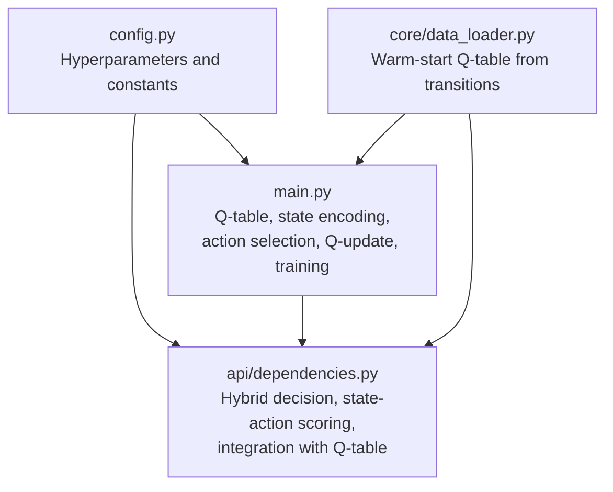
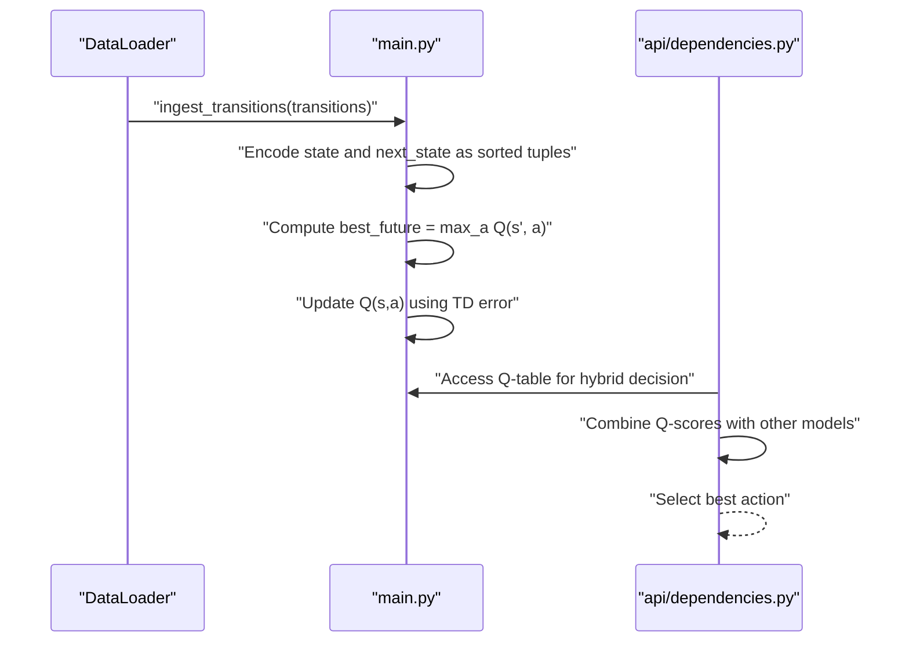
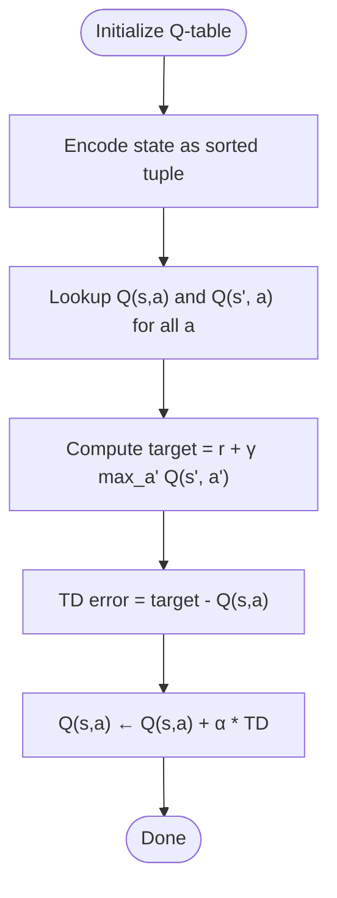
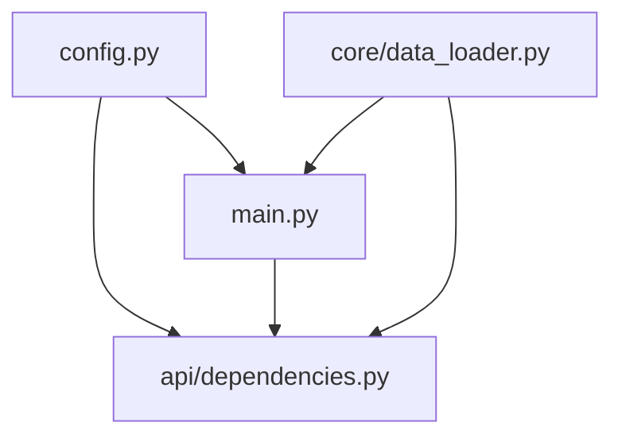

# Q-Learning Framework

<cite>
**Referenced Files in This Document**
- [main.py](file://main.py)
- [config.py](file://config.py)
- [api/dependencies.py](file://api/dependencies.py)
- [core/data_loader.py](file://core/data_loader.py)
</cite>

## Table of Contents
1. [Introduction](#introduction)
2. [Project Structure](#project-structure)
3. [Core Components](#core-components)
4. [Architecture Overview](#architecture-overview)
5. [Detailed Component Analysis](#detailed-component-analysis)
6. [Dependency Analysis](#dependency-analysis)
7. [Performance Considerations](#performance-considerations)
8. [Troubleshooting Guide](#troubleshooting-guide)
9. [Conclusion](#conclusion)

## Introduction
This document explains the Q-learning framework implemented in the repository, focusing on temporal difference learning. It covers Q-table initialization with a dictionary keyed by state-action pairs, state encoding using sorted tuples, action selection via epsilon-greedy, and the Q-value update rule. It also documents hyperparameters (alpha, gamma, epsilon, epsilon decay), numerical stability considerations, and state space management for large representations. Practical examples illustrate initialization, update sequences, and convergence behavior, along with the integration of Q-values into a hybrid decision pipeline.

## Project Structure
The Q-learning implementation centers on a small set of modules:
- main.py defines the Q-table, state encoding, action selection, Q-update, and training loop.
- config.py centralizes hyperparameters and constants.
- api/dependencies.py integrates Q-values into hybrid decision-making and demonstrates state-action scoring.
- core/data_loader.py shows how transitions can be used to warm-start the Q-table.

**Diagram sources**
- [main.py:1-401](file://main.py#L1-L401)
- [config.py:1-106](file://config.py#L1-L106)
- [api/dependencies.py:726-758](file://api/dependencies.py#L726-L758)
- [core/data_loader.py:304-337](file://core/data_loader.py#L304-L337)

**Section sources**
- [main.py:1-401](file://main.py#L1-L401)
- [config.py:1-106](file://config.py#L1-L106)
- [api/dependencies.py:726-758](file://api/dependencies.py#L726-L758)
- [core/data_loader.py:304-337](file://core/data_loader.py#L304-L337)

## Core Components
- Q-table: A dictionary keyed by (state_tuple, action) storing Q-values. Initialization uses a default factory yielding zero for missing keys.
- State encoding: States are represented as sorted tuples of tokens to ensure canonical ordering and consistent hashing.
- Action selection: Epsilon-greedy chooses a random action with probability epsilon, otherwise selects the action with the highest Q-value for the current state.
- Q-update: Temporal difference learning updates Q(s,a) using the Bellman-like rule with learning rate alpha and discount factor gamma.
- Training loop: Episodes alternate between environment steps and epsilon decay.

Practical example references:
- Q-table initialization: [main.py:28](file://main.py#L28)
- State encoding: [main.py:116-118](file://main.py#L116-L118)
- Action selection: [main.py:122-129](file://main.py#L122-L129)
- Q-update: [main.py:133-139](file://main.py#L133-L139)
- Training loop: [main.py:174-189](file://main.py#L174-L189)

**Section sources**
- [main.py:28-39](file://main.py#L28-L39)
- [main.py:116-139](file://main.py#L116-L139)
- [main.py:174-189](file://main.py#L174-L189)

## Architecture Overview
The Q-learning subsystem interacts with the broader system through two primary pathways:
- Offline warm-start: Transitions from data loaders are used to initialize Q-values.
- Online decision: During inference, Q-values are combined with simulation and predictive models to select actions.

**Diagram sources**
- [core/data_loader.py:304-337](file://core/data_loader.py#L304-L337)
- [main.py:116-139](file://main.py#L116-L139)
- [api/dependencies.py:726-758](file://api/dependencies.py#L726-L758)

## Detailed Component Analysis

### Q-Table Initialization and State-Action Tracking
- Initialization: The Q-table is initialized as a dictionary with a default value of zero for missing keys. This enables sparse representation and avoids pre-populating all state-action pairs.
- State encoding: States are converted to sorted tuples to ensure deterministic, hashable keys regardless of input order.
- Action selection: Epsilon-greedy chooses random actions with probability epsilon; otherwise, it picks the action with the maximal Q-value for the encoded state.
- Q-update: The update applies the temporal difference rule with learning rate alpha and discount factor gamma.

**Diagram sources**
- [main.py:28](file://main.py#L28)
- [main.py:116-118](file://main.py#L116-L118)
- [main.py:122-129](file://main.py#L122-L129)
- [main.py:133-139](file://main.py#L133-L139)

**Section sources**
- [main.py:28-39](file://main.py#L28-L39)
- [main.py:116-139](file://main.py#L116-L139)

### Q-Value Update Equation and Parameters
- Update rule: Q(s,a) ← Q(s,a) + α[r + γ max_a' Q(s',a') − Q(s,a)]
- Parameters:
  - Alpha (α): Learning rate controlling step size of updates. See [config.py:17](file://config.py#L17).
  - Gamma (γ): Discount factor for future rewards. See [config.py:18](file://config.py#L18).
  - Temporal difference error: [r + γ max_a' Q(s',a') − Q(s,a)] captures the prediction gap between expected and realized return.
- Reward shaping: The environment reward incorporates action costs and outcome thresholds. See [main.py:85-112](file://main.py#L85-L112).

Practical example references:
- Warm-start from transitions: [core/data_loader.py:322-334](file://core/data_loader.py#L322-L334)
- Online update during training: [main.py:164](file://main.py#L164)

**Section sources**
- [config.py:17-22](file://config.py#L17-L22)
- [main.py:85-112](file://main.py#L85-L112)
- [core/data_loader.py:322-334](file://core/data_loader.py#L322-L334)
- [main.py:164](file://main.py#L164)

### State Encoding Using Sorted Tuples
- States are sets of tokens that are converted to sorted tuples to form stable keys.
- This ensures that equivalent states (with different token orders) map to the same key, enabling consistent Q-value tracking.

Practical example references:
- Encoding function: [main.py:116-118](file://main.py#L116-L118)
- Transition ingestion: [core/data_loader.py:324-327](file://core/data_loader.py#L324-L327)

**Section sources**
- [main.py:116-118](file://main.py#L116-L118)
- [core/data_loader.py:324-327](file://core/data_loader.py#L324-L327)

### Action Selection Mechanism
- Epsilon-greedy: With probability epsilon, a random action is chosen; otherwise, the greedy action maximizing Q(s,a) is selected.
- Epsilon decay: Epsilon decays per episode to reduce exploration over time.

Practical example references:
- Action selection: [main.py:122-129](file://main.py#L122-L129)
- Epsilon decay: [main.py:187](file://main.py#L187)
- Hyperparameters: [config.py:19-20](file://config.py#L19-L20)

**Section sources**
- [main.py:122-129](file://main.py#L122-L129)
- [main.py:187](file://main.py#L187)
- [config.py:19-20](file://config.py#L19-L20)

### Practical Examples

#### Example 1: Q-Table Initialization
- Initialize Q-table with default zeros for missing keys.
- Reference: [main.py:28](file://main.py#L28)

#### Example 2: Update Sequence
- Encode state and next_state as sorted tuples.
- Compute best future value across actions.
- Apply temporal difference update with alpha and gamma.
- References:
  - Encoding: [main.py:116-118](file://main.py#L116-L118)
  - Best future: [main.py:137](file://main.py#L137)
  - Update: [main.py:138](file://main.py#L138)

#### Example 3: Convergence Behavior
- Monitor Q-table coverage and policy stability during training.
- References:
  - Training loop: [main.py:174-189](file://main.py#L174-L189)
  - Status reporting: [main.py:312-316](file://main.py#L312-L316)

#### Example 4: Warm-Starting Q-Table from Transitions
- Convert transition state and next_state to sorted tuples.
- Compute best future Q-value for the next state.
- Perform Q-update using alpha and gamma.
- Reference: [core/data_loader.py:322-334](file://core/data_loader.py#L322-L334)

**Section sources**
- [main.py:28](file://main.py#L28)
- [main.py:116-139](file://main.py#L116-L139)
- [main.py:174-189](file://main.py#L174-L189)
- [main.py:312-316](file://main.py#L312-L316)
- [core/data_loader.py:322-334](file://core/data_loader.py#L322-L334)

### Epsilon-Greedy Exploration and Decay
- Initial exploration: Epsilon controls the probability of random action selection.
- Decay schedule: Epsilon is multiplied by a decay factor each episode to reduce exploration over time.
- References:
  - Hyperparameters: [config.py:19-20](file://config.py#L19-L20)
  - Decay application: [main.py:187](file://main.py#L187)

**Section sources**
- [config.py:19-20](file://config.py#L19-L20)
- [main.py:187](file://main.py#L187)

### Numerical Stability and State Space Management
- Default initialization: Using a default factory ensures missing keys evaluate to zero, preventing key errors and simplifying sparse state spaces.
- State canonicalization: Sorting tokens into tuples guarantees consistent hashing and reduces duplication across equivalent states.
- Large state representations: The dictionary-based Q-table scales to large state spaces by storing only visited state-action pairs. Monitoring coverage helps assess learning progress.
- References:
  - Default factory: [main.py:28](file://main.py#L28)
  - State encoding: [main.py:116-118](file://main.py#L116-L118)
  - Coverage metrics: [main.py:312-316](file://main.py#L312-L316)

**Section sources**
- [main.py:28](file://main.py#L28)
- [main.py:116-118](file://main.py#L116-L118)
- [main.py:312-316](file://main.py#L312-L316)

## Dependency Analysis
The Q-learning subsystem depends on configuration constants and integrates with the broader inference pipeline.

**Diagram sources**
- [config.py:1-106](file://config.py#L1-L106)
- [main.py:1-401](file://main.py#L1-L401)
- [api/dependencies.py:1-200](file://api/dependencies.py#L1-L200)
- [core/data_loader.py:304-337](file://core/data_loader.py#L304-L337)

**Section sources**
- [config.py:1-106](file://config.py#L1-L106)
- [main.py:1-401](file://main.py#L1-L401)
- [api/dependencies.py:1-200](file://api/dependencies.py#L1-L200)
- [core/data_loader.py:304-337](file://core/data_loader.py#L304-L337)

## Performance Considerations
- Sparsity: The dictionary-backed Q-table stores only visited state-action pairs, reducing memory usage for large state spaces.
- Hashing: Sorted tuples provide efficient, deterministic keys suitable for dictionary lookups.
- Decoupled training: Epsilon decay and update frequency are controlled by hyperparameters to balance exploration and convergence speed.
- Hybrid integration: Combining Q-values with simulation and predictive models can improve decision quality without altering the core Q-learning update.

## Troubleshooting Guide
- Missing keys: Ensure state encoding produces sorted tuples to avoid mismatched keys.
- Convergence issues: Adjust alpha and gamma; verify reward shaping aligns with intended goals.
- Excessive randomness: Increase epsilon or reduce decay to encourage exploitation once learning is established.
- Coverage monitoring: Use status reporting to track Q-table entries and policy states.

**Section sources**
- [main.py:116-118](file://main.py#L116-L118)
- [main.py:312-316](file://main.py#L312-L316)

## Conclusion
The Q-learning framework in this repository employs a sparse, dictionary-backed Q-table with canonical state encoding, epsilon-greedy action selection, and temporal difference updates. Hyperparameters are centralized for easy tuning, and the system integrates Q-values into a hybrid decision pipeline. The design supports large state spaces through sparse storage and provides practical mechanisms for warm-starting and monitoring learning progress.