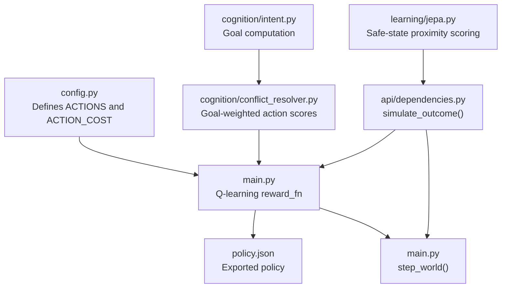
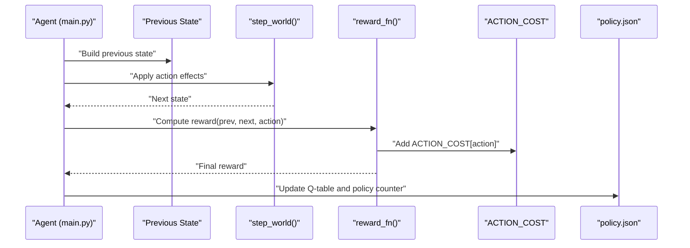
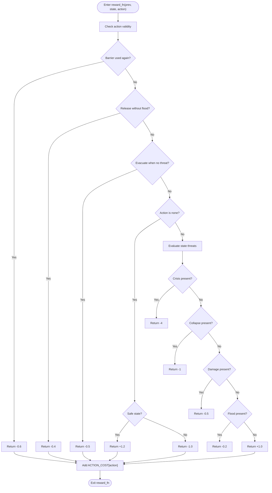
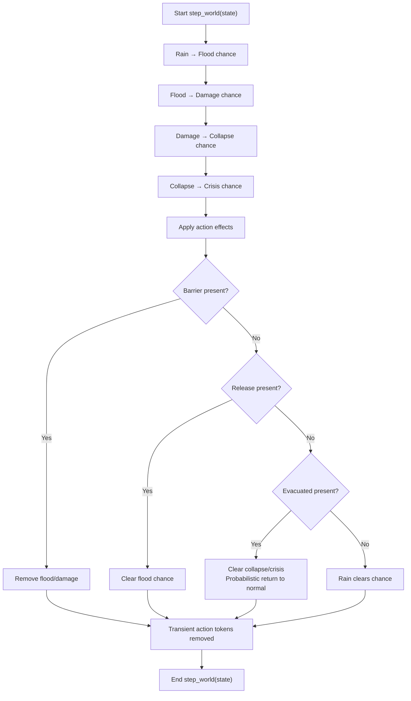
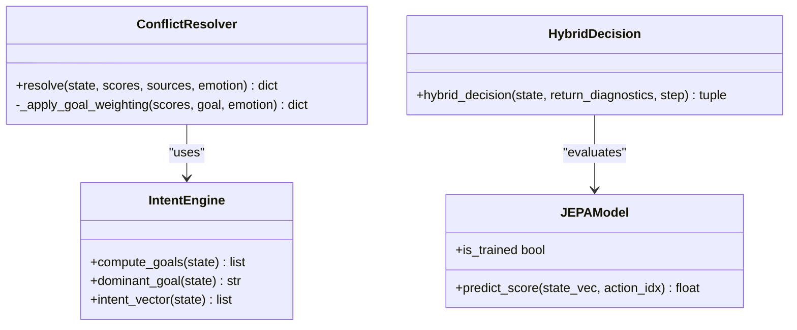
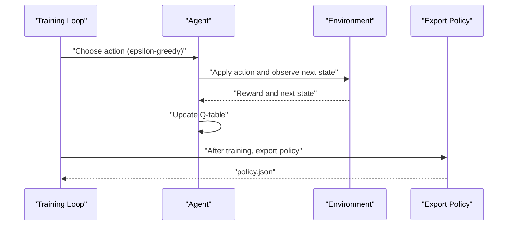
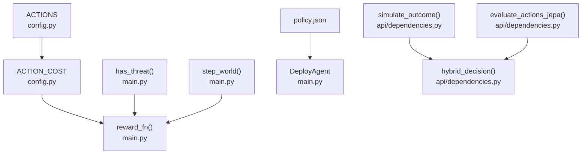

# Reward Function Design

<cite>
**Referenced Files in This Document**
- [main.py](file://main.py)
- [config.py](file://config.py)
- [policy.json](file://policy.json)
- [api/dependencies.py](file://api/dependencies.py)
- [cognition/conflict_resolver.py](file://cognition/conflict_resolver.py)
- [cognition/intent.py](file://cognition/intent.py)
- [learning/jepa.py](file://learning/jepa.py)
</cite>

## Table of Contents
1. [Introduction](#introduction)
2. [Project Structure](#project-structure)
3. [Core Components](#core-components)
4. [Architecture Overview](#architecture-overview)
5. [Detailed Component Analysis](#detailed-component-analysis)
6. [Dependency Analysis](#dependency-analysis)
7. [Performance Considerations](#performance-considerations)
8. [Troubleshooting Guide](#troubleshooting-guide)
9. [Conclusion](#conclusion)

## Introduction
This document explains the reward function design for the disaster response decision engine. It focuses on the penalty and incentive structure, including threat-based penalties, action-based penalties, safe-state rewards, and the integration of ACTION_COST. It also documents the reward calculation methodology, threat assessment, action validity checks, state transition evaluation, and how reward shaping accelerates policy convergence. Examples illustrate reward computations for various state-action pairs, and strategies are provided to avoid penalties and discover optimal policies.

## Project Structure
The reward system spans several modules:
- The core Q-learning reward computation resides in the main training module.
- Action costs are centralized in configuration.
- A policy export captures emergent behavior across states.
- An API module provides alternate outcome simulation and reward evaluation for planning and hybrid decisions.
- Cognitive modules weight action scores by goals and emotions, complementing reward shaping.
- A world dynamics module defines state transitions and threat propagation.

**Diagram sources**
- [main.py:85-112](file://main.py#L85-L112)
- [config.py:5-13](file://config.py#L5-L13)
- [api/dependencies.py:631-675](file://api/dependencies.py#L631-L675)
- [cognition/conflict_resolver.py:68-82](file://cognition/conflict_resolver.py#L68-L82)
- [cognition/intent.py:20-84](file://cognition/intent.py#L20-L84)
- [learning/jepa.py:137-148](file://learning/jepa.py#L137-L148)

**Section sources**
- [main.py:1-401](file://main.py#L1-L401)
- [config.py:1-106](file://config.py#L1-L106)
- [api/dependencies.py:550-749](file://api/dependencies.py#L550-L749)
- [cognition/conflict_resolver.py:1-83](file://cognition/conflict_resolver.py#L1-L83)
- [cognition/intent.py:1-84](file://cognition/intent.py#L1-L84)
- [learning/jepa.py:66-152](file://learning/jepa.py#L66-L152)

## Core Components
- Threat assessment and safe-state reward: The reward function evaluates the current state to assign negative rewards for escalating threats and a positive reward for safe states. It also applies penalties for invalid actions and integrates ACTION_COST.
- Action validity checks: Certain actions incur penalties when performed under invalid conditions (e.g., releasing water when there is no flood).
- Safe-state incentives: Positive rewards are given when no threats remain, encouraging the agent to reach and maintain safe states.
- ACTION_COST integration: Per-action costs are added to the base reward to discourage unnecessary actions and bias toward cost-effective choices.
- Policy export: After training, a deterministic policy is exported to guide deployment decisions.

**Section sources**
- [main.py:37-38](file://main.py#L37-L38)
- [main.py:85-112](file://main.py#L85-L112)
- [config.py:7-13](file://config.py#L7-L13)
- [policy.json:1-47](file://policy.json#L1-L47)

## Architecture Overview
The reward pipeline connects state transitions, action validity, threat evaluation, and cost integration. The figure below maps the actual code components involved in reward computation and policy shaping.

**Diagram sources**
- [main.py:143-169](file://main.py#L143-L169)
- [main.py:43-80](file://main.py#L43-L80)
- [main.py:85-112](file://main.py#L85-L112)
- [config.py:7-13](file://config.py#L7-L13)
- [policy.json:194-207](file://policy.json#L194-L207)

## Detailed Component Analysis

### Reward Function: Threat-Based Penalties and Safe-State Rewards
The reward function computes penalties and incentives based on:
- Threat-based penalties: -4 for crisis, -1 for collapse, -0.5 for damage, -0.2 for flood.
- Safe-state reward: +1.0 when no threats remain.
- Action-based penalties:
  - Barrier used again: -0.6
  - Release without flood: -0.4
  - Evacuate when no threat exists: -0.5
  - None action: +1.2 if safe, -1.0 if threatened
- ACTION_COST integration: Adds a small per-action cost to the base reward.

**Diagram sources**
- [main.py:85-112](file://main.py#L85-L112)
- [config.py:7-13](file://config.py#L7-L13)

**Section sources**
- [main.py:85-112](file://main.py#L85-L112)
- [config.py:7-13](file://config.py#L7-L13)

### Threat Assessment and State Transition Evaluation
Threat assessment determines whether a state is safe or contains escalating hazards. The world dynamics module defines how states evolve over time and how actions influence outcomes.

**Diagram sources**
- [main.py:43-80](file://main.py#L43-L80)

**Section sources**
- [main.py:37-38](file://main.py#L37-L38)
- [main.py:43-80](file://main.py#L43-L80)

### Action Validity Checking and Penalty Avoidance Strategies
- Barrier penalty avoidance: Do not repeat barrier if it is already set in the previous state.
- Release penalty avoidance: Only release when flood is present; otherwise incur a penalty.
- Evacuate penalty avoidance: Only evacuate when a threat exists; evacuating when safe incurs a penalty.
- None action strategy: Choose none when safe to gain +1.2; when threatened, prefer corrective actions to avoid -1.0.

Penalty avoidance is enforced by the reward function’s conditional checks and by the world dynamics that remove transient action tokens after effects are applied.

**Section sources**
- [main.py:87-94](file://main.py#L87-L94)
- [main.py:76-79](file://main.py#L76-L79)

### Reward Calculation Methodology and Normalization Considerations
- Base reward: Determined by threat presence and action validity.
- ACTION_COST integration: Adds a small per-action cost to bias toward minimal-cost actions.
- No explicit reward normalization is implemented in the core reward function; however, the hybrid decision pipeline normalizes scores across sources (simulation, Q-table, JEPA) to select actions.

Normalization in the hybrid decision:
- Simulation and Q-scores are combined with weights.
- JEPA scores are used when conflicts are weak or when the model is not yet trained.

**Section sources**
- [main.py:111](file://main.py#L111)
- [api/dependencies.py:726-758](file://api/dependencies.py#L726-L758)

### Reward Shaping and Policy Convergence Acceleration
- Goal-weighted action scores: The conflict resolver adjusts action scores according to dominant goals and emotional state, promoting survival and stability.
- JEPA-based safety scoring: JEPA predicts next-state latents and compares them to a safe latent, encouraging actions that move toward safer states.
- Hybrid decision: Combines simulation, Q-table, and JEPA scores to accelerate convergence and reduce oscillation between equally valued actions.

**Diagram sources**
- [cognition/intent.py:20-84](file://cognition/intent.py#L20-L84)
- [cognition/conflict_resolver.py:24-82](file://cognition/conflict_resolver.py#L24-L82)
- [learning/jepa.py:137-148](file://learning/jepa.py#L137-L148)
- [api/dependencies.py:726-758](file://api/dependencies.py#L726-L758)

**Section sources**
- [cognition/conflict_resolver.py:68-82](file://cognition/conflict_resolver.py#L68-L82)
- [cognition/intent.py:30-78](file://cognition/intent.py#L30-L78)
- [learning/jepa.py:137-148](file://learning/jepa.py#L137-L148)
- [api/dependencies.py:726-758](file://api/dependencies.py#L726-L758)

### Examples of Reward Computations
Below are example computations for selected state-action pairs. Replace placeholders with actual state sets and actions to compute rewards using the reward function.

- Example A: Previous state has no threats; action is none.
  - Base reward: +1.2 (safe none)
  - Add ACTION_COST[none]: +0
  - Final reward: +1.2

- Example B: Previous state has flood; action is release (valid).
  - Base reward: 0 (no threat change)
  - Add ACTION_COST[release]: -0.02
  - Final reward: ~-0.02

- Example C: Previous state has flood; action is release without flood.
  - Base reward: -0.4 (invalid release)
  - Add ACTION_COST[release]: -0.02
  - Final reward: -0.42

- Example D: Previous state has no threat; action is evacuate.
  - Base reward: -0.5 (evacuate when safe)
  - Add ACTION_COST[evacuate]: -0.05
  - Final reward: -0.55

- Example E: State has crisis.
  - Base reward: -4
  - Add ACTION_COST[action]: varies
  - Final reward: -4 + ACTION_COST[action]

- Example F: State has collapse.
  - Base reward: -1
  - Add ACTION_COST[action]: varies
  - Final reward: -1 + ACTION_COST[action]

- Example G: State has no threats.
  - Base reward: +1.0
  - Add ACTION_COST[action]: varies
  - Final reward: 1.0 + ACTION_COST[action]

**Section sources**
- [main.py:85-112](file://main.py#L85-L112)
- [config.py:7-13](file://config.py#L7-L13)

### Optimal Policy Emergence and Deployment
- Training builds a Q-table over many episodes; actions are chosen greedily or randomly depending on epsilon decay.
- Policy export selects the most frequent action for each state when confidence exceeds a threshold.
- Deployment agents read the exported policy to select actions deterministically.

**Diagram sources**
- [main.py:174-189](file://main.py#L174-L189)
- [main.py:194-207](file://main.py#L194-L207)
- [policy.json:1-47](file://policy.json#L1-47)

**Section sources**
- [main.py:174-189](file://main.py#L174-L189)
- [main.py:194-207](file://main.py#L194-L207)
- [policy.json:1-47](file://policy.json#L1-L47)

## Dependency Analysis
The reward system depends on:
- Centralized action cost definitions.
- State transition logic that influences reward outcomes.
- Policy export that reflects learned preferences.
- Planning utilities that simulate outcomes and compute alternative reward estimates.

**Diagram sources**
- [config.py:5-13](file://config.py#L5-L13)
- [main.py:37-38](file://main.py#L37-L38)
- [main.py:85-112](file://main.py#L85-L112)
- [main.py:43-80](file://main.py#L43-L80)
- [policy.json:1-47](file://policy.json#L1-L47)
- [api/dependencies.py:631-675](file://api/dependencies.py#L631-L675)
- [api/dependencies.py:726-758](file://api/dependencies.py#L726-L758)

**Section sources**
- [config.py:5-13](file://config.py#L5-L13)
- [main.py:37-38](file://main.py#L37-L38)
- [main.py:85-112](file://main.py#L85-L112)
- [main.py:43-80](file://main.py#L43-L80)
- [policy.json:1-47](file://policy.json#L1-L47)
- [api/dependencies.py:631-675](file://api/dependencies.py#L631-L675)
- [api/dependencies.py:726-758](file://api/dependencies.py#L726-L758)

## Performance Considerations
- ACTION_COST is small and does not significantly alter the sign of rewards but helps differentiate near-optimal actions.
- Reward shaping via goal weighting and JEPA safety scores reduces oscillation and accelerates convergence by guiding exploration toward safer actions.
- Simulation-based planning provides robust estimates of future rewards, improving decision quality.

## Troubleshooting Guide
- Unexpected penalties for barrier or release: Verify that transient action tokens are cleared after effects are applied; repeated actions incur penalties.
- Low safe-state rewards: Confirm that the state is truly free of threats; otherwise, the function assigns negative rewards based on the most severe threat present.
- Policy drift during training: Adjust epsilon decay and training episodes; ensure sufficient exploration early on.
- Hybrid decision oscillation: The hybrid decision switches to JEPA-based selection when Q-scores are nearly equal, reducing indecision.

**Section sources**
- [main.py:76-79](file://main.py#L76-L79)
- [main.py:85-112](file://main.py#L85-L112)
- [api/dependencies.py:726-758](file://api/dependencies.py#L726-L758)

## Conclusion
The reward function balances threat-based penalties, action validity checks, and safe-state incentives while integrating small per-action costs. Together with goal-weighted action scoring and JEPA-based safety estimation, the system encourages policies that avoid penalties, stabilize conditions, and converge efficiently to safe, effective behaviors. The exported policy encapsulates these learned preferences for deployment.