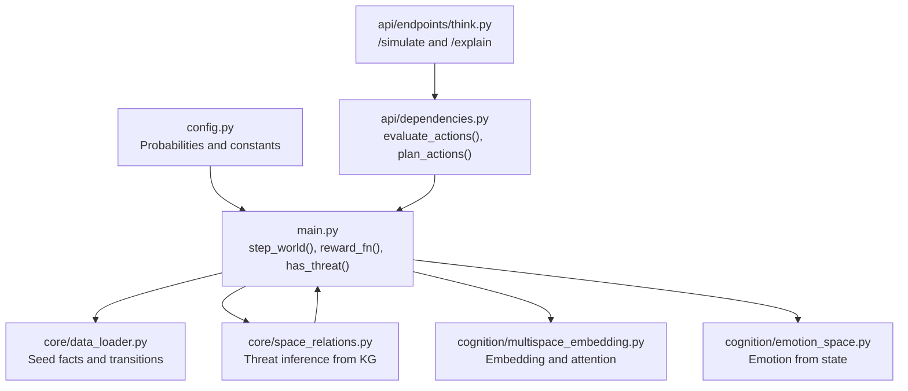
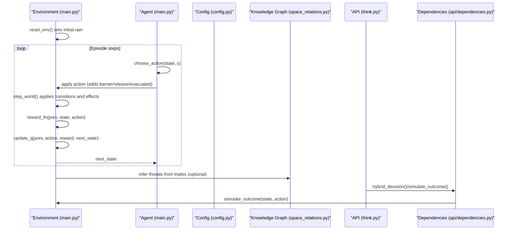
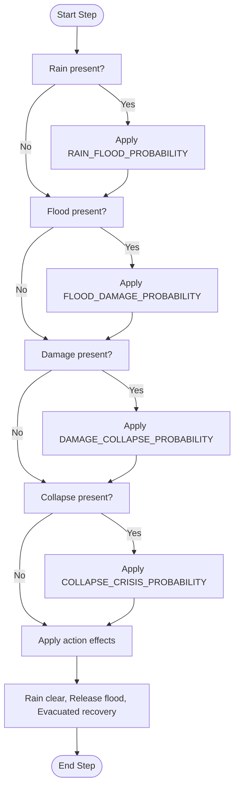
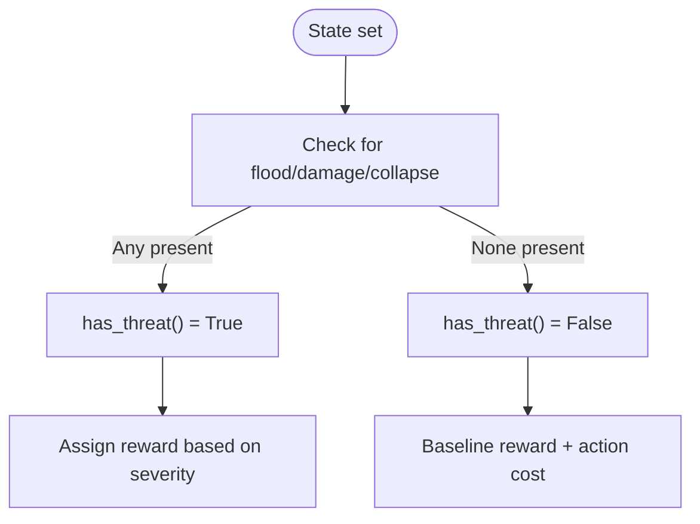
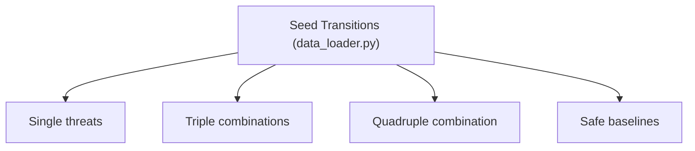
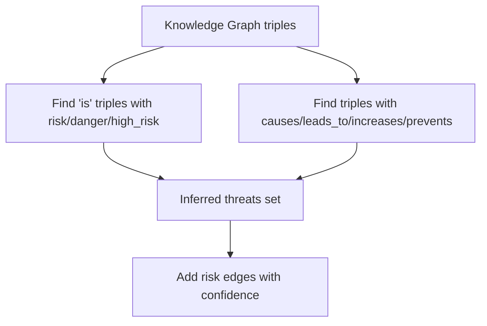
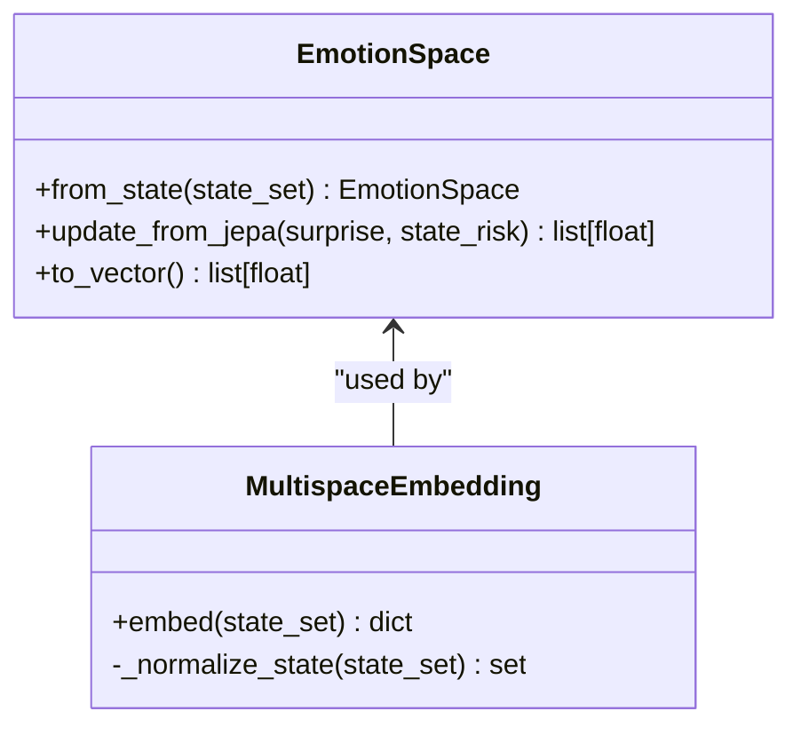
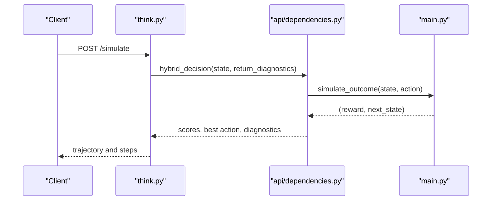
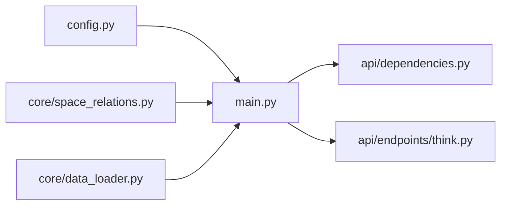

# Threat State Modeling

<cite>
**Referenced Files in This Document**
- [main.py](file://main.py)
- [config.py](file://config.py)
- [data_loader.py](file://core/data_loader.py)
- [space_relations.py](file://core/space_relations.py)
- [emotion_space.py](file://cognition/emotion_space.py)
- [multispace_embedding.py](file://cognition/multispace_embedding.py)
- [think.py](file://api/endpoints/think.py)
- [api_dependencies.py](file://api/dependencies.py)
- [test_data_loader.py](file://tests/test_data_loader.py)
</cite>

## Table of Contents
1. [Introduction](#introduction)
2. [Project Structure](#project-structure)
3. [Core Components](#core-components)
4. [Architecture Overview](#architecture-overview)
5. [Detailed Component Analysis](#detailed-component-analysis)
6. [Dependency Analysis](#dependency-analysis)
7. [Performance Considerations](#performance-considerations)
8. [Troubleshooting Guide](#troubleshooting-guide)
9. [Conclusion](#conclusion)

## Introduction
This document explains the threat state modeling used to represent disaster response scenarios. It focuses on five threat categories: rain (precipitation), flood (water inundation), damage (structural harm), collapse (building failure), and crisis (emergency condition). The model defines a probabilistic state evolution governed by transition probabilities and integrates environmental triggers, mitigation actions, and recovery dynamics. It also documents the has_threat() function, threat severity assessment, and practical guidance for state representation efficiency and memory optimization in large state spaces.

## Project Structure
The threat modeling spans several modules:
- Environment and dynamics: main.py defines the world step function, action effects, and reward function.
- Configuration: config.py centralizes transition and clearing probabilities.
- Domain knowledge: core/data_loader.py seeds causal and mitigating relations for the flood/disaster domain.
- Knowledge graph integration: core/space_relations.py infers threats from KG triples and builds risk signals.
- Emotion and embedding: cognition/emotion_space.py and cognition/multispace_embedding.py provide state-aware assessments and attention/confidence metrics.
- API and simulation: api/endpoints/think.py and api/dependencies.py expose simulation and explanation endpoints that leverage the underlying model.

**Diagram sources**
- [config.py:26-34](file://config.py#L26-L34)
- [main.py:43-111](file://main.py#L43-L111)
- [data_loader.py:446-499](file://core/data_loader.py#L446-L499)
- [space_relations.py:322-356](file://core/space_relations.py#L322-L356)
- [multispace_embedding.py:36-88](file://cognition/multispace_embedding.py#L36-L88)
- [emotion_space.py:12-33](file://cognition/emotion_space.py#L12-L33)
- [think.py:39-78](file://api/endpoints/think.py#L39-L78)
- [api_dependencies.py:677-724](file://api/dependencies.py#L677-L724)

**Section sources**
- [main.py:1-401](file://main.py#L1-L401)
- [config.py:1-106](file://config.py#L1-L106)
- [data_loader.py:440-500](file://core/data_loader.py#L440-L500)
- [space_relations.py:298-356](file://core/space_relations.py#L298-L356)
- [multispace_embedding.py:35-88](file://cognition/multispace_embedding.py#L35-L88)
- [emotion_space.py:1-42](file://cognition/emotion_space.py#L1-L42)
- [think.py:1-121](file://api/endpoints/think.py#L1-L121)
- [api_dependencies.py:677-724](file://api/dependencies.py#L677-L724)

## Core Components
- Threat categories and state representation
  - The state is represented as a set of tokens drawn from {rain, flood, damage, collapse, crisis, barrier, release, evacuated}. The has_threat() function checks for presence of flood, damage, or collapse to classify a state as threatening.
  - The state key is derived by sorting the set and converting to a tuple for indexing in the Q-table and policy counter.

- Probabilistic state evolution
  - Rain initiates flood with probability RAIN_FLOOD_PROBABILITY.
  - Flood evolves to damage with probability FLOOD_DAMAGE_PROBABILITY.
  - Damage evolves to collapse with probability DAMAGE_COLLAPSE_PROBABILITY.
  - Collapse evolves to crisis with probability COLLAPSE_CRISIS_PROBABILITY.
  - Environmental clearing and recovery:
    - Rain clears naturally with probability RAIN_CLEAR_PROBABILITY.
    - Flood clears via release with probability RELEASE_FLOOD_CLEAR_PROBABILITY.
    - Evacuated state probabilistically reverts to normal with probability EVACUATED_RETURN_PROBABILITY.

- Actions and effects
  - barrier prevents flood and damage when present.
  - release reduces flood with a given probability.
  - evacuate removes collapse and crisis and may restore normalcy with recovery probability.
  - Action tokens are transient and removed after effects are applied.

- Reward function
  - Negative rewards for inappropriate actions (e.g., evacuating without threat, releasing without flood).
  - Negative rewards increase with severity: crisis > collapse > damage > flood.
  - Positive baseline rewards for safe states and action costs are incorporated.

- Domain knowledge and seed transitions
  - The data loader seeds causal escalation (rain → flood → damage → collapse → crisis), long-range escalation, mitigations, and state classifications.
  - Seed transitions include compound states and rare 4-way combinations, guiding warm-start Q-table initialization.

**Section sources**
- [main.py:37-111](file://main.py#L37-L111)
- [config.py:26-34](file://config.py#L26-L34)
- [data_loader.py:446-499](file://core/data_loader.py#L446-L499)

## Architecture Overview
The threat modeling architecture couples a discrete-event probabilistic world with reinforcement learning and semantic knowledge.

**Diagram sources**
- [main.py:174-189](file://main.py#L174-L189)
- [main.py:143-169](file://main.py#L143-L169)
- [main.py:43-80](file://main.py#L43-L80)
- [config.py:26-34](file://config.py#L26-L34)
- [space_relations.py:322-356](file://core/space_relations.py#L322-L356)
- [think.py:39-54](file://api/endpoints/think.py#L39-L54)
- [api_dependencies.py:630-636](file://api/dependencies.py#L630-L636)

## Detailed Component Analysis

### Probabilistic State Evolution Model
The model captures a directed cascade of threats with independent Bernoulli transitions:
- rain → flood with probability RAIN_FLOOD_PROBABILITY
- flood → damage with probability FLOOD_DAMAGE_PROBABILITY
- damage → collapse with probability DAMAGE_COLLAPSE_PROBABILITY
- collapse → crisis with probability COLLAPSE_CRISIS_PROBABILITY

Recovery and mitigation:
- rain clears naturally with probability RAIN_CLEAR_PROBABILITY
- flood cleared by release with probability RELEASE_FLOOD_CLEAR_PROBABILITY
- evacuated state returns to normal with probability EVACUATED_RETURN_PROBABILITY
- barrier prevents flood and damage when present

**Diagram sources**
- [main.py:43-80](file://main.py#L43-L80)
- [config.py:26-34](file://config.py#L26-L34)

**Section sources**
- [main.py:43-80](file://main.py#L43-L80)
- [config.py:26-34](file://config.py#L26-L34)

### State Representation and Keying
- State is a set of tokens; the key is a sorted tuple of the set for indexing.
- This representation is efficient for hashing and enables compact storage of visited states and Q-values.
- Policy counter tracks action selection frequencies per state key, enabling export of a deterministic policy.

Practical implications:
- Sorting ensures canonical keys regardless of insertion order.
- Using tuples as dictionary keys avoids mutable set issues.
- Memory footprint scales with number of unique state keys encountered during training.

**Section sources**
- [main.py:116-118](file://main.py#L116-L118)
- [main.py:194-207](file://main.py#L194-L207)

### has_threat() Function and Severity Assessment
- has_threat(): returns True if flood, damage, or collapse is present, indicating a non-trivial threat requiring attention.
- Severity-aware reward:
  - Crisis incurs the largest penalty.
  - Collapse and damage incur moderate penalties.
  - Flood incurs a smaller penalty.
  - None action yields positive baseline reward when no threat exists; negative otherwise.
  - Action costs are included in reward_fn().

**Diagram sources**
- [main.py:37-38](file://main.py#L37-L38)
- [main.py:85-111](file://main.py#L85-L111)

**Section sources**
- [main.py:37-38](file://main.py#L37-L38)
- [main.py:85-111](file://main.py#L85-L111)

### Examples of State Trajectories and Probability Calculations
- Example trajectory (conceptual):
  - Initial: rain
  - Step 1: rain → flood (transition with RAIN_FLOOD_PROBABILITY)
  - Step 2: flood → damage (transition with FLOOD_DAMAGE_PROBABILITY)
  - Step 3: damage → collapse (transition with DAMAGE_COLLAPSE_PROBABILITY)
  - Step 4: collapse → crisis (transition with COLLAPSE_CRISIS_PROBABILITY)
  - Recovery: evacuate → collapse and crisis removed; evacuated → normal with EVACUATED_RETURN_PROBABILITY
- Probability calculation (conceptual):
  - P(rain → flood → damage → collapse → crisis) = RAIN_FLOOD_PROBABILITY × FLOOD_DAMAGE_PROBABILITY × DAMAGE_COLLAPSE_PROBABILITY × COLLAPSE_CRISIS_PROBABILITY
  - P(flood cleared by release) = RELEASE_FLOOD_CLEAR_PROBABILITY

These examples illustrate how cascading transitions propagate risk and how mitigation actions alter downstream probabilities.

**Section sources**
- [main.py:43-80](file://main.py#L43-L80)
- [config.py:26-34](file://config.py#L26-L34)

### State Space Enumeration and Coverage
- The seed transitions in the data loader cover:
  - Critical single-threat states and multi-threat compounds.
  - 3-way subsets (e.g., collapse, crisis, damage; collapse, crisis, flood; crisis, damage, flood).
  - 4-way compound state (all major threats).
  - Safe baseline states (empty and evacuated).
- Tests verify presence of key compound transitions, ensuring coverage of under-represented states.

**Diagram sources**
- [data_loader.py:479-499](file://core/data_loader.py#L479-L499)
- [test_data_loader.py:255-277](file://tests/test_data_loader.py#L255-L277)

**Section sources**
- [data_loader.py:479-499](file://core/data_loader.py#L479-L499)
- [test_data_loader.py:255-277](file://tests/test_data_loader.py#L255-L277)

### Knowledge Graph Threat Inference
- The space_relations module infers threats from KG triples by:
  - Collecting tokens labeled as risk, danger, or high_risk.
  - Collecting tokens connected by causal relations (causes, leads_to, increases, prevents).
- Risk edges are added with confidence tuned by token type, supporting downstream risk signals.

**Diagram sources**
- [space_relations.py:322-356](file://core/space_relations.py#L322-L356)

**Section sources**
- [space_relations.py:322-356](file://core/space_relations.py#L322-L356)

### Emotion and Embedding from State
- EmotionSpace computes fear, anger, sadness, surprise, and calm from state tokens, emphasizing higher intensity for crisis and collapse.
- MultispaceEmbedding produces risk vectors, attention metrics, and confidence measures, incorporating known token ratios and memory scores.

**Diagram sources**
- [emotion_space.py:12-42](file://cognition/emotion_space.py#L12-L42)
- [multispace_embedding.py:36-88](file://cognition/multispace_embedding.py#L36-L88)

**Section sources**
- [emotion_space.py:12-42](file://cognition/emotion_space.py#L12-L42)
- [multispace_embedding.py:36-88](file://cognition/multispace_embedding.py#L36-L88)

### API Simulation and Explanation
- The /simulate endpoint runs multi-step trajectories using hybrid decision and simulate_outcome, returning state-action-reward-next_state traces.
- The /explain endpoint provides explanations, rule-engine scores, simulation scores, JEPA scores, and risk calculation.

**Diagram sources**
- [think.py:39-54](file://api/endpoints/think.py#L39-L54)
- [api_dependencies.py:630-636](file://api/dependencies.py#L630-L636)
- [main.py:43-80](file://main.py#L43-L80)

**Section sources**
- [think.py:39-78](file://api/endpoints/think.py#L39-L78)
- [api_dependencies.py:677-724](file://api/dependencies.py#L677-L724)

## Dependency Analysis
- Internal dependencies
  - main.py depends on config.py for probabilities and constants.
  - API endpoints depend on api/dependencies.py, which in turn uses main.py’s simulate_outcome and Q-table.
  - space_relations.py supports dynamic threat inference used by the broader system.
- External integration points
  - Knowledge Graph and TMS are integrated via core modules and exposed through the semantic stack.

**Diagram sources**
- [config.py:26-34](file://config.py#L26-L34)
- [main.py:43-111](file://main.py#L43-L111)
- [api_dependencies.py:630-636](file://api/dependencies.py#L630-L636)
- [think.py:39-54](file://api/endpoints/think.py#L39-L54)
- [space_relations.py:322-356](file://core/space_relations.py#L322-L356)
- [data_loader.py:446-499](file://core/data_loader.py#L446-L499)

**Section sources**
- [config.py:26-34](file://config.py#L26-L34)
- [main.py:43-111](file://main.py#L43-L111)
- [api_dependencies.py:630-636](file://api/dependencies.py#L630-L636)
- [think.py:39-54](file://api/endpoints/think.py#L39-L54)
- [space_relations.py:322-356](file://core/space_relations.py#L322-L356)
- [data_loader.py:446-499](file://core/data_loader.py#L446-L499)

## Performance Considerations
- State representation efficiency
  - Using a frozenset or sorted tuple as a key ensures O(1) hash lookup and avoids duplication across permutations.
  - Keep state sets minimal by aggregating tokens and avoiding redundant attributes.
- Memory optimization for large state spaces
  - Limit state-key cardinality by pruning unlikely or unreachable states during training.
  - Use sparse Q-table structures keyed by state tuples; avoid storing zero-probability transitions.
  - Export policy only for states exceeding a confidence threshold to reduce policy size.
- Action token transience
  - Remove action tokens immediately after applying effects to prevent state explosion and maintain clean state semantics.
- Simulation and planning
  - Cap simulation steps to prevent excessive computation.
  - Use small Monte Carlo rollouts for planning when exact transitions are expensive.

[No sources needed since this section provides general guidance]

## Troubleshooting Guide
- Unexpected state growth or memory spikes
  - Verify action tokens are discarded after effects (barrier, release).
  - Confirm has_threat() logic aligns with intended classification boundaries.
- Low policy confidence
  - Increase training episodes or adjust ε-decay schedule.
  - Export policy with a lower confidence threshold to include more states.
- Incorrect reward behavior
  - Review reward_fn() for penalties on invalid actions and ensure action costs are applied consistently.
- Simulation divergence
  - Check simulate_outcome() and ensure it mirrors step_world() logic.
  - Validate probabilities in config.py and confirm they reflect intended dynamics.

**Section sources**
- [main.py:58-80](file://main.py#L58-L80)
- [main.py:85-111](file://main.py#L85-L111)
- [config.py:26-34](file://config.py#L26-L34)

## Conclusion
The threat state modeling provides a concise, probabilistic framework for disaster response scenarios. By composing independent transitions along the rain → flood → damage → collapse → crisis cascade and integrating mitigation actions, the model supports robust decision-making. The has_threat() function and severity-aware rewards guide safe behavior, while seed knowledge and API simulation enable rapid policy development and evaluation. For large-scale deployments, careful state representation and policy export thresholds ensure scalability and maintainability.