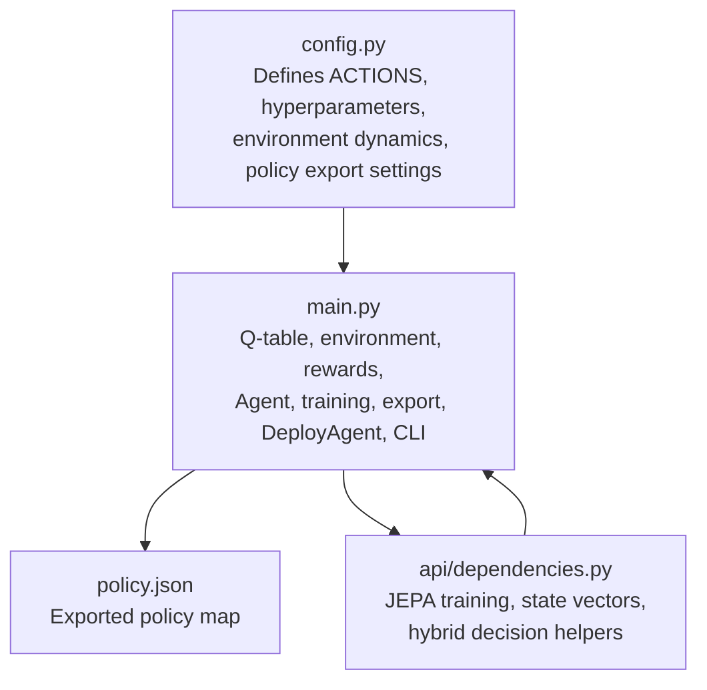
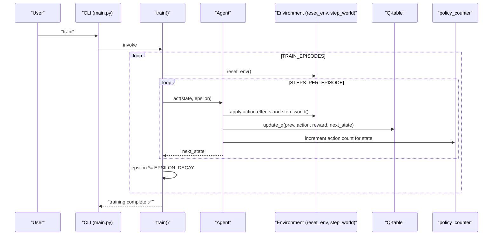
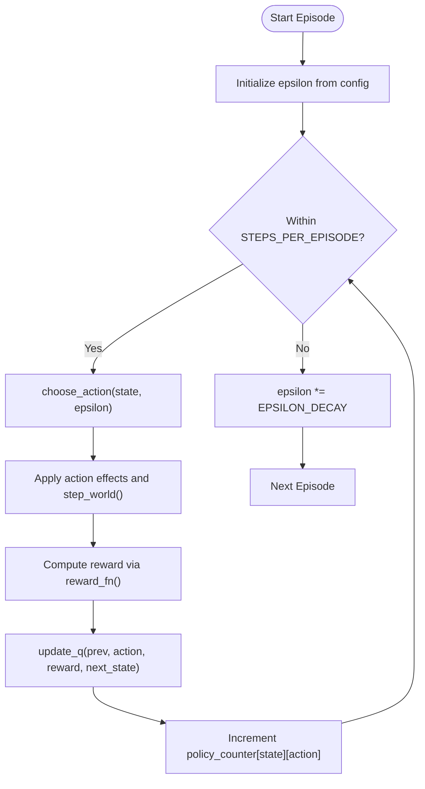
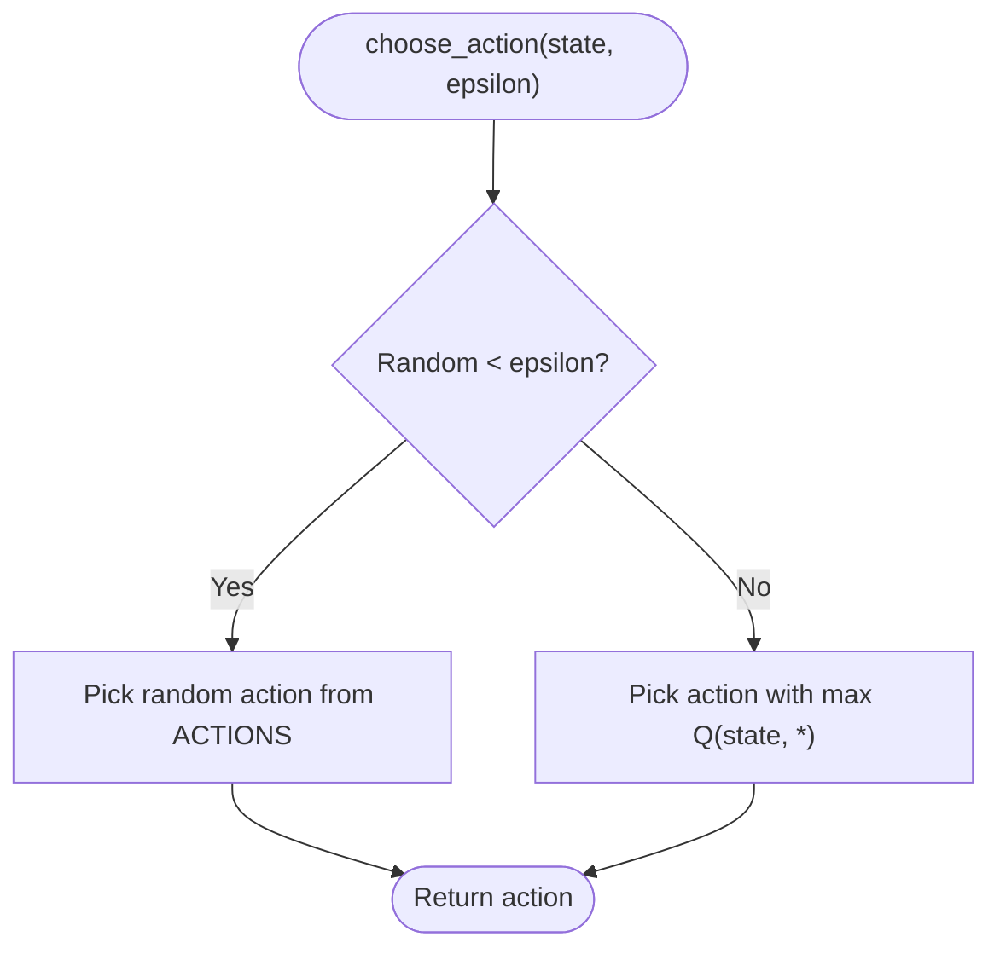
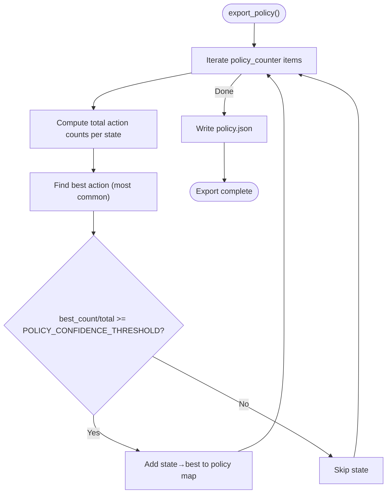
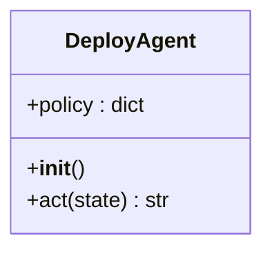
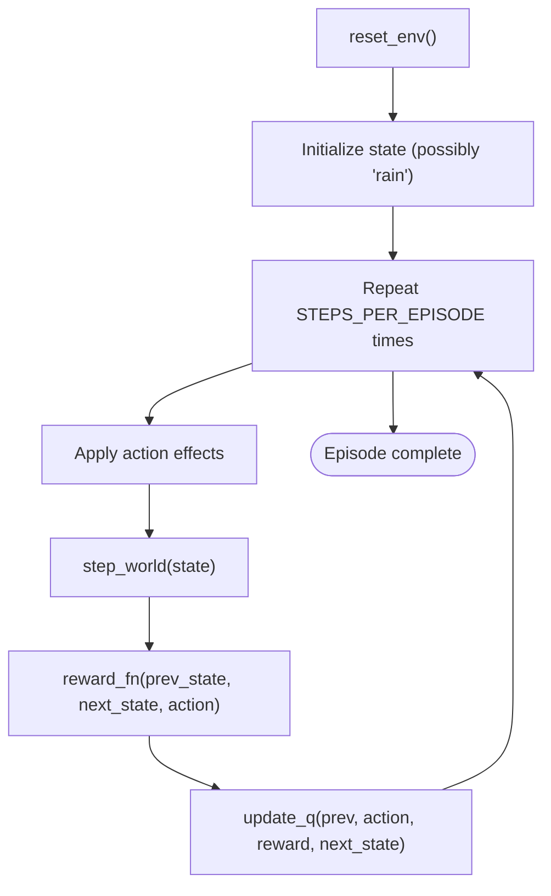
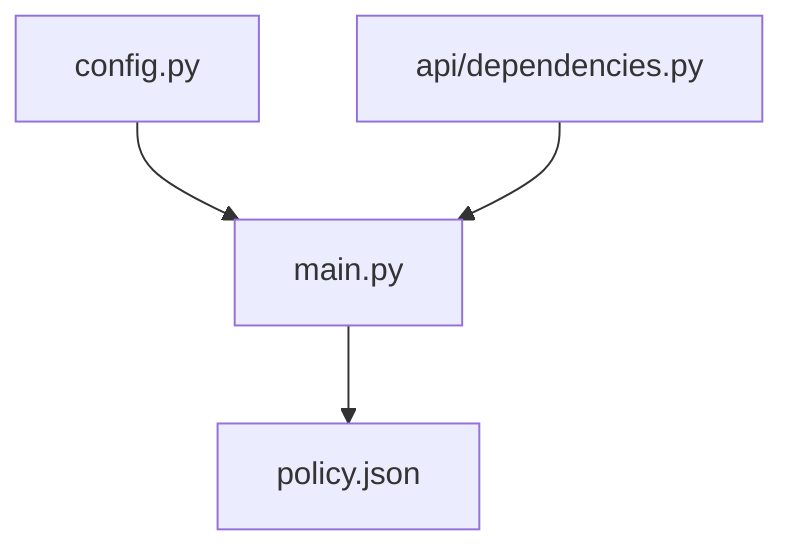

# Training and Deployment Pipeline

<cite>
**Referenced Files in This Document**
- [config.py](file://config.py)
- [main.py](file://main.py)
- [policy.json](file://policy.json)
- [api/dependencies.py](file://api/dependencies.py)
- [requirements.txt](file://requirements.txt)
</cite>

## Table of Contents
1. [Introduction](#introduction)
2. [Project Structure](#project-structure)
3. [Core Components](#core-components)
4. [Architecture Overview](#architecture-overview)
5. [Detailed Component Analysis](#detailed-component-analysis)
6. [Dependency Analysis](#dependency-analysis)
7. [Performance Considerations](#performance-considerations)
8. [Troubleshooting Guide](#troubleshooting-guide)
9. [Conclusion](#conclusion)
10. [Appendices](#appendices)

## Introduction
This document describes the complete Reinforcement Learning (RL) training and deployment pipeline implemented in the project. It covers the training loop driven by configuration parameters, epsilon-greedy exploration mechanics, policy export and confidence filtering, and the inference-time DeployAgent. It also documents the CLI commands for training, exporting, and deploying, along with practical guidance for policy confidence tuning and deployment optimization.

## Project Structure
The RL pipeline centers around a small but complete implementation in the main module, with configuration centralized in a dedicated module. Supporting runtime capabilities for advanced decision-making (including a JEPA-based safety model) reside in the API dependencies module. The policy is serialized to a JSON file for deployment.

**Diagram sources**
- [config.py:1-106](file://config.py#L1-L106)
- [main.py:1-401](file://main.py#L1-L401)
- [api/dependencies.py:1-800](file://api/dependencies.py#L1-L800)

**Section sources**
- [config.py:1-106](file://config.py#L1-L106)
- [main.py:1-401](file://main.py#L1-L401)
- [api/dependencies.py:1-800](file://api/dependencies.py#L1-L800)

## Core Components
- Configuration module defines:
  - Actions, action costs, and RL hyperparameters (alpha, gamma, epsilon, epsilon_decay)
  - Environment dynamics (probabilities for weather and hazards)
  - Policy export settings (policy file path and confidence threshold)
  - JEPA warmup and early stopping parameters
- Main module implements:
  - Q-table and policy counter
  - Environment reset and world step dynamics
  - Reward function
  - Epsilon-greedy action selection and Q-learning update
  - Training loop with configurable episodes and steps per episode
  - Policy export using counters and confidence threshold
  - DeployAgent for inference-time action selection
  - Interactive CLI with commands for training, exporting, and deployment
- API dependencies module provides:
  - JEPA model training from Q-table
  - State vectorization and action scoring
  - Hybrid decision helpers used in broader runtime contexts

**Section sources**
- [config.py:1-106](file://config.py#L1-L106)
- [main.py:1-401](file://main.py#L1-L401)
- [api/dependencies.py:570-603](file://api/dependencies.py#L570-L603)

## Architecture Overview
The RL workflow integrates configuration-driven hyperparameters, an environment simulator, a tabular Q-learning agent, and a policy export mechanism. At runtime, the policy is loaded by the DeployAgent for inference.

**Diagram sources**
- [main.py:174-189](file://main.py#L174-L189)
- [main.py:143-169](file://main.py#L143-L169)
- [main.py:34-80](file://main.py#L34-L80)
- [config.py:17-22](file://config.py#L17-L22)

## Detailed Component Analysis

### Training Loop and Hyperparameters
- TRAIN_EPISODES controls the total number of episodes executed during training.
- STEPS_PER_EPISODE determines how many environment steps are taken within each episode.
- Epsilon-greedy exploration starts at EPSILON and decays multiplicatively by EPSILON_DECAY each episode.
- Q-learning updates use alpha (ALPHA) and gamma (GAMMA) to propagate rewards and learn action values.

**Diagram sources**
- [main.py:174-189](file://main.py#L174-L189)
- [main.py:122-139](file://main.py#L122-L139)
- [main.py:43-111](file://main.py#L43-L111)
- [config.py:17-22](file://config.py#L17-L22)

**Section sources**
- [main.py:174-189](file://main.py#L174-L189)
- [main.py:122-139](file://main.py#L122-L139)
- [config.py:17-22](file://config.py#L17-L22)

### Epsilon-Greedy Exploration
- Exploration vs. exploitation balance is controlled by epsilon:
  - With probability epsilon, a random action is selected.
  - Otherwise, the action with the highest Q-value is chosen.
- Epsilon decays per episode according to EPSILON_DECAY, gradually shifting focus toward exploitation.

**Diagram sources**
- [main.py:122-128](file://main.py#L122-L128)
- [config.py:19-20](file://config.py#L19-L20)

**Section sources**
- [main.py:122-128](file://main.py#L122-L128)
- [config.py:19-20](file://config.py#L19-L20)

### Policy Export Mechanism
- During training, policy_counter records how often each action is taken from each state.
- export_policy computes the fraction of times the most frequent action was chosen for each state.
- Only states where the fraction meets or exceeds POLICY_CONFIDENCE_THRESHOLD are included in the exported policy.json.
- The DeployAgent loads policy.json and selects actions based on the current state’s sorted tuple key.

**Diagram sources**
- [main.py:194-207](file://main.py#L194-L207)
- [config.py:38-39](file://config.py#L38-L39)

**Section sources**
- [main.py:194-207](file://main.py#L194-L207)
- [config.py:38-39](file://config.py#L38-L39)

### DeployAgent Inference
- DeployAgent loads the exported policy.json at initialization.
- act(state) converts the state to a canonical key and returns the mapped action, defaulting to “none” if unknown.

**Diagram sources**
- [main.py:212-220](file://main.py#L212-L220)

**Section sources**
- [main.py:212-220](file://main.py#L212-L220)

### CLI Commands and Usage Patterns
The interactive CLI supports the following commands:
- train: Run the full training loop using TRAIN_EPISODES and STEPS_PER_EPISODE.
- episodes <N>: Run N additional episodes incrementally.
- export: Export the policy to policy.json using POLICY_CONFIDENCE_THRESHOLD.
- deploy: Run a 12-step deployment demonstration using DeployAgent.
- seed, load <file>, teach <sentence>, status, help, exit/quit.

Example usage patterns:
- Initial training: train
- Extend training: episodes 100
- Export policy: export
- Demonstrate deployment: deploy

**Section sources**
- [main.py:342-401](file://main.py#L342-L401)

### Environment Dynamics and Reward Function
- reset_env probabilistically initializes “rain.”
- step_world evolves state based on hazard propagation and action effects.
- reward_fn assigns rewards based on action validity, state threats, and action costs.

**Diagram sources**
- [main.py:34-80](file://main.py#L34-L80)
- [main.py:85-111](file://main.py#L85-L111)
- [main.py:133-139](file://main.py#L133-L139)

**Section sources**
- [main.py:34-80](file://main.py#L34-L80)
- [main.py:85-111](file://main.py#L85-L111)
- [main.py:133-139](file://main.py#L133-L139)

### Advanced Decision Support (JEPA and Hybrid Scoring)
While not required for the tabular RL pipeline, the API dependencies module provides:
- _train_jepa_from_qtable: Trains a JEPA model using simulated outcomes from the Q-table.
- _state_to_vec: Converts states to numeric vectors for JEPA.
- evaluate_actions_jepa: Scores actions using JEPA’s predicted safety proximity to a safe latent.
- hybrid_decision: Combines Q-scores, simulation-based scores, and JEPA scores for robust decisions.

These capabilities complement the tabular policy for richer decision-making in broader runtime scenarios.

**Section sources**
- [api/dependencies.py:570-603](file://api/dependencies.py#L570-L603)
- [api/dependencies.py:554-629](file://api/dependencies.py#L554-L629)

## Dependency Analysis
- Configuration drives training and policy export parameters.
- The main module depends on configuration for hyperparameters and environment constants.
- The API dependencies module depends on the main module’s Q-table to initialize JEPA training.
- The DeployAgent depends on the exported policy.json.

**Diagram sources**
- [config.py:1-106](file://config.py#L1-L106)
- [main.py:1-401](file://main.py#L1-L401)
- [api/dependencies.py:1-800](file://api/dependencies.py#L1-L800)

**Section sources**
- [config.py:1-106](file://config.py#L1-L106)
- [main.py:1-401](file://main.py#L1-L401)
- [api/dependencies.py:1-800](file://api/dependencies.py#L1-L800)

## Performance Considerations
- Training scale: TRAIN_EPISODES and STEPS_PER_EPISODE directly impact runtime and convergence stability. Larger values increase training time but may improve policy robustness.
- Exploration decay: EPSILON_DECAY controls the speed of shift from exploration to exploitation. Slower decay allows more exploration; faster decay accelerates convergence but risks premature local optima.
- Confidence threshold: POLICY_CONFIDENCE_THRESHOLD balances policy size and reliability. Higher thresholds reduce included states, improving confidence but potentially leaving out rare but useful patterns.
- Export frequency: Export the policy after sufficient training to capture learned behavior, then periodically re-export as training continues.

[No sources needed since this section provides general guidance]

## Troubleshooting Guide
- Low policy coverage: If policy.json ends up empty or sparse, consider lowering POLICY_CONFIDENCE_THRESHOLD or increasing TRAIN_EPISODES and STEPS_PER_EPISODE.
- Poor deployment performance: Verify that the deployed environment matches the training distribution. Confirm that the policy.json file exists and is readable by DeployAgent.
- CLI command errors: Ensure correct argument formatting (e.g., episodes requires an integer). Use help to list available commands.
- Environment mismatch: If actions produce unexpected outcomes, review reward_fn and step_world logic to align with intended dynamics.

**Section sources**
- [main.py:342-401](file://main.py#L342-L401)
- [main.py:212-220](file://main.py#L212-L220)

## Conclusion
The pipeline combines a simple yet effective tabular Q-learning agent with a straightforward policy export and deployment mechanism. Configuration-driven parameters enable precise control over training duration, exploration behavior, and policy quality. The CLI provides a practical interface for training, exporting, and validating deployments. For advanced scenarios, the JEPA-based helpers in the API dependencies module offer complementary safety-aware decision support.

[No sources needed since this section summarizes without analyzing specific files]

## Appendices

### Configuration Reference
- Actions: discrete action set used by the agent.
- Hyperparameters: alpha (learning rate), gamma (discount), epsilon (initial exploration), epsilon_decay (decay per episode).
- Training schedule: TRAIN_EPISODES, STEPS_PER_EPISODE.
- Environment dynamics: probabilities governing weather and hazard progression.
- Policy export: POLICY_FILE path and POLICY_CONFIDENCE_THRESHOLD.

**Section sources**
- [config.py:1-106](file://config.py#L1-L106)

### Example Workflows
- Training run:
  - Command: train
  - Behavior: Executes TRAIN_EPISODES with STEPS_PER_EPISODE per episode, decaying epsilon each episode.
- Policy export:
  - Command: export
  - Behavior: Writes policy.json containing state-action mappings meeting the confidence threshold.
- Deployment demonstration:
  - Command: deploy
  - Behavior: Initializes DeployAgent, runs 12 steps of inference, and prints cumulative reward.

**Section sources**
- [main.py:342-401](file://main.py#L342-L401)
- [main.py:225-252](file://main.py#L225-L252)

### Policy Confidence Tuning Guidelines
- Start with the default threshold and inspect policy.json size and coverage.
- If the policy is too conservative (sparse), lower the threshold slightly to include more states.
- If the policy is too noisy (overfit to rare events), raise the threshold to filter out low-confidence choices.
- Validate by running deploy and observing whether actions align with expected behavior under various states.

**Section sources**
- [config.py:38-39](file://config.py#L38-L39)
- [main.py:194-207](file://main.py#L194-L207)

### Deployment Optimization Strategies
- Persist policy.json and ensure it is loaded by DeployAgent in production environments.
- Monitor policy coverage and re-export after extended training sessions.
- For dynamic environments, periodically re-run training and export to adapt to changing conditions.
- Combine with broader runtime systems (e.g., JEPA-based scoring) for enhanced safety-aware decisions.

[No sources needed since this section provides general guidance]