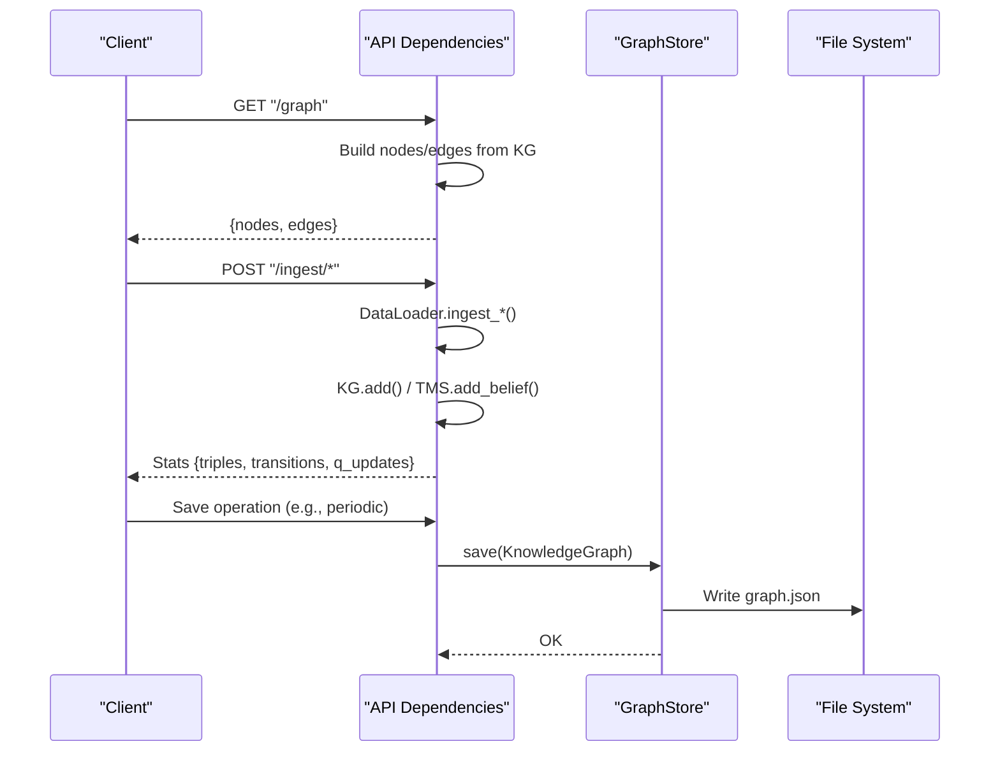
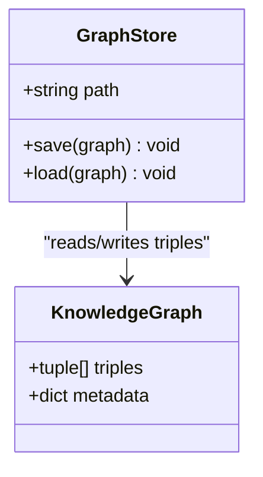
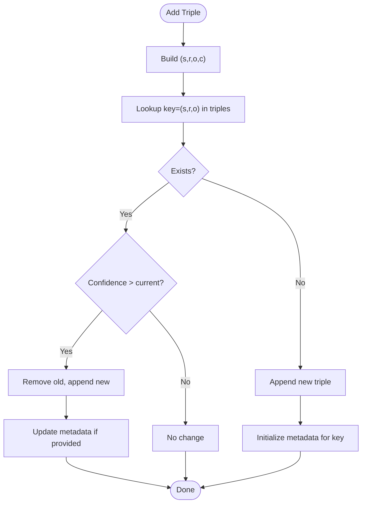
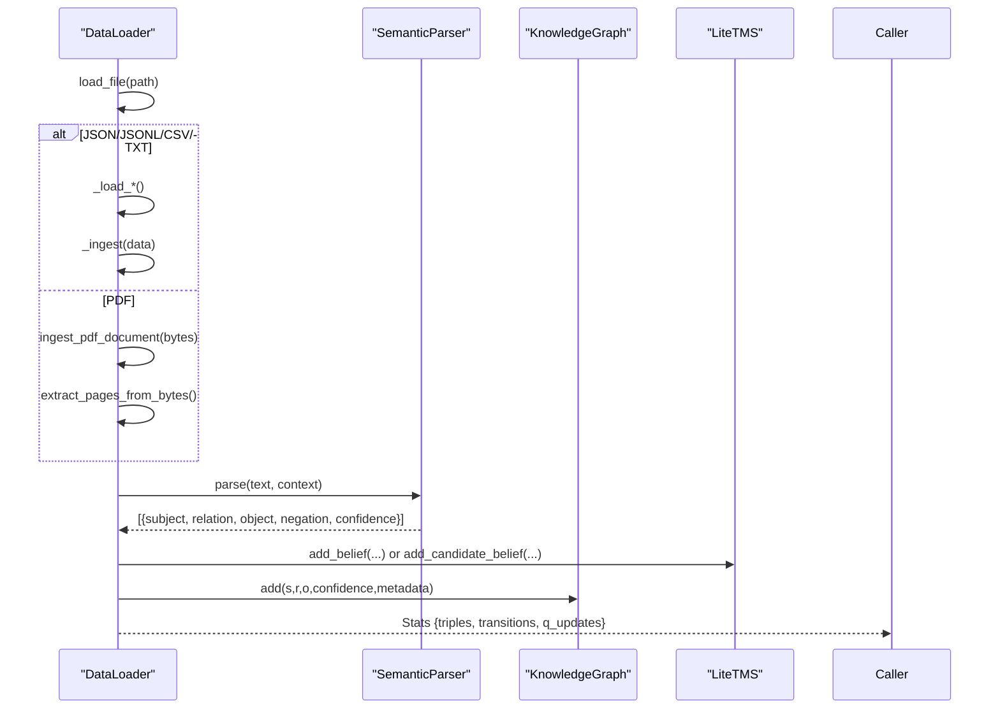
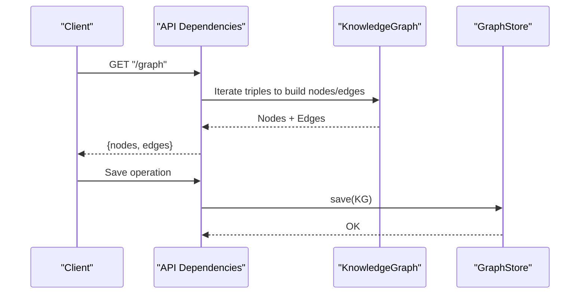
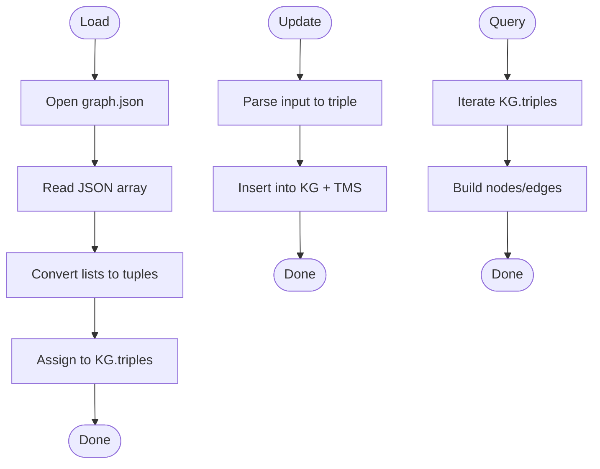
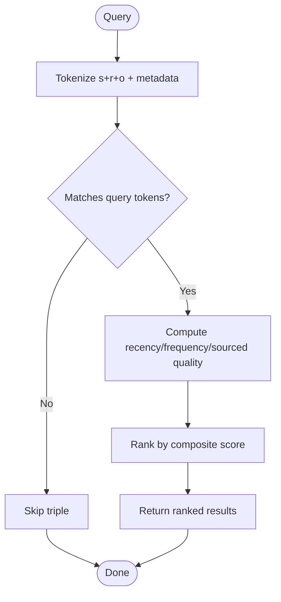
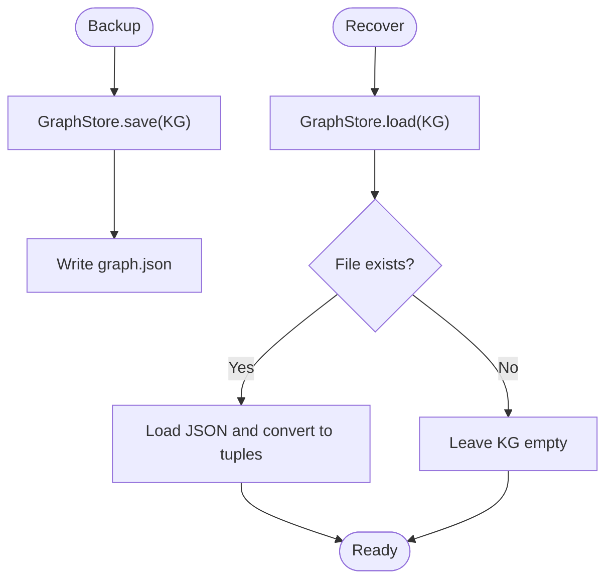
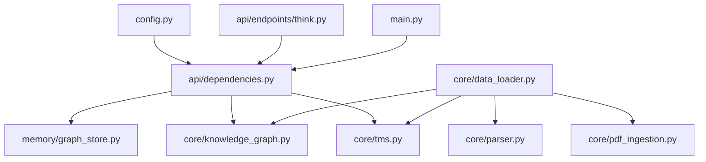

# Graph Storage and Persistence

<cite>
**Referenced Files in This Document**
- [graph_store.py](file://memory/graph_store.py)
- [knowledge_graph.py](file://core/knowledge_graph.py)
- [data_loader.py](file://core/data_loader.py)
- [parser.py](file://core/parser.py)
- [pdf_ingestion.py](file://core/pdf_ingestion.py)
- [tms.py](file://core/tms.py)
- [dependencies.py](file://api/dependencies.py)
- [config.py](file://config.py)
- [main.py](file://main.py)
- [think.py](file://api/endpoints/think.py)
- [test_api.py](file://tests/test_api.py)
</cite>

## Table of Contents
1. [Introduction](#introduction)
2. [Project Structure](#project-structure)
3. [Core Components](#core-components)
4. [Architecture Overview](#architecture-overview)
5. [Detailed Component Analysis](#detailed-component-analysis)
6. [Dependency Analysis](#dependency-analysis)
7. [Performance Considerations](#performance-considerations)
8. [Troubleshooting Guide](#troubleshooting-guide)
9. [Conclusion](#conclusion)
10. [Appendices](#appendices)

## Introduction
This document explains the graph storage system for persistent knowledge graph management. It focuses on how triples and metadata are stored, serialized, loaded, and queried; how indexing and caching contribute to performance; and how backup and recovery are implemented. It also describes integration with ingestion pipelines, external storage considerations, and the relationship between in-memory and persistent representations.

## Project Structure
The graph store and persistence logic spans several modules:
- Memory persistence: a dedicated class persists the knowledge graph’s triples to disk.
- Knowledge representation: an in-memory knowledge graph holds triples and associated metadata.
- Ingestion pipeline: parsers and loaders transform raw data into triples and insert them into the knowledge graph.
- API integration: the API initializes the graph store and exposes endpoints that reflect the current state of the knowledge graph.
- Configuration: central settings define the persistence file name and operational parameters.

```mermaid
graph TB
subgraph "Persistence Layer"
GS["GraphStore<br/>save/load"]
FS["File System<br/>graph.json"]
end
subgraph "In-Memory Model"
KG["KnowledgeGraph<br/>triples + metadata"]
TMS["LiteTMS<br/>beliefs + candidates"]
end
subgraph "Ingestion Pipeline"
DL["DataLoader<br/>formats + injection"]
PARSER["SemanticParser<br/>NL parsing"]
PDF["PDFIngestion<br/>text extraction"]
end
subgraph "API Integration"
DEPS["API Dependencies<br/>global KG/TMS/GraphStore"]
ENDPOINTS["Endpoints<br/>/graph, /metrics"]
end
DL --> PARSER
DL --> PDF
DL --> KG
DL --> TMS
DEPS --> KG
DEPS --> TMS
DEPS --> GS
GS <- --> FS
ENDPOINTS --> DEPS
```

**Diagram sources**
- [graph_store.py:1-19](file://memory/graph_store.py#L1-L19)
- [knowledge_graph.py:1-34](file://core/knowledge_graph.py#L1-L34)
- [data_loader.py:1-500](file://core/data_loader.py#L1-L500)
- [parser.py:1-480](file://core/parser.py#L1-L480)
- [pdf_ingestion.py:1-100](file://core/pdf_ingestion.py#L1-L100)
- [tms.py:1-158](file://core/tms.py#L1-L158)
- [dependencies.py:1-200](file://api/dependencies.py#L1-L200)
- [think.py:81-96](file://api/endpoints/think.py#L81-L96)

**Section sources**
- [graph_store.py:1-19](file://memory/graph_store.py#L1-L19)
- [knowledge_graph.py:1-34](file://core/knowledge_graph.py#L1-L34)
- [data_loader.py:1-500](file://core/data_loader.py#L1-L500)
- [parser.py:1-480](file://core/parser.py#L1-L480)
- [pdf_ingestion.py:1-100](file://core/pdf_ingestion.py#L1-L100)
- [tms.py:1-158](file://core/tms.py#L1-L158)
- [dependencies.py:1-200](file://api/dependencies.py#L1-L200)
- [config.py:70-80](file://config.py#L70-L80)

## Core Components
- GraphStore: responsible for saving and loading the knowledge graph’s triples to/from a JSON file. It ensures that loaded triples are represented as tuples for compatibility with downstream logic.
- KnowledgeGraph: maintains an in-memory list of triples and a metadata dictionary keyed by triple (subject, relation, object). It deduplicates and updates triples based on confidence.
- DataLoader: ingests structured and unstructured data (JSON/JSONL/CSV/TXT) and natural language sentences, converting them into triples and inserting them into the knowledge graph and TMS.
- SemanticParser: converts natural language statements into canonical triples with optional negation and confidence.
- PDFIngestion: extracts normalized text from PDFs for downstream parsing and triple generation.
- API Dependencies: initializes the knowledge graph, TMS, and graph store, and integrates them into the API runtime.
- Configuration: defines the persistence file name and operational parameters for the semantic stack.

**Section sources**
- [graph_store.py:1-19](file://memory/graph_store.py#L1-L19)
- [knowledge_graph.py:1-34](file://core/knowledge_graph.py#L1-L34)
- [data_loader.py:1-500](file://core/data_loader.py#L1-L500)
- [parser.py:1-480](file://core/parser.py#L1-L480)
- [pdf_ingestion.py:1-100](file://core/pdf_ingestion.py#L1-L100)
- [dependencies.py:1-200](file://api/dependencies.py#L1-L200)
- [config.py:70-80](file://config.py#L70-L80)

## Architecture Overview
The system separates persistence from computation:
- In-memory: KnowledgeGraph and LiteTMS hold live state and metadata.
- Persistent: GraphStore writes and reads the triples array to a JSON file.
- Ingestion: DataLoader orchestrates parsing and insertion into both in-memory structures.
- API: Provides endpoints that expose the current state and integrate with the graph store.



**Diagram sources**
- [dependencies.py:90-120](file://api/dependencies.py#L90-L120)
- [think.py:81-96](file://api/endpoints/think.py#L81-L96)
- [graph_store.py:7-18](file://memory/graph_store.py#L7-L18)
- [data_loader.py:343-440](file://core/data_loader.py#L343-L440)

## Detailed Component Analysis

### GraphStore: File-Based Persistence and Serialization
GraphStore provides a minimal persistence layer:
- Save: Serializes the in-memory triples list to a JSON file.
- Load: Reads the JSON file and reconstructs triples as tuples to maintain type consistency.



**Diagram sources**
- [graph_store.py:3-18](file://memory/graph_store.py#L3-L18)
- [knowledge_graph.py:1-34](file://core/knowledge_graph.py#L1-L34)

**Section sources**
- [graph_store.py:1-19](file://memory/graph_store.py#L1-L19)

### KnowledgeGraph: Triples and Metadata Management
KnowledgeGraph manages:
- An ordered list of triples, each containing subject, relation, object, and confidence.
- A metadata dictionary keyed by (subject, relation, object) to associate provenance and contextual information with each triple.
- Deduplication and confidence-aware replacement of existing triples.



**Diagram sources**
- [knowledge_graph.py:6-27](file://core/knowledge_graph.py#L6-L27)

**Section sources**
- [knowledge_graph.py:1-34](file://core/knowledge_graph.py#L1-L34)

### DataLoader and SemanticParser: Ingestion and Triple Generation
DataLoader supports multiple input formats and orchestrates triple injection:
- Formats: JSON, JSONL, CSV, TXT.
- Natural language: Uses SemanticParser to produce canonical triples with optional negation and confidence.
- PDF ingestion: Normalizes PDF text for sentence-level parsing.



**Diagram sources**
- [data_loader.py:53-110](file://core/data_loader.py#L53-L110)
- [parser.py:115-171](file://core/parser.py#L115-L171)
- [tms.py:30-57](file://core/tms.py#L30-L57)
- [knowledge_graph.py:6-23](file://core/knowledge_graph.py#L6-L23)

**Section sources**
- [data_loader.py:1-500](file://core/data_loader.py#L1-L500)
- [parser.py:1-480](file://core/parser.py#L1-L480)
- [pdf_ingestion.py:1-100](file://core/pdf_ingestion.py#L1-L100)
- [tms.py:1-158](file://core/tms.py#L1-L158)

### API Integration and Endpoints
The API initializes the graph store and integrates it with the knowledge graph:
- Global instances: KnowledgeGraph, LiteTMS, GraphStore, and others are created once and reused.
- Endpoints: Expose graph topology and metrics; the graph endpoint constructs nodes and edges from the in-memory knowledge graph.



**Diagram sources**
- [dependencies.py:90-120](file://api/dependencies.py#L90-L120)
- [think.py:81-96](file://api/endpoints/think.py#L81-L96)
- [graph_store.py:7-18](file://memory/graph_store.py#L7-L18)

**Section sources**
- [dependencies.py:1-200](file://api/dependencies.py#L1-L200)
- [think.py:81-96](file://api/endpoints/think.py#L81-L96)

### Retrieval Operations: Loading, Updating, and Querying
- Loading: GraphStore.load reconstructs triples as tuples from the persisted JSON file.
- Updating: DataLoader.ingest_triple inserts or updates triples in KnowledgeGraph and TMS.
- Querying: The API’s graph endpoint builds a node-edge view from the in-memory triples.



**Diagram sources**
- [graph_store.py:11-18](file://memory/graph_store.py#L11-L18)
- [data_loader.py:389-405](file://core/data_loader.py#L389-L405)
- [think.py:81-96](file://api/endpoints/think.py#L81-L96)

**Section sources**
- [graph_store.py:1-19](file://memory/graph_store.py#L1-L19)
- [data_loader.py:389-405](file://core/data_loader.py#L389-L405)
- [think.py:81-96](file://api/endpoints/think.py#L81-L96)

### Indexing Strategies and Caching Mechanisms
- In-memory indexing: KnowledgeGraph uses a list of tuples and a dictionary keyed by (s, r, o) for metadata. This provides O(n) lookup for duplicates and O(1) average-time metadata retrieval.
- Usage and recency scoring: The API computes frequency and recency signals from TMS records to score facts during queries.
- Cache sizing: A configuration parameter controls index cache size for knowledge graph lookups.



**Diagram sources**
- [dependencies.py:1091-1116](file://api/dependencies.py#L1091-L1116)
- [config.py:104-106](file://config.py#L104-L106)

**Section sources**
- [knowledge_graph.py:1-34](file://core/knowledge_graph.py#L1-L34)
- [dependencies.py:1091-1116](file://api/dependencies.py#L1091-L1116)
- [config.py:104-106](file://config.py#L104-L106)

### Backup and Recovery Procedures
- Backup: Persist the triples array to a JSON file using GraphStore.save.
- Recovery: On startup or demand, GraphStore.load reads the JSON file and restores triples as tuples.
- Integrity: The loader gracefully handles missing files and ensures type consistency by converting JSON arrays back to tuples.



**Diagram sources**
- [graph_store.py:7-18](file://memory/graph_store.py#L7-L18)

**Section sources**
- [graph_store.py:1-19](file://memory/graph_store.py#L1-L19)

### Practical Examples
- Graph loading and saving:
  - Save: Call the graph store’s save method with the in-memory knowledge graph.
  - Load: Call the graph store’s load method to restore triples from the JSON file.
- Data integrity checks:
  - Verify that triples are tuples after loading.
  - Confirm that metadata is preserved and retrievable by triple key.
- API usage:
  - Use the graph endpoint to retrieve nodes and edges derived from the knowledge graph.

**Section sources**
- [graph_store.py:7-18](file://memory/graph_store.py#L7-L18)
- [knowledge_graph.py:28-34](file://core/knowledge_graph.py#L28-L34)
- [think.py:81-96](file://api/endpoints/think.py#L81-L96)
- [test_api.py:109-123](file://tests/test_api.py#L109-L123)

### Integration with External Storage Systems and Data Formats
- File-based persistence: The system uses a local JSON file for graph storage.
- Supported ingestion formats: JSON, JSONL, CSV, TXT, and PDF (via text extraction).
- Provenance metadata: PDF ingestion and natural language parsing attach rich provenance to triples, enabling traceability and quality scoring.

**Section sources**
- [data_loader.py:1-500](file://core/data_loader.py#L1-L500)
- [pdf_ingestion.py:1-100](file://core/pdf_ingestion.py#L1-L100)
- [parser.py:1-480](file://core/parser.py#L1-L480)

### Scalability Considerations and Storage Optimization
- Current model: Linear list of triples with dictionary metadata favors simplicity and small-to-medium datasets.
- Index cache: Tunable cache size improves query performance for large graphs.
- Thread safety: The API uses locks for inference and ingestion to avoid contention.
- Recommendations:
  - For larger graphs, consider hash-based indexing for triples and metadata.
  - Introduce incremental saves and snapshots for recovery.
  - Add compression or binary serialization for very large graphs.
  - Partition by domains or time windows to reduce scan costs.

**Section sources**
- [config.py:104-106](file://config.py#L104-L106)
- [dependencies.py:102-105](file://api/dependencies.py#L102-L105)

## Dependency Analysis
The following diagram shows how modules depend on each other in the persistence and retrieval flow.



**Diagram sources**
- [config.py:1-106](file://config.py#L1-L106)
- [dependencies.py:1-200](file://api/dependencies.py#L1-L200)
- [graph_store.py:1-19](file://memory/graph_store.py#L1-L19)
- [knowledge_graph.py:1-34](file://core/knowledge_graph.py#L1-L34)
- [tms.py:1-158](file://core/tms.py#L1-L158)
- [data_loader.py:1-500](file://core/data_loader.py#L1-L500)
- [parser.py:1-480](file://core/parser.py#L1-L480)
- [pdf_ingestion.py:1-100](file://core/pdf_ingestion.py#L1-L100)
- [main.py:265-277](file://main.py#L265-L277)
- [think.py:81-96](file://api/endpoints/think.py#L81-L96)

**Section sources**
- [dependencies.py:1-200](file://api/dependencies.py#L1-L200)
- [data_loader.py:1-500](file://core/data_loader.py#L1-L500)
- [think.py:81-96](file://api/endpoints/think.py#L81-L96)

## Performance Considerations
- In-memory operations: List scans for duplicates and dictionary lookups for metadata are efficient for moderate sizes.
- Scoring and ranking: Frequency and recency computations from TMS records inform relevance scoring during queries.
- Concurrency: Locks protect shared resources during inference and ingestion.
- Tuning: Adjust cache sizes and thread pool sizes for workload characteristics.

[No sources needed since this section provides general guidance]

## Troubleshooting Guide
- Missing persistence file: GraphStore.load silently ignores missing files; ensure the file exists or initialize the knowledge graph before saving.
- Type mismatch after load: GraphStore.load converts JSON arrays to tuples; confirm downstream logic expects tuples.
- API endpoint failures: The graph endpoint returns safe defaults when data is invalid; inspect logs for errors.
- Ingestion errors: PDF ingestion validates size and content; ensure dependencies are installed and documents are not encrypted.

**Section sources**
- [graph_store.py:11-18](file://memory/graph_store.py#L11-L18)
- [think.py:299-335](file://api/endpoints/think.py#L299-L335)
- [pdf_ingestion.py:40-72](file://core/pdf_ingestion.py#L40-L72)

## Conclusion
The graph storage system combines a simple, robust file-based persistence layer with an in-memory knowledge graph and TMS for reasoning. DataLoader and SemanticParser provide flexible ingestion from multiple formats, while the API integrates these components to expose graph state and support recovery via file-based persistence. For larger-scale deployments, consider hash-based indexing, partitioning, and snapshotting to improve performance and reliability.

## Appendices
- Example operations:
  - Save: Use the graph store’s save method with the in-memory knowledge graph.
  - Load: Use the graph store’s load method to restore triples from the JSON file.
  - Query: Use the graph endpoint to retrieve nodes and edges derived from the knowledge graph.

**Section sources**
- [graph_store.py:7-18](file://memory/graph_store.py#L7-L18)
- [think.py:81-96](file://api/endpoints/think.py#L81-L96)