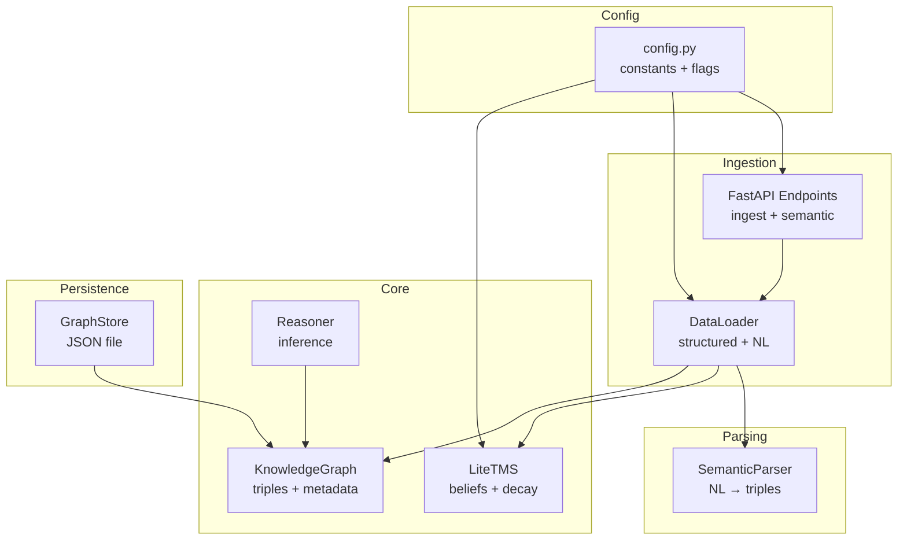
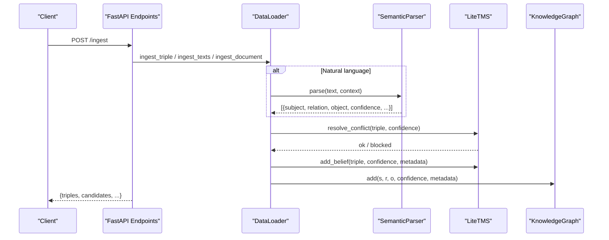
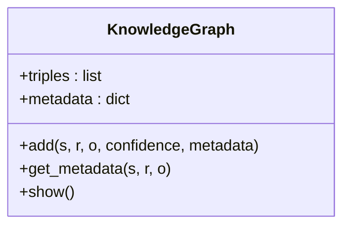
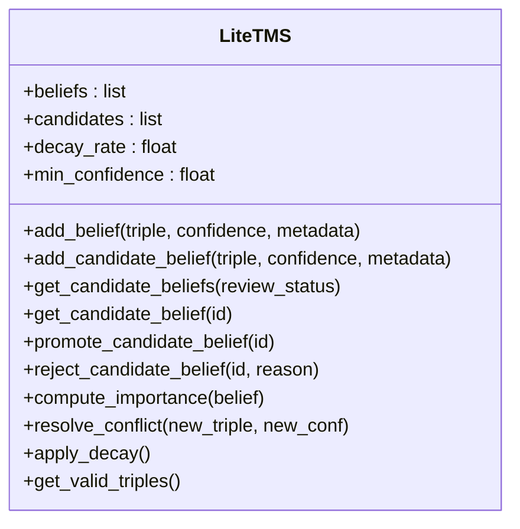
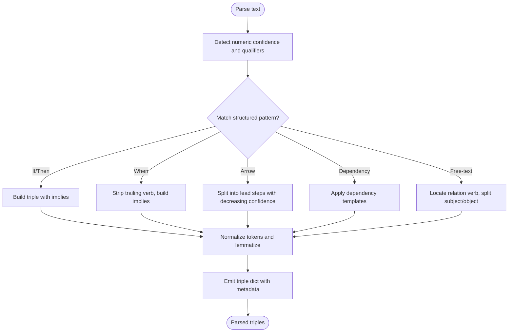
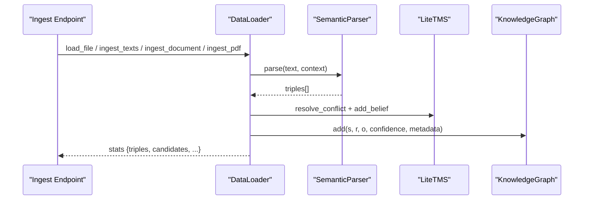
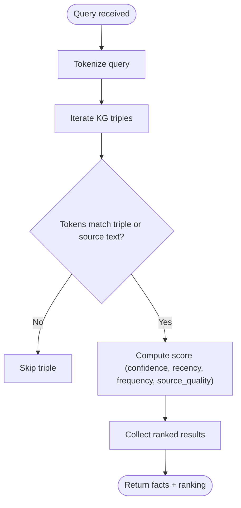
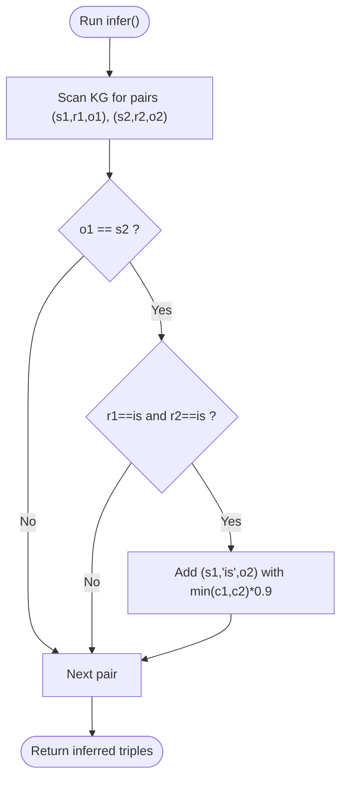
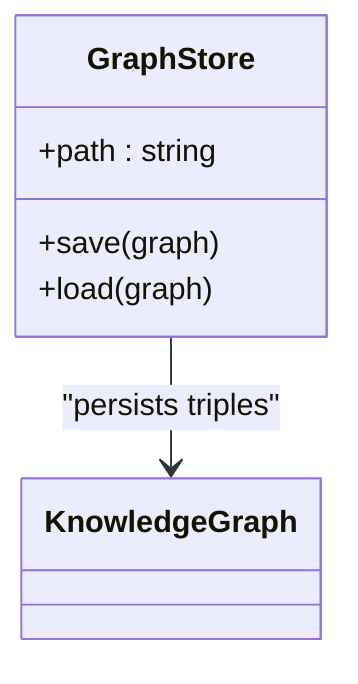
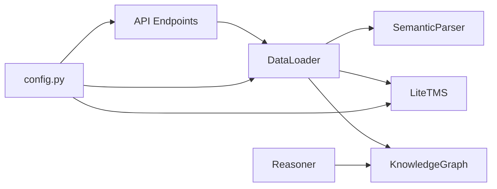

# Knowledge Graph System

<cite>
**Referenced Files in This Document**
- [knowledge_graph.py](file://core/knowledge_graph.py)
- [graph_store.py](file://memory/graph_store.py)
- [tms.py](file://core/tms.py)
- [ingest.py](file://api/endpoints/ingest.py)
- [semantic.py](file://api/endpoints/semantic.py)
- [parser.py](file://core/parser.py)
- [data_loader.py](file://core/data_loader.py)
- [requests.py](file://api/models/requests.py)
- [dependencies.py](file://api/dependencies.py)
- [reasoning.py](file://core/reasoning.py)
- [config.py](file://config.py)
</cite>

## Table of Contents
1. [Introduction](#introduction)
2. [Project Structure](#project-structure)
3. [Core Components](#core-components)
4. [Architecture Overview](#architecture-overview)
5. [Detailed Component Analysis](#detailed-component-analysis)
6. [Dependency Analysis](#dependency-analysis)
7. [Performance Considerations](#performance-considerations)
8. [Troubleshooting Guide](#troubleshooting-guide)
9. [Conclusion](#conclusion)
10. [Appendices](#appendices)

## Introduction
This document describes the knowledge graph system that encodes semantic knowledge as triples (subject-relation-object) with confidence weights and metadata. It covers triple storage and persistence, the truth maintenance system (TMS) for belief revision and consistency, ingestion from natural language and structured sources, query and traversal capabilities, and serialization formats. Practical examples illustrate triple creation, query execution, and knowledge traversal.

## Project Structure
The knowledge graph system spans several modules:
- Core graph and reasoning: triple storage, TMS, and lightweight reasoner
- Ingestion: API endpoints and data loaders for structured and natural language inputs
- Parsing: semantic parser that extracts triples from text
- Persistence: JSON-backed graph store
- API orchestration: dependency wiring and endpoint handlers

**Diagram sources**
- [knowledge_graph.py:1-34](file://core/knowledge_graph.py#L1-L34)
- [tms.py:4-158](file://core/tms.py#L4-L158)
- [reasoning.py:1-27](file://core/reasoning.py#L1-L27)
- [parser.py:102-480](file://core/parser.py#L102-L480)
- [data_loader.py:39-500](file://core/data_loader.py#L39-L500)
- [ingest.py:1-292](file://api/endpoints/ingest.py#L1-L292)
- [semantic.py:1-204](file://api/endpoints/semantic.py#L1-L204)
- [graph_store.py:3-19](file://memory/graph_store.py#L3-L19)
- [config.py:70-106](file://config.py#L70-L106)

**Section sources**
- [knowledge_graph.py:1-34](file://core/knowledge_graph.py#L1-L34)
- [tms.py:4-158](file://core/tms.py#L4-L158)
- [reasoning.py:1-27](file://core/reasoning.py#L1-L27)
- [parser.py:102-480](file://core/parser.py#L102-L480)
- [data_loader.py:39-500](file://core/data_loader.py#L39-L500)
- [ingest.py:1-292](file://api/endpoints/ingest.py#L1-L292)
- [semantic.py:1-204](file://api/endpoints/semantic.py#L1-L204)
- [graph_store.py:3-19](file://memory/graph_store.py#L3-L19)
- [config.py:70-106](file://config.py#L70-L106)

## Core Components
- KnowledgeGraph: stores triples as (subject, relation, object, confidence) and maintains per-triple metadata keyed by (subject, relation, object). Provides deduplication and confidence-driven replacement.
- LiteTMS: manages beliefs with confidence, usage, timestamps, and stages; supports candidate knowledge, promotion/rejection, conflict resolution, and decay.
- SemanticParser: converts natural language statements into normalized triples with confidence and metadata, supporting determinstic patterns, dependency parsing, and free-text heuristics.
- DataLoader: loads structured data (JSON/JSONL/CSV/TXT) and documents (including PDFs), normalizes facts, and injects into TMS and KnowledgeGraph.
- GraphStore: persists triples to disk as JSON and loads them back, converting stored lists to tuples for compatibility.
- Reasoner: applies simple transitive inference over identity relations.

**Section sources**
- [knowledge_graph.py:1-34](file://core/knowledge_graph.py#L1-L34)
- [tms.py:4-158](file://core/tms.py#L4-L158)
- [parser.py:102-480](file://core/parser.py#L102-L480)
- [data_loader.py:39-500](file://core/data_loader.py#L39-L500)
- [graph_store.py:3-19](file://memory/graph_store.py#L3-L19)
- [reasoning.py:1-27](file://core/reasoning.py#L1-L27)

## Architecture Overview
The system integrates ingestion, parsing, triple storage, and belief maintenance. API endpoints coordinate ingestion and semantic operations, while the TMS ensures consistency and confidence-weighted belief management.

**Diagram sources**
- [ingest.py:41-87](file://api/endpoints/ingest.py#L41-L87)
- [data_loader.py:389-405](file://core/data_loader.py#L389-L405)
- [parser.py:115-171](file://core/parser.py#L115-L171)
- [tms.py:111-128](file://core/tms.py#L111-L128)
- [knowledge_graph.py:6-23](file://core/knowledge_graph.py#L6-L23)

## Detailed Component Analysis

### Triple Storage and Metadata
- Triples are stored as four-tuples (subject, relation, object, confidence).
- Metadata is tracked per triple via a dictionary keyed by (subject, relation, object).
- Deduplication and confidence replacement are handled during insertion.

**Diagram sources**
- [knowledge_graph.py:1-34](file://core/knowledge_graph.py#L1-L34)

**Section sources**
- [knowledge_graph.py:1-34](file://core/knowledge_graph.py#L1-L34)

### Truth Maintenance System (Belief Revision and Consistency)
- Beliefs are stored with confidence, usage, timestamps, and stage metadata.
- Conflict resolution checks for negated relations and replaces lower-confidence contradicting beliefs.
- Decay reduces confidence over time and prunes below threshold.
- Candidate knowledge can be reviewed and promoted to active beliefs.

**Diagram sources**
- [tms.py:4-158](file://core/tms.py#L4-L158)

**Section sources**
- [tms.py:4-158](file://core/tms.py#L4-L158)

### Natural Language Parsing to Triples
- Supports deterministic patterns (if/then, when, arrow chains), dependency patterns, and fallback free-text parsing.
- Confidence is extracted from numeric suffixes or qualifiers; negation is detected and encoded by appending a marker to the relation.
- Context metadata is propagated to triples.

**Diagram sources**
- [parser.py:115-171](file://core/parser.py#L115-L171)
- [parser.py:193-221](file://core/parser.py#L193-L221)
- [parser.py:201-210](file://core/parser.py#L201-L210)
- [parser.py:211-221](file://core/parser.py#L211-L221)
- [parser.py:223-245](file://core/parser.py#L223-L245)
- [parser.py:315-386](file://core/parser.py#L315-L386)

**Section sources**
- [parser.py:102-480](file://core/parser.py#L102-L480)

### Data Ingestion Pipeline
- Structured ingestion: JSON/JSONL/CSV/TXT files are loaded and normalized into triples.
- Document ingestion: splits into paragraphs and sentences, preserving provenance metadata.
- PDF ingestion: extracts pages/paragraphs/sentences, deduplicates by fingerprint, and annotates metadata.
- Candidate pipeline: facts can be staged as candidates for review before promotion.

**Diagram sources**
- [ingest.py:41-87](file://api/endpoints/ingest.py#L41-L87)
- [data_loader.py:53-110](file://core/data_loader.py#L53-L110)
- [data_loader.py:119-150](file://core/data_loader.py#L119-L150)
- [data_loader.py:152-198](file://core/data_loader.py#L152-L198)
- [data_loader.py:200-294](file://core/data_loader.py#L200-L294)
- [parser.py:115-171](file://core/parser.py#L115-L171)
- [tms.py:111-128](file://core/tms.py#L111-L128)
- [knowledge_graph.py:6-23](file://core/knowledge_graph.py#L6-L23)

**Section sources**
- [ingest.py:1-292](file://api/endpoints/ingest.py#L1-L292)
- [data_loader.py:39-500](file://core/data_loader.py#L39-L500)
- [parser.py:102-480](file://core/parser.py#L102-L480)

### Query Operations and Traversal
- Search and recall endpoints leverage tokenization and scoring that considers confidence, recency, frequency, and source quality.
- Concept tracing builds relation graphs around a concept across spaces.
- Subject/object/predicate filtering is supported implicitly by token matching and provenance metadata.

**Diagram sources**
- [dependencies.py:924-945](file://api/dependencies.py#L924-L945)
- [dependencies.py:947-953](file://api/dependencies.py#L947-L953)
- [dependencies.py:1102-1124](file://api/dependencies.py#L1102-L1124)

**Section sources**
- [semantic.py:95-149](file://api/endpoints/semantic.py#L95-L149)
- [dependencies.py:924-1137](file://api/dependencies.py#L924-L1137)

### Inference and Transitive Closure
- The reasoner performs limited transitive closure over identity relations to derive new triples with conservative confidence.

**Diagram sources**
- [reasoning.py:6-27](file://core/reasoning.py#L6-L27)

**Section sources**
- [reasoning.py:1-27](file://core/reasoning.py#L1-L27)

### Serialization and Persistence
- Triples are serialized to a JSON file as arrays of arrays and deserialized back to tuples for internal use.
- GraphStore handles save/load operations.

**Diagram sources**
- [graph_store.py:3-19](file://memory/graph_store.py#L3-L19)
- [knowledge_graph.py:1-34](file://core/knowledge_graph.py#L1-L34)

**Section sources**
- [graph_store.py:3-19](file://memory/graph_store.py#L3-L19)
- [config.py:72-74](file://config.py#L72-L74)

### Practical Examples

- Triple creation from structured data:
  - Use the ingestion endpoint to POST structured facts; the loader normalizes and injects into TMS and KG.
  - Example path: [ingest.py:41-87](file://api/endpoints/ingest.py#L41-L87), [data_loader.py:389-405](file://core/data_loader.py#L389-L405)

- Triple creation from natural language:
  - Parse statements into triples with confidence and metadata; see the parser’s deterministic and free-text modes.
  - Example path: [parser.py:115-171](file://core/parser.py#L115-L171), [parser.py:315-386](file://core/parser.py#L315-L386)

- Query execution and ranking:
  - Search and recall endpoints return ranked facts using confidence, recency, frequency, and source quality.
  - Example path: [semantic.py:95-149](file://api/endpoints/semantic.py#L95-L149), [dependencies.py:1102-1124](file://api/dependencies.py#L1102-L1124)

- Knowledge traversal and concept tracing:
  - Concept trace builds relation graphs around a concept across spaces.
  - Example path: [semantic.py:178-204](file://api/endpoints/semantic.py#L178-L204), [dependencies.py:449-504](file://api/dependencies.py#L449-L504)

- Inference and transitive closure:
  - Run inference to derive new identity triples.
  - Example path: [reasoning.py:6-27](file://core/reasoning.py#L6-L27)

**Section sources**
- [ingest.py:41-87](file://api/endpoints/ingest.py#L41-L87)
- [data_loader.py:389-405](file://core/data_loader.py#L389-L405)
- [parser.py:115-171](file://core/parser.py#L115-L171)
- [parser.py:315-386](file://core/parser.py#L315-L386)
- [semantic.py:95-149](file://api/endpoints/semantic.py#L95-L149)
- [dependencies.py:1102-1124](file://api/dependencies.py#L1102-L1124)
- [semantic.py:178-204](file://api/endpoints/semantic.py#L178-L204)
- [dependencies.py:449-504](file://api/dependencies.py#L449-L504)
- [reasoning.py:6-27](file://core/reasoning.py#L6-L27)

## Dependency Analysis
- API endpoints depend on the data loader, parser, TMS, and KG.
- The data loader depends on the parser and TMS/KG.
- The TMS and KG are foundational; the reasoner depends on KG.
- Configuration constants drive behavior such as decay rates, minimum confidence, and feature flags.

**Diagram sources**
- [ingest.py:1-292](file://api/endpoints/ingest.py#L1-L292)
- [semantic.py:1-204](file://api/endpoints/semantic.py#L1-L204)
- [data_loader.py:39-500](file://core/data_loader.py#L39-L500)
- [parser.py:102-480](file://core/parser.py#L102-L480)
- [tms.py:4-158](file://core/tms.py#L4-L158)
- [knowledge_graph.py:1-34](file://core/knowledge_graph.py#L1-L34)
- [reasoning.py:1-27](file://core/reasoning.py#L1-L27)
- [config.py:70-106](file://config.py#L70-L106)

**Section sources**
- [ingest.py:1-292](file://api/endpoints/ingest.py#L1-L292)
- [semantic.py:1-204](file://api/endpoints/semantic.py#L1-L204)
- [data_loader.py:39-500](file://core/data_loader.py#L39-L500)
- [parser.py:102-480](file://core/parser.py#L102-L480)
- [tms.py:4-158](file://core/tms.py#L4-L158)
- [knowledge_graph.py:1-34](file://core/knowledge_graph.py#L1-L34)
- [reasoning.py:1-27](file://core/reasoning.py#L1-L27)
- [config.py:70-106](file://config.py#L70-L106)

## Performance Considerations
- Indexing strategies: current triple storage is a flat list. For large-scale graphs, consider indexing by subject, predicate, and object to accelerate filtering and traversal.
- Retrieval caching: cache frequent queries and their rankings; invalidate on triple insertions or significant updates.
- Parallelization: parse and ingest batches concurrently with bounded thread pools.
- Decay tuning: adjust decay rate and minimum confidence thresholds to balance staleness and noise.
- Feature flags: toggle expensive features (e.g., spaCy dependency parsing) via configuration.

[No sources needed since this section provides general guidance]

## Troubleshooting Guide
- Ingestion errors: verify API key, rate limits, and payload sizes; check logs for exceptions raised by ingestion endpoints.
- PDF ingestion: ensure file type and size limits are respected; confirm curriculum phase prerequisites when applicable.
- Belief conflicts: review TMS candidate queue and promote/reject candidates as needed; monitor decay pruning.
- Query scoring: if results seem unranked, inspect provenance source quality and recency/frequency normalization.

**Section sources**
- [ingest.py:105-154](file://api/endpoints/ingest.py#L105-L154)
- [ingest.py:157-223](file://api/endpoints/ingest.py#L157-L223)
- [semantic.py:27-34](file://api/endpoints/semantic.py#L27-L34)
- [dependencies.py:195-208](file://api/dependencies.py#L195-L208)

## Conclusion
The knowledge graph system provides a compact, triple-centric representation enriched by confidence weights and metadata. It integrates robust ingestion from diverse sources, a TMS for belief revision and consistency, and practical query and traversal utilities. With modest indexing and caching enhancements, it scales to larger knowledge bases while maintaining interpretability and traceability.

## Appendices

### API Surface for Knowledge Injection and Semantics
- Ingest endpoints: POST /ingest, /ingest/texts, /ingest/documents, /ingest/pdf(s), /ingest/candidates, and review operations.
- Semantic endpoints: /semantic/assert, /semantic/beliefs, /semantic/infer, /semantic/search, /semantic/recall, /semantic/relations, and concept utilities.

**Section sources**
- [ingest.py:1-292](file://api/endpoints/ingest.py#L1-L292)
- [semantic.py:1-204](file://api/endpoints/semantic.py#L1-L204)
- [requests.py:14-64](file://api/models/requests.py#L14-L64)