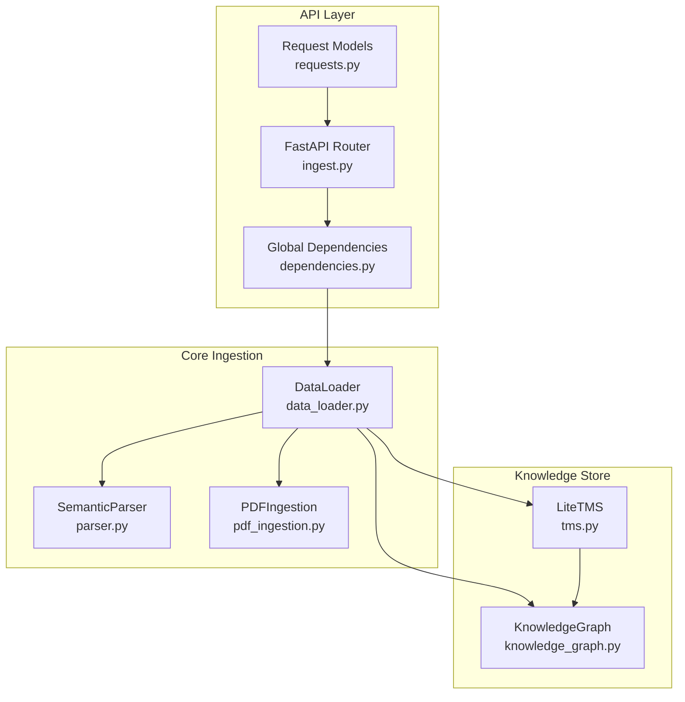
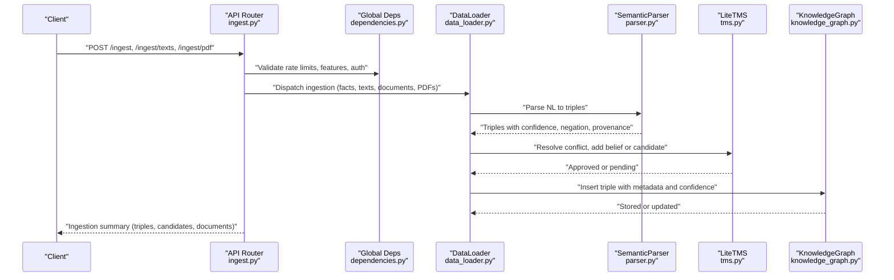
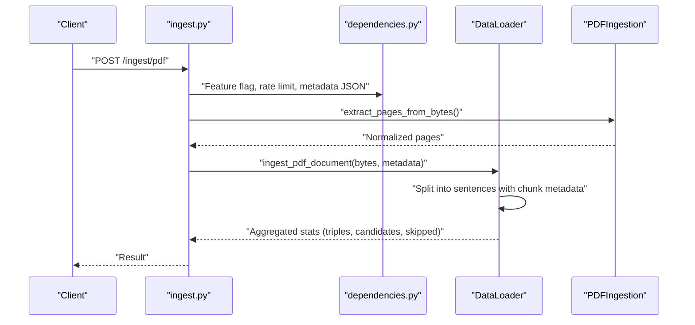
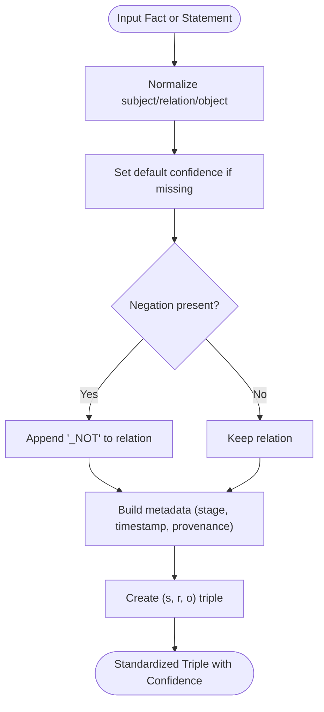
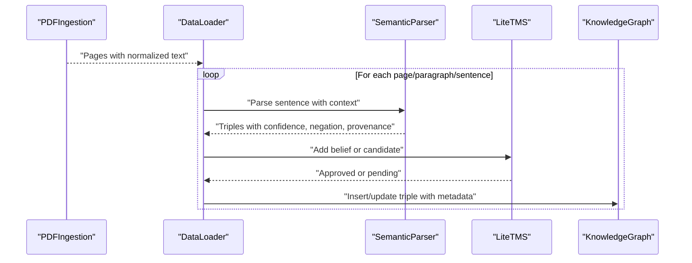
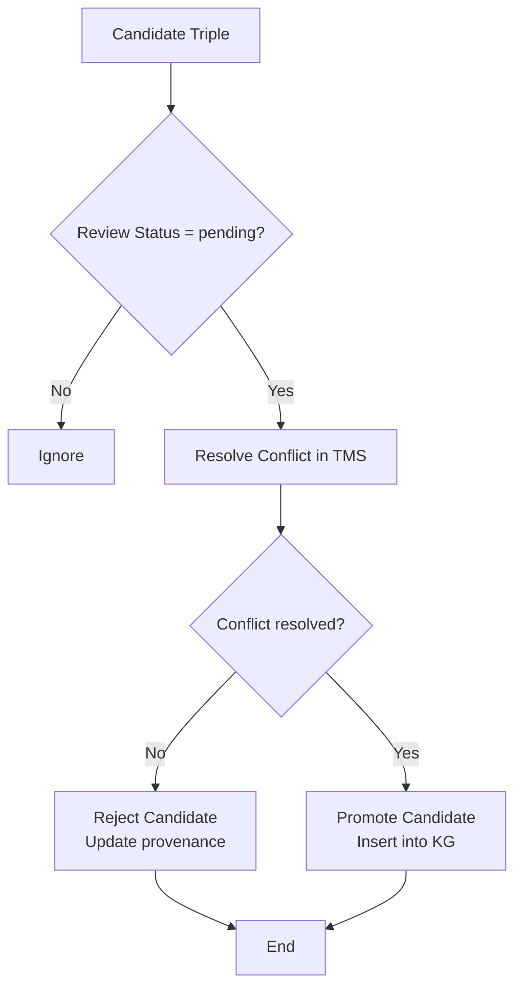
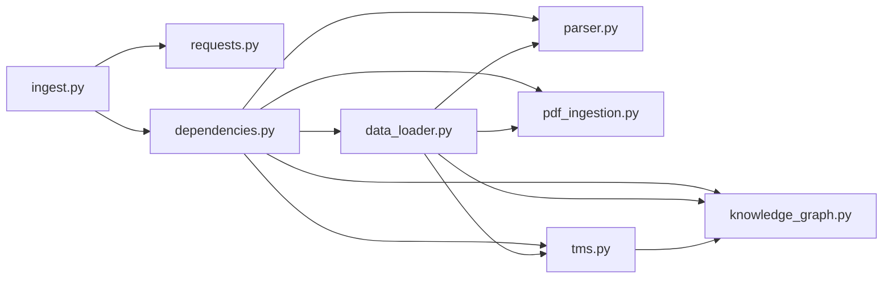

# Knowledge Injection and Integration

<cite>
**Referenced Files in This Document**
- [ingest.py](file://api/endpoints/ingest.py)
- [requests.py](file://api/models/requests.py)
- [dependencies.py](file://api/dependencies.py)
- [data_loader.py](file://core/data_loader.py)
- [parser.py](file://core/parser.py)
- [tms.py](file://core/tms.py)
- [knowledge_graph.py](file://core/knowledge_graph.py)
- [pdf_ingestion.py](file://core/pdf_ingestion.py)
- [test_data_loader.py](file://tests/test_data_loader.py)
- [test_parser.py](file://tests/test_parser.py)
</cite>

## Table of Contents
1. [Introduction](#introduction)
2. [Project Structure](#project-structure)
3. [Core Components](#core-components)
4. [Architecture Overview](#architecture-overview)
5. [Detailed Component Analysis](#detailed-component-analysis)
6. [Dependency Analysis](#dependency-analysis)
7. [Performance Considerations](#performance-considerations)
8. [Troubleshooting Guide](#troubleshooting-guide)
9. [Conclusion](#conclusion)
10. [Appendices](#appendices)

## Introduction
This document explains the knowledge injection system that integrates new information into the knowledge graph. It covers the ingestion pipeline from natural language and structured sources, the data transformation process that standardizes inputs into standardized triple format with confidence weights, and the integration workflow from PDF processing, text parsing, and concept extraction to triple creation. Practical examples illustrate the complete knowledge injection process from raw data to graph insertion. Validation and quality assurance steps, batch processing capabilities, error handling, and the relationship with the Truth Maintenance System (TMS) for consistency checking are documented using terminology consistent with the codebase, including “knowledge injection,” “data transformation,” and “confidence weights.”

## Project Structure
The knowledge injection system spans API endpoints, request models, a central data loader, a semantic parser, a PDF ingestion pipeline, and the knowledge graph with a TMS. The API orchestrates ingestion requests, rate-limits and validates inputs, delegates to the data loader, and logs events. The data loader coordinates parsing, triple preparation, candidate staging, and graph insertion. The TMS manages belief states and conflict resolution. The knowledge graph stores triples with metadata and confidence. PDF ingestion normalizes raw PDF text for downstream parsing.

**Diagram sources**
- [ingest.py:1-292](file://api/endpoints/ingest.py#L1-L292)
- [requests.py:1-90](file://api/models/requests.py#L1-L90)
- [dependencies.py:78-118](file://api/dependencies.py#L78-L118)
- [data_loader.py:39-500](file://core/data_loader.py#L39-L500)
- [parser.py:102-480](file://core/parser.py#L102-L480)
- [pdf_ingestion.py:30-100](file://core/pdf_ingestion.py#L30-L100)
- [knowledge_graph.py:1-34](file://core/knowledge_graph.py#L1-L34)
- [tms.py:4-158](file://core/tms.py#L4-L158)

**Section sources**
- [ingest.py:1-292](file://api/endpoints/ingest.py#L1-L292)
- [requests.py:1-90](file://api/models/requests.py#L1-L90)
- [dependencies.py:78-118](file://api/dependencies.py#L78-L118)
- [data_loader.py:39-500](file://core/data_loader.py#L39-L500)
- [parser.py:102-480](file://core/parser.py#L102-L480)
- [pdf_ingestion.py:30-100](file://core/pdf_ingestion.py#L30-L100)
- [knowledge_graph.py:1-34](file://core/knowledge_graph.py#L1-L34)
- [tms.py:4-158](file://core/tms.py#L4-L158)

## Core Components
- API endpoints for knowledge injection:
  - Text ingestion, structured facts ingestion, document ingestion, PDF ingestion, batch PDF ingestion, and candidate review workflows.
- Request models define the schema for ingestion payloads.
- Global dependencies initialize the KnowledgeGraph, LiteTMS, SemanticParser, and GraphStore.
- DataLoader orchestrates ingestion from multiple sources, transforms inputs into triples, and integrates into TMS and KG.
- SemanticParser extracts standardized (subject, relation, object) triples from natural language with confidence and negation support.
- PDFIngestion extracts and normalizes text from PDFs for sentence-level processing.
- KnowledgeGraph stores triples with confidence and metadata, replacing existing triples with higher confidence.
- LiteTMS maintains beliefs, candidate knowledge, and resolves conflicts to preserve consistency.

**Section sources**
- [ingest.py:11-292](file://api/endpoints/ingest.py#L11-L292)
- [requests.py:34-90](file://api/models/requests.py#L34-L90)
- [dependencies.py:90-118](file://api/dependencies.py#L90-L118)
- [data_loader.py:39-500](file://core/data_loader.py#L39-L500)
- [parser.py:102-480](file://core/parser.py#L102-L480)
- [pdf_ingestion.py:30-100](file://core/pdf_ingestion.py#L30-L100)
- [knowledge_graph.py:1-34](file://core/knowledge_graph.py#L1-L34)
- [tms.py:4-158](file://core/tms.py#L4-L158)

## Architecture Overview
The knowledge injection architecture follows a request-driven ingestion pipeline:
- API endpoints accept ingestion requests and enforce rate limits and feature flags.
- The global dependency container provides a shared KnowledgeGraph, LiteTMS, SemanticParser, and GraphStore.
- DataLoader parses natural language, loads structured data, and orchestrates triple creation and insertion.
- TMS validates and merges triples, applies conflict resolution, and manages candidate review workflows.
- KnowledgeGraph persists triples with metadata and confidence, updating on duplicates with higher confidence.

**Diagram sources**
- [ingest.py:11-292](file://api/endpoints/ingest.py#L11-L292)
- [dependencies.py:78-118](file://api/dependencies.py#L78-L118)
- [data_loader.py:115-198](file://core/data_loader.py#L115-L198)
- [parser.py:115-181](file://core/parser.py#L115-L181)
- [tms.py:30-86](file://core/tms.py#L30-L86)
- [knowledge_graph.py:6-27](file://core/knowledge_graph.py#L6-L27)

## Detailed Component Analysis

### API Endpoints for Knowledge Injection
- Text ingestion endpoint accepts lists of natural language statements with optional source document and stage.
- Structured facts ingestion endpoint accepts arrays of subject-relation-object-confidence dictionaries, optionally with negation and metadata.
- Document ingestion endpoint splits inline documents into sentences and ingests each sentence with provenance metadata.
- PDF ingestion endpoint validates file types and sizes, archives content, and ingests PDFs with page/paragraph/sentence-level provenance.
- Batch PDF ingestion endpoint supports multiple files with per-route rate limiting and batch size constraints.
- Candidate ingestion and review endpoints manage staged knowledge for human-in-the-loop validation.

**Diagram sources**
- [ingest.py:105-154](file://api/endpoints/ingest.py#L105-L154)
- [pdf_ingestion.py:34-78](file://core/pdf_ingestion.py#L34-L78)
- [data_loader.py:200-294](file://core/data_loader.py#L200-L294)

**Section sources**
- [ingest.py:11-292](file://api/endpoints/ingest.py#L11-L292)
- [requests.py:34-90](file://api/models/requests.py#L34-L90)
- [dependencies.py:188-200](file://api/dependencies.py#L188-L200)

### Data Transformation and Triple Preparation
- DataLoader prepares triples from structured facts:
  - Normalizes subject/relation/object strings.
  - Applies default confidence if missing.
  - Converts negation into a “_NOT” relation suffix.
  - Builds metadata with stage, timestamp, and additional fields.
- Natural language transformation:
  - SemanticParser extracts triples from statements with confidence and negation detection.
  - Supports structured patterns (if/then, when, arrow chains) and free-text parsing with canonical relation mapping.
  - Attaches provenance context (source_document, paragraph_index, sentence_index, extraction method, etc.).

**Diagram sources**
- [data_loader.py:368-387](file://core/data_loader.py#L368-L387)
- [parser.py:115-181](file://core/parser.py#L115-L181)

**Section sources**
- [data_loader.py:368-405](file://core/data_loader.py#L368-L405)
- [parser.py:115-181](file://core/parser.py#L115-L181)

### Integration Workflow: From PDF to Graph Insertion
- PDF ingestion:
  - Validates file size and type, checks for encryption, and extracts text page-by-page.
  - Normalizes PDF text to improve downstream parsing reliability.
- Sentence-level processing:
  - Documents are split into paragraphs and sentences.
  - Each sentence is processed with metadata indicating source_document, page_index, paragraph_index, sentence_index, chunk_id, and ingestion_run_id.
- Triple creation and insertion:
  - DataLoader parses each sentence into triples.
  - Triples are validated and inserted into TMS and KG.
  - Duplicate handling replaces existing triples with higher confidence.

**Diagram sources**
- [pdf_ingestion.py:34-78](file://core/pdf_ingestion.py#L34-L78)
- [data_loader.py:200-294](file://core/data_loader.py#L200-L294)
- [parser.py:115-181](file://core/parser.py#L115-L181)
- [tms.py:30-86](file://core/tms.py#L30-L86)
- [knowledge_graph.py:6-27](file://core/knowledge_graph.py#L6-L27)

**Section sources**
- [pdf_ingestion.py:34-78](file://core/pdf_ingestion.py#L34-L78)
- [data_loader.py:200-294](file://core/data_loader.py#L200-L294)
- [parser.py:115-181](file://core/parser.py#L115-L181)
- [knowledge_graph.py:6-27](file://core/knowledge_graph.py#L6-L27)
- [tms.py:30-86](file://core/tms.py#L30-L86)

### Candidate Review and Truth Maintenance System
- Candidate staging:
  - Facts and parsed triples can be staged as candidates with “pending” review status.
  - Review queue exposes pending candidates for human-in-the-loop evaluation.
- Promotion and rejection:
  - Approved candidates are promoted to active beliefs and inserted into the knowledge graph.
  - Rejected candidates update review status and can include a reason in provenance.
- Conflict resolution:
  - TMS resolves contradictions between positive and negated relations for the same subject/object pair.
  - Maintains validity thresholds and applies decay to older beliefs.

**Diagram sources**
- [data_loader.py:415-439](file://core/data_loader.py#L415-L439)
- [tms.py:70-97](file://core/tms.py#L70-L97)
- [tms.py:111-128](file://core/tms.py#L111-L128)

**Section sources**
- [data_loader.py:415-439](file://core/data_loader.py#L415-L439)
- [tms.py:70-128](file://core/tms.py#L70-L128)

### Practical Examples: Complete Knowledge Injection Process
- Example 1: Natural language ingestion
  - Input: List of statements with optional confidence values.
  - Transformation: Parser extracts triples, attaches provenance, and sets default confidence if missing.
  - Integration: DataLoader inserts triples into TMS and KG; duplicates updated if confidence is higher.
- Example 2: Structured facts ingestion
  - Input: Array of dictionaries with subject, relation, object, optional confidence and negation.
  - Transformation: DataLoader prepares triples, converts negation to “_NOT,” and builds metadata.
  - Integration: TMS conflict resolution and KG insertion.
- Example 3: PDF ingestion
  - Input: PDF bytes with optional metadata.
  - Transformation: PDF text extraction and normalization; sentence splitting with chunk metadata.
  - Integration: Sentence parsing, candidate or direct insertion, and graph updates.

**Section sources**
- [test_data_loader.py:54-86](file://tests/test_data_loader.py#L54-L86)
- [test_data_loader.py:130-166](file://tests/test_data_loader.py#L130-L166)
- [test_parser.py:147-156](file://tests/test_parser.py#L147-L156)
- [data_loader.py:115-198](file://core/data_loader.py#L115-L198)
- [data_loader.py:368-405](file://core/data_loader.py#L368-L405)
- [pdf_ingestion.py:34-78](file://core/pdf_ingestion.py#L34-L78)

## Dependency Analysis
The ingestion pipeline exhibits clear separation of concerns:
- API endpoints depend on request models and global dependencies.
- Global dependencies instantiate KnowledgeGraph, LiteTMS, SemanticParser, and GraphStore.
- DataLoader depends on SemanticParser and PDFIngestion, and interacts with TMS and KG.
- TMS and KG are tightly coupled to maintain consistency and metadata.

**Diagram sources**
- [ingest.py:1-20](file://api/endpoints/ingest.py#L1-L20)
- [requests.py:1-90](file://api/models/requests.py#L1-L90)
- [dependencies.py:90-118](file://api/dependencies.py#L90-L118)
- [data_loader.py:39-50](file://core/data_loader.py#L39-L50)
- [parser.py:102-110](file://core/parser.py#L102-L110)
- [pdf_ingestion.py:30-36](file://core/pdf_ingestion.py#L30-L36)
- [tms.py:4-10](file://core/tms.py#L4-L10)
- [knowledge_graph.py:1-5](file://core/knowledge_graph.py#L1-L5)

**Section sources**
- [dependencies.py:90-118](file://api/dependencies.py#L90-L118)
- [data_loader.py:39-50](file://core/data_loader.py#L39-L50)
- [tms.py:4-10](file://core/tms.py#L4-L10)
- [knowledge_graph.py:1-5](file://core/knowledge_graph.py#L1-L5)

## Performance Considerations
- Rate limiting: API enforces per-route rate limits to prevent overload during ingestion bursts.
- Batch processing:
  - Single PDF ingestion supports per-file and total batch size limits.
  - Batch PDF ingestion aggregates results and tracks failures per document.
- Memory and duplication:
  - PDF duplicate fingerprinting avoids reprocessing identical content.
  - KnowledgeGraph replaces triples with higher confidence, reducing redundant storage.
- Optional dependency:
  - spaCy dependency is optional; fallback to rule-based parsing ensures robustness.

[No sources needed since this section provides general guidance]

## Troubleshooting Guide
Common issues and resolutions:
- Unsupported media type or invalid metadata:
  - PDF ingestion validates file extension and JSON metadata; errors are surfaced with HTTP exceptions.
- Size limits exceeded:
  - Per-file and batch size limits trigger client errors; adjust uploads accordingly.
- Prerequisite curriculum phases:
  - Certain operations require prerequisite phases; missing prerequisites return a conflict error with missing phase list.
- Parse failures:
  - PDF ingestion errors are caught and returned as unprocessable entity; inspect archived content for debugging.
- Candidate review:
  - Promote/reject endpoints return not-found if candidate is missing or not pending; verify review queue and candidate IDs.

**Section sources**
- [ingest.py:114-154](file://api/endpoints/ingest.py#L114-L154)
- [ingest.py:165-223](file://api/endpoints/ingest.py#L165-L223)
- [ingest.py:260-291](file://api/endpoints/ingest.py#L260-L291)
- [pdf_ingestion.py:43-56](file://core/pdf_ingestion.py#L43-L56)

## Conclusion
The knowledge injection system provides a robust, multi-source ingestion pipeline that transforms raw inputs into standardized triples with confidence weights. It integrates natural language parsing, structured data ingestion, and PDF processing with strong validation and quality assurance through candidate staging, TMS conflict resolution, and metadata-rich provenance. The API layer offers batch processing, rate limiting, and human-in-the-loop candidate review, ensuring consistency and reliability in knowledge graph updates.

[No sources needed since this section summarizes without analyzing specific files]

## Appendices

### API Endpoints Reference
- POST /ingest/texts: Ingest natural language statements with optional source document and stage.
- POST /ingest: Ingest structured facts, texts, documents, and transitions; supports candidate or validated stages.
- POST /ingest/documents: Ingest inline documents with sentence-level provenance.
- POST /ingest/pdf: Ingest a single PDF with metadata and optional curriculum tracking.
- POST /ingest/pdfs: Ingest a batch of PDFs with aggregated statistics and per-document failure tracking.
- POST /ingest/candidates: Stage facts and texts as candidates for review.
- GET /ingest/candidates: List pending candidates up to a configurable limit.
- POST /ingest/candidates/{candidate_id}/promote: Promote a candidate to active belief.
- POST /ingest/candidates/{candidate_id}/reject: Reject a candidate with optional reason.

**Section sources**
- [ingest.py:11-292](file://api/endpoints/ingest.py#L11-L292)
- [requests.py:34-90](file://api/models/requests.py#L34-L90)

### Data Transformation Details
- Default confidence: If missing, defaults are applied during triple preparation.
- Negation handling: Negated relations are encoded with a “_NOT” suffix for consistent conflict resolution.
- Provenance enrichment: Context metadata (source_document, indices, extraction method) is attached to triples.

**Section sources**
- [data_loader.py:368-387](file://core/data_loader.py#L368-L387)
- [parser.py:115-181](file://core/parser.py#L115-L181)

### Validation and Quality Assurance
- Candidate review queue: Pending candidates are exposed for manual approval or rejection.
- Conflict resolution: TMS resolves contradictions between positive/negative relations for the same triple.
- Duplicate handling: KG replaces existing triples with higher confidence; PDF duplicates are skipped using fingerprints.

**Section sources**
- [data_loader.py:415-439](file://core/data_loader.py#L415-L439)
- [tms.py:111-128](file://core/tms.py#L111-L128)
- [knowledge_graph.py:10-20](file://core/knowledge_graph.py#L10-L20)
- [test_data_loader.py:160-166](file://tests/test_data_loader.py#L160-L166)