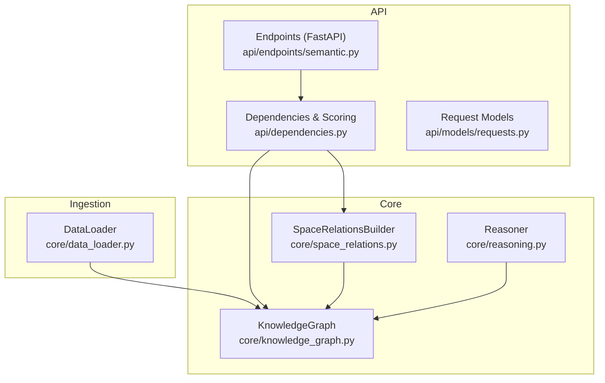
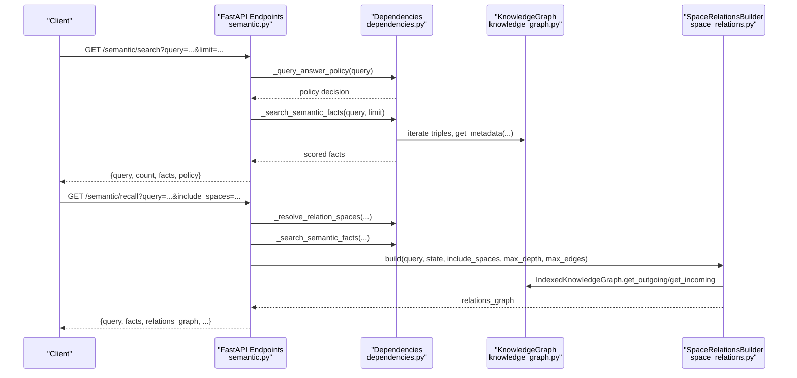
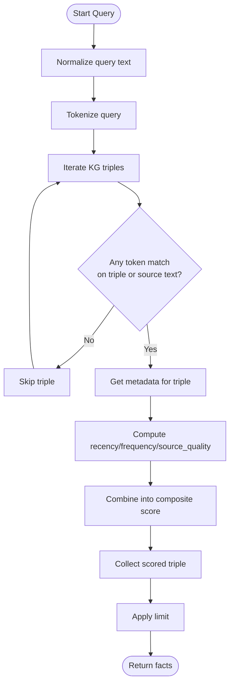
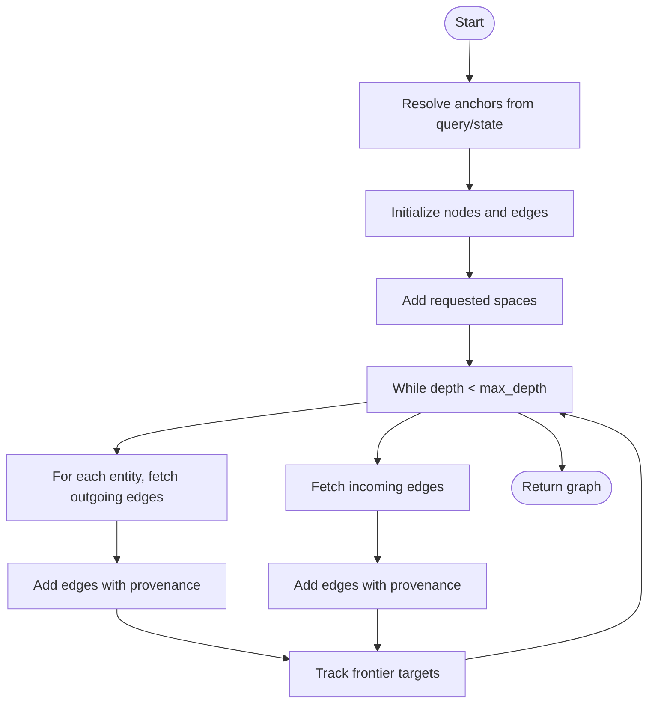
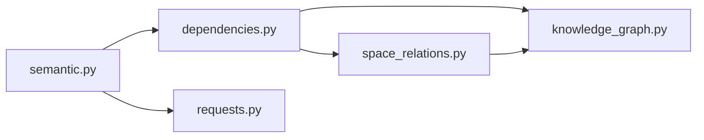

# Query Operations and Retrieval

<cite>
**Referenced Files in This Document**
- [knowledge_graph.py](file://core/knowledge_graph.py)
- [space_relations.py](file://core/space_relations.py)
- [reasoning.py](file://core/reasoning.py)
- [dependencies.py](file://api/dependencies.py)
- [semantic.py](file://api/endpoints/semantic.py)
- [requests.py](file://api/models/requests.py)
- [data_loader.py](file://core/data_loader.py)
- [test_api.py](file://tests/test_api.py)
- [test_space_relations.py](file://tests/test_space_relations.py)
</cite>

## Table of Contents
1. [Introduction](#introduction)
2. [Project Structure](#project-structure)
3. [Core Components](#core-components)
4. [Architecture Overview](#architecture-overview)
5. [Detailed Component Analysis](#detailed-component-analysis)
6. [Dependency Analysis](#dependency-analysis)
7. [Performance Considerations](#performance-considerations)
8. [Troubleshooting Guide](#troubleshooting-guide)
9. [Conclusion](#conclusion)

## Introduction
This document explains knowledge graph query operations and retrieval mechanisms implemented in the system. It focuses on triple filtering and retrieval, subject/object/predicate filtering, path-finding traversal across spaces, query optimization, metadata retrieval, and practical query patterns. It also covers performance characteristics and indexing strategies that enable efficient retrieval.

## Project Structure
The query pipeline spans several modules:
- Core knowledge representation and storage
- Space-aware relation graph builder
- API endpoints exposing query operations
- Supporting utilities for tokenization, scoring, and provenance
- Tests validating query behaviors

**Diagram sources**
- [knowledge_graph.py:1-34](file://core/knowledge_graph.py#L1-L34)
- [space_relations.py:84-167](file://core/space_relations.py#L84-L167)
- [reasoning.py:1-28](file://core/reasoning.py#L1-L28)
- [semantic.py:1-204](file://api/endpoints/semantic.py#L1-L204)
- [dependencies.py:1-200](file://api/dependencies.py#L1-L200)
- [data_loader.py:1-500](file://core/data_loader.py#L1-L500)

**Section sources**
- [knowledge_graph.py:1-34](file://core/knowledge_graph.py#L1-L34)
- [space_relations.py:1-562](file://core/space_relations.py#L1-L562)
- [reasoning.py:1-28](file://core/reasoning.py#L1-L28)
- [semantic.py:1-204](file://api/endpoints/semantic.py#L1-L204)
- [dependencies.py:1-200](file://api/dependencies.py#L1-L200)
- [data_loader.py:1-500](file://core/data_loader.py#L1-L500)

## Core Components
- KnowledgeGraph: Stores triples and associated metadata; supports adding and retrieving metadata per triple.
- SpaceRelationsBuilder: Builds cross-space relation graphs for recall/explain workflows, enabling traversal and filtering across semantic, memory, goal, risk, attention/self, arithmetic, calculus, curriculum, and emotion spaces.
- Reasoner: Performs safe transitive inference on the knowledge graph.
- API endpoints: Expose query operations including semantic search, recall, and relations graph construction.
- Dependencies: Provide tokenization, query policy, scoring, and provenance extraction used by query operations.

**Section sources**
- [knowledge_graph.py:1-34](file://core/knowledge_graph.py#L1-L34)
- [space_relations.py:84-167](file://core/space_relations.py#L84-L167)
- [reasoning.py:1-28](file://core/reasoning.py#L1-L28)
- [semantic.py:95-176](file://api/endpoints/semantic.py#L95-L176)
- [dependencies.py:175-200](file://api/dependencies.py#L175-L200)

## Architecture Overview
The query architecture integrates ingestion, storage, tokenization, ranking, and graph building.

**Diagram sources**
- [semantic.py:95-176](file://api/endpoints/semantic.py#L95-L176)
- [dependencies.py:188-200](file://api/dependencies.py#L188-L200)
- [dependencies.py:1091-1206](file://api/dependencies.py#L1091-L1206)
- [knowledge_graph.py:28-29](file://core/knowledge_graph.py#L28-L29)
- [space_relations.py:56-82](file://core/space_relations.py#L56-L82)
- [space_relations.py:169-238](file://core/space_relations.py#L169-L238)

## Detailed Component Analysis

### Triple Filtering and Retrieval
Triple filtering is performed by tokenizing the query and matching against subject, relation, object, and optionally source text metadata. Facts are scored using confidence, recency, frequency, and source quality.

Key behaviors:
- Tokenization supports Unicode and splits underscore tokens.
- Matching occurs across searchable tokens of triple components and source text tokens.
- Metadata retrieval is available per triple for provenance and contextual information.
- Ranking aggregates confidence, recency, frequency, and source quality into a composite score.

**Diagram sources**
- [dependencies.py:1796-1804](file://api/dependencies.py#L1796-L1804)
- [dependencies.py:1091-1116](file://api/dependencies.py#L1091-L1116)
- [dependencies.py:1116-1206](file://api/dependencies.py#L1116-L1206)
- [knowledge_graph.py:28-29](file://core/knowledge_graph.py#L28-L29)

**Section sources**
- [dependencies.py:1796-1804](file://api/dependencies.py#L1796-L1804)
- [dependencies.py:1091-1116](file://api/dependencies.py#L1091-L1116)
- [dependencies.py:1116-1206](file://api/dependencies.py#L1116-L1206)
- [knowledge_graph.py:28-29](file://core/knowledge_graph.py#L28-L29)

### Subject/Object/Predicate Filtering Capabilities
- Subject filtering: Match entities appearing as subject in triples.
- Object filtering: Match entities appearing as object in triples.
- Predicate filtering: Match relation strings and derived tokens.
- Conditional filtering: Uses token intersection checks to ensure lexical coverage across triple components and metadata source text.

Practical examples validated by tests:
- Searching for “flood” retrieves triples containing “flood” in subject or object.
- Arithmetic expressions trigger runtime computation and augmentation of results.
- Calculus queries leverage symbolic computation and include solution traces in provenance.

**Section sources**
- [dependencies.py:1091-1116](file://api/dependencies.py#L1091-L1116)
- [dependencies.py:1116-1206](file://api/dependencies.py#L1116-L1206)
- [test_api.py:375-384](file://tests/test_api.py#L375-L384)
- [test_api.py:420-433](file://tests/test_api.py#L420-L433)
- [test_api.py:497-518](file://tests/test_api.py#L497-L518)

### Path-Finding and Traversal Across Spaces
The SpaceRelationsBuilder constructs a multi-space graph around anchors derived from the query and/or state. It performs breadth-first traversal up to a configurable depth, collecting edges with confidence and provenance. It supports:
- Semantic space: bidirectional traversal over outgoing and incoming edges using an indexed knowledge graph wrapper.
- Memory, goal, risk, attention/self, arithmetic, calculus, curriculum, emotion spaces: specialized edge generation with space-specific semantics.

**Diagram sources**
- [space_relations.py:90-167](file://core/space_relations.py#L90-L167)
- [space_relations.py:169-238](file://core/space_relations.py#L169-L238)
- [space_relations.py:56-82](file://core/space_relations.py#L56-L82)

**Section sources**
- [space_relations.py:90-167](file://core/space_relations.py#L90-L167)
- [space_relations.py:169-238](file://core/space_relations.py#L169-L238)
- [space_relations.py:56-82](file://core/space_relations.py#L56-L82)
- [test_space_relations.py:41-63](file://tests/test_space_relations.py#L41-L63)

### Query Optimization Techniques
- IndexedKnowledgeGraph: Precomputes outgoing and incoming adjacency lists keyed by lowercased entities for O(1) neighbor lookups during traversal.
- Tokenization and early rejection: Rejects triples whose tokens do not intersect with query tokens or source text tokens.
- Scoring weights: Confidence, recency, frequency, and source quality are combined into a composite score to rank results.
- Limits: Enforces limits on returned facts and edges to cap resource usage.

**Section sources**
- [space_relations.py:56-82](file://core/space_relations.py#L56-L82)
- [dependencies.py:1091-1116](file://api/dependencies.py#L1091-L1116)
- [dependencies.py:1116-1206](file://api/dependencies.py#L1116-L1206)

### Metadata Retrieval Operations
Metadata retrieval is available per triple and includes:
- Provenance: source document, page index, sentence index, ingestion run ID, timestamps, and stage.
- Contextual information: source text, space, and computed solution traces for arithmetic and calculus.

Tests demonstrate retrieval of metadata for ingested facts and provenance tracking across documents and sentences.

**Section sources**
- [knowledge_graph.py:28-29](file://core/knowledge_graph.py#L28-L29)
- [data_loader.py:152-198](file://core/data_loader.py#L152-L198)
- [test_data_loader.py:103-133](file://tests/test_data_loader.py#L103-L133)

### Practical Examples and Patterns
Common query patterns and validations:
- Basic search returns scored facts with ranking breakdown and provenance.
- Recall expands the relations graph with optional entity expansion from initial facts.
- Arithmetic queries return computed results augmented with solution traces.
- Calculus queries return derivatives, integrals, and detailed solution traces.
- Concept-based recall can expand to all spaces depending on query semantics.

These behaviors are exercised and asserted in tests.

**Section sources**
- [test_api.py:370-384](file://tests/test_api.py#L370-L384)
- [test_api.py:385-394](file://tests/test_api.py#L385-L394)
- [test_api.py:395-418](file://tests/test_api.py#L395-L418)
- [test_api.py:420-433](file://tests/test_api.py#L420-L433)
- [test_api.py:497-518](file://tests/test_api.py#L497-L518)
- [test_api.py:552-561](file://tests/test_api.py#L552-L561)

### Complex Queries: Multiple Hops, Conditional Filtering, Aggregation
- Multiple hops: Achieved by increasing max_depth in the relations graph builder; traversal explores neighbors iteratively.
- Conditional filtering: Implemented via token intersection checks across triple components and metadata source text.
- Aggregation: Results are ranked by a composite score combining confidence, recency, frequency, and source quality; arithmetic and calculus results are appended with computed provenance.

**Section sources**
- [space_relations.py:169-238](file://core/space_relations.py#L169-L238)
- [dependencies.py:1091-1116](file://api/dependencies.py#L1091-L1116)
- [dependencies.py:1116-1206](file://api/dependencies.py#L1116-L1206)

## Dependency Analysis
The query pipeline depends on:
- KnowledgeGraph for triple storage and metadata retrieval.
- SpaceRelationsBuilder for constructing multi-space graphs with traversal and edge generation.
- Dependencies module for tokenization, policy decisions, scoring, and provenance.
- API endpoints orchestrating request handling and response formatting.

**Diagram sources**
- [semantic.py:1-204](file://api/endpoints/semantic.py#L1-L204)
- [dependencies.py:1-200](file://api/dependencies.py#L1-L200)
- [knowledge_graph.py:1-34](file://core/knowledge_graph.py#L1-L34)
- [space_relations.py:1-562](file://core/space_relations.py#L1-L562)
- [requests.py:1-90](file://api/models/requests.py#L1-L90)

**Section sources**
- [semantic.py:1-204](file://api/endpoints/semantic.py#L1-L204)
- [dependencies.py:1-200](file://api/dependencies.py#L1-L200)
- [knowledge_graph.py:1-34](file://core/knowledge_graph.py#L1-L34)
- [space_relations.py:1-562](file://core/space_relations.py#L1-L562)
- [requests.py:1-90](file://api/models/requests.py#L1-L90)

## Performance Considerations
- Indexing: IndexedKnowledgeGraph provides O(1) neighbor lookups, reducing traversal cost compared to linear scans.
- Tokenization: Efficient Unicode-aware tokenization with underscore expansion reduces false negatives.
- Scoring: Lightweight aggregation of confidence, recency, frequency, and source quality avoids heavy computations.
- Limits: Enforced limits on facts and edges prevent unbounded growth in recall and relations graph sizes.
- Inference: Reasoner applies conservative transitive chaining to avoid incorrect inferences and maintain performance.

[No sources needed since this section provides general guidance]

## Troubleshooting Guide
Common issues and resolutions:
- No facts returned: Verify query tokens; queries without lexical tokens may be rejected by policy.
- Unknown concepts: Non-indexed concepts may yield zero results; ensure seed knowledge or ingestion includes relevant facts.
- Relations graph empty: Confirm include_spaces selection and max_edges; increase max_edges if needed.
- Missing metadata: Ensure ingestion recorded provenance fields (e.g., source_document, sentence_index).

Validation references:
- Policy-based rejection for tokenless queries.
- Expansion behavior differences between recall modes.
- Metadata presence in candidate reviews and document ingestion.

**Section sources**
- [test_api.py:445-448](file://tests/test_api.py#L445-L448)
- [test_api.py:395-418](file://tests/test_api.py#L395-L418)
- [test_data_loader.py:103-133](file://tests/test_data_loader.py#L103-L133)

## Conclusion
The system provides robust query operations over a knowledge graph with strong filtering, scoring, and metadata retrieval capabilities. Path-finding across spaces is supported by an indexed traversal engine, and performance is optimized through indexing, tokenization, and enforced limits. The API exposes intuitive endpoints for search, recall, and relations graph construction, enabling practical exploration of knowledge relationships with contextual provenance.