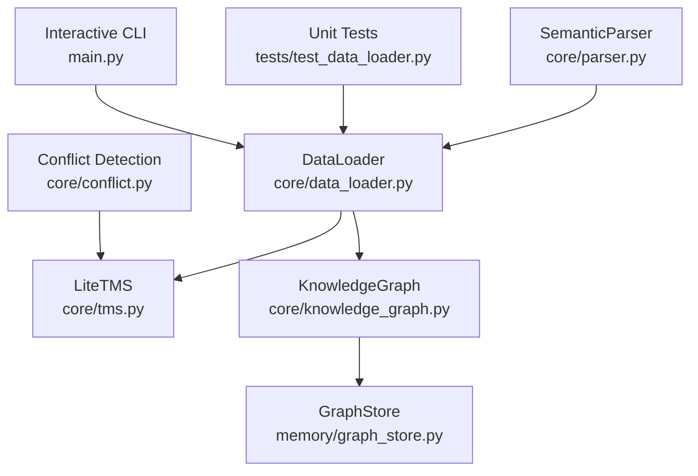
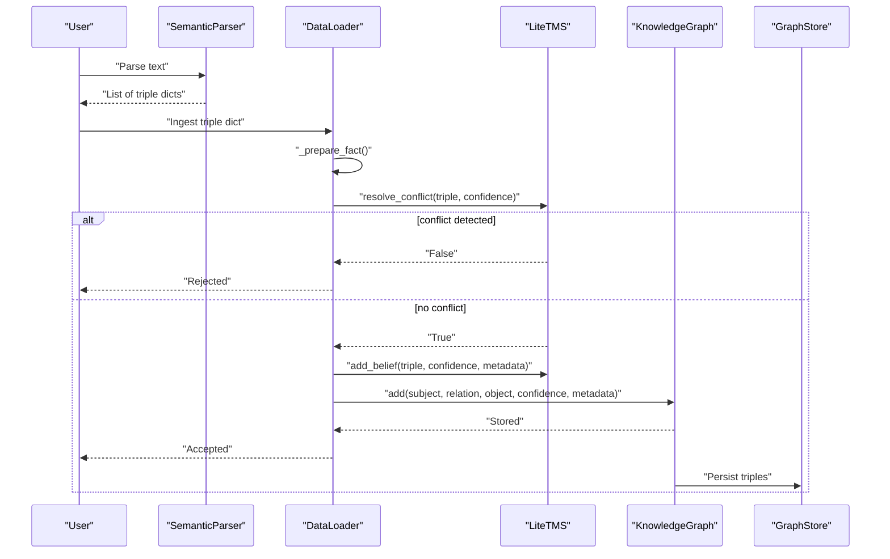
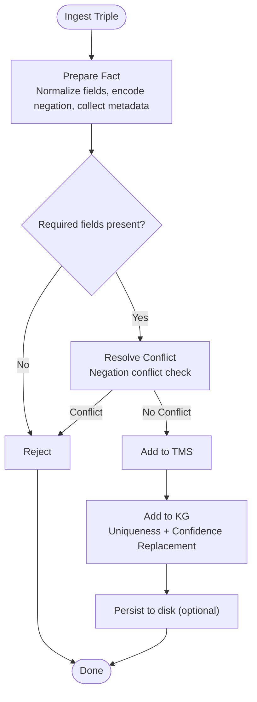
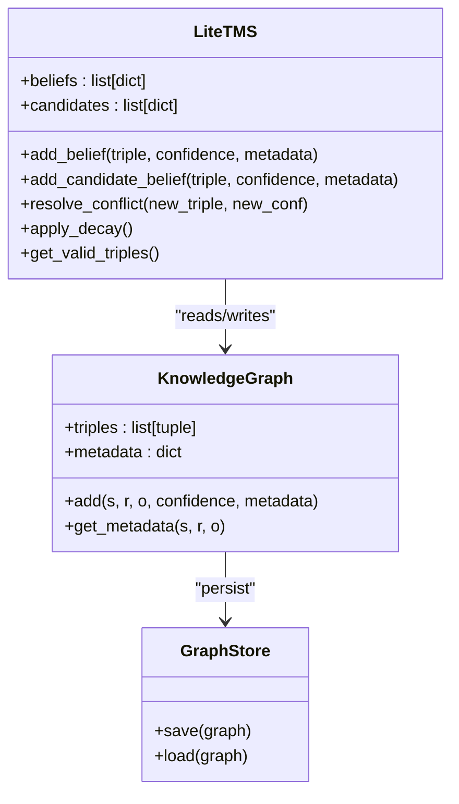
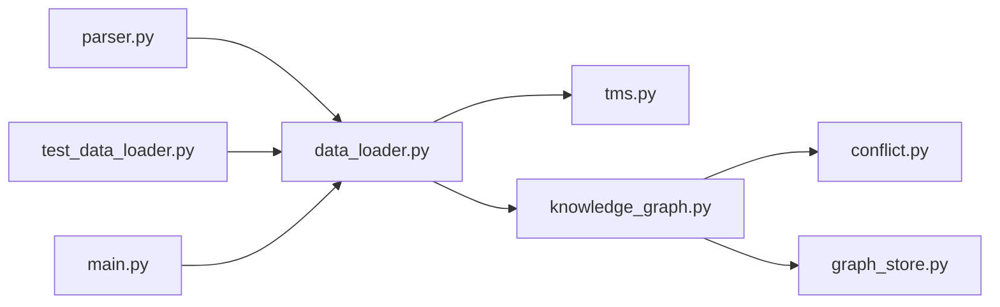

# Triple Representation and Structure

<cite>
**Referenced Files in This Document**
- [knowledge_graph.py](file://core/knowledge_graph.py)
- [data_loader.py](file://core/data_loader.py)
- [parser.py](file://core/parser.py)
- [tms.py](file://core/tms.py)
- [conflict.py](file://core/conflict.py)
- [graph_store.py](file://memory/graph_store.py)
- [test_data_loader.py](file://tests/test_data_loader.py)
- [main.py](file://main.py)
</cite>

## Table of Contents
1. [Introduction](#introduction)
2. [Project Structure](#project-structure)
3. [Core Components](#core-components)
4. [Architecture Overview](#architecture-overview)
5. [Detailed Component Analysis](#detailed-component-analysis)
6. [Dependency Analysis](#dependency-analysis)
7. [Performance Considerations](#performance-considerations)
8. [Troubleshooting Guide](#troubleshooting-guide)
9. [Conclusion](#conclusion)

## Introduction
This document explains the triple representation system that encodes fundamental knowledge in the semantic AI system. It focuses on how triples (subject-relation-object) represent semantic relationships, how confidence weights manage belief strength, and how metadata attaches contextual provenance. It documents the triple creation pipeline, uniqueness constraints, duplicate handling, validation and normalization, and the relationship between triples and the overall knowledge graph architecture.

## Project Structure
The triple system spans several modules:
- Parser extracts triples from natural language and structured formats.
- Data loader validates, normalizes, and injects triples into the Triple Management System (TMS) and Knowledge Graph (KG).
- KG stores triples as immutable tuples with metadata keyed by (subject, relation, object).
- Conflict detection enforces logical consistency for negated statements.
- Persistence layer saves and loads triples to/from JSON.

**Diagram sources**
- [parser.py:115-171](file://core/parser.py#L115-L171)
- [data_loader.py:389-405](file://core/data_loader.py#L389-L405)
- [tms.py:30-45](file://core/tms.py#L30-L45)
- [knowledge_graph.py:6-29](file://core/knowledge_graph.py#L6-L29)
- [graph_store.py:7-18](file://memory/graph_store.py#L7-L18)
- [conflict.py:1-18](file://core/conflict.py#L1-L18)
- [test_data_loader.py:27-51](file://tests/test_data_loader.py#L27-L51)
- [main.py:265-323](file://main.py#L265-L323)

**Section sources**
- [parser.py:115-171](file://core/parser.py#L115-L171)
- [data_loader.py:389-405](file://core/data_loader.py#L389-L405)
- [knowledge_graph.py:6-29](file://core/knowledge_graph.py#L6-L29)
- [tms.py:30-45](file://core/tms.py#L30-L45)
- [conflict.py:1-18](file://core/conflict.py#L1-L18)
- [graph_store.py:7-18](file://memory/graph_store.py#L7-L18)
- [test_data_loader.py:27-51](file://tests/test_data_loader.py#L27-L51)
- [main.py:265-323](file://main.py#L265-L323)

## Core Components
- Triple format: The system uses a four-tuple internally for storage: (subject, relation, object, confidence). The external representation is a dictionary with keys subject, relation, object, negation, and confidence.
- Confidence weights: A floating-point value in [0.0, 1.0] representing belief strength. Confidence is rounded to four decimals for consistency.
- Metadata: Arbitrary dictionary attached to each triple for provenance and context (e.g., source_document, stage, timestamps, sentence indices).
- Uniqueness and duplicates: Triples are uniquely identified by (subject, relation, object). If a higher-confidence version arrives, it replaces the existing triple; otherwise, it is ignored.

**Section sources**
- [knowledge_graph.py:6-29](file://core/knowledge_graph.py#L6-L29)
- [parser.py:471-479](file://core/parser.py#L471-L479)
- [data_loader.py:368-387](file://core/data_loader.py#L368-L387)

## Architecture Overview
The triple lifecycle:
1. Parse: Natural language or structured input is parsed into triple dictionaries.
2. Prepare: Fields are normalized, negation is encoded, and metadata is collected.
3. Validate: Missing fields invalidate the triple.
4. Conflict resolution: Negation conflicts are detected against existing triples.
5. Inject: Triple is added to TMS and KG with metadata.
6. Persist: KG triples are saved/loaded as JSON tuples.

**Diagram sources**
- [parser.py:115-171](file://core/parser.py#L115-L171)
- [data_loader.py:368-405](file://core/data_loader.py#L368-L405)
- [tms.py:111-128](file://core/tms.py#L111-L128)
- [knowledge_graph.py:6-29](file://core/knowledge_graph.py#L6-L29)
- [graph_store.py:7-18](file://memory/graph_store.py#L7-L18)

## Detailed Component Analysis

### Triple Format and Internal Representation
- Internal storage: Each triple is stored as a four-element tuple (subject, relation, object, confidence). This ensures immutability and efficient hashing for uniqueness checks.
- External representation: Parsed triples are dictionaries with keys subject, relation, object, negation, and confidence. Negation is encoded by appending "_NOT" to the relation when applicable.
- Metadata: Stored separately in a dictionary keyed by (subject, relation, object) to associate provenance and context with each triple.

Practical example references:
- Creating a triple dictionary: [parser.py:471-479](file://core/parser.py#L471-L479)
- Storing as tuple and metadata mapping: [knowledge_graph.py:6-29](file://core/knowledge_graph.py#L6-L29)

**Section sources**
- [knowledge_graph.py:6-29](file://core/knowledge_graph.py#L6-L29)
- [parser.py:471-479](file://core/parser.py#L471-L479)

### Confidence Weighting Mechanism
- Belief strength: Confidence values are floats in [0.0, 1.0], rounded to four decimals for consistency.
- Default confidence: If not provided, defaults to 0.8 during parsing.
- Feedback and decay: TMS adjusts confidence based on feedback and applies decay over time to prune low-importance beliefs.
- Comparison: Higher-confidence duplicates replace existing triples; lower-confidence duplicates are ignored.

Practical example references:
- Default confidence and rounding: [parser.py:126-143](file://core/parser.py#L126-L143)
- TMS confidence adjustment and decay: [tms.py:99-152](file://core/tms.py#L99-L152)
- Duplicate handling by confidence: [knowledge_graph.py:14-16](file://core/knowledge_graph.py#L14-L16)

**Section sources**
- [parser.py:126-143](file://core/parser.py#L126-L143)
- [tms.py:99-152](file://core/tms.py#L99-L152)
- [knowledge_graph.py:14-16](file://core/knowledge_graph.py#L14-L16)

### Metadata Attachment System
- Provenance: Metadata includes source_document, stage, timestamps, and sentence/page indices for traceability.
- Normalization: During ingestion, metadata is extracted from the input fact and merged with context (e.g., source_document).
- Retrieval: Metadata is retrieved by triple key for downstream use (e.g., ranking, filtering).

Practical example references:
- Metadata extraction and defaults: [data_loader.py:381-386](file://core/data_loader.py#L381-L386)
- Context merging during parsing: [parser.py:168-169](file://core/parser.py#L168-L169)
- Metadata retrieval: [knowledge_graph.py:28-29](file://core/knowledge_graph.py#L28-L29)

**Section sources**
- [data_loader.py:381-386](file://core/data_loader.py#L381-L386)
- [parser.py:168-169](file://core/parser.py#L168-L169)
- [knowledge_graph.py:28-29](file://core/knowledge_graph.py#L28-L29)

### Triple Creation Process
- Parsing: Natural language sentences are parsed into triple dictionaries using deterministic patterns, dependency parsing, and fallback rules.
- Structured formats: CSV, JSON, JSONL, and TXT are supported; confidence is extracted from trailing tokens or defaults.
- Candidate staging: Triples can be staged as candidates for review before promotion.

Practical example references:
- Sentence parsing and confidence extraction: [parser.py:115-171](file://core/parser.py#L115-L171)
- Structured ingestion: [data_loader.py:53-101](file://core/data_loader.py#L53-L101)
- Candidate ingestion: [data_loader.py:407-413](file://core/data_loader.py#L407-L413)

**Section sources**
- [parser.py:115-171](file://core/parser.py#L115-L171)
- [data_loader.py:53-101](file://core/data_loader.py#L53-L101)
- [data_loader.py:407-413](file://core/data_loader.py#L407-L413)

### Uniqueness Constraints and Duplicate Handling Logic
- Uniqueness: Triples are uniquely identified by (subject, relation, object).
- Replacement: If a new triple has higher confidence than an existing one, it replaces it; otherwise, it is ignored.
- Negation conflict: Conflicts are detected for opposite relations (e.g., causes vs causes_NOT) with the same subject and object.

**Diagram sources**
- [data_loader.py:368-405](file://core/data_loader.py#L368-L405)
- [tms.py:111-128](file://core/tms.py#L111-L128)
- [knowledge_graph.py:10-26](file://core/knowledge_graph.py#L10-L26)

**Section sources**
- [data_loader.py:368-405](file://core/data_loader.py#L368-L405)
- [tms.py:111-128](file://core/tms.py#L111-L128)
- [knowledge_graph.py:10-26](file://core/knowledge_graph.py#L10-L26)

### Validation, Normalization, and Practical Examples
- Validation: Missing subject/relation/object fields cause rejection.
- Normalization: Text normalization includes lowercasing, article removal, and noun singularization.
- Examples:
  - Triple instantiation from parsed text: [parser.py:471-479](file://core/parser.py#L471-L479)
  - Confidence comparison and replacement: [knowledge_graph.py:14-16](file://core/knowledge_graph.py#L14-L16)
  - Metadata association during ingestion: [data_loader.py:381-386](file://core/data_loader.py#L381-L386)

**Section sources**
- [parser.py:471-479](file://core/parser.py#L471-L479)
- [knowledge_graph.py:14-16](file://core/knowledge_graph.py#L14-L16)
- [data_loader.py:381-386](file://core/data_loader.py#L381-L386)

### Relationship Between Triples and Knowledge Graph Architecture
- KG stores triples as immutable tuples and maintains a metadata mapping keyed by triple identifiers.
- TMS manages belief strength, candidate staging, conflict resolution, and decay.
- Conflict detection ensures logical consistency for negated statements.
- Persistence layer saves/load triples as JSON arrays of tuples.

**Diagram sources**
- [knowledge_graph.py:1-34](file://core/knowledge_graph.py#L1-L34)
- [tms.py:1-157](file://core/tms.py#L1-L157)
- [graph_store.py:1-19](file://memory/graph_store.py#L1-L19)

**Section sources**
- [knowledge_graph.py:1-34](file://core/knowledge_graph.py#L1-L34)
- [tms.py:1-157](file://core/tms.py#L1-L157)
- [graph_store.py:1-19](file://memory/graph_store.py#L1-L19)

## Dependency Analysis
- Parser depends on rule-based and optional spaCy dependency parsing to extract triples.
- DataLoader orchestrates ingestion, validation, conflict resolution, and persistence.
- KG and TMS are tightly coupled: TMS resolves conflicts and decides whether to accept triples; KG stores them.
- Conflict detection operates on KG triples to prevent contradictory negations.

**Diagram sources**
- [parser.py:115-171](file://core/parser.py#L115-L171)
- [data_loader.py:389-405](file://core/data_loader.py#L389-L405)
- [tms.py:111-128](file://core/tms.py#L111-L128)
- [knowledge_graph.py:6-29](file://core/knowledge_graph.py#L6-L29)
- [conflict.py:1-18](file://core/conflict.py#L1-L18)
- [graph_store.py:7-18](file://memory/graph_store.py#L7-L18)
- [test_data_loader.py:27-51](file://tests/test_data_loader.py#L27-L51)
- [main.py:265-323](file://main.py#L265-L323)

**Section sources**
- [parser.py:115-171](file://core/parser.py#L115-L171)
- [data_loader.py:389-405](file://core/data_loader.py#L389-L405)
- [tms.py:111-128](file://core/tms.py#L111-L128)
- [knowledge_graph.py:6-29](file://core/knowledge_graph.py#L6-L29)
- [conflict.py:1-18](file://core/conflict.py#L1-L18)
- [graph_store.py:7-18](file://memory/graph_store.py#L7-L18)
- [test_data_loader.py:27-51](file://tests/test_data_loader.py#L27-L51)
- [main.py:265-323](file://main.py#L265-L323)

## Performance Considerations
- Tuple storage: Using tuples for triples ensures fast hashing and equality checks for uniqueness.
- Metadata mapping: Separate dictionary avoids duplicating provenance across multiple triple instances.
- Conflict detection: Linear scan over KG triples is acceptable for small-to-medium knowledge bases; consider indexing for large-scale deployments.
- Decay and pruning: TMS decay reduces memory footprint and computational overhead by removing low-confidence beliefs.

[No sources needed since this section provides general guidance]

## Troubleshooting Guide
Common issues and resolutions:
- Missing fields: If subject, relation, or object is empty, ingestion rejects the triple. Verify input format and defaults.
  - Reference: [data_loader.py:375-376](file://core/data_loader.py#L375-L376)
- Negation conflicts: If a triple contradicts an existing opposite relation with the same subject and object, it is rejected.
  - Reference: [tms.py:111-128](file://core/tms.py#L111-L128)
- Duplicate handling: Lower-confidence duplicates are ignored; higher-confidence versions replace existing triples.
  - Reference: [knowledge_graph.py:14-16](file://core/knowledge_graph.py#L14-L16)
- Candidate promotion: Promoting a candidate adds it to KG with its provenance metadata.
  - Reference: [test_data_loader.py:92-104](file://tests/test_data_loader.py#L92-L104)

**Section sources**
- [data_loader.py:375-376](file://core/data_loader.py#L375-L376)
- [tms.py:111-128](file://core/tms.py#L111-L128)
- [knowledge_graph.py:14-16](file://core/knowledge_graph.py#L14-L16)
- [test_data_loader.py:92-104](file://tests/test_data_loader.py#L92-L104)

## Conclusion
The triple representation system encodes semantic knowledge as (subject, relation, object) tuples with confidence weights and rich metadata. The pipeline ensures robust validation, normalization, conflict resolution, and persistence, forming the backbone of the knowledge graph architecture. By managing belief strength and provenance rigorously, the system supports reliable reasoning and decision-making.