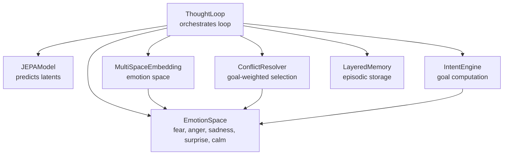
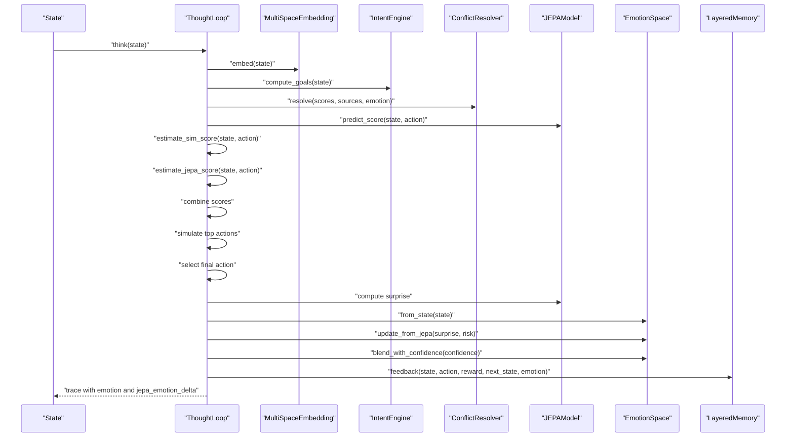
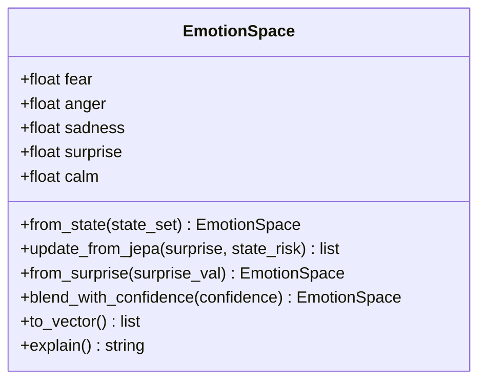
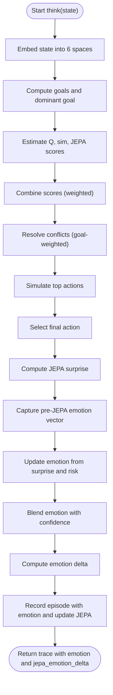
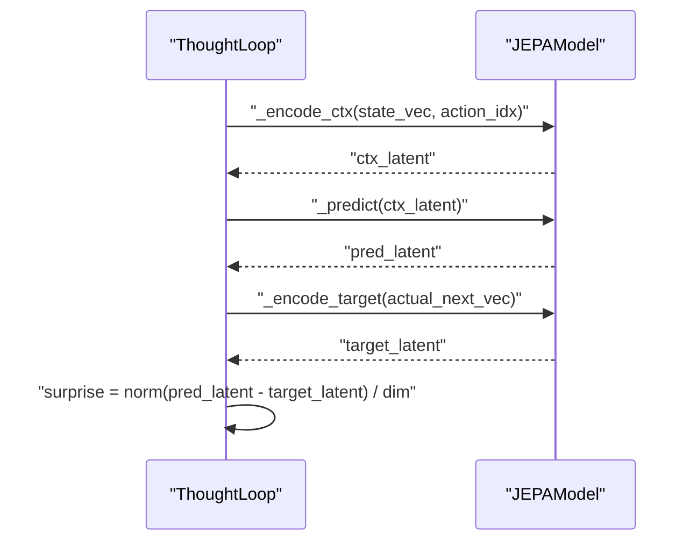
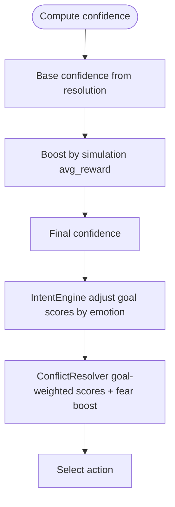
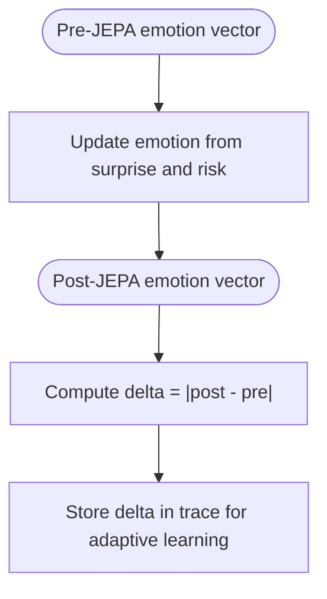
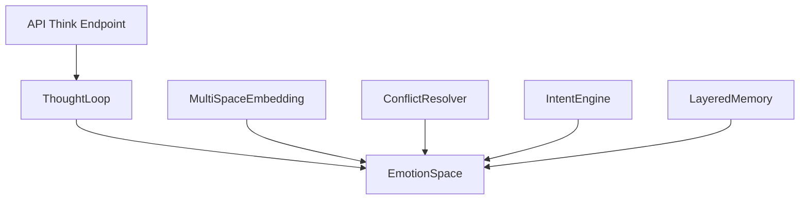

# Emotion Processing

<cite>
**Referenced Files in This Document**
- [emotion_space.py](file://cognition/emotion_space.py)
- [thought_loop.py](file://cognition/thought_loop.py)
- [jepa.py](file://learning/jepa.py)
- [multispace_embedding.py](file://cognition/multispace_embedding.py)
- [conflict_resolver.py](file://cognition/conflict_resolver.py)
- [intent.py](file://cognition/intent.py)
- [layered_memory.py](file://cognition/layered_memory.py)
- [think.py](file://api/endpoints/think.py)
- [test_emotion_space.py](file://tests/test_emotion_space.py)
</cite>

## Table of Contents
1. [Introduction](#introduction)
2. [Project Structure](#project-structure)
3. [Core Components](#core-components)
4. [Architecture Overview](#architecture-overview)
5. [Detailed Component Analysis](#detailed-component-analysis)
6. [Dependency Analysis](#dependency-analysis)
7. [Performance Considerations](#performance-considerations)
8. [Troubleshooting Guide](#troubleshooting-guide)
9. [Conclusion](#conclusion)

## Introduction
This document explains the emotion processing system that integrates affective computing into decision-making. It focuses on how EmotionSpace models five-dimensional emotional states and influences reasoning, how emotion is computed from state information, how JEPA surprise feeds into emotional updates, and how confidence blending affects decision reliability. It also documents the emotion delta mechanism used for adaptive learning and demonstrates practical examples of emotion calculation across scenarios.

## Project Structure
The emotion system spans several modules:
- EmotionSpace: maintains and updates a five-dimensional emotion vector (fear, anger, sadness, surprise, calm)
- ThoughtLoop: orchestrates the deliberative loop, computes JEPA surprise, updates emotion, and blends confidence
- JEPAModel: predicts next-state latents and computes surprise
- MultiSpaceEmbedding: constructs multi-space embeddings including emotion
- ConflictResolver and IntentEngine: integrate emotion into goal-weighted action selection
- LayeredMemory: stores episodic experiences with emotion vectors for trend analysis
- API endpoints: expose emotion/JEPA debugging and decision workflows

**Diagram sources**
- [emotion_space.py:1-71](file://cognition/emotion_space.py#L1-L71)
- [thought_loop.py:50-279](file://cognition/thought_loop.py#L50-L279)
- [jepa.py:49-185](file://learning/jepa.py#L49-L185)
- [multispace_embedding.py:25-112](file://cognition/multispace_embedding.py#L25-L112)
- [conflict_resolver.py:24-83](file://cognition/conflict_resolver.py#L24-L83)
- [intent.py:20-84](file://cognition/intent.py#L20-L84)
- [layered_memory.py:18-192](file://cognition/layered_memory.py#L18-L192)

**Section sources**
- [emotion_space.py:1-71](file://cognition/emotion_space.py#L1-L71)
- [thought_loop.py:50-279](file://cognition/thought_loop.py#L50-L279)
- [jepa.py:1-185](file://learning/jepa.py#L1-L185)
- [multispace_embedding.py:1-112](file://cognition/multispace_embedding.py#L1-L112)
- [conflict_resolver.py:1-83](file://cognition/conflict_resolver.py#L1-L83)
- [intent.py:1-84](file://cognition/intent.py#L1-L84)
- [layered_memory.py:1-192](file://cognition/layered_memory.py#L1-L192)

## Core Components
- EmotionSpace: Provides state-to-emotion mapping, JEPA-driven updates, confidence blending, and vectorization/explanation
- ThoughtLoop: Computes JEPA surprise, updates emotion, blends confidence, and tracks emotion deltas for adaptive learning
- JEPAModel: Encodes contexts and targets, predicts next-state latents, and computes surprise as reconstruction error
- MultiSpaceEmbedding: Builds six-space embeddings including emotion derived from state
- ConflictResolver and IntentEngine: Weight action scores by goals and emotion to influence action selection
- LayeredMemory: Stores episodes with emotion vectors for trend analysis and failure recall

**Section sources**
- [emotion_space.py:4-71](file://cognition/emotion_space.py#L4-L71)
- [thought_loop.py:64-156](file://cognition/thought_loop.py#L64-L156)
- [jepa.py:49-148](file://learning/jepa.py#L49-L148)
- [multispace_embedding.py:36-105](file://cognition/multispace_embedding.py#L36-L105)
- [conflict_resolver.py:28-82](file://cognition/conflict_resolver.py#L28-L82)
- [intent.py:30-78](file://cognition/intent.py#L30-L78)
- [layered_memory.py:34-191](file://cognition/layered_memory.py#L34-L191)

## Architecture Overview
The emotion processing pipeline integrates JEPA prediction error with state-derived emotion and confidence to influence decision-making. The ThoughtLoop computes JEPA surprise, updates emotion, blends with confidence, and records emotion deltas for adaptive learning.

**Diagram sources**
- [thought_loop.py:64-156](file://cognition/thought_loop.py#L64-L156)
- [multispace_embedding.py:36-105](file://cognition/multispace_embedding.py#L36-L105)
- [intent.py:30-78](file://cognition/intent.py#L30-L78)
- [conflict_resolver.py:28-49](file://cognition/conflict_resolver.py#L28-L49)
- [jepa.py:137-148](file://learning/jepa.py#L137-L148)
- [emotion_space.py:12-50](file://cognition/emotion_space.py#L12-L50)
- [layered_memory.py:34-46](file://cognition/layered_memory.py#L34-L46)

## Detailed Component Analysis

### EmotionSpace: Five-Dimensional Emotion Vector
EmotionSpace defines a five-dimensional vector representing:
- Fear: threat response
- Anger: frustration or resistance
- Sadness: dejection or loss
- Surprise: novelty/prediction error
- Calm: residual equilibrium (complementary to fear/anger/sadness)

Key behaviors:
- from_state: maps discrete state tokens to emotion magnitudes
- update_from_jepa: updates surprise and recalibrates calm; modulates fear based on surprise and risk
- from_surprise: convenience wrapper around update_from_jepa
- blend_with_confidence: scales calm proportionally to confidence
- to_vector: returns [fear, anger, sadness, surprise, calm]
- explain: generates human-readable emotion labels and vector string

**Diagram sources**
- [emotion_space.py:4-71](file://cognition/emotion_space.py#L4-L71)

**Section sources**
- [emotion_space.py:4-71](file://cognition/emotion_space.py#L4-L71)
- [test_emotion_space.py:6-45](file://tests/test_emotion_space.py#L6-L45)

### ThoughtLoop: Emotion Integration in the Deliberative Loop
ThoughtLoop coordinates perception, memory, intent, conflict resolution, simulation, and feedback. It computes JEPA surprise, updates emotion, blends confidence, and records emotion deltas for adaptive learning.

Highlights:
- Risk level computation from spaces["risk"]
- Pre-JEPA emotion vector capture for delta calculation
- Emotion update via update_from_jepa(surprise, risk_level)
- Confidence blending via blend_with_confidence(confidence)
- Emotion delta calculation: element-wise absolute difference between post- and pre-JEPA emotion vectors
- Feedback writes emotion to memory and updates JEPA model

**Diagram sources**
- [thought_loop.py:64-156](file://cognition/thought_loop.py#L64-L156)

**Section sources**
- [thought_loop.py:64-156](file://cognition/thought_loop.py#L64-L156)
- [jepa.py:194-201](file://learning/jepa.py#L194-L201)

### JEPA Surprise Processing
JEPA computes a latent prediction for the next state given (state, action) and compares it to the encoded target latent. The surprise is the normalized Euclidean distance between prediction and target.

Key steps:
- Encode context: concatenate state vector with one-hot action
- Predict latent: linear transform plus activation
- Encode target: linear transform of next_state (EMA shadow)
- Compute surprise: norm(prediction - target) / dimensionality

**Diagram sources**
- [jepa.py:79-89](file://learning/jepa.py#L79-L89)
- [jepa.py:194-201](file://learning/jepa.py#L194-L201)

**Section sources**
- [jepa.py:79-148](file://learning/jepa.py#L79-L148)
- [thought_loop.py:194-201](file://cognition/thought_loop.py#L194-L201)

### Emotion-Based Confidence Adjustment and Influence on Action Selection
Confidence is computed from resolution tension and simulation projections, then optionally boosted by simulation outcomes. Emotion influences:
- IntentEngine: adjusts goal scores based on fear/anger/sadness
- ConflictResolver: adds goal-dependent boosts and fear-sensitive adjustments

**Diagram sources**
- [thought_loop.py:114-117](file://cognition/thought_loop.py#L114-L117)
- [intent.py:49-56](file://cognition/intent.py#L49-L56)
- [conflict_resolver.py:77-81](file://cognition/conflict_resolver.py#L77-L81)

**Section sources**
- [thought_loop.py:114-117](file://cognition/thought_loop.py#L114-L117)
- [intent.py:49-56](file://cognition/intent.py#L49-L56)
- [conflict_resolver.py:77-81](file://cognition/conflict_resolver.py#L77-L81)

### Emotion Delta Calculation and Adaptive Learning
After updating emotion from JEPA surprise, ThoughtLoop computes the element-wise absolute difference between the pre- and post-JEPA emotion vectors. These deltas quantify how much each dimension changed due to the surprise and risk interaction, enabling adaptive learning feedback.

**Diagram sources**
- [thought_loop.py:119-124](file://cognition/thought_loop.py#L119-L124)

**Section sources**
- [thought_loop.py:119-124](file://cognition/thought_loop.py#L119-L124)

### Practical Examples

#### Example 1: Emotion Calculation from State Tokens
- Scenario: state contains "flood"
- EmotionSpace.from_state maps to moderate fear and low sadness; surprise starts at zero, calm is elevated
- Expected: fear ≈ 0.4, sadness ≈ 0.2, surprise ≈ 0.0, calm ≈ 0.6

**Section sources**
- [emotion_space.py:12-33](file://cognition/emotion_space.py#L12-L33)

#### Example 2: Impact of JEPA Surprise on Emotional States
- Scenario: state "rain" with low initial fear; JEPA surprise = 0.6
- EmotionSpace.update_from_jepa increases surprise and decreases calm; fear may increase slightly depending on risk
- Expected: surprise > previous, calm < previous; fear may rise if risk > threshold

**Section sources**
- [emotion_space.py:35-42](file://cognition/emotion_space.py#L35-L42)
- [test_emotion_space.py:17-23](file://tests/test_emotion_space.py#L17-L23)

#### Example 3: Confidence Blending and Action Selection
- Scenario: high confidence from strong simulation projections
- EmotionSpace.blend_with_confidence reduces calm proportionally to confidence
- ConflictResolver applies goal-weighted boosts and fear-sensitive adjustments to action scores

**Section sources**
- [emotion_space.py:48-50](file://cognition/emotion_space.py#L48-L50)
- [conflict_resolver.py:77-81](file://cognition/conflict_resolver.py#L77-L81)

#### Example 4: Emotion Delta in Adaptive Learning
- Scenario: after JEPA surprise update, emotion vector changes across dimensions
- ThoughtLoop computes jepa_emotion_delta to capture change magnitude
- LayeredMemory stores episodes with emotion vectors for trend analysis

**Section sources**
- [thought_loop.py:123-125](file://cognition/thought_loop.py#L123-L125)
- [layered_memory.py:34-46](file://cognition/layered_memory.py#L34-L46)

## Dependency Analysis
EmotionSpace is central and used across modules:
- ThoughtLoop depends on EmotionSpace for emotion updates and deltas
- MultiSpaceEmbedding constructs emotion as part of the six-space embedding
- ConflictResolver and IntentEngine incorporate emotion into goal weighting and scoring
- LayeredMemory stores emotion vectors with episodes for trend analysis
- API endpoints expose emotion/JEPA debugging and decision workflows

**Diagram sources**
- [emotion_space.py:12-50](file://cognition/emotion_space.py#L12-L50)
- [thought_loop.py:61-125](file://cognition/thought_loop.py#L61-L125)
- [multispace_embedding.py:95-95](file://cognition/multispace_embedding.py#L95-L95)
- [conflict_resolver.py:28-49](file://cognition/conflict_resolver.py#L28-L49)
- [intent.py:30-78](file://cognition/intent.py#L30-L78)
- [layered_memory.py:34-46](file://cognition/layered_memory.py#L34-L46)
- [think.py:9-16](file://api/endpoints/think.py#L9-L16)

**Section sources**
- [emotion_space.py:12-50](file://cognition/emotion_space.py#L12-L50)
- [thought_loop.py:61-125](file://cognition/thought_loop.py#L61-L125)
- [multispace_embedding.py:95-95](file://cognition/multispace_embedding.py#L95-L95)
- [conflict_resolver.py:28-49](file://cognition/conflict_resolver.py#L28-L49)
- [intent.py:30-78](file://cognition/intent.py#L30-L78)
- [layered_memory.py:34-46](file://cognition/layered_memory.py#L34-L46)
- [think.py:9-16](file://api/endpoints/think.py#L9-L16)

## Performance Considerations
- EmotionSpace computations are lightweight vector operations suitable for real-time loops
- JEPA surprise computation involves small linear algebra operations; batching or caching could improve throughput if needed
- Confidence blending and emotion deltas add minimal overhead to the loop
- MultiSpaceEmbedding constructs emotion vectors alongside other spaces; ensure efficient state coercion and normalization

## Troubleshooting Guide
Common issues and checks:
- Emotion vector bounds: ensure calm remains non-negative after updates; EmotionSpace enforces min/max constraints
- Confidence blending: verify that calm is scaled appropriately by confidence
- JEPA surprise computation: handle exceptions and fallback to zero surprise when model is untrained
- Emotion deltas: confirm delta calculation uses absolute differences across all five dimensions
- API debugging: use the emotion/JEPA debug endpoint to validate emotion transitions under varying surprises and risks

**Section sources**
- [emotion_space.py:35-50](file://cognition/emotion_space.py#L35-L50)
- [thought_loop.py:194-201](file://cognition/thought_loop.py#L194-L201)
- [think.py:99-120](file://api/endpoints/think.py#L99-L120)

## Conclusion
The emotion processing system integrates affective computing into the deliberative loop by modeling a five-dimensional emotion vector, computing JEPA surprise, updating emotion accordingly, blending with confidence, and tracking emotion deltas for adaptive learning. Emotion influences both goal computation and action selection, enhancing decision-making reliability by incorporating affective signals alongside cognitive and behavioral scores.