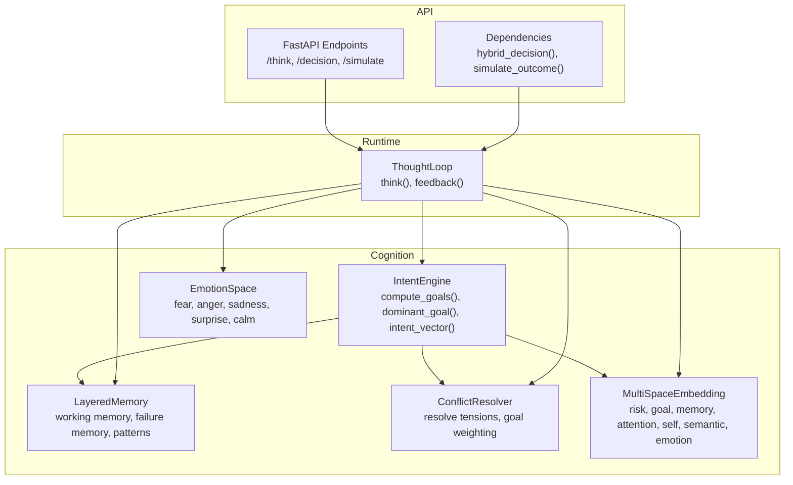
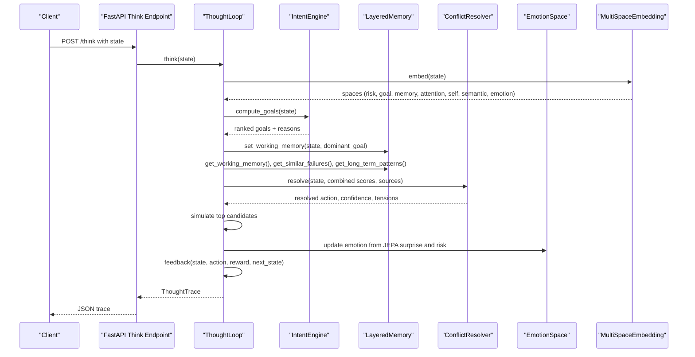
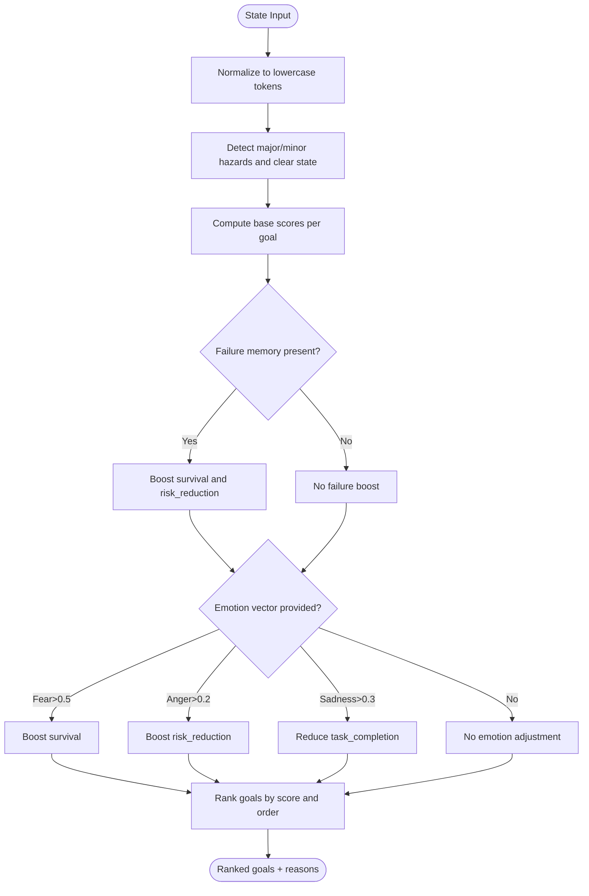
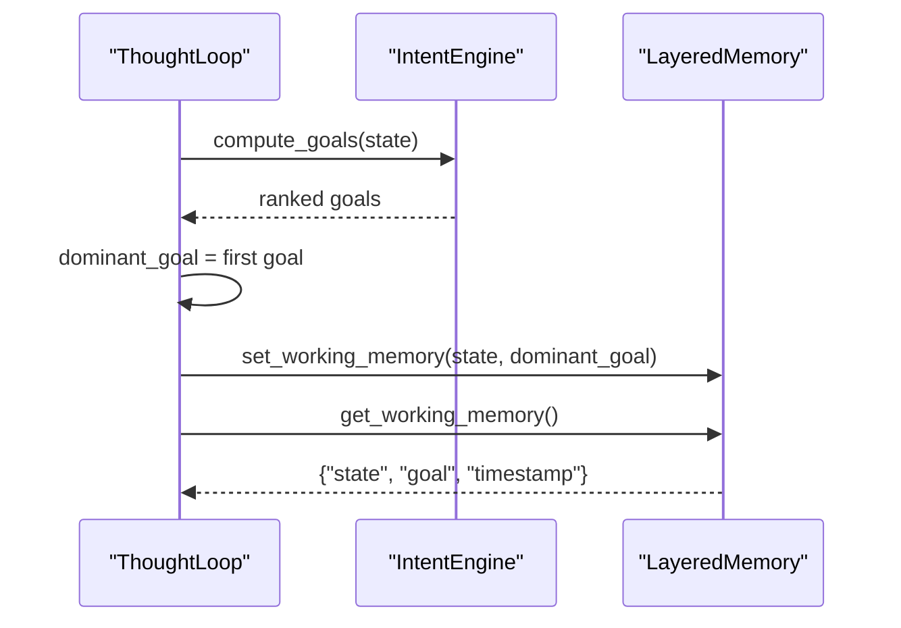
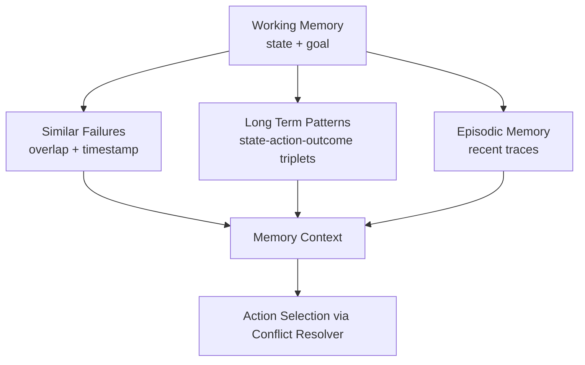
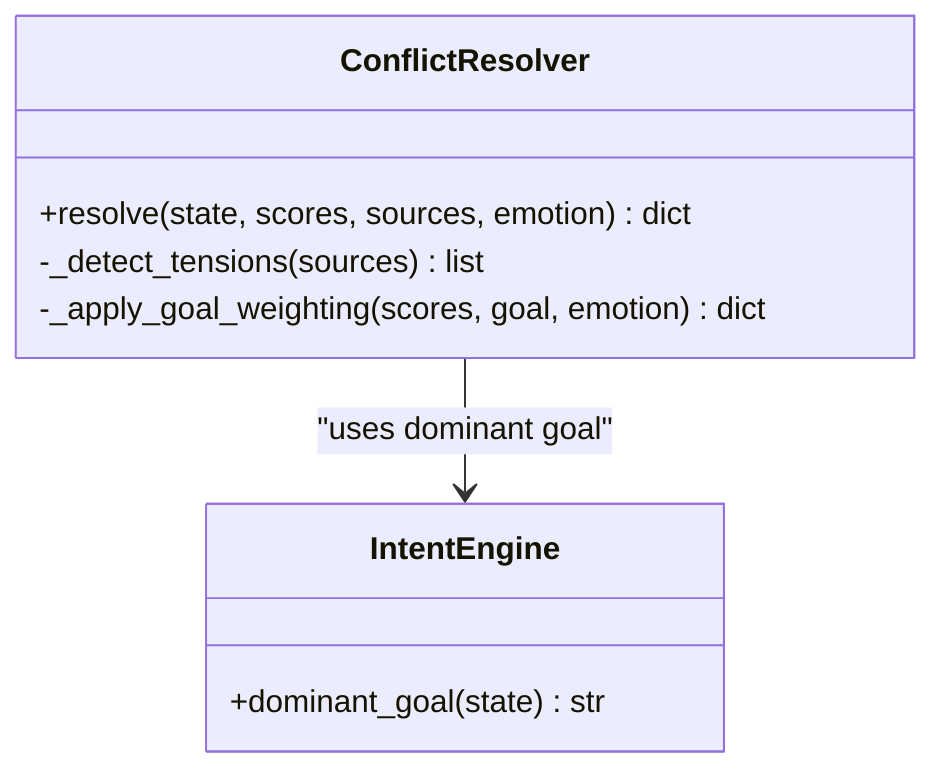
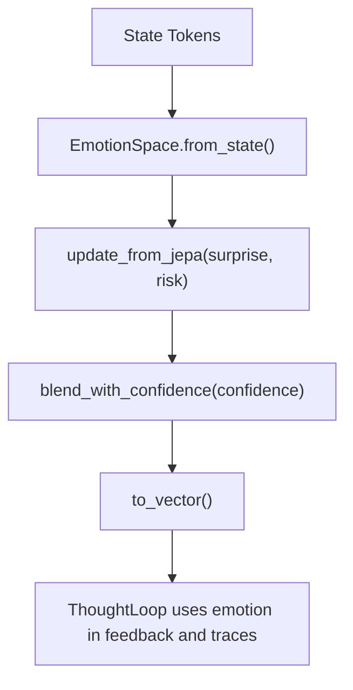
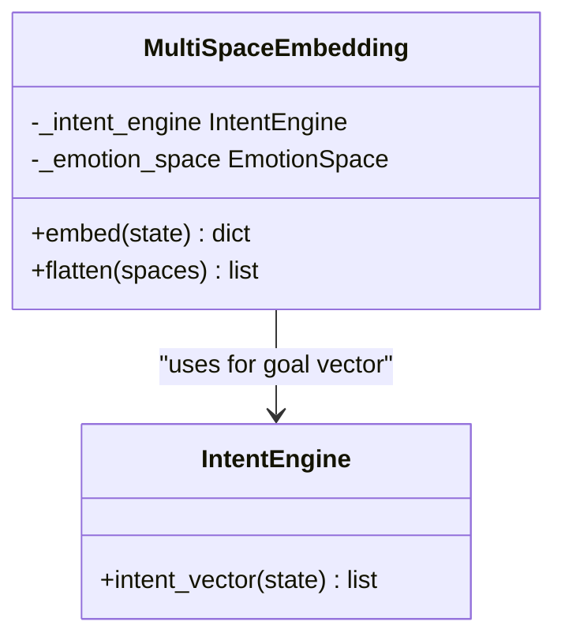
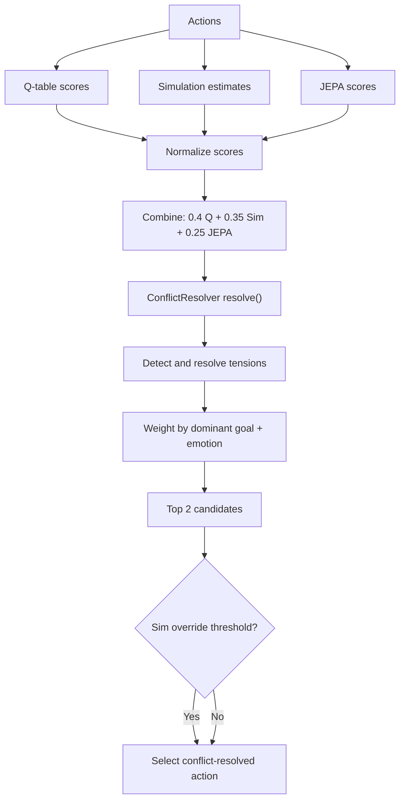
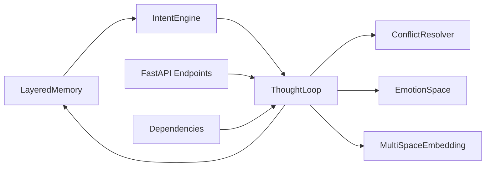

# Intent Management

<cite>
**Referenced Files in This Document**
- [intent.py](file://cognition/intent.py)
- [thought_loop.py](file://cognition/thought_loop.py)
- [layered_memory.py](file://cognition/layered_memory.py)
- [conflict_resolver.py](file://cognition/conflict_resolver.py)
- [emotion_space.py](file://cognition/emotion_space.py)
- [multispace_embedding.py](file://cognition/multispace_embedding.py)
- [think.py](file://api/endpoints/think.py)
- [dependencies.py](file://api/dependencies.py)
- [config.py](file://config.py)
- [test_thought_loop.py](file://tests/test_thought_loop.py)
</cite>

## Table of Contents
1. [Introduction](#introduction)
2. [Project Structure](#project-structure)
3. [Core Components](#core-components)
4. [Architecture Overview](#architecture-overview)
5. [Detailed Component Analysis](#detailed-component-analysis)
6. [Dependency Analysis](#dependency-analysis)
7. [Performance Considerations](#performance-considerations)
8. [Troubleshooting Guide](#troubleshooting-guide)
9. [Conclusion](#conclusion)
10. [Appendices](#appendices)

## Introduction
This document explains the intent management system that powers goal-directed reasoning and action planning. It covers how the IntentEngine computes active goals from input states, maintains goal hierarchies, extracts the dominant goal, and influences working memory assignment. It documents the intent computation pipeline that processes state information to identify primary objectives and secondary goals, and demonstrates how intents influence action candidate evaluation and memory retrieval. Practical examples show intent calculation across disaster scenarios, goal ranking mechanisms, and how intents shape the search space for viable actions.

## Project Structure
The intent management system spans several cognitive modules and integrates with memory, conflict resolution, emotion modeling, and multi-space embedding. The ThoughtLoop orchestrates perception, memory retrieval, intent computation, conflict resolution, simulation, decision, and feedback. API endpoints expose the reasoning pipeline to clients.

**Diagram sources**
- [intent.py:20-84](file://cognition/intent.py#L20-L84)
- [thought_loop.py:50-170](file://cognition/thought_loop.py#L50-L170)
- [layered_memory.py:18-192](file://cognition/layered_memory.py#L18-L192)
- [conflict_resolver.py:24-83](file://cognition/conflict_resolver.py#L24-L83)
- [emotion_space.py:4-71](file://cognition/emotion_space.py#L4-L71)
- [multispace_embedding.py:25-112](file://cognition/multispace_embedding.py#L25-L112)
- [think.py:8-121](file://api/endpoints/think.py#L8-L121)
- [dependencies.py:631-675](file://api/dependencies.py#L631-L675)

**Section sources**
- [intent.py:1-84](file://cognition/intent.py#L1-L84)
- [thought_loop.py:1-279](file://cognition/thought_loop.py#L1-L279)
- [layered_memory.py:1-192](file://cognition/layered_memory.py#L1-L192)
- [conflict_resolver.py:1-83](file://cognition/conflict_resolver.py#L1-L83)
- [emotion_space.py:1-71](file://cognition/emotion_space.py#L1-L71)
- [multispace_embedding.py:1-112](file://cognition/multispace_embedding.py#L1-L112)
- [think.py:1-121](file://api/endpoints/think.py#L1-L121)
- [dependencies.py:631-675](file://api/dependencies.py#L631-L675)

## Core Components
- IntentEngine: Computes active goals from state sets, ranks them, and provides an intent vector for downstream systems.
- ThoughtLoop: Orchestrates the deliberative thought loop, integrating perception, memory, intent, conflict resolution, simulation, and feedback.
- LayeredMemory: Provides working memory, failure memory, long-term patterns, and episodic memory to inform intent and retrieval.
- ConflictResolver: Resolves tensions among action candidates guided by the dominant goal and optional emotion weighting.
- EmotionSpace: Encodes emotional states from state tokens and updates them based on JEPA surprise and risk.
- MultiSpaceEmbedding: Projects states into six cognitive spaces (risk, goal, memory, attention, self, semantic, emotion) and feeds intent vectors and emotion into the ThoughtLoop.

**Section sources**
- [intent.py:20-84](file://cognition/intent.py#L20-L84)
- [thought_loop.py:50-170](file://cognition/thought_loop.py#L50-L170)
- [layered_memory.py:18-192](file://cognition/layered_memory.py#L18-L192)
- [conflict_resolver.py:24-83](file://cognition/conflict_resolver.py#L24-L83)
- [emotion_space.py:4-71](file://cognition/emotion_space.py#L4-L71)
- [multispace_embedding.py:25-112](file://cognition/multispace_embedding.py#L25-L112)

## Architecture Overview
The intent management system follows a closed-loop pipeline:
- Perception: Normalize and embed state into six spaces.
- Memory: Retrieve working memory, similar failures, and long-term patterns.
- Intent: Compute ranked goals and dominant goal; set working memory accordingly.
- Conflict Resolution: Resolve tensions among action candidates weighted by the dominant goal and emotion.
- Simulation: Evaluate top candidates via simulated outcomes.
- Decision: Select best action, possibly overriding with simulation gains.
- Feedback: Record outcome, update JEPA, and adjust working memory for next iteration.

**Diagram sources**
- [thought_loop.py:64-156](file://cognition/thought_loop.py#L64-L156)
- [intent.py:30-74](file://cognition/intent.py#L30-L74)
- [layered_memory.py:112-124](file://cognition/layered_memory.py#L112-L124)
- [conflict_resolver.py:28-49](file://cognition/conflict_resolver.py#L28-L49)
- [emotion_space.py:35-50](file://cognition/emotion_space.py#L35-L50)
- [multispace_embedding.py:36-105](file://cognition/multispace_embedding.py#L36-L105)
- [think.py:8-16](file://api/endpoints/think.py#L8-L16)

## Detailed Component Analysis

### IntentEngine: Goal Computation and Ranking
IntentEngine transforms a normalized state into a ranked list of goals and an intent vector. The five goals are prioritized as survival, stability, risk_reduction, consistency, task_completion. Scoring logic:
- Base scores depend on presence of crisis/collapse, flood/damage, rain, and whether the state is clear.
- Failure memory boost increases survival and risk_reduction when prior failures match the current state.
- Optional emotion-based adjustments increase survival under high fear and risk_reduction under moderate anger; sadness slightly reduces task_completion.
- Ranking sorts by descending score and then by predefined order to break ties consistently.

**Diagram sources**
- [intent.py:30-74](file://cognition/intent.py#L30-L74)

**Section sources**
- [intent.py:20-84](file://cognition/intent.py#L20-L84)

### Dominant Goal Extraction and Working Memory Assignment
The dominant goal is simply the top-ranked goal from compute_goals. ThoughtLoop uses this to set working memory, which encapsulates the current state and the active goal. This working memory context is later used to retrieve relevant past experiences and patterns.

**Diagram sources**
- [thought_loop.py:67-69](file://cognition/thought_loop.py#L67-L69)
- [intent.py:76-78](file://cognition/intent.py#L76-L78)
- [layered_memory.py:119-124](file://cognition/layered_memory.py#L119-L124)

**Section sources**
- [thought_loop.py:64-75](file://cognition/thought_loop.py#L64-L75)
- [intent.py:76-78](file://cognition/intent.py#L76-L78)
- [layered_memory.py:112-124](file://cognition/layered_memory.py#L112-L124)

### Intent-Based Memory Retrieval
Working memory anchors retrieval of:
- Similar failures: retrieves past episodes with overlapping state tokens and timestamps them to prioritize recency.
- Long-term patterns: stable state-action-outcome triplets recorded by frequency.
- Episodic memory: recent event traces with optional emotion vectors.

These contexts guide action selection by surfacing relevant prior experiences and patterns.

**Diagram sources**
- [thought_loop.py:71-75](file://cognition/thought_loop.py#L71-L75)
- [layered_memory.py:98-110](file://cognition/layered_memory.py#L98-L110)
- [layered_memory.py:126-127](file://cognition/layered_memory.py#L126-L127)
- [layered_memory.py:155-163](file://cognition/layered_memory.py#L155-L163)

**Section sources**
- [thought_loop.py:71-75](file://cognition/thought_loop.py#L71-L75)
- [layered_memory.py:98-127](file://cognition/layered_memory.py#L98-L127)
- [layered_memory.py:155-163](file://cognition/layered_memory.py#L155-L163)

### Conflict Resolution and Goal Weighting
ConflictResolver identifies tensions across multiple scoring sources (Q-table, simulation, JEPA) and resolves them by weighting action scores according to the dominant goal. Emotion can further bias action preferences (e.g., increased evacuation preference under high fear).

**Diagram sources**
- [conflict_resolver.py:24-83](file://cognition/conflict_resolver.py#L24-L83)
- [intent.py:76-78](file://cognition/intent.py#L76-L78)

**Section sources**
- [conflict_resolver.py:28-83](file://cognition/conflict_resolver.py#L28-L83)
- [intent.py:76-78](file://cognition/intent.py#L76-L78)

### Emotion-Aware Decision Making
EmotionSpace encodes fear, anger, sadness, surprise, and calm from state tokens and updates them based on JEPA surprise and risk. ThoughtLoop blends emotion with confidence to influence action selection and tracks emotion deltas post-simulation.

**Diagram sources**
- [emotion_space.py:12-50](file://cognition/emotion_space.py#L12-L50)
- [thought_loop.py:118-125](file://cognition/thought_loop.py#L118-L125)

**Section sources**
- [emotion_space.py:12-50](file://cognition/emotion_space.py#L12-L50)
- [thought_loop.py:118-125](file://cognition/thought_loop.py#L118-L125)

### Multi-Space Embedding and Intent Vector
MultiSpaceEmbedding projects states into six cognitive spaces and supplies the intent vector to downstream modules. The intent vector is derived from the ranked goal scores and is used by the ThoughtLoop to set working memory and by the ConflictResolver to weight actions.

**Diagram sources**
- [multispace_embedding.py:25-112](file://cognition/multispace_embedding.py#L25-L112)
- [intent.py:80-83](file://cognition/intent.py#L80-L83)

**Section sources**
- [multispace_embedding.py:36-105](file://cognition/multispace_embedding.py#L36-L105)
- [intent.py:80-83](file://cognition/intent.py#L80-L83)

### Practical Examples: Disaster Scenarios and Goal Ranking
Below are representative scenarios illustrating intent computation and resulting action preferences. These examples demonstrate how state tokens influence goal scores and, consequently, action selection.

- Scenario A: Clear weather with no immediate threats
  - State tokens: {"rain"} only
  - Goals: survival ~0.0, stability ~0.5 (rain suggests mild instability), risk_reduction ~0.3 (rain could escalate), consistency ~0.8 (maintain calm), task_completion ~0.5
  - Dominant goal: consistency
  - Expected action: none (low urgency, consistent behavior)

- Scenario B: Flood and damage present
  - State tokens: {"flood", "damage"}
  - Goals: survival ~1.0 (active hazard), stability ~1.0 (ongoing damage), risk_reduction ~0.8 (prevent escalation), consistency ~0.3 (threats present), task_completion ~0.5
  - Dominant goal: survival or stability (both high)
  - Expected action: barrier or release (mitigation), possibly evacuate depending on simulation override

- Scenario C: Crisis and collapse present
  - State tokens: {"crisis", "collapse"}
  - Goals: survival ~1.0 (major threat), stability ~0.0 (major threat), risk_reduction ~0.8 (escalation risk), consistency ~0.3 (threats present), task_completion ~0.5
  - Dominant goal: survival
  - Expected action: evacuate (high-precedence mitigation)

- Scenario D: Past failure memory overlaps with current state
  - State tokens: {"flood", "damage"}
  - Failure memory boost increases survival and risk_reduction scores
  - Dominant goal remains survival or stability
  - Expected action: stronger preference for barrier/release or evacuate depending on simulation gains

- Scenario E: High fear emotion
  - Emotion vector: fear > 0.5
  - Survival score boosted; evacuation preference increased
  - Dominant goal: survival
  - Expected action: evacuate

These examples illustrate how the IntentEngine’s scoring logic and the ConflictResolver’s goal-weighting combine to shape the search space and influence action selection.

**Section sources**
- [intent.py:30-74](file://cognition/intent.py#L30-L74)
- [conflict_resolver.py:68-82](file://cognition/conflict_resolver.py#L68-L82)
- [emotion_space.py:12-33](file://cognition/emotion_space.py#L12-L33)

### Intent-Based Action Candidate Evaluation
The ThoughtLoop evaluates actions using three sources:
- Q-table scores (experience-based)
- Simulation estimates (projected rewards)
- JEPA scores (latent prediction mismatch)

These are normalized and combined into a composite score. The ConflictResolver then resolves tensions across sources and weights by the dominant goal. If a candidate significantly outperforms the conflict-resolved action, it can override the decision.

**Diagram sources**
- [thought_loop.py:77-99](file://cognition/thought_loop.py#L77-L99)
- [conflict_resolver.py:28-49](file://cognition/conflict_resolver.py#L28-L49)

**Section sources**
- [thought_loop.py:77-106](file://cognition/thought_loop.py#L77-L106)
- [conflict_resolver.py:28-49](file://cognition/conflict_resolver.py#L28-L49)

### API Integration and Simulation
The FastAPI endpoints integrate the ThoughtLoop and provide:
- /think: Runs a full reasoning cycle and returns a ThoughtTrace.
- /decision: Returns hybrid decision scores and best action.
- /simulate: Produces a trajectory by repeatedly applying decisions and simulating outcomes.

Outcome simulation is implemented in dependencies and used by ThoughtLoop to estimate projected rewards and decide overrides.

**Section sources**
- [think.py:8-54](file://api/endpoints/think.py#L8-L54)
- [dependencies.py:631-675](file://api/dependencies.py#L631-L675)
- [thought_loop.py:171-185](file://cognition/thought_loop.py#L171-L185)

## Dependency Analysis
The IntentEngine depends on LayeredMemory for failure memory scoring. ThoughtLoop composes IntentEngine, ConflictResolver, EmotionSpace, MultiSpaceEmbedding, and LayeredMemory. API endpoints depend on ThoughtLoop and simulation utilities.

**Diagram sources**
- [intent.py:17-24](file://cognition/intent.py#L17-L24)
- [thought_loop.py:51-61](file://cognition/thought_loop.py#L51-L61)
- [conflict_resolver.py:21-26](file://cognition/conflict_resolver.py#L21-L26)
- [emotion_space.py:4-11](file://cognition/emotion_space.py#L4-L11)
- [multispace_embedding.py:25-30](file://cognition/multispace_embedding.py#L25-L30)
- [think.py:8-16](file://api/endpoints/think.py#L8-L16)
- [dependencies.py:631-675](file://api/dependencies.py#L631-L675)

**Section sources**
- [intent.py:17-24](file://cognition/intent.py#L17-L24)
- [thought_loop.py:51-61](file://cognition/thought_loop.py#L51-L61)
- [conflict_resolver.py:21-26](file://cognition/conflict_resolver.py#L21-L26)
- [emotion_space.py:4-11](file://cognition/emotion_space.py#L4-L11)
- [multispace_embedding.py:25-30](file://cognition/multispace_embedding.py#L25-L30)
- [think.py:8-16](file://api/endpoints/think.py#L8-L16)
- [dependencies.py:631-675](file://api/dependencies.py#L631-L675)

## Performance Considerations
- State normalization and scoring are O(n) in the number of tokens.
- Ranking is O(g log g) for g goals; here g=5, so effectively constant-time.
- Memory retrieval operations (failure overlap, pattern counts) scale with memory sizes; ensure bounded limits for similar_failures and long_term patterns.
- Simulation sampling introduces stochasticity; use sufficient samples to stabilize estimates while controlling latency.
- Confidence blending and emotion updates are lightweight vector operations.

[No sources needed since this section provides general guidance]

## Troubleshooting Guide
Common issues and remedies:
- Empty or malformed state input: coerce_state handles strings, tuples, and sets; ensure tokens are non-empty and normalized.
- Dominant goal not changing: verify emotion thresholds and failure memory presence; confirm that failure_boost and emotion adjustments are applied.
- Conflicts not resolved: check tension detection thresholds and goal weighting; ensure dominant goal is computed from the same state used for resolution.
- JEPA surprise anomalies: inspect prediction encoding and target encoding; handle exceptions gracefully in feedback().
- API endpoint errors: review FastAPI exception handling and logging; ensure dependencies are initialized before use.

**Section sources**
- [thought_loop.py:251-265](file://cognition/thought_loop.py#L251-L265)
- [conflict_resolver.py:51-66](file://cognition/conflict_resolver.py#L51-L66)
- [thought_loop.py:158-167](file://cognition/thought_loop.py#L158-L167)
- [think.py:10-16](file://api/endpoints/think.py#L10-L16)

## Conclusion
The intent management system couples goal-directed reasoning with contextual memory and emotion-aware decision-making. IntentEngine computes ranked goals from state tokens, dominance determines working memory, and ConflictResolver shapes action selection by weighting candidates according to the dominant goal and emotion. Multi-space embedding and simulation refine choices, while feedback continuously updates JEPA and memory. Together, these components enable robust, adaptive action planning across diverse scenarios, including disaster management.

[No sources needed since this section summarizes without analyzing specific files]

## Appendices

### Appendix A: Configuration and Actions
- Actions: barrier, release, evacuate, none
- Action costs: applied to Q-learning reward
- Environment dynamics: probabilities for escalation and recovery

**Section sources**
- [config.py:5-13](file://config.py#L5-L13)
- [config.py:25-34](file://config.py#L25-L34)

### Appendix B: API Endpoints Overview
- /think: Full reasoning trace
- /decision: Hybrid decision scores and best action
- /simulate: Trajectory of decisions and outcomes
- /explain: Human-readable breakdown of state, scores, and risk

**Section sources**
- [think.py:8-78](file://api/endpoints/think.py#L8-L78)

### Appendix C: Test Coverage Highlights
- ThoughtLoop returns structured traces with required keys
- Action selection respects dominant goal in crisis scenarios
- Memory accumulation and episodic storage verified
- JEPA integration and emotion tracking validated

**Section sources**
- [test_thought_loop.py:53-202](file://tests/test_thought_loop.py#L53-L202)