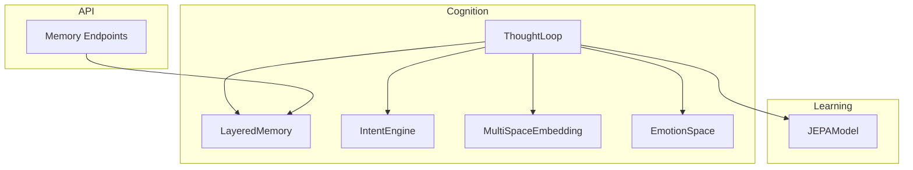
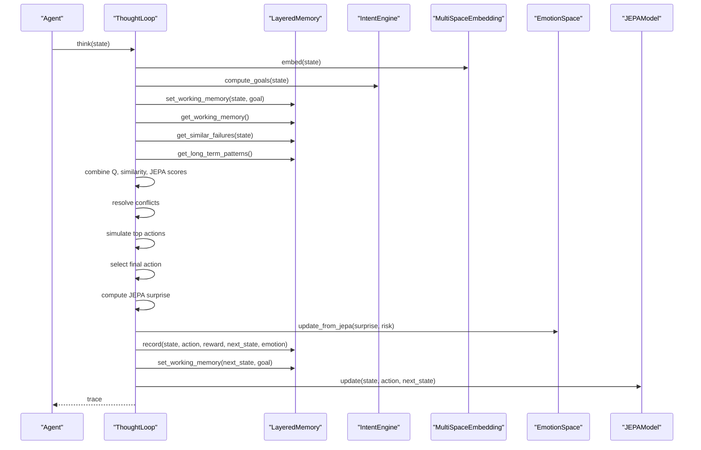
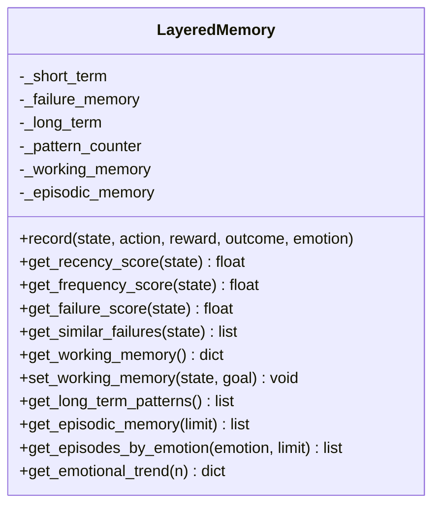
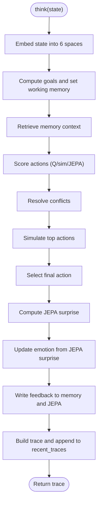
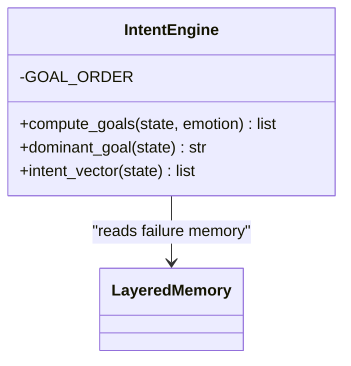
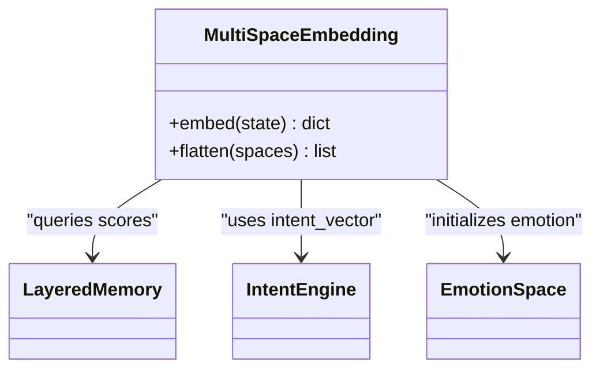
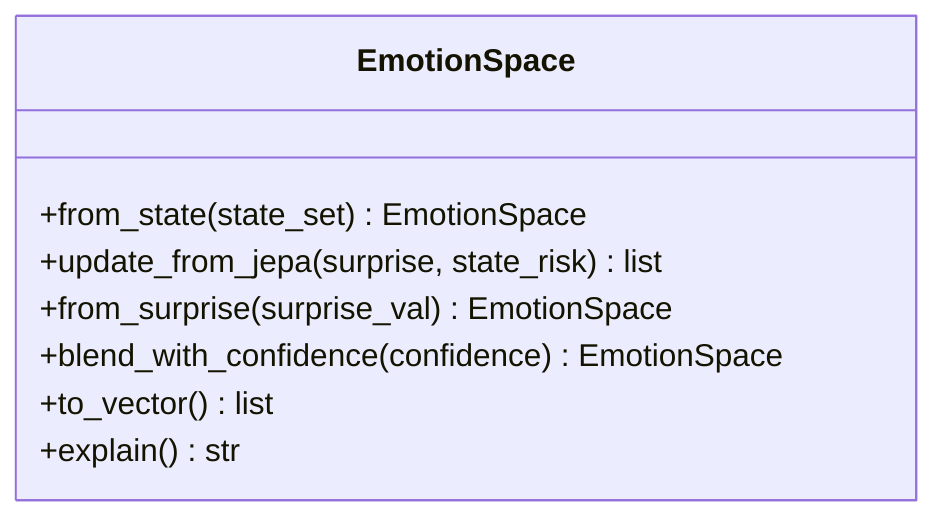
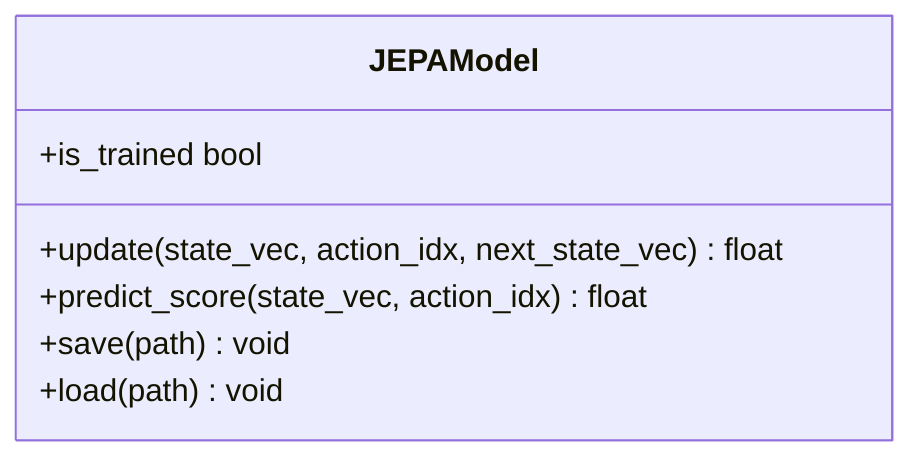
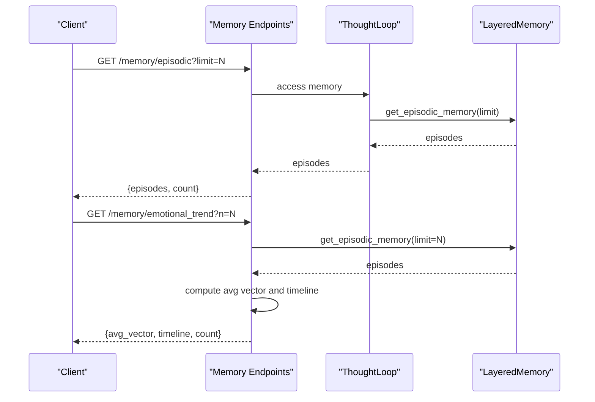
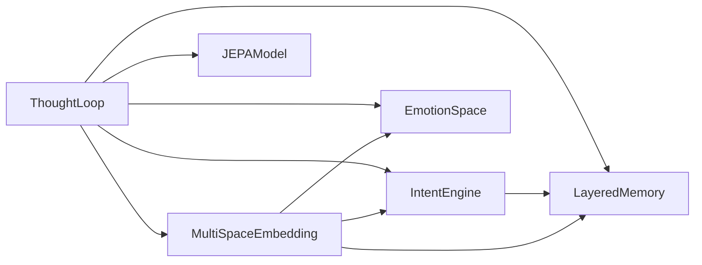

# Memory Layers

<cite>
**Referenced Files in This Document**
- [layered_memory.py](file://cognition/layered_memory.py)
- [thought_loop.py](file://cognition/thought_loop.py)
- [intent.py](file://cognition/intent.py)
- [multispace_embedding.py](file://cognition/multispace_embedding.py)
- [emotion_space.py](file://cognition/emotion_space.py)
- [jepa.py](file://learning/jepa.py)
- [memory.py](file://api/endpoints/memory.py)
- [test_thought_loop.py](file://tests/test_thought_loop.py)
</cite>

## Table of Contents
1. [Introduction](#introduction)
2. [Project Structure](#project-structure)
3. [Core Components](#core-components)
4. [Architecture Overview](#architecture-overview)
5. [Detailed Component Analysis](#detailed-component-analysis)
6. [Dependency Analysis](#dependency-analysis)
7. [Performance Considerations](#performance-considerations)
8. [Troubleshooting Guide](#troubleshooting-guide)
9. [Conclusion](#conclusion)

## Introduction
This document explains the layered memory system that orchestrates short-term context recall, failure pattern recognition, long-term behavioral patterns, and episodic memory. It documents how working memory maintains current state and goal associations, how memory recording captures state-action-reward-next_state sequences with emotional context, and how recent traces inform future reasoning. It also covers integration with the JEPA model updates and practical examples of memory retrieval for similar failure scenarios, long-term pattern analysis, and working memory updates after action execution.

## Project Structure
The memory system spans several modules:
- Cognition: layered memory, thought loop, intent engine, emotion space, and multi-space embedding
- Learning: JEPA model for latent prediction and safety scoring
- API: endpoints to expose episodic memory and emotional trends
- Tests: integration tests validating memory accumulation, JEPA updates, and emotion vectors

**Diagram sources**
- [layered_memory.py:18-28](file://cognition/layered_memory.py#L18-L28)
- [thought_loop.py:50-62](file://cognition/thought_loop.py#L50-L62)
- [intent.py:20-25](file://cognition/intent.py#L20-L25)
- [multispace_embedding.py:25-31](file://cognition/multispace_embedding.py#L25-L31)
- [emotion_space.py:4-11](file://cognition/emotion_space.py#L4-L11)
- [jepa.py:49-71](file://learning/jepa.py#L49-L71)
- [memory.py:1-40](file://api/endpoints/memory.py#L1-L40)

**Section sources**
- [layered_memory.py:1-192](file://cognition/layered_memory.py#L1-L192)
- [thought_loop.py:1-279](file://cognition/thought_loop.py#L1-L279)
- [intent.py:1-84](file://cognition/intent.py#L1-L84)
- [multispace_embedding.py:1-112](file://cognition/multispace_embedding.py#L1-L112)
- [emotion_space.py:1-71](file://cognition/emotion_space.py#L1-L71)
- [jepa.py:1-185](file://learning/jepa.py#L1-L185)
- [memory.py:1-40](file://api/endpoints/memory.py#L1-L40)

## Core Components
- LayeredMemory: maintains short-term, failure, long-term, and episodic memory; supports working memory and emotional trend analysis
- ThoughtLoop: orchestrates perception, memory retrieval, intent computation, conflict resolution, simulation, decision, and feedback; integrates JEPA updates and emotion modeling
- IntentEngine: computes ranked goals from current state and failure memory
- MultiSpaceEmbedding: projects state into six cognitive spaces (risk, goal, memory, attention, self, semantic) and emotion
- EmotionSpace: tracks and updates an emotion vector based on JEPA surprise and state risk
- JEPAModel: trains latent predictors for next-state representations and scores actions by safety proximity to a safe latent
- API endpoints: expose episodic memory and emotional trends for visualization and monitoring

**Section sources**
- [layered_memory.py:18-192](file://cognition/layered_memory.py#L18-L192)
- [thought_loop.py:50-170](file://cognition/thought_loop.py#L50-L170)
- [intent.py:20-84](file://cognition/intent.py#L20-L84)
- [multispace_embedding.py:25-105](file://cognition/multispace_embedding.py#L25-L105)
- [emotion_space.py:4-71](file://cognition/emotion_space.py#L4-L71)
- [jepa.py:49-185](file://learning/jepa.py#L49-L185)
- [memory.py:1-40](file://api/endpoints/memory.py#L1-L40)

## Architecture Overview
The system coordinates memory layers with reasoning and learning:
- Perception: state is embedded across multiple spaces
- Memory: working memory, similar failures, and long-term patterns are retrieved
- Intent: goals are computed with failure-memory boosts and emotional influences
- Conflict: tensions among action candidates are resolved
- Simulation: top actions are projected for reward and next-state
- Decision: a final action is selected with confidence
- Feedback: memory is updated with state-action-reward-next_state and JEPA is updated

**Diagram sources**
- [thought_loop.py:64-167](file://cognition/thought_loop.py#L64-L167)
- [layered_memory.py:34-70](file://cognition/layered_memory.py#L34-L70)
- [intent.py:30-78](file://cognition/intent.py#L30-L78)
- [multispace_embedding.py:36-105](file://cognition/multispace_embedding.py#L36-L105)
- [emotion_space.py:35-42](file://cognition/emotion_space.py#L35-L42)
- [jepa.py:93-135](file://learning/jepa.py#L93-L135)

## Detailed Component Analysis

### LayeredMemory
LayeredMemory organizes memory into:
- Short-term: recent state-action-reward-next_state entries with recency/frequency/failure scoring
- Failure: negative outcomes for failure-aware retrieval
- Long-term: stable patterns detected by counting frequent state-action-outcome triplets
- Episodic: full history of experiences with optional emotion vectors
- Working: current state-goal context timestamped for reasoning alignment

Key capabilities:
- Recording sequences with emotion context and building failure and long-term patterns
- Computing recency, frequency, and failure scores for state reuse
- Retrieving similar failures with overlap and timestamps
- Managing working memory state and goal
- Exposing episodic memory and emotional trends

**Diagram sources**
- [layered_memory.py:18-192](file://cognition/layered_memory.py#L18-L192)

**Section sources**
- [layered_memory.py:18-192](file://cognition/layered_memory.py#L18-L192)

### ThoughtLoop
ThoughtLoop coordinates the reasoning loop:
- Embeds state into six spaces
- Computes goals and sets working memory
- Retrieves memory context (working, similar failures, long-term patterns)
- Scores actions via Q-table, similarity sampling, and JEPA
- Resolves conflicts and simulates top candidates
- Executes action, computes JEPA surprise, updates emotion, writes feedback
- Stores recent traces for diagnostics

**Diagram sources**
- [thought_loop.py:64-167](file://cognition/thought_loop.py#L64-L167)

**Section sources**
- [thought_loop.py:64-167](file://cognition/thought_loop.py#L64-L167)

### IntentEngine
IntentEngine ranks goals by priority and adjusts for failure memory and emotion:
- Survival, stability, risk reduction, consistency, task completion
- Boosts based on failure memory and emotion vector
- Produces intent vector for conflict resolution

**Diagram sources**
- [intent.py:20-84](file://cognition/intent.py#L20-L84)
- [layered_memory.py:90-96](file://cognition/layered_memory.py#L90-L96)

**Section sources**
- [intent.py:20-84](file://cognition/intent.py#L20-L84)

### MultiSpaceEmbedding
Projects state into six cognitive spaces plus emotion:
- Risk: threat weights
- Goal: intent vector
- Memory: recency, frequency, failure scores
- Attention: threat count, surprise, context load
- Self: confidence, overload, surprise
- Semantic: belief density and conflict count
- Emotion: derived from state

**Diagram sources**
- [multispace_embedding.py:25-105](file://cognition/multispace_embedding.py#L25-L105)
- [layered_memory.py:71-96](file://cognition/layered_memory.py#L71-L96)
- [intent.py:80-84](file://cognition/intent.py#L80-L84)
- [emotion_space.py:52-53](file://cognition/emotion_space.py#L52-L53)

**Section sources**
- [multispace_embedding.py:25-105](file://cognition/multispace_embedding.py#L25-L105)

### EmotionSpace
Maintains an emotion vector and updates it based on JEPA surprise and state risk:
- From state: computes fear, anger, sadness, surprise, calm
- From JEPA: adjusts surprise and calmer/fear balance
- Blending with confidence and conversion to vector

**Diagram sources**
- [emotion_space.py:4-71](file://cognition/emotion_space.py#L4-L71)

**Section sources**
- [emotion_space.py:4-71](file://cognition/emotion_space.py#L4-L71)

### JEPAModel
Trains latent predictors for next-state representations and scores actions:
- Encodes (state, action) context and next_state target
- Predicts latent and compares to safe latent for safety score
- Updates weights with EMA for target encoder
- Tracks trained samples and persistence

**Diagram sources**
- [jepa.py:49-185](file://learning/jepa.py#L49-L185)

**Section sources**
- [jepa.py:49-185](file://learning/jepa.py#L49-L185)

### API Endpoints for Memory
Expose episodic memory and emotional trends:
- GET /memory/episodic: returns recent episodes with optional limit
- GET /memory/emotional_trend: returns average emotion vector and timeline

**Diagram sources**
- [memory.py:7-40](file://api/endpoints/memory.py#L7-L40)
- [layered_memory.py:155-191](file://cognition/layered_memory.py#L155-L191)

**Section sources**
- [memory.py:1-40](file://api/endpoints/memory.py#L1-L40)
- [layered_memory.py:155-191](file://cognition/layered_memory.py#L155-L191)

## Dependency Analysis
- ThoughtLoop depends on LayeredMemory, IntentEngine, MultiSpaceEmbedding, EmotionSpace, and JEPAModel
- IntentEngine reads failure memory from LayeredMemory
- MultiSpaceEmbedding queries LayeredMemory for memory scores and uses IntentEngine for goal vector
- EmotionSpace is initialized by MultiSpaceEmbedding and updated by ThoughtLoop
- API endpoints depend on ThoughtLoop memory for exposure

**Diagram sources**
- [thought_loop.py:50-62](file://cognition/thought_loop.py#L50-L62)
- [intent.py:17-25](file://cognition/intent.py#L17-L25)
- [multispace_embedding.py:25-31](file://cognition/multispace_embedding.py#L25-L31)

**Section sources**
- [thought_loop.py:50-62](file://cognition/thought_loop.py#L50-L62)
- [intent.py:17-25](file://cognition/intent.py#L17-L25)
- [multispace_embedding.py:25-31](file://cognition/multispace_embedding.py#L25-L31)

## Performance Considerations
- Short-term memory is bounded by a deque; ensure appropriate size for workload
- Pattern detection thresholds trigger long-term summaries; tune sensitivity vs. storage
- JEPA training requires sufficient samples; monitor is_trained and increase exploration early
- Emotion updates and memory retrievals are O(n) over recent buffers; keep limits reasonable
- Embedding computations are lightweight but can be cached if repeated states are common

## Troubleshooting Guide
Common issues and checks:
- JEPA update failures: handled gracefully in feedback; verify state/action vectors and model readiness
- Empty or invalid states: coerce_state normalizes various inputs; ensure tokens are meaningful
- Memory retrieval returns empty: confirm recording occurred and memory layers are populated
- Emotion vectors unexpected: check JEPA surprise magnitude and risk level inputs
- API endpoints fail: inspect logs for exceptions and validate ThoughtLoop availability

**Section sources**
- [thought_loop.py:158-167](file://cognition/thought_loop.py#L158-L167)
- [test_thought_loop.py:136-150](file://tests/test_thought_loop.py#L136-L150)

## Conclusion
The layered memory system integrates short-term context, failure awareness, and long-term patterns with working memory and episodic traces. ThoughtLoop coordinates perception, memory, intent, conflict, simulation, and decision, while JEPA enhances safety-aware action selection. EmotionSpace reflects reasoning surprises and risk, influencing goals and confidence. Recent traces capture the reasoning path for diagnostics and dashboard visualization, enabling continuous improvement and interpretability.