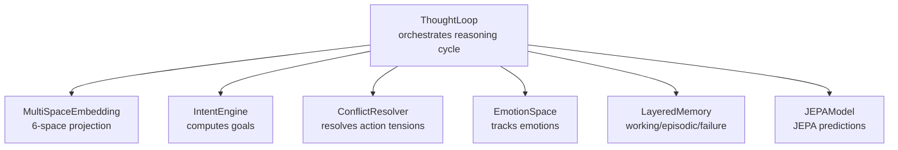
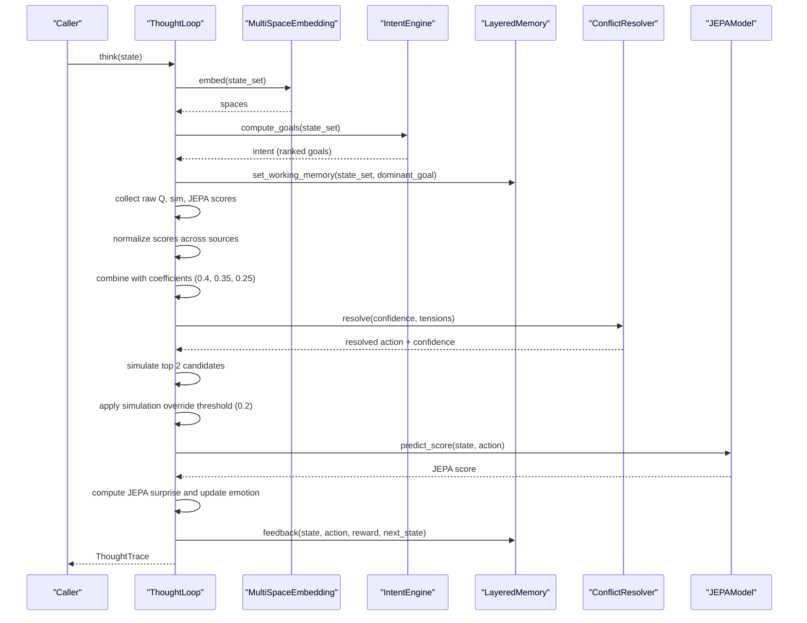
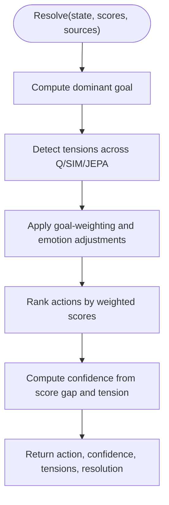
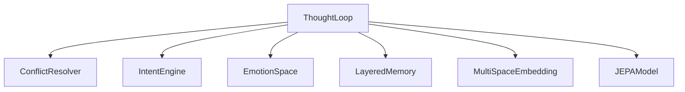

# Reasoning Coordination

<cite>
**Referenced Files in This Document**
- [thought_loop.py](file://cognition/thought_loop.py)
- [conflict_resolver.py](file://cognition/conflict_resolver.py)
- [intent.py](file://cognition/intent.py)
- [emotion_space.py](file://cognition/emotion_space.py)
- [layered_memory.py](file://cognition/layered_memory.py)
- [multispace_embedding.py](file://cognition/multispace_embedding.py)
- [jepa.py](file://learning/jepa.py)
- [config.py](file://config.py)
- [test_thought_loop.py](file://tests/test_thought_loop.py)
</cite>

## Table of Contents
1. [Introduction](#introduction)
2. [Project Structure](#project-structure)
3. [Core Components](#core-components)
4. [Architecture Overview](#architecture-overview)
5. [Detailed Component Analysis](#detailed-component-analysis)
6. [Dependency Analysis](#dependency-analysis)
7. [Performance Considerations](#performance-considerations)
8. [Troubleshooting Guide](#troubleshooting-guide)
9. [Conclusion](#conclusion)

## Introduction
This document explains the reasoning coordination subsystem within the thought loop system. It focuses on how the ThoughtLoop class orchestrates multiple reasoning sources—Q-learning scores, simulation projections, and JEPA predictions—into a unified decision-making pipeline. The document details the weighted combination mechanism, conflict resolution, simulation override threshold, normalization of scores across different scales, and the temporary state management and working memory updates during reasoning cycles.

## Project Structure
The reasoning coordination subsystem spans several modules:
- ThoughtLoop orchestrates perception, memory, intent, conflict resolution, simulation, decision, and feedback.
- ConflictResolver resolves tensions between action candidates guided by dominant goals and emotions.
- IntentEngine computes ranked goals from state and memory.
- EmotionSpace tracks emotional states and influences reasoning.
- LayeredMemory stores working memory, episodic experiences, and failure patterns.
- MultiSpaceEmbedding projects states into six cognitive spaces.
- JEPAModel provides JEPA predictions and scores for safety.

**Diagram sources**
- [thought_loop.py:50-62](file://cognition/thought_loop.py#L50-L62)
- [conflict_resolver.py:24-26](file://cognition/conflict_resolver.py#L24-L26)
- [intent.py:20-24](file://cognition/intent.py#L20-L24)
- [emotion_space.py:4-11](file://cognition/emotion_space.py#L4-L11)
- [layered_memory.py:18-28](file://cognition/layered_memory.py#L18-L28)
- [multispace_embedding.py:25-30](file://cognition/multispace_embedding.py#L25-L30)
- [jepa.py:49-72](file://learning/jepa.py#L49-L72)

**Section sources**
- [thought_loop.py:1-30](file://cognition/thought_loop.py#L1-L30)
- [config.py:4-5](file://config.py#L4-L5)

## Core Components
- ThoughtLoop: Central coordinator that embeds state, computes goals, normalizes reasoning sources, combines them with fixed coefficients, resolves conflicts, simulates top candidates, applies simulation override threshold, computes confidence, updates emotion, and writes feedback.
- ConflictResolver: Identifies tensions across reasoning sources and applies goal-weighting and emotion-aware adjustments to produce a resolved action and confidence.
- IntentEngine: Computes a ranked list of goals from state and memory, with optional emotion influence.
- EmotionSpace: Encodes emotional state from state and updates it based on JEPA surprise and risk.
- LayeredMemory: Provides working memory, failure patterns, and long-term patterns.
- MultiSpaceEmbedding: Projects state into six cognitive spaces (risk, goal, memory, attention, self, semantic, emotion).
- JEPAModel: Predicts next-state latents and scores actions based on proximity to a safe latent.

**Section sources**
- [thought_loop.py:50-156](file://cognition/thought_loop.py#L50-L156)
- [conflict_resolver.py:24-83](file://cognition/conflict_resolver.py#L24-L83)
- [intent.py:20-84](file://cognition/intent.py#L20-L84)
- [emotion_space.py:4-71](file://cognition/emotion_space.py#L4-L71)
- [layered_memory.py:18-192](file://cognition/layered_memory.py#L18-L192)
- [multispace_embedding.py:25-112](file://cognition/multispace_embedding.py#L25-L112)
- [jepa.py:49-185](file://learning/jepa.py#L49-L185)

## Architecture Overview
The reasoning coordination pipeline follows a deterministic sequence with optional overrides:

**Diagram sources**
- [thought_loop.py:64-156](file://cognition/thought_loop.py#L64-L156)
- [conflict_resolver.py:28-49](file://cognition/conflict_resolver.py#L28-L49)
- [jepa.py:137-148](file://learning/jepa.py#L137-L148)

## Detailed Component Analysis

### ThoughtLoop: Reasoning Coordination Orchestrator
- State handling: Coerces inputs to canonical sets, normalizes to lowercase, and converts to vectors for JEPA.
- Embedding: Projects state into six spaces (risk, goal, memory, attention, self, semantic, emotion).
- Intent: Sets working memory and retrieves memory context (working, similar failures, long-term patterns).
- Scoring: Collects raw scores from Q-learning, simulation, and JEPA; normalizes each source independently; combines with fixed coefficients.
- Conflict resolution: Uses ConflictResolver to resolve tensions and compute confidence.
- Simulation override: Reviews top two candidates; if a candidate beats the resolved action by the override threshold, it becomes the final action.
- Feedback: Records experience, updates working memory, and trains JEPA.

Key mechanisms:
- Normalization: Min-max normalization per source to align different scales.
- Combination: Weighted sum with coefficients 0.4 (Q), 0.35 (simulation), 0.25 (JEPA).
- Override: Simulation override threshold of 0.2 allows simulation results to override conflict resolution when significantly better.
- Confidence: Adjusted upward if simulation projections are strong.
- Emotion: Updated from JEPA surprise and risk, blended with confidence.

**Section sources**
- [thought_loop.py:64-156](file://cognition/thought_loop.py#L64-L156)
- [thought_loop.py:171-185](file://cognition/thought_loop.py#L171-L185)
- [thought_loop.py:187-201](file://cognition/thought_loop.py#L187-L201)
- [thought_loop.py:238-248](file://cognition/thought_loop.py#L238-L248)
- [thought_loop.py:250-279](file://cognition/thought_loop.py#L250-L279)

### ConflictResolver: Tension Resolution and Goal Weighting
- Detects tensions between reasoning sources for each action by computing absolute differences across Q vs. sim, Q vs. JEPA, and sim vs. JEPA.
- Applies goal-weighting to boost or penalize actions according to the dominant goal.
- Optionally incorporates emotion (fear) to adjust action preferences.
- Computes confidence based on margin between top and second-best weighted scores and total action tension.

**Diagram sources**
- [conflict_resolver.py:28-49](file://cognition/conflict_resolver.py#L28-L49)
- [conflict_resolver.py:51-66](file://cognition/conflict_resolver.py#L51-L66)
- [conflict_resolver.py:68-82](file://cognition/conflict_resolver.py#L68-L82)

**Section sources**
- [conflict_resolver.py:24-83](file://cognition/conflict_resolver.py#L24-L83)

### IntentEngine: Goal Ranking and Emotion Influence
- Computes goal scores from state features and memory failure boost.
- Incorporates emotion (fear, anger, sadness) to adjust goal priorities.
- Provides intent vector and dominant goal for downstream weighting.

**Section sources**
- [intent.py:30-78](file://cognition/intent.py#L30-L78)

### EmotionSpace: Emotional State Tracking
- Encodes emotion from state (fear, anger, sadness, surprise, calm).
- Updates emotion from JEPA surprise and risk level.
- Blends emotion with confidence to reflect reasoning confidence.

**Section sources**
- [emotion_space.py:12-50](file://cognition/emotion_space.py#L12-L50)

### LayeredMemory: Working Memory and Episodic Patterns
- Stores working memory (state, goal, timestamp).
- Maintains short-term, failure, and long-term patterns.
- Provides recency, frequency, and failure scores to inform embeddings and goals.

**Section sources**
- [layered_memory.py:34-110](file://cognition/layered_memory.py#L34-L110)

### MultiSpaceEmbedding: Six-Space Projection
- Projects state into risk, goal, memory, attention, self, semantic, and emotion spaces.
- Supplies risk level for emotion updates and context load for attention.

**Section sources**
- [multispace_embedding.py:36-105](file://cognition/multispace_embedding.py#L36-L105)

### JEPAModel: JEPA Predictions and Safety Scoring
- Predicts next-state latent from (state, action) context.
- Scores actions by proximity to a safe latent; returns normalized score.
- Computes JEPA surprise as distance between predicted and target latents.

**Section sources**
- [jepa.py:79-148](file://learning/jepa.py#L79-L148)

## Dependency Analysis
The ThoughtLoop depends on:
- ConflictResolver for conflict resolution and confidence computation.
- IntentEngine for goal ranking and dominant goal.
- EmotionSpace for emotion updates and blending.
- LayeredMemory for working memory and episodic/failure patterns.
- MultiSpaceEmbedding for six-space state representation.
- JEPAModel for JEPA predictions and surprise computation.

**Diagram sources**
- [thought_loop.py:39-61](file://cognition/thought_loop.py#L39-L61)

**Section sources**
- [thought_loop.py:39-61](file://cognition/thought_loop.py#L39-L61)

## Performance Considerations
- Normalization overhead: Min-max normalization per source is O(n) per action set; acceptable for small action sets.
- Simulation sampling: Three samples per action for estimation and review; can be tuned for speed/accuracy trade-offs.
- Override pass: Single linear scan over top two candidates; negligible overhead.
- JEPA prediction: Matrix operations per action; consider caching or batched predictions if scaling.
- Memory growth: Recent traces are bounded; ensure long-term patterns are pruned appropriately.

## Troubleshooting Guide
Common issues and remedies:
- Normalization edge cases: When all scores in a source are identical, normalization fills with midpoint or zero; ensure diverse inputs to avoid flat scores.
- Simulation override not triggering: Verify override threshold and that projected rewards exceed the resolved action by the threshold.
- JEPA update failures: Wrapped in try/except; check logs for failures and ensure state/action vectors are valid.
- Confidence bounds: Clamped to [0, 1]; confirm that emotion blending and simulation projections are within expected ranges.

**Section sources**
- [thought_loop.py:238-248](file://cognition/thought_loop.py#L238-L248)
- [thought_loop.py:108-166](file://cognition/thought_loop.py#L108-L166)

## Conclusion
The reasoning coordination subsystem integrates Q-learning, simulation, and JEPA into a robust decision pipeline. ThoughtLoop normalizes heterogeneous scores, combines them with carefully chosen coefficients, resolves conflicts guided by goals and emotions, and applies a simulation override threshold to ensure strong projections can supersede conflict resolution. Temporary state management and working memory updates enable continuous learning and adaptation through feedback loops.