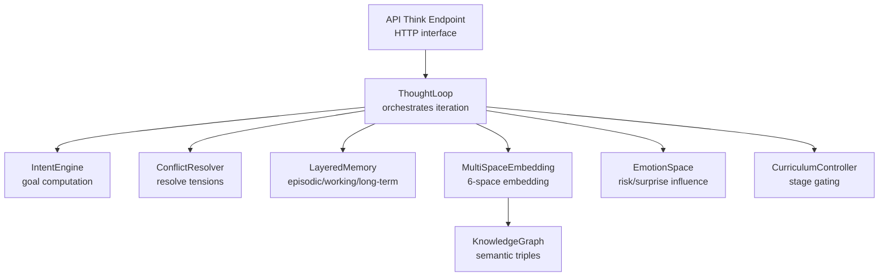
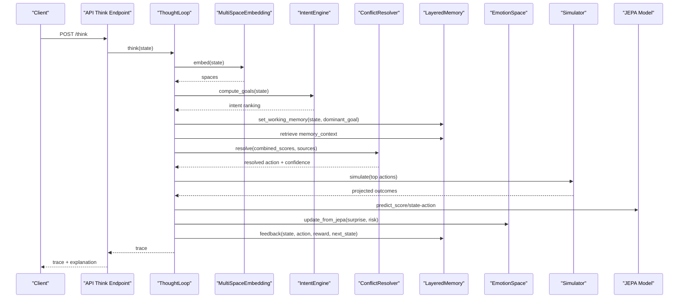
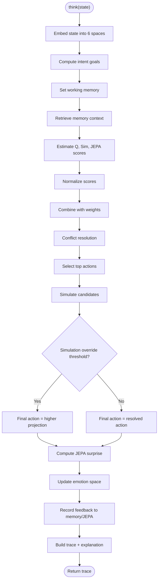
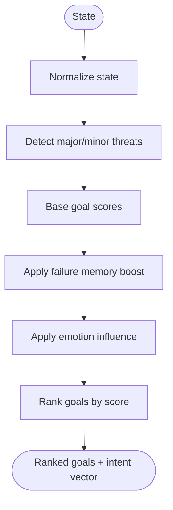
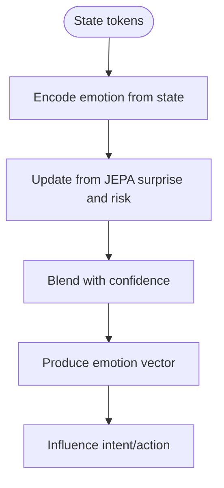
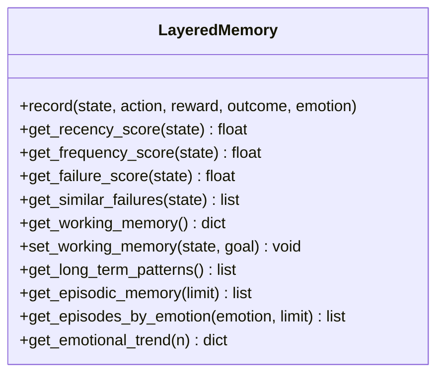
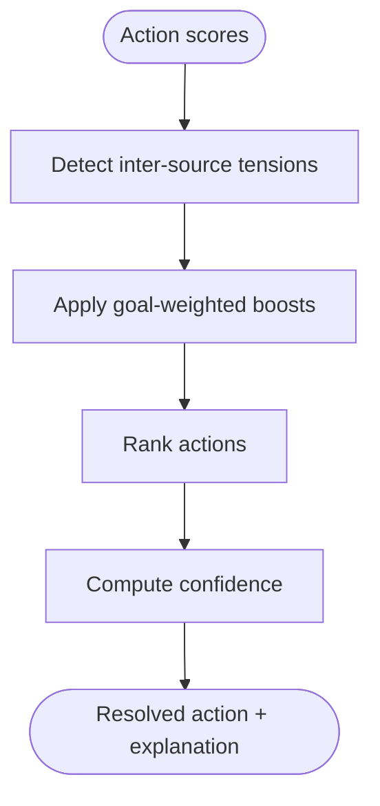
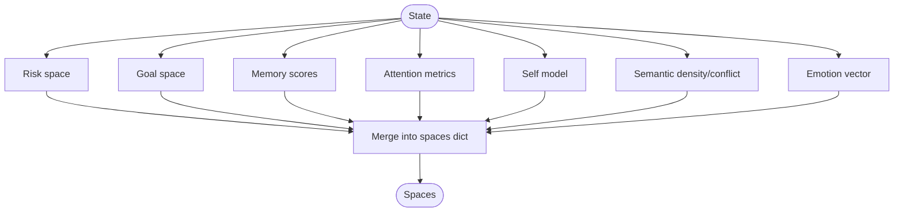
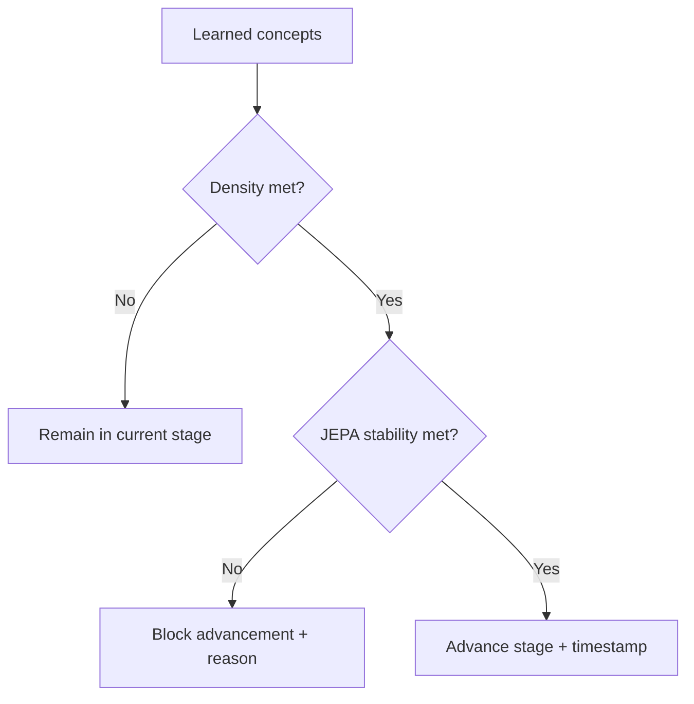
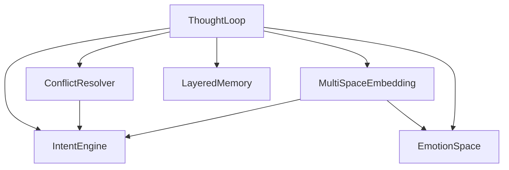

# Thought Loop System

<cite>
**Referenced Files in This Document**
- [thought_loop.py](file://cognition/thought_loop.py)
- [intent.py](file://cognition/intent.py)
- [emotion_space.py](file://cognition/emotion_space.py)
- [layered_memory.py](file://cognition/layered_memory.py)
- [conflict_resolver.py](file://cognition/conflict_resolver.py)
- [multispace_embedding.py](file://cognition/multispace_embedding.py)
- [think.py](file://api/endpoints/think.py)
- [curriculum.py](file://learning/curriculum.py)
- [knowledge_graph.py](file://core/knowledge_graph.py)
- [test_thought_loop.py](file://tests/test_thought_loop.py)
- [test_emotion_space.py](file://tests/test_emotion_space.py)
</cite>

## Table of Contents
1. [Introduction](#introduction)
2. [Project Structure](#project-structure)
3. [Core Components](#core-components)
4. [Architecture Overview](#architecture-overview)
5. [Detailed Component Analysis](#detailed-component-analysis)
6. [Dependency Analysis](#dependency-analysis)
7. [Performance Considerations](#performance-considerations)
8. [Troubleshooting Guide](#troubleshooting-guide)
9. [Conclusion](#conclusion)
10. [Appendices](#appendices)

## Introduction
This document explains the thought loop system that orchestrates multi-modal reasoning and working memory management. It details the iterative reasoning architecture coordinating semantic processing, learning systems, and decision engines. It documents intent management for goal-directed reasoning and action planning, emotion space integration for risk assessment and decision influence, and a layered memory system supporting episodic, semantic, and procedural knowledge. Conflict resolution mechanisms handle competing goals and conflicting information. Practical examples illustrate thought loop execution, intent processing, and emotion’s influence on decision-making. Integration points with the knowledge graph for semantic reasoning and the curriculum system for learning adaptation are described, along with real-time coordination and temporal dynamics.

## Project Structure
The thought loop system is implemented primarily under the cognition module and integrates with API endpoints, learning curriculum, and core knowledge graph components. The following diagram highlights the main modules and their roles.

**Diagram sources**
- [thought_loop.py:50-170](file://cognition/thought_loop.py#L50-L170)
- [intent.py:20-84](file://cognition/intent.py#L20-L84)
- [conflict_resolver.py:24-83](file://cognition/conflict_resolver.py#L24-L83)
- [layered_memory.py:18-192](file://cognition/layered_memory.py#L18-L192)
- [multispace_embedding.py:25-112](file://cognition/multispace_embedding.py#L25-L112)
- [emotion_space.py:4-71](file://cognition/emotion_space.py#L4-L71)
- [think.py:8-121](file://api/endpoints/think.py#L8-L121)
- [knowledge_graph.py:1-34](file://core/knowledge_graph.py#L1-L34)
- [curriculum.py:92-296](file://learning/curriculum.py#L92-L296)

**Section sources**
- [thought_loop.py:1-279](file://cognition/thought_loop.py#L1-L279)
- [think.py:1-121](file://api/endpoints/think.py#L1-L121)

## Core Components
- ThoughtLoop: Implements the iterative thought loop pipeline integrating perception, memory, intent, conflict resolution, simulation, decision, and feedback. It manages working memory, coordinates scoring from Q-table, simulation, and JEPA, and updates emotion space and memory.
- IntentEngine: Computes ranked goals from the current state and optionally influenced by emotion and failure memory, producing an intent vector for conflict resolution.
- EmotionSpace: Encodes emotional states from state tokens, updates from JEPA surprise and risk, blends with confidence, and provides a vectorized representation influencing intent weighting.
- LayeredMemory: Provides short-term, working, failure, and long-term memory layers, with episodic storage and emotional trend analytics.
- ConflictResolver: Detects tensions across scoring sources and applies goal-weighted adjustments to resolve conflicts.
- MultiSpaceEmbedding: Projects states into six cognitive spaces (risk, goal, memory, attention, self, semantic) and integrates emotion and knowledge graph signals.
- API Think Endpoint: Exposes HTTP endpoints to run the thought loop, simulate trajectories, and explain decisions.
- CurriculumController: Manages learning stages gated by concept density and JEPA stability, enabling progression from literacy to numeracy to reasoning.
- KnowledgeGraph: Stores semantic triples and metadata used by MultiSpaceEmbedding for semantic space construction.

**Section sources**
- [thought_loop.py:50-170](file://cognition/thought_loop.py#L50-L170)
- [intent.py:20-84](file://cognition/intent.py#L20-L84)
- [emotion_space.py:4-71](file://cognition/emotion_space.py#L4-L71)
- [layered_memory.py:18-192](file://cognition/layered_memory.py#L18-L192)
- [conflict_resolver.py:24-83](file://cognition/conflict_resolver.py#L24-L83)
- [multispace_embedding.py:25-112](file://cognition/multispace_embedding.py#L25-L112)
- [think.py:8-121](file://api/endpoints/think.py#L8-L121)
- [curriculum.py:92-296](file://learning/curriculum.py#L92-L296)
- [knowledge_graph.py:1-34](file://core/knowledge_graph.py#L1-L34)

## Architecture Overview
The thought loop architecture coordinates multiple subsystems in an iterative cycle. Perception converts raw state into a multi-space embedding. Memory retrieves relevant context. Intent computes active goals. Conflict resolution harmonizes competing signals. Simulation projects outcomes for top actions. Decision selects the final action. Feedback updates memory and JEPA, while emotion space evolves based on surprise and risk.

**Diagram sources**
- [thought_loop.py:64-156](file://cognition/thought_loop.py#L64-L156)
- [multispace_embedding.py:36-105](file://cognition/multispace_embedding.py#L36-L105)
- [intent.py:30-78](file://cognition/intent.py#L30-L78)
- [conflict_resolver.py:28-49](file://cognition/conflict_resolver.py#L28-L49)
- [emotion_space.py:35-50](file://cognition/emotion_space.py#L35-L50)
- [layered_memory.py:34-70](file://cognition/layered_memory.py#L34-L70)
- [think.py:8-16](file://api/endpoints/think.py#L8-L16)

## Detailed Component Analysis

### ThoughtLoop: Iterative Reasoning and Working Memory
The ThoughtLoop orchestrates the full reasoning cycle. It embeds the state into six cognitive spaces, computes intent-driven goals, sets working memory, retrieves memory context, normalizes and combines scores from Q-table, simulation, and JEPA, resolves conflicts, simulates top candidates, selects the final action, computes JEPA surprise, updates emotion space, and writes feedback to memory and JEPA.

Key behaviors:
- State coercion and normalization to canonical sets.
- Score normalization and weighted combination across modalities.
- Simulation override threshold to favor simulation projections when sufficiently confident.
- JEPA surprise computation and emotion blending.
- Trace building with explanations for interpretability.

**Diagram sources**
- [thought_loop.py:64-156](file://cognition/thought_loop.py#L64-L156)

**Section sources**
- [thought_loop.py:50-170](file://cognition/thought_loop.py#L50-L170)
- [thought_loop.py:171-228](file://cognition/thought_loop.py#L171-L228)

### Intent Management: Goal-Directed Reasoning
IntentManagement computes a ranked list of goals from the current state, optionally boosted by failure memory and modulated by emotion. The dominant goal drives conflict resolution weighting.

Highlights:
- Goal ordering prioritizes survival, stability, risk reduction, consistency, and task completion.
- Failure memory increases risk-related goal scores.
- Emotion influences goal scores (e.g., fear raises survival, anger affects risk reduction, sadness impacts task completion).
- Produces intent vector for downstream use.

**Diagram sources**
- [intent.py:30-78](file://cognition/intent.py#L30-L78)

**Section sources**
- [intent.py:20-84](file://cognition/intent.py#L20-L84)

### Emotion Space: Risk Assessment and Decision Influence
EmotionSpace encodes emotional states from state tokens, updates from JEPA surprise and risk, and blends with confidence. It influences intent weighting and decision confidence.

Highlights:
- From-state mapping from threat tokens to fear, anger, sadness, surprise, calm.
- Update-from-JEPA adjusts surprise and recalibrates calm; high surprise and risk increase fear.
- Blend-with-confidence scales calm proportionally to confidence.
- Vectorized representation and textual explanation.

**Diagram sources**
- [emotion_space.py:12-50](file://cognition/emotion_space.py#L12-L50)

**Section sources**
- [emotion_space.py:4-71](file://cognition/emotion_space.py#L4-L71)

### Layered Memory: Episodic, Working, Long-Term, Failure
LayeredMemory supports multiple memory types:
- Short-term: recent experiences with decay.
- Working: current state-goal context.
- Failure: negative outcomes for caution.
- Long-term: stable patterns aggregated by frequency.

Features:
- Record episodes with state, action, reward, outcome, timestamp, emotion.
- Similar failures retrieval and overlap scoring.
- Working memory setter/getter.
- Episodic memory and emotional trends.

**Diagram sources**
- [layered_memory.py:18-192](file://cognition/layered_memory.py#L18-L192)

**Section sources**
- [layered_memory.py:18-192](file://cognition/layered_memory.py#L18-L192)

### Conflict Resolution: Handling Competing Goals and Signals
ConflictResolver detects tensions across scoring sources (Q-table, simulation, JEPA) and applies goal-weighted adjustments. It computes confidence based on margin and accumulated tension.

Highlights:
- Tension detection across source pairs.
- Goal-specific action boosts.
- Emotion-aware adjustments (e.g., fear increasing evacuation preference).
- Confidence estimation combining score gap and tension.

**Diagram sources**
- [conflict_resolver.py:28-83](file://cognition/conflict_resolver.py#L28-L83)

**Section sources**
- [conflict_resolver.py:24-83](file://cognition/conflict_resolver.py#L24-L83)

### Multi-Space Embedding: Semantic Reasoning and Attention
MultiSpaceEmbedding projects states into six cognitive spaces:
- Risk: threat indicators.
- Goal: intent vector.
- Memory: recency, frequency, failure scores.
- Attention: threat count, surprise, context load.
- Self: confidence, overload, novelty surprise.
- Semantic: belief density and conflict count from knowledge graph.
- Emotion: emotion vector.

It also flattens spaces for downstream consumption.

**Diagram sources**
- [multispace_embedding.py:36-105](file://cognition/multispace_embedding.py#L36-L105)

**Section sources**
- [multispace_embedding.py:25-112](file://cognition/multispace_embedding.py#L25-L112)

### API Integration: Real-Time Coordination and Temporal Dynamics
The API Think endpoint exposes:
- POST /think: runs the thought loop and returns a trace with explanation.
- GET /thought_trace: retrieves recent traces.
- POST /decision: performs hybrid decision and records artifacts.
- POST /simulate: simulates a trajectory of decisions and outcomes.
- GET /explain: provides rule, simulation, and JEPA scores alongside best action.
- GET /graph: renders a policy graph.
- GET /debug/emotion/jepa: tests emotion updates under varying surprise and risk.

These endpoints coordinate real-time execution, allowing continuous interaction with the thought loop and memory.

**Section sources**
- [think.py:8-121](file://api/endpoints/think.py#L8-L121)

### Curriculum Integration: Learning Adaptation
The CurriculumController manages progression across stages:
- Literacy, Numeracy, Reasoning.
- Progression requires concept density and JEPA stability thresholds.
- Prerequisite gating prevents restricted operations until required stage is met.
- Status reporting and persistence support operational monitoring.

**Diagram sources**
- [curriculum.py:128-202](file://learning/curriculum.py#L128-L202)

**Section sources**
- [curriculum.py:92-296](file://learning/curriculum.py#L92-L296)

### Knowledge Graph Integration: Semantic Reasoning
The KnowledgeGraph stores semantic triples with confidence and metadata. MultiSpaceEmbedding consumes:
- Belief density for semantic space.
- Conflict count derived from belief relations to inform semantic reasoning.

**Section sources**
- [knowledge_graph.py:1-34](file://core/knowledge_graph.py#L1-L34)
- [multispace_embedding.py:73-93](file://cognition/multispace_embedding.py#L73-L93)

## Dependency Analysis
The ThoughtLoop composes multiple cognitive modules with explicit dependencies. The diagram below shows the primary import and composition relationships.

**Diagram sources**
- [thought_loop.py:39-61](file://cognition/thought_loop.py#L39-L61)
- [conflict_resolver.py:21-26](file://cognition/conflict_resolver.py#L21-L26)
- [multispace_embedding.py:25-30](file://cognition/multispace_embedding.py#L25-L30)

**Section sources**
- [thought_loop.py:39-61](file://cognition/thought_loop.py#L39-L61)
- [conflict_resolver.py:21-26](file://cognition/conflict_resolver.py#L21-L26)
- [multispace_embedding.py:25-30](file://cognition/multispace_embedding.py#L25-L30)

## Performance Considerations
- Score normalization avoids dominance by extreme values and stabilizes combined scores.
- Simulation override threshold balances deliberation and efficiency.
- Deque-based recent traces cap memory footprint for diagnostics.
- Multi-space embedding flattening enables efficient downstream processing.
- Emotion updates and blending are lightweight vector operations.
- Recommendations:
  - Tune simulation samples for accuracy vs. latency trade-offs.
  - Monitor JEPA training samples to balance stability and adaptability.
  - Adjust conflict resolution thresholds for sensitivity to tensions.

[No sources needed since this section provides general guidance]

## Troubleshooting Guide
Common issues and checks:
- Trace completeness: Ensure required keys are present and confidence remains within [0, 1].
- Action validity: Verify selected action belongs to the action set.
- State normalization: Confirm state coercion handles empty, string, and tuple inputs.
- Emotion vectorization: Validate emotion vector length and labels.
- Feedback updates: Confirm JEPA training samples increase after feedback.
- Emotional trends: Use episodic memory queries to validate emotion labeling and averaging.

**Section sources**
- [test_thought_loop.py:53-87](file://tests/test_thought_loop.py#L53-L87)
- [test_thought_loop.py:105-134](file://tests/test_thought_loop.py#L105-L134)
- [test_thought_loop.py:136-150](file://tests/test_thought_loop.py#L136-L150)
- [test_thought_loop.py:152-166](file://tests/test_thought_loop.py#L152-L166)
- [test_thought_loop.py:168-198](file://tests/test_thought_loop.py#L168-L198)
- [test_emotion_space.py:6-45](file://tests/test_emotion_space.py#L6-L45)

## Conclusion
The thought loop system integrates multi-modal reasoning, intent management, emotion space, layered memory, and conflict resolution into a cohesive iterative pipeline. It coordinates perception, memory, planning, simulation, and learning feedback while maintaining interpretability through trace explanations. Integration with the knowledge graph enriches semantic understanding, and the curriculum controller ensures learning progression aligns with stability and competence. The API endpoints enable real-time interaction and diagnostics, supporting practical deployment and experimentation.

[No sources needed since this section summarizes without analyzing specific files]

## Appendices

### Practical Examples

- Thought loop execution:
  - Invoke POST /think with a state set to receive a full trace including spaces, intent, resolution, candidates, emotion, and explanation.
  - Use GET /thought_trace to inspect recent reasoning traces.

- Intent processing:
  - States with “crisis” or “collapse” elevate survival and risk reduction goals; “flood” or “damage” increase stability and risk reduction.
  - Emotion vectors influence goal scores; fear raises survival, anger affects risk reduction, and sadness reduces task completion drive.

- Emotion influence on decision-making:
  - JEPA surprise and risk update emotion; high surprise and risk increase fear, reducing calm and potentially overriding simulation projections if thresholds are met.
  - Confidence blending scales calm proportionally to decision confidence.

- Knowledge graph integration:
  - Semantic density and conflict counts from the knowledge graph contribute to the semantic space, informing contextual reasoning.

- Curriculum integration:
  - Stage progression depends on concept density and JEPA stability; prerequisite gating prevents restricted operations until required stage is achieved.

**Section sources**
- [think.py:8-121](file://api/endpoints/think.py#L8-L121)
- [intent.py:30-78](file://cognition/intent.py#L30-L78)
- [emotion_space.py:35-50](file://cognition/emotion_space.py#L35-L50)
- [multispace_embedding.py:73-93](file://cognition/multispace_embedding.py#L73-L93)
- [curriculum.py:128-202](file://learning/curriculum.py#L128-L202)