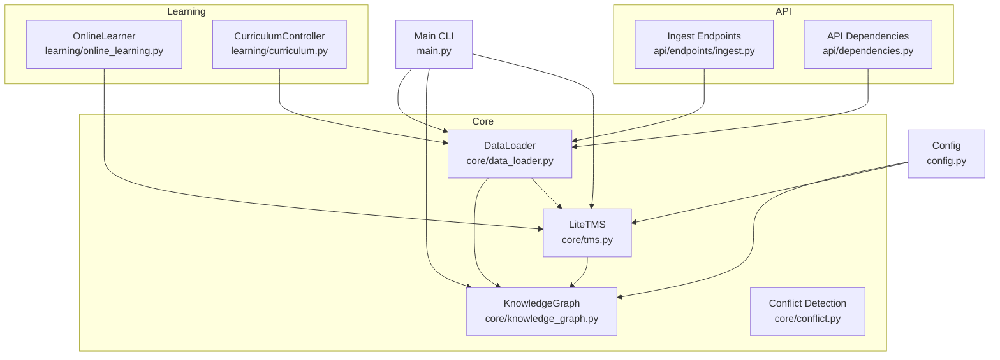
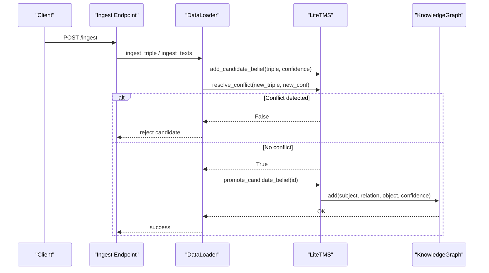
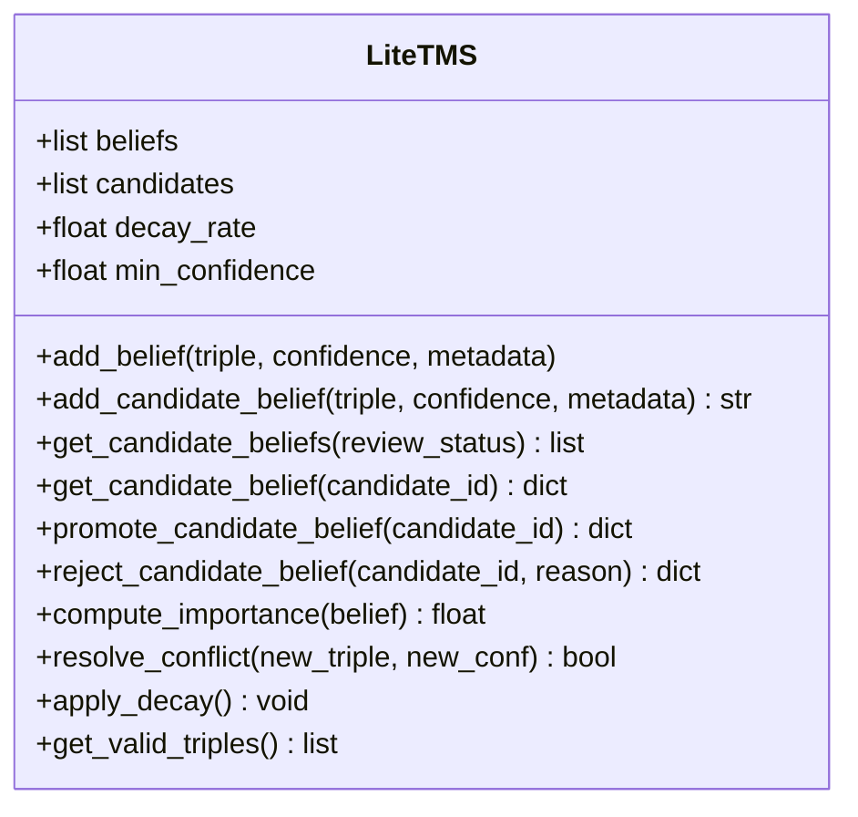
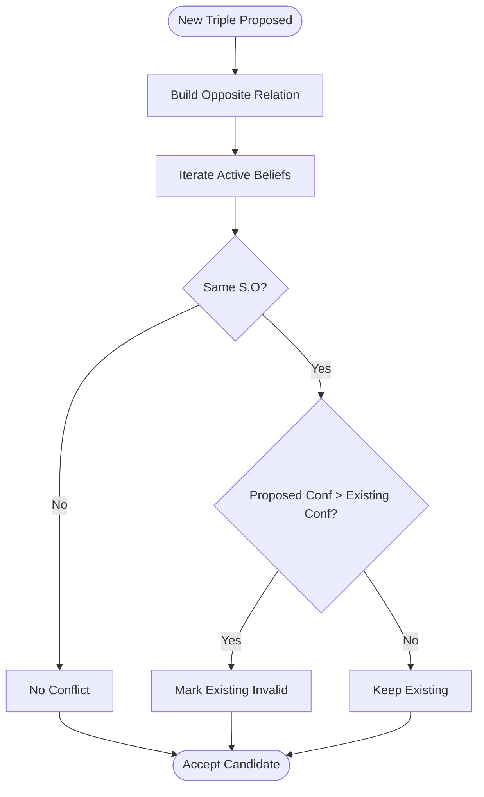
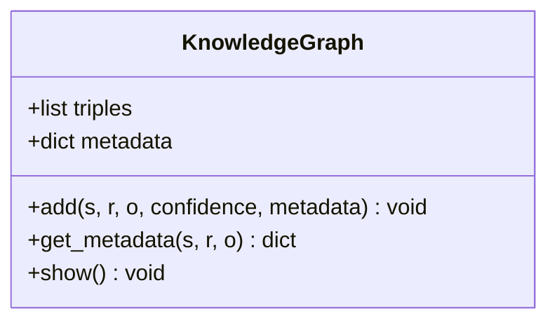
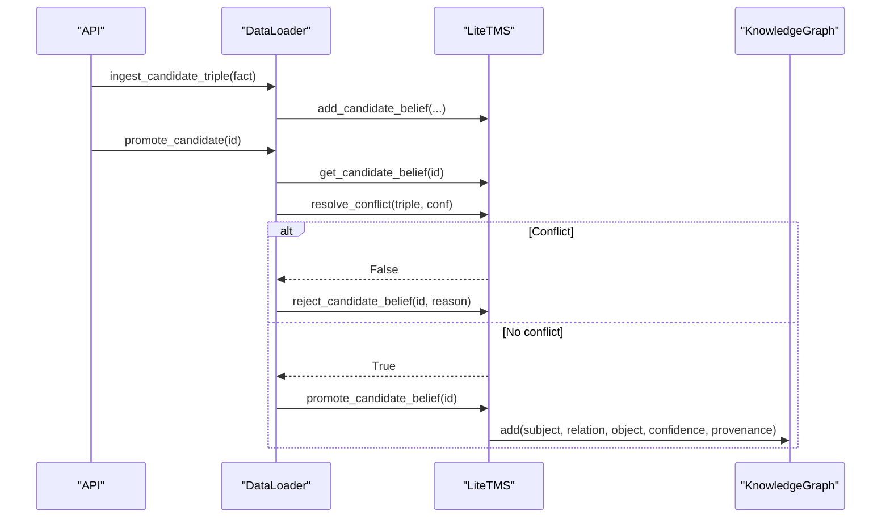
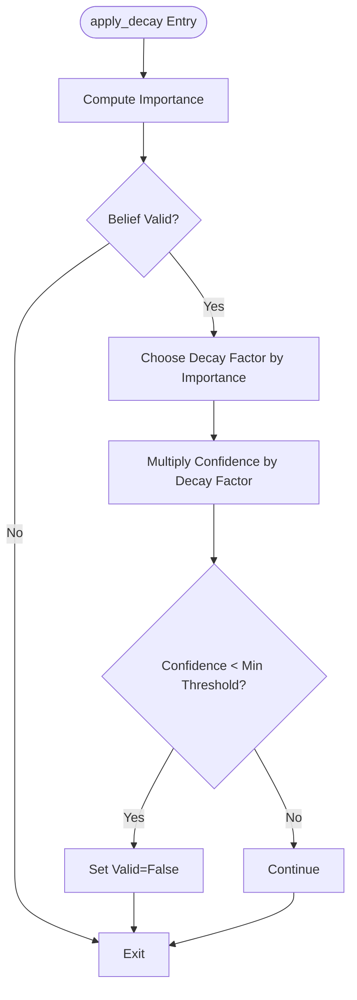
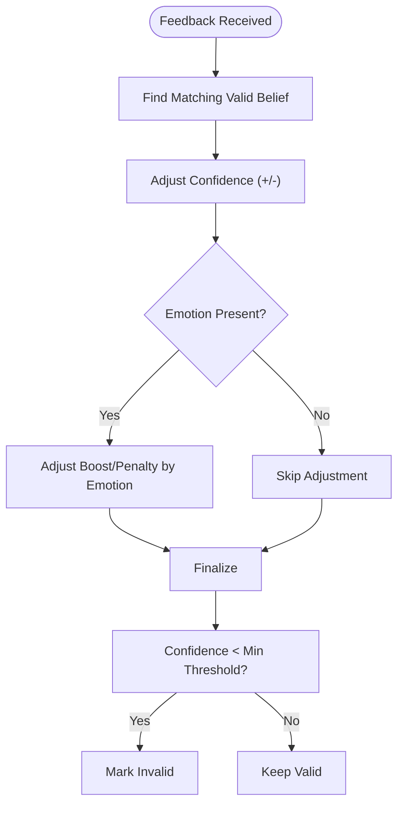
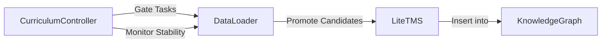
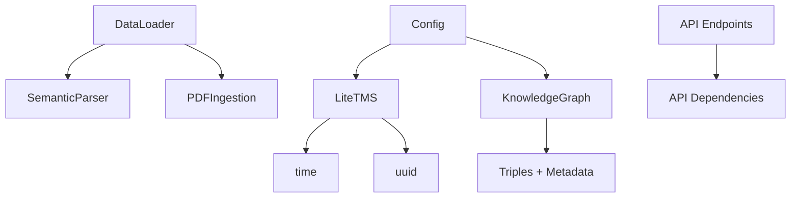

# Truth Maintenance System

<cite>
**Referenced Files in This Document**
- [tms.py](file://core/tms.py)
- [conflict.py](file://core/conflict.py)
- [knowledge_graph.py](file://core/knowledge_graph.py)
- [data_loader.py](file://core/data_loader.py)
- [config.py](file://config.py)
- [main.py](file://main.py)
- [ingest.py](file://api/endpoints/ingest.py)
- [dependencies.py](file://api/dependencies.py)
- [online_learning.py](file://learning/online_learning.py)
- [curriculum.py](file://learning/curriculum.py)
</cite>

## Table of Contents
1. [Introduction](#introduction)
2. [Project Structure](#project-structure)
3. [Core Components](#core-components)
4. [Architecture Overview](#architecture-overview)
5. [Detailed Component Analysis](#detailed-component-analysis)
6. [Dependency Analysis](#dependency-analysis)
7. [Performance Considerations](#performance-considerations)
8. [Troubleshooting Guide](#troubleshooting-guide)
9. [Conclusion](#conclusion)
10. [Appendices](#appendices)

## Introduction
This document explains the Truth Maintenance System (TMS) implementation for managing belief validity and confidence levels over time. It covers belief revision and confidence propagation, conflict detection and resolution, decay and stability management, integration with the knowledge graph, and the relationship between TMS and the curriculum system for learning-based belief updates. Terminology follows the codebase: “beliefs,” “validity,” and “confidence propagation.”

## Project Structure
The TMS resides in the core module alongside related components:
- Truth Maintenance System: core/tms.py
- Conflict detection: core/conflict.py
- Knowledge Graph: core/knowledge_graph.py
- Data ingestion pipeline: core/data_loader.py
- Configuration: config.py
- Web API endpoints for ingestion: api/endpoints/ingest.py
- API dependencies and integration: api/dependencies.py
- Online learning and feedback: learning/online_learning.py
- Curriculum controller: learning/curriculum.py

**Diagram sources**
- [tms.py:4-158](file://core/tms.py#L4-L158)
- [knowledge_graph.py:1-34](file://core/knowledge_graph.py#L1-L34)
- [data_loader.py:39-500](file://core/data_loader.py#L39-L500)
- [conflict.py:1-19](file://core/conflict.py#L1-L19)
- [config.py:70-106](file://config.py#L70-L106)
- [main.py:265-323](file://main.py#L265-L323)
- [ingest.py:1-292](file://api/endpoints/ingest.py#L1-L292)
- [dependencies.py:1218-1222](file://api/dependencies.py#L1218-L1222)
- [online_learning.py:1-29](file://learning/online_learning.py#L1-L29)
- [curriculum.py:92-296](file://learning/curriculum.py#L92-L296)

**Section sources**
- [tms.py:4-158](file://core/tms.py#L4-L158)
- [knowledge_graph.py:1-34](file://core/knowledge_graph.py#L1-L34)
- [data_loader.py:39-500](file://core/data_loader.py#L39-L500)
- [conflict.py:1-19](file://core/conflict.py#L1-L19)
- [config.py:70-106](file://config.py#L70-L106)
- [main.py:265-323](file://main.py#L265-L323)
- [ingest.py:1-292](file://api/endpoints/ingest.py#L1-L292)
- [dependencies.py:1218-1222](file://api/dependencies.py#L1218-L1222)
- [online_learning.py:1-29](file://learning/online_learning.py#L1-L29)
- [curriculum.py:92-296](file://learning/curriculum.py#L92-L296)

## Core Components
- LiteTMS: Manages beliefs, candidate knowledge, validity, confidence propagation, conflict resolution, and decay.
- KnowledgeGraph: Stores validated triples with confidence and metadata, replacing lower-confidence duplicates.
- DataLoader: Orchestrates ingestion, candidate promotion/rejection, and conflict checks against TMS and KG.
- Conflict detection: Detects negation-based conflicts between new triples and existing knowledge.
- Configuration: Provides decay rate and minimum confidence thresholds.
- OnlineLearner: Applies feedback-driven confidence updates to existing beliefs.
- CurriculumController: Gates higher-level tasks and monitors stability to influence belief acquisition.

**Section sources**
- [tms.py:4-158](file://core/tms.py#L4-L158)
- [knowledge_graph.py:1-34](file://core/knowledge_graph.py#L1-L34)
- [data_loader.py:39-500](file://core/data_loader.py#L39-L500)
- [conflict.py:1-19](file://core/conflict.py#L1-L19)
- [config.py:70-106](file://config.py#L70-L106)
- [online_learning.py:1-29](file://learning/online_learning.py#L1-L29)
- [curriculum.py:92-296](file://learning/curriculum.py#L92-L296)

## Architecture Overview
The TMS sits at the center of the semantic stack, receiving knowledge from ingestion and online feedback, validating it against existing beliefs, and propagating confidence through the knowledge graph. The curriculum system influences when and how new knowledge is accepted, and the API exposes endpoints to manage candidate knowledge and integrate with the broader system.

**Diagram sources**
- [ingest.py:40-82](file://api/endpoints/ingest.py#L40-L82)
- [data_loader.py:407-434](file://core/data_loader.py#L407-L434)
- [tms.py:47-97](file://core/tms.py#L47-L97)
- [knowledge_graph.py:6-23](file://core/knowledge_graph.py#L6-L23)

## Detailed Component Analysis

### LiteTMS: Belief Management and Confidence Propagation
LiteTMS maintains two lists:
- Active beliefs: validated, valid, and propagated into the knowledge graph.
- Candidate knowledge: pending review with explicit stage and review status.

Key capabilities:
- Add or update active beliefs with confidence and metadata.
- Add candidate beliefs with “pending” status.
- Promote candidates to validated knowledge after conflict resolution.
- Reject candidates with optional reasons.
- Compute importance from confidence, usage, and age.
- Resolve conflicts using negation-based opposite relations.
- Apply confidence decay based on importance and time, with a minimum confidence threshold.

**Diagram sources**
- [tms.py:4-158](file://core/tms.py#L4-L158)

**Section sources**
- [tms.py:30-97](file://core/tms.py#L30-L97)
- [tms.py:99-157](file://core/tms.py#L99-L157)

### Conflict Detection and Resolution
Two complementary mechanisms prevent inconsistency:
- Negation-based conflict detection in TMS: identifies contradictions by checking opposite relations for the same subject-object pair.
- Conflict detection in the knowledge graph: detects negation-based conflicts across stored triples.

**Diagram sources**
- [tms.py:111-128](file://core/tms.py#L111-L128)
- [conflict.py:1-19](file://core/conflict.py#L1-L19)

**Section sources**
- [tms.py:111-128](file://core/tms.py#L111-L128)
- [conflict.py:1-19](file://core/conflict.py#L1-L19)

### Knowledge Graph Integration
The KnowledgeGraph stores validated triples with confidence and metadata, replacing lower-confidence duplicates. It ensures that stronger evidence supersedes weaker claims.

**Diagram sources**
- [knowledge_graph.py:1-34](file://core/knowledge_graph.py#L1-L34)

**Section sources**
- [knowledge_graph.py:6-29](file://core/knowledge_graph.py#L6-L29)

### Data Ingestion Pipeline and Candidate Review
The DataLoader coordinates ingestion and candidate review:
- Prepares facts and adds them as candidates.
- Retrieves pending candidates for review.
- Promotes candidates after conflict resolution and inserts into the knowledge graph.
- Rejects candidates with reasons.

**Diagram sources**
- [data_loader.py:407-434](file://core/data_loader.py#L407-L434)
- [tms.py:47-97](file://core/tms.py#L47-L97)
- [knowledge_graph.py:6-23](file://core/knowledge_graph.py#L6-L23)

**Section sources**
- [data_loader.py:407-434](file://core/data_loader.py#L407-L434)

### Decay and Stability Management
LiteTMS computes an importance score from confidence, usage, and age, then applies decay differently depending on importance thresholds. If confidence falls below the minimum threshold, the belief becomes invalid.

**Diagram sources**
- [tms.py:130-151](file://core/tms.py#L130-L151)

**Section sources**
- [tms.py:99-151](file://core/tms.py#L99-L151)

### Online Learning and Feedback
OnlineLearner adjusts confidence based on feedback and optional emotional state, then validates against the minimum confidence threshold.

**Diagram sources**
- [online_learning.py:5-29](file://learning/online_learning.py#L5-L29)
- [tms.py:149-151](file://core/tms.py#L149-L151)

**Section sources**
- [online_learning.py:5-29](file://learning/online_learning.py#L5-L29)

### Relationship to Curriculum System
The curriculum gates higher-level tasks and monitors stability via recent JEPA errors. While TMS manages belief validity and confidence, the curriculum influences when and how new knowledge is acquired and promoted.

**Diagram sources**
- [curriculum.py:92-202](file://learning/curriculum.py#L92-L202)
- [data_loader.py:420-434](file://core/data_loader.py#L420-L434)
- [tms.py:70-86](file://core/tms.py#L70-L86)
- [knowledge_graph.py:6-23](file://core/knowledge_graph.py#L6-L23)

**Section sources**
- [curriculum.py:92-202](file://learning/curriculum.py#L92-L202)
- [data_loader.py:420-434](file://core/data_loader.py#L420-L434)

## Dependency Analysis
- LiteTMS depends on time and UUID for timestamps and identifiers.
- DataLoader depends on SemanticParser and PDF ingestion utilities.
- API endpoints depend on dependencies for loader initialization and rate limiting.
- KnowledgeGraph depends on in-memory storage of triples and metadata.
- Configuration centralizes decay rate and minimum confidence.

**Diagram sources**
- [tms.py:1-2](file://core/tms.py#L1-L2)
- [data_loader.py:35-36](file://core/data_loader.py#L35-L36)
- [ingest.py:1-8](file://api/endpoints/ingest.py#L1-L8)
- [dependencies.py:1218-1222](file://api/dependencies.py#L1218-L1222)
- [knowledge_graph.py:1-34](file://core/knowledge_graph.py#L1-L34)
- [config.py:70-106](file://config.py#L70-L106)

**Section sources**
- [tms.py:1-2](file://core/tms.py#L1-L2)
- [data_loader.py:35-36](file://core/data_loader.py#L35-L36)
- [ingest.py:1-8](file://api/endpoints/ingest.py#L1-L8)
- [dependencies.py:1218-1222](file://api/dependencies.py#L1218-L1222)
- [knowledge_graph.py:1-34](file://core/knowledge_graph.py#L1-L34)
- [config.py:70-106](file://config.py#L70-L106)

## Performance Considerations
- Complexity:
  - Adding/updating active beliefs: O(n) over active beliefs.
  - Conflict resolution: O(n) over active beliefs.
  - Decay application: O(n) over active beliefs.
  - KnowledgeGraph add/update: O(n) over existing triples for duplicates.
- Tuning:
  - Decay rate controls confidence retention speed; lower values decay faster.
  - Minimum confidence determines when beliefs are pruned.
  - Importance thresholds affect decay aggressiveness for high-impact beliefs.

[No sources needed since this section provides general guidance]

## Troubleshooting Guide
Common issues and resolutions:
- Candidate not promoted:
  - Cause: Conflict detected by TMS resolve_conflict.
  - Action: Inspect candidate’s triple and confidence; adjust or reject.
- Belief removed after decay:
  - Cause: Confidence fell below minimum threshold.
  - Action: Increase confidence via feedback or reduce decay rate/min threshold.
- Inconsistent knowledge:
  - Cause: Negation-based conflict with existing belief.
  - Action: Verify relation negation suffix and confidence values; ensure consistency.
- API rejection of candidate:
  - Cause: Candidate not pending or conflict detected.
  - Action: Check review queue and candidate status; re-ingest with corrected facts.

**Section sources**
- [tms.py:111-151](file://core/tms.py#L111-L151)
- [data_loader.py:420-434](file://core/data_loader.py#L420-L434)
- [ingest.py:260-291](file://api/endpoints/ingest.py#L260-L291)

## Conclusion
The LiteTMS provides a robust framework for managing beliefs with validity, confidence propagation, and decay. Conflict detection ensures consistency, while integration with the knowledge graph and ingestion pipeline maintains a coherent semantic foundation. The curriculum system complements TMS by gating higher-level knowledge and monitoring stability, enabling learning-based belief updates over time.

[No sources needed since this section summarizes without analyzing specific files]

## Appendices

### Practical Examples

- Conflict identification:
  - Scenario: Propose “barrier prevents flood” with confidence 0.8.
  - TMS checks for “barrier prevents flood_NOT”; if found with higher confidence, existing belief is invalidated.
  - Outcome: Candidate rejected or existing belief marked invalid.

- Belief updating:
  - Scenario: Feedback indicates “barrier prevents flood” is correct.
  - OnlineLearner increases confidence slightly; if confidence drops below threshold, belief is invalidated.

- Consistency verification:
  - Scenario: New triple “barrier prevents flood” proposed.
  - DataLoader calls TMS.resolve_conflict; if true, promotes candidate and inserts into KG.

**Section sources**
- [tms.py:111-128](file://core/tms.py#L111-L128)
- [online_learning.py:5-29](file://learning/online_learning.py#L5-L29)
- [data_loader.py:420-434](file://core/data_loader.py#L420-L434)

### Decay Rate and Minimum Confidence Settings
- Decay rate: Controls exponential decay of confidence over time.
- Minimum confidence: Prunes beliefs below this threshold.
- Configured centrally and used by TMS and KnowledgeGraph.

**Section sources**
- [config.py:70-106](file://config.py#L70-L106)
- [tms.py:5-9](file://core/tms.py#L5-L9)
- [knowledge_graph.py:6-23](file://core/knowledge_graph.py#L6-L23)