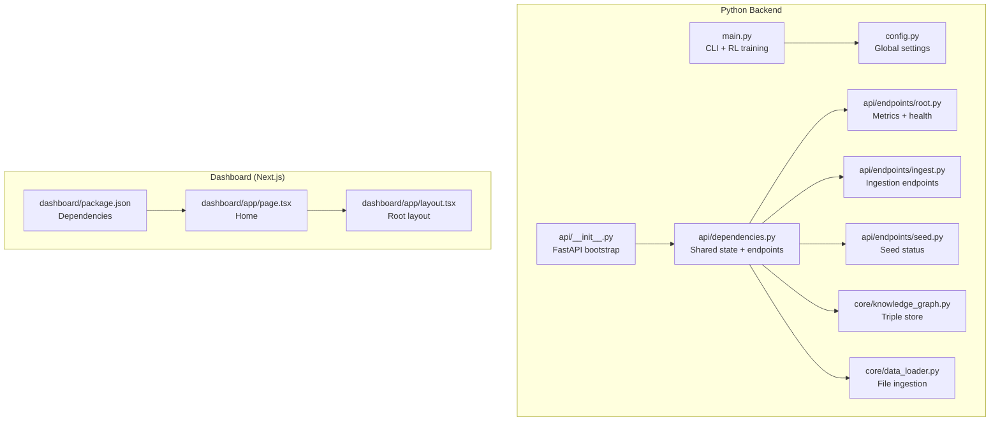
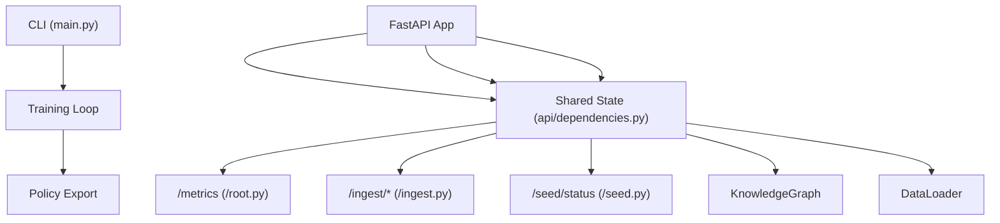

# Getting Started

<cite>
**Referenced Files in This Document**
- [requirements.txt](file://requirements.txt)
- [package.json](file://package.json)
- [config.py](file://config.py)
- [main.py](file://main.py)
- [api/__init__.py](file://api/__init__.py)
- [api/dependencies.py](file://api/dependencies.py)
- [api/endpoints/root.py](file://api/endpoints/root.py)
- [api/endpoints/ingest.py](file://api/endpoints/ingest.py)
- [api/endpoints/seed.py](file://api/endpoints/seed.py)
- [dashboard/package.json](file://dashboard/package.json)
- [dashboard/app/page.tsx](file://dashboard/app/page.tsx)
- [dashboard/app/layout.tsx](file://dashboard/app/layout.tsx)
- [core/knowledge_graph.py](file://core/knowledge_graph.py)
- [core/data_loader.py](file://core/data_loader.py)
</cite>

## Table of Contents
1. [Introduction](#introduction)
2. [Project Structure](#project-structure)
3. [Core Components](#core-components)
4. [Architecture Overview](#architecture-overview)
5. [Installation and Setup](#installation-and-setup)
6. [Quick Start Guide](#quick-start-guide)
7. [Environment Variables and Configuration](#environment-variables-and-configuration)
8. [Troubleshooting Guide](#troubleshooting-guide)
9. [Conclusion](#conclusion)

## Introduction
This guide helps you install, configure, and run the Semantic AI Decision Engine locally. It covers:
- Installing Python and Node.js dependencies
- Setting up the reinforcement learning environment and semantic processing stack
- Starting the dashboard frontend
- Running training episodes, exporting policies, and interacting with the CLI
- Basic usage examples for flood disaster response scenarios
- Environment variables and configuration options
- Troubleshooting across operating systems

## Project Structure
The repository is organized into modular components:
- Python backend: RL training, policy export, API server, semantic processing, and ingestion
- Dashboard: Next.js frontend for monitoring and visualization
- Artifacts: Seed knowledge and training materials
- Tests and scripts: Example demonstrations and validations

**Diagram sources**
- [main.py:1-401](file://main.py#L1-L401)
- [config.py:1-106](file://config.py#L1-L106)
- [api/__init__.py:1-61](file://api/__init__.py#L1-L61)
- [api/dependencies.py:1-800](file://api/dependencies.py#L1-L800)
- [api/endpoints/root.py:1-45](file://api/endpoints/root.py#L1-L45)
- [api/endpoints/ingest.py:1-292](file://api/endpoints/ingest.py#L1-L292)
- [api/endpoints/seed.py:1-29](file://api/endpoints/seed.py#L1-L29)
- [core/knowledge_graph.py:1-34](file://core/knowledge_graph.py#L1-L34)
- [core/data_loader.py:1-200](file://core/data_loader.py#L1-L200)
- [dashboard/package.json:1-30](file://dashboard/package.json#L1-L30)
- [dashboard/app/page.tsx:1-32](file://dashboard/app/page.tsx#L1-L32)
- [dashboard/app/layout.tsx:1-20](file://dashboard/app/layout.tsx#L1-L20)

**Section sources**
- [main.py:1-401](file://main.py#L1-L401)
- [config.py:1-106](file://config.py#L1-L106)
- [api/__init__.py:1-61](file://api/__init__.py#L1-L61)
- [api/dependencies.py:1-800](file://api/dependencies.py#L1-L800)
- [api/endpoints/root.py:1-45](file://api/endpoints/root.py#L1-L45)
- [api/endpoints/ingest.py:1-292](file://api/endpoints/ingest.py#L1-L292)
- [api/endpoints/seed.py:1-29](file://api/endpoints/seed.py#L1-L29)
- [core/knowledge_graph.py:1-34](file://core/knowledge_graph.py#L1-L34)
- [core/data_loader.py:1-200](file://core/data_loader.py#L1-L200)
- [dashboard/package.json:1-30](file://dashboard/package.json#L1-L30)
- [dashboard/app/page.tsx:1-32](file://dashboard/app/page.tsx#L1-L32)
- [dashboard/app/layout.tsx:1-20](file://dashboard/app/layout.tsx#L1-L20)

## Core Components
- Reinforcement Learning (RL) Training and Policy Export
  - Q-table and policy counter are initialized and managed in the main module.
  - Training runs episodes with probabilistic world dynamics and rewards.
  - Policy export writes a JSON policy file for deployment.
- Semantic Processing Stack
  - KnowledgeGraph stores triples with confidence and metadata.
  - DataLoader parses natural language and structured data into triples and transitions.
  - Parser and optional spaCy dependency parsing are configurable.
- API Server
  - FastAPI app bootstrapped via a proxy module to maintain shared state.
  - Endpoints expose metrics, ingestion, and seed status.
- Dashboard Frontend
  - Next.js app with React Force Graph and Recharts for visualization.

**Section sources**
- [main.py:25-208](file://main.py#L25-L208)
- [core/knowledge_graph.py:1-34](file://core/knowledge_graph.py#L1-L34)
- [core/data_loader.py:1-200](file://core/data_loader.py#L1-L200)
- [api/__init__.py:1-61](file://api/__init__.py#L1-L61)
- [api/dependencies.py:1-800](file://api/dependencies.py#L1-L800)
- [api/endpoints/root.py:1-45](file://api/endpoints/root.py#L1-L45)
- [api/endpoints/ingest.py:1-292](file://api/endpoints/ingest.py#L1-L292)
- [api/endpoints/seed.py:1-29](file://api/endpoints/seed.py#L1-L29)
- [dashboard/package.json:1-30](file://dashboard/package.json#L1-L30)

## Architecture Overview
High-level runtime architecture:
- CLI orchestrates RL training and policy export.
- API server exposes ingestion and metrics endpoints.
- Semantic stack (KnowledgeGraph, TMS, parser) persists and reasons over knowledge.
- Dashboard consumes API metrics and renders visualizations.

**Diagram sources**
- [main.py:174-208](file://main.py#L174-L208)
- [api/dependencies.py:1-800](file://api/dependencies.py#L1-L800)
- [api/endpoints/root.py:1-45](file://api/endpoints/root.py#L1-L45)
- [api/endpoints/ingest.py:1-292](file://api/endpoints/ingest.py#L1-L292)
- [api/endpoints/seed.py:1-29](file://api/endpoints/seed.py#L1-L29)
- [core/knowledge_graph.py:1-34](file://core/knowledge_graph.py#L1-L34)
- [core/data_loader.py:1-200](file://core/data_loader.py#L1-L200)

## Installation and Setup

### Prerequisites
- Python 3.8 or newer
- Node.js 18+ and npm 8+
- Git (recommended)

### Step 1: Clone and Prepare
- Clone the repository to your machine.
- Create a virtual environment for Python and activate it.

### Step 2: Install Python Dependencies
- Install Python packages from requirements.txt:
  - fastapi, uvicorn, numpy, pypdf, python-multipart, spacy, reportlab

**Section sources**
- [requirements.txt:1-9](file://requirements.txt#L1-L9)

### Step 3: Install Node.js Dependencies
- Navigate to the dashboard directory and install dependencies:
  - react-force-graph, react-force-graph-2d, next, react, react-dom, recharts, and dev dependencies

**Section sources**
- [dashboard/package.json:1-30](file://dashboard/package.json#L1-L30)

### Step 4: Download spaCy Model (Optional)
- If ENABLE_SPACY_DEP_PARSER is enabled, download the spaCy model configured by SPACY_MODEL_NAME.

**Section sources**
- [config.py:84-87](file://config.py#L84-L87)

### Step 5: Configure API Authentication (Optional)
- Set INGEST_API_KEY to enable X-API-Key protection on ingestion endpoints.

**Section sources**
- [config.py:56-61](file://config.py#L56-L61)
- [api/dependencies.py:78-89](file://api/dependencies.py#L78-L89)
- [api/endpoints/ingest.py:11-102](file://api/endpoints/ingest.py#L11-L102)

### Step 6: Start the API Server
- Run the FastAPI app with uvicorn on the host/port defined in config.

**Section sources**
- [config.py:52-53](file://config.py#L52-L53)
- [api/__init__.py:55-61](file://api/__init__.py#L55-L61)

### Step 7: Start the Dashboard
- From the dashboard directory, run the development server and open the browser to the homepage.

**Section sources**
- [dashboard/package.json:5-10](file://dashboard/package.json#L5-L10)
- [dashboard/app/page.tsx:1-32](file://dashboard/app/page.tsx#L1-L32)
- [dashboard/app/layout.tsx:1-20](file://dashboard/app/layout.tsx#L1-L20)

## Quick Start Guide

### A. Train the RL Agent
- Launch the CLI and run the full training:
  - Command: train
  - Expected outcome: training complete printed to console

**Section sources**
- [main.py:374-375](file://main.py#L374-L375)

### B. Export the Policy
- Export the learned policy to a JSON file:
  - Command: export
  - Expected outcome: policy exported printed to console; policy.json created

**Section sources**
- [main.py:378-379](file://main.py#L378-L379)
- [main.py:194-207](file://main.py#L194-L207)

### C. Deploy and Run a Demo
- Run a short deployment simulation using the exported policy:
  - Command: deploy
  - Expected outcome: step-by-step state-action trace and total reward printed

**Section sources**
- [main.py:380-381](file://main.py#L380-L381)
- [main.py:225-252](file://main.py#L225-L252)

### D. Seed Domain Knowledge
- Inject built-in domain knowledge for flood/disaster scenarios:
  - Command: seed
  - Expected outcome: seed triples ingested; status reflects new triple count

**Section sources**
- [main.py:382-383](file://main.py#L382-L383)
- [api/endpoints/seed.py:7-28](file://api/endpoints/seed.py#L7-L28)

### E. Load Data Files
- Load structured data (JSON/JSONL/CSV/TXT) containing facts, texts, and transitions:
  - Command: load <file>
  - Expected outcome: ingestion statistics printed

**Section sources**
- [main.py:384-389](file://main.py#L384-L389)
- [core/data_loader.py:53-68](file://core/data_loader.py#L53-L68)

### F. Teach a Fact (Natural Language)
- Parse and inject a single natural language statement:
  - Command: teach "<sentence>"
  - Expected outcome: triple(s) ingested or warning if parsing fails

**Section sources**
- [main.py:390-393](file://main.py#L390-L393)
- [core/data_loader.py:115-150](file://core/data_loader.py#L115-L150)

### G. Inspect Status
- View Q-table and knowledge base summaries:
  - Command: status
  - Expected outcome: counts of Q entries, policy states, valid TMS beliefs, KG triple count

**Section sources**
- [main.py:394-395](file://main.py#L394-L395)

### H. Additional CLI Commands
- episodes <N>: run N additional training episodes
- help/?/exit/quit/q: help, usage, and exit

**Section sources**
- [main.py:324-340](file://main.py#L324-L340)
- [main.py:396-401](file://main.py#L396-L401)

## Environment Variables and Configuration

### Python Configuration Options
- Actions and costs: define available actions and per-action cost penalties
- RL hyperparameters: learning rate, discount factor, initial exploration, decay, episodes, steps per episode
- World dynamics: probabilities governing rain-to-flood, flood-to-damage, damage-to-collapse, collapse-to-crisis, and clearing probabilities
- Policy export: output file name and confidence threshold
- JEPA: warmup epochs, simulations per key, weights file
- Curriculum: state file, error tolerance, stability window, API host/port
- Semantic stack: graph file, TMS decay and minimum confidence
- PDF ingest limits and flags
- Feature flags: enable/disable PDF ingest, space relations, spaCy dependency parser, enhanced negation
- Performance tuning: KG index cache size, thread pool size

**Section sources**
- [config.py:3-106](file://config.py#L3-L106)

### API Authentication
- INGEST_API_KEY: when set, requires X-API-Key header on ingestion endpoints

**Section sources**
- [config.py:56-61](file://config.py#L56-L61)
- [api/dependencies.py:78-89](file://api/dependencies.py#L78-L89)

### API Endpoints
- GET /metrics: returns counts and health signals
- GET /loop/health: returns recent loop artifacts and counts
- POST /ingest/texts, /ingest/seed, /ingest, /ingest/documents, /ingest/pdf, /ingest/pdfs, /ingest/candidates, /ingest/candidates/{id}/promote, /ingest/candidates/{id}/reject
- GET /seed/status: returns seed ingestion status

**Section sources**
- [api/endpoints/root.py:7-44](file://api/endpoints/root.py#L7-L44)
- [api/endpoints/ingest.py:11-292](file://api/endpoints/ingest.py#L11-L292)
- [api/endpoints/seed.py:7-28](file://api/endpoints/seed.py#L7-L28)

## Troubleshooting Guide

### Python Installation Issues
- Virtual environment not activating:
  - Ensure you created and activated a virtual environment before installing dependencies.
- Missing NumPy or SciPy compilation errors:
  - Install system build tools and reinstall NumPy from requirements.
- spaCy model not found:
  - Download the model specified by SPACY_MODEL_NAME or disable spaCy-dependent features.

**Section sources**
- [requirements.txt:1-9](file://requirements.txt#L1-L9)
- [config.py:84-87](file://config.py#L84-L87)

### API Server Issues
- Port already in use:
  - Change API_HOST/API_PORT in config or kill the conflicting process.
- CORS or authentication errors:
  - Verify INGEST_API_KEY and X-API-Key header for protected endpoints.

**Section sources**
- [config.py:52-53](file://config.py#L52-L53)
- [config.py:56-61](file://config.py#L56-L61)
- [api/dependencies.py:78-89](file://api/dependencies.py#L78-L89)

### Dashboard Issues
- Node modules missing:
  - Run npm install in the dashboard directory.
- Next.js dev server not starting:
  - Check port availability and Node.js version compatibility.

**Section sources**
- [dashboard/package.json:1-30](file://dashboard/package.json#L1-L30)

### RL Training and Policy Export
- Training completes quickly:
  - Confirm TRAIN_EPISODES and STEPS_PER_EPISODE values.
- Policy file not created:
  - Ensure export was executed and POLICY_CONFIDENCE_THRESHOLD is met.

**Section sources**
- [config.py:17-22](file://config.py#L17-L22)
- [config.py:37-39](file://config.py#L37-L39)
- [main.py:174-207](file://main.py#L174-L207)

### Flood Disaster Scenario Behavior
- Threat progression:
  - Rain → Flood → Damage → Collapse → Crisis, with clearing probabilities.
- Action effects:
  - Barrier reduces flood/damage; Release reduces flood; Evacuate removes crisis/collapse and introduces temporary evacuated state.

**Section sources**
- [main.py:43-80](file://main.py#L43-L80)
- [main.py:85-111](file://main.py#L85-L111)

## Conclusion
You now have the Semantic AI Decision Engine installed and running locally. Use the CLI to train, export, and deploy policies, and leverage the API and dashboard for ingestion and monitoring. Adjust configuration via environment variables and config.py to fit your environment and workload.