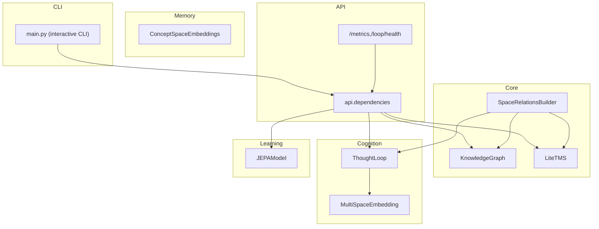
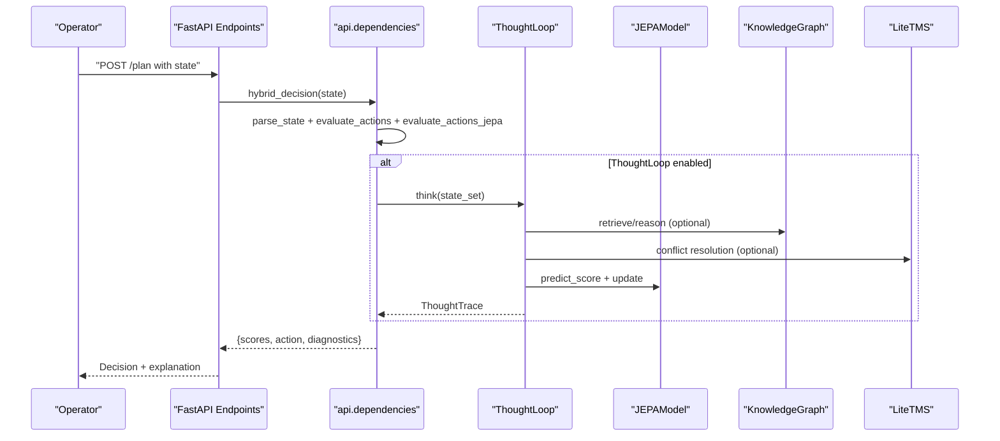
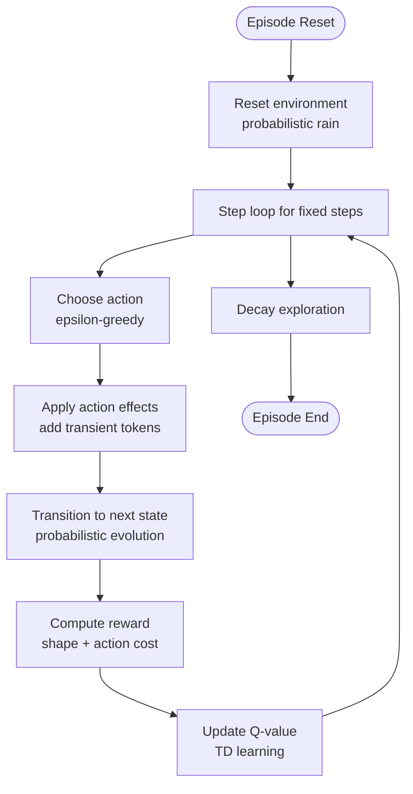
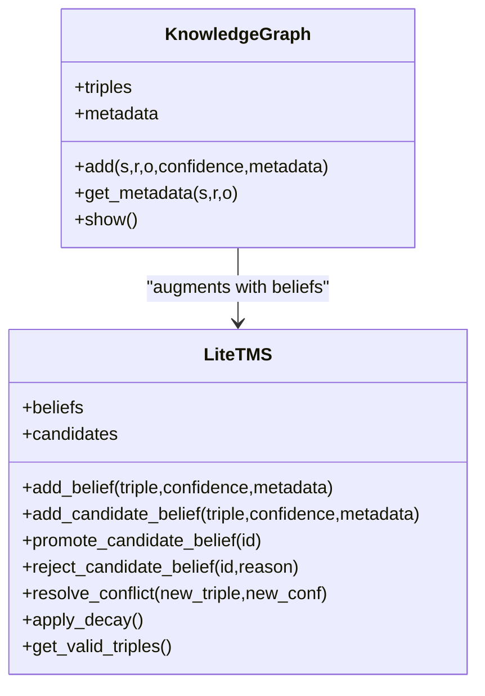
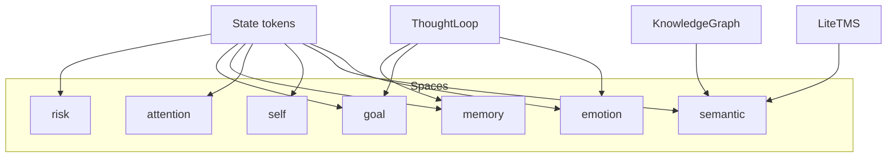
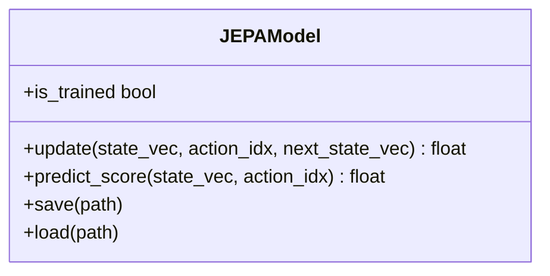
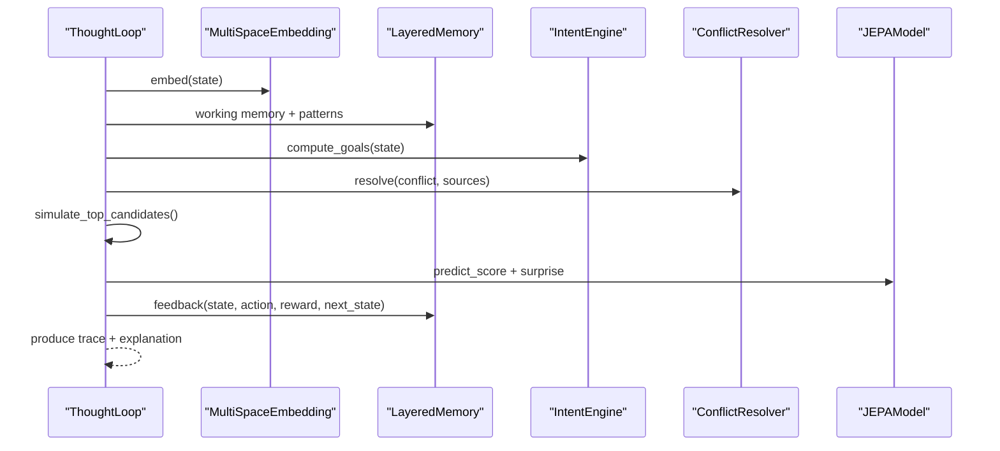
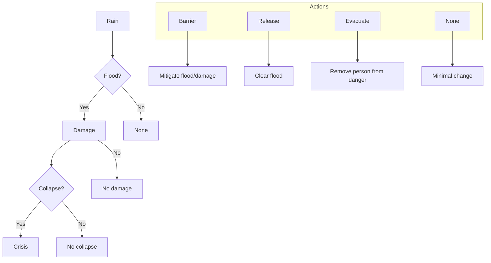
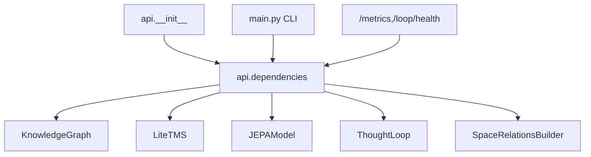

# Project Overview

<cite>
**Referenced Files in This Document**
- [main.py](file://main.py)
- [config.py](file://config.py)
- [api/dependencies.py](file://api/dependencies.py)
- [api/endpoints/root.py](file://api/endpoints/root.py)
- [core/knowledge_graph.py](file://core/knowledge_graph.py)
- [core/tms.py](file://core/tms.py)
- [core/space_relations.py](file://core/space_relations.py)
- [cognition/thought_loop.py](file://cognition/thought_loop.py)
- [cognition/multispace_embedding.py](file://cognition/multispace_embedding.py)
- [learning/jepa.py](file://learning/jepa.py)
- [docs/concept_space_tensor_model.md](file://docs/concept_space_tensor_model.md)
</cite>

## Table of Contents
1. [Introduction](#introduction)
2. [Project Structure](#project-structure)
3. [Core Components](#core-components)
4. [Architecture Overview](#architecture-overview)
5. [Detailed Component Analysis](#detailed-component-analysis)
6. [Dependency Analysis](#dependency-analysis)
7. [Performance Considerations](#performance-considerations)
8. [Troubleshooting Guide](#troubleshooting-guide)
9. [Conclusion](#conclusion)
10. [Appendices](#appendices)

## Introduction
The Semantic AI Decision Engine is a hybrid intelligence system designed to support disaster response decision-making by combining reinforcement learning with semantic knowledge representation. It models real-world scenarios such as floods, where evolving threat states (e.g., rain → flood → damage → collapse → crisis) require adaptive, explainable actions (e.g., barrier installation, water release, evacuation). The system integrates:
- A Q-learning policy engine that learns optimal actions from simulated environments
- A knowledge graph augmented by a Truth Maintenance System (TMS) to manage beliefs and resolve conflicts
- Multi-space reasoning that embeds states across cognitive and domain spaces (risk, goal, memory, attention, self, semantic, arithmetic, calculus, curriculum, emotion)
- A JEPA-based world model that predicts next-state latents to guide safer decisions and quantify uncertainty

This enables both beginner-friendly conceptual understanding and developer-focused technical coverage, including mathematical foundations, data flows, and practical deployment examples.

## Project Structure
The repository organizes functionality into cohesive layers:
- Core: Knowledge graph, TMS, reasoning, and space relations
- Cognition: Thought loop, multi-space embedding, and related cognitive modules
- Learning: JEPA model and curriculum-related learners
- Memory: Concept space embeddings and graph store
- API: FastAPI endpoints, shared dependencies, and orchestration of the semantic stack
- CLI: Interactive training, policy export, and deployment demonstrations

**Diagram sources**
- [api/dependencies.py:90-118](file://api/dependencies.py#L90-L118)
- [core/knowledge_graph.py:1-34](file://core/knowledge_graph.py#L1-L34)
- [core/tms.py:4-158](file://core/tms.py#L4-L158)
- [core/space_relations.py:84-167](file://core/space_relations.py#L84-L167)
- [cognition/thought_loop.py:50-100](file://cognition/thought_loop.py#L50-L100)
- [cognition/multispace_embedding.py:25-105](file://cognition/multispace_embedding.py#L25-L105)
- [learning/jepa.py:49-152](file://learning/jepa.py#L49-L152)
- [api/endpoints/root.py:7-29](file://api/endpoints/root.py#L7-L29)
- [main.py:256-401](file://main.py#L256-L401)

**Section sources**
- [api/dependencies.py:90-118](file://api/dependencies.py#L90-L118)
- [api/endpoints/root.py:7-29](file://api/endpoints/root.py#L7-L29)
- [main.py:256-401](file://main.py#L256-L401)

## Core Components
- Q-learning policy engine: A tabular Q-table with action selection, reward shaping, and updates, trained in a flood/disaster environment with probabilistic transitions and action costs.
- Knowledge graph and TMS: Stores facts as triples with confidence and metadata; applies decay and conflict resolution to maintain valid beliefs.
- Multi-space reasoning: Embeds states across six cognitive and domain spaces (risk, goal, memory, attention, self, semantic) to inform decision-making.
- JEPA world model: Predicts next-state latents from (state, action) contexts to score actions by safety proximity to a “safe” latent.
- Thought loop: Orchestrates perception, memory, intent, conflict resolution, simulation, and feedback to produce a decision with confidence and explainability.

These components collectively enable hybrid decision-making: learned policies (Q-table), explicit semantic knowledge (KG/TMS), and latent-world modeling (JEPA), all coordinated by multi-space embeddings.

**Section sources**
- [main.py:28-170](file://main.py#L28-L170)
- [config.py:5-40](file://config.py#L5-L40)
- [core/knowledge_graph.py:1-34](file://core/knowledge_graph.py#L1-L34)
- [core/tms.py:4-158](file://core/tms.py#L4-L158)
- [cognition/multispace_embedding.py:25-105](file://cognition/multispace_embedding.py#L25-L105)
- [cognition/thought_loop.py:50-156](file://cognition/thought_loop.py#L50-L156)
- [learning/jepa.py:49-152](file://learning/jepa.py#L49-L152)

## Architecture Overview
The system’s architecture blends reinforcement learning with semantic knowledge and multi-space reasoning:

**Diagram sources**
- [api/dependencies.py:726-758](file://api/dependencies.py#L726-L758)
- [cognition/thought_loop.py:64-156](file://cognition/thought_loop.py#L64-L156)
- [learning/jepa.py:137-152](file://learning/jepa.py#L137-L152)
- [core/knowledge_graph.py:1-34](file://core/knowledge_graph.py#L1-L34)
- [core/tms.py:111-158](file://core/tms.py#L111-L158)

## Detailed Component Analysis

### Q-Learning Policy Engine (Disaster Environment)
- State space: discrete threat flags (e.g., rain, flood, damage, collapse, crisis) and transient action tokens (barrier, release, evacuated).
- Actions: barrier, release, evacuate, none with associated costs.
- World dynamics: probabilistic transitions reflecting real-world evolution (e.g., rain → flood, flood → damage, etc.).
- Reward function: shaped to penalize ineffective actions and avoid unnecessary risks.
- Training: episodic with decaying exploration, updating Q-values via temporal difference learning.

**Diagram sources**
- [main.py:34-112](file://main.py#L34-L112)
- [main.py:174-189](file://main.py#L174-L189)
- [config.py:17-22](file://config.py#L17-L22)

**Section sources**
- [main.py:34-112](file://main.py#L34-L112)
- [main.py:174-189](file://main.py#L174-L189)
- [config.py:17-22](file://config.py#L17-L22)

### Knowledge Graph and Truth Maintenance System
- KnowledgeGraph stores triples with confidence and metadata; supports retrieval and metadata association.
- LiteTMS manages belief validity, usage, importance, and decay; resolves conflicts between opposing relations.

**Diagram sources**
- [core/knowledge_graph.py:1-34](file://core/knowledge_graph.py#L1-L34)
- [core/tms.py:4-158](file://core/tms.py#L4-L158)

**Section sources**
- [core/knowledge_graph.py:1-34](file://core/knowledge_graph.py#L1-L34)
- [core/tms.py:4-158](file://core/tms.py#L4-L158)

### Multi-Space Reasoning and Concept Spaces
- MultiSpaceEmbedding projects a state into six cognitive and domain spaces: risk, goal, memory, attention, self, semantic, emotion.
- SpaceRelationsBuilder constructs unified relation graphs across spaces (e.g., semantic, memory, goal, risk, arithmetic, calculus, curriculum, emotion) anchored by state tokens and query terms.

**Diagram sources**
- [cognition/multispace_embedding.py:36-105](file://cognition/multispace_embedding.py#L36-L105)
- [core/space_relations.py:84-167](file://core/space_relations.py#L84-L167)

**Section sources**
- [cognition/multispace_embedding.py:25-105](file://cognition/multispace_embedding.py#L25-L105)
- [core/space_relations.py:84-167](file://core/space_relations.py#L84-L167)
- [docs/concept_space_tensor_model.md:1-58](file://docs/concept_space_tensor_model.md#L1-L58)

### JEPA World Model
- JEPA predicts next-state latents from (state, action) contexts; higher scores indicate safer outcomes closer to a “safe” latent.
- Supports early stopping and persistence; integrated into the thought loop to compute surprise and emotion deltas.

**Diagram sources**
- [learning/jepa.py:49-152](file://learning/jepa.py#L49-L152)

**Section sources**
- [learning/jepa.py:49-152](file://learning/jepa.py#L49-L152)
- [cognition/thought_loop.py:194-201](file://cognition/thought_loop.py#L194-L201)

### Thought Loop Pipeline
- Deliberative pipeline: Perception → Memory → Intent → Conflict → Simulation → Decision → Feedback.
- Combines Q-scores, simulation projections, and JEPA scores with weighted fusion; selects action with confidence and produces human-readable explanations.

**Diagram sources**
- [cognition/thought_loop.py:64-156](file://cognition/thought_loop.py#L64-L156)
- [cognition/multispace_embedding.py:36-105](file://cognition/multispace_embedding.py#L36-L105)

**Section sources**
- [cognition/thought_loop.py:50-156](file://cognition/thought_loop.py#L50-L156)

### Disaster Response Scenario: Flood Management
- Threat states: rain → flood → damage → collapse → crisis.
- Actions: barrier (mitigates flood/damage), release (removes flood), evacuate (removes person from danger), none (minimal effort).
- Rewards and costs reflect real-world trade-offs; policy confidence thresholds govern policy export and deployment.
- The CLI demonstrates training, policy export, and deployment runs to showcase decision sequences under evolving threat states.

**Diagram sources**
- [main.py:43-80](file://main.py#L43-L80)
- [main.py:85-112](file://main.py#L85-L112)
- [config.py:26-34](file://config.py#L26-L34)

**Section sources**
- [main.py:43-112](file://main.py#L43-L112)
- [config.py:26-34](file://config.py#L26-L34)

## Dependency Analysis
The API orchestrates the semantic stack and exposes metrics and health checks. The CLI initializes the semantic stack lazily for interactive use.

**Diagram sources**
- [api/__init__.py:18-61](file://api/__init__.py#L18-L61)
- [api/dependencies.py:90-118](file://api/dependencies.py#L90-L118)
- [api/endpoints/root.py:7-29](file://api/endpoints/root.py#L7-L29)
- [main.py:265-323](file://main.py#L265-L323)

**Section sources**
- [api/__init__.py:18-61](file://api/__init__.py#L18-L61)
- [api/dependencies.py:90-118](file://api/dependencies.py#L90-L118)
- [api/endpoints/root.py:7-29](file://api/endpoints/root.py#L7-L29)
- [main.py:265-323](file://main.py#L265-L323)

## Performance Considerations
- Tabular Q-learning: Efficient for small, discrete state/action spaces typical in scenario-based domains; consider function approximation for larger state spaces.
- JEPA training: Warm-up from Q-table keys and early stopping reduce overfitting and improve generalization.
- Multi-space embeddings: Lightweight vectorizations enable rapid reasoning across spaces; caching and normalization prevent numerical drift.
- API throughput: Rate limiting and thread-safe locks protect resource contention during ingestion and inference.

[No sources needed since this section provides general guidance]

## Troubleshooting Guide
- Policy export threshold: Adjust policy confidence threshold to include more or fewer states in the exported policy.
- Training instability: Reduce learning rate or increase steps per episode; monitor policy confidence and conflicts.
- Knowledge decay: Tune decay rate and minimum confidence to preserve useful beliefs.
- JEPA training: Ensure sufficient samples and consider early stopping criteria; verify safe latent encoding after weight updates.
- API ingestion: Validate API key configuration and rate limits; check logs for ingest events and errors.

**Section sources**
- [config.py:38-40](file://config.py#L38-L40)
- [core/tms.py:130-151](file://core/tms.py#L130-L151)
- [learning/jepa.py:56-72](file://learning/jepa.py#L56-L72)
- [api/dependencies.py:78-89](file://api/dependencies.py#L78-L89)

## Conclusion
The Semantic AI Decision Engine demonstrates a practical hybrid approach to disaster response decision-making. By combining reinforcement learning with semantic knowledge and multi-space reasoning, it achieves robust, explainable decisions under uncertainty. The modular architecture supports incremental learning, curriculum-driven bootstrapping, and real-time deployment, making it adaptable to evolving domains such as flood management.

[No sources needed since this section summarizes without analyzing specific files]

## Appendices

### Practical Examples
- Training and exporting a policy:
  - Train episodes, then export policy to a JSON file for deployment.
- Deployment demo:
  - Run a fixed sequence of steps under evolving threat states to observe cumulative reward and action selection.
- Interactive CLI:
  - Teach facts, load data files, seed domain knowledge, and inspect Q-table and knowledge-base summaries.

**Section sources**
- [main.py:174-208](file://main.py#L174-L208)
- [main.py:225-252](file://main.py#L225-L252)
- [main.py:278-323](file://main.py#L278-L323)