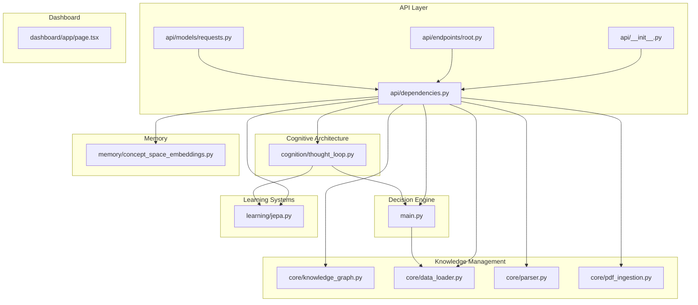
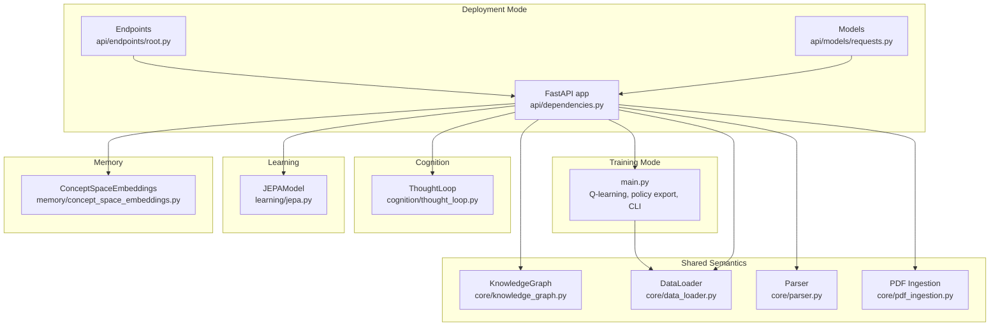
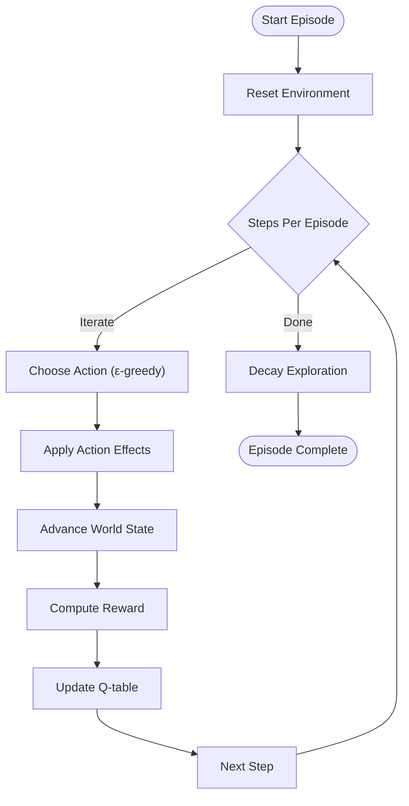
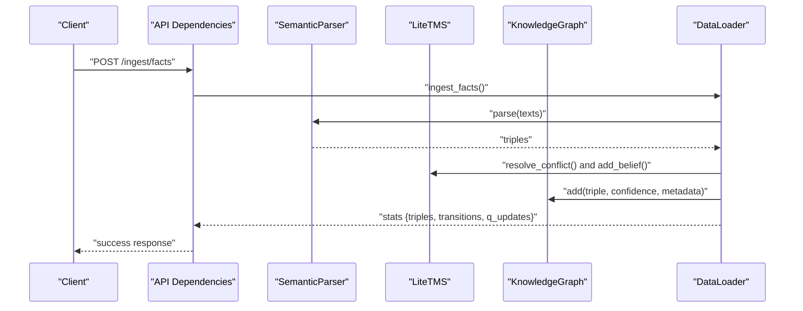
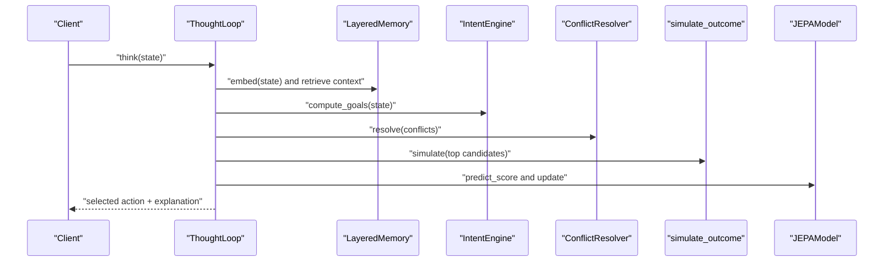
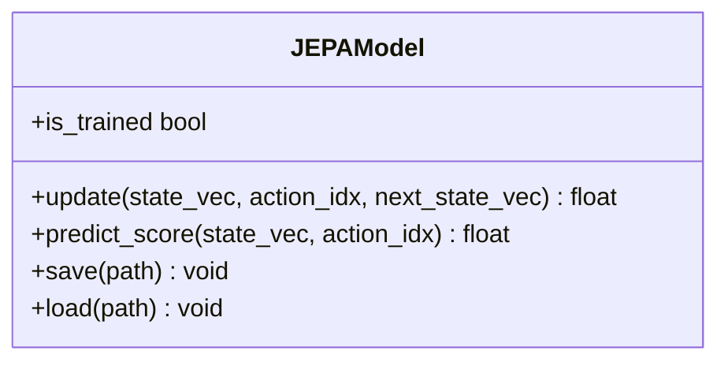
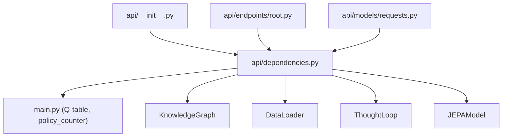
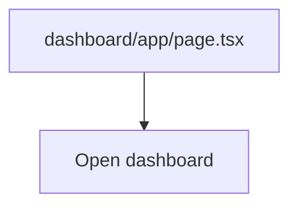
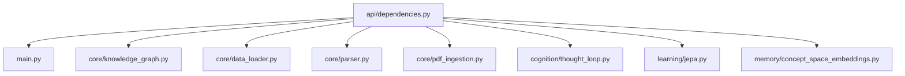

# System Architecture

<cite>
**Referenced Files in This Document**
- [main.py](file://main.py)
- [config.py](file://config.py)
- [requirements.txt](file://requirements.txt)
- [package.json](file://package.json)
- [api/__init__.py](file://api/__init__.py)
- [api/dependencies.py](file://api/dependencies.py)
- [api/endpoints/root.py](file://api/endpoints/root.py)
- [api/models/requests.py](file://api/models/requests.py)
- [core/knowledge_graph.py](file://core/knowledge_graph.py)
- [core/data_loader.py](file://core/data_loader.py)
- [core/pdf_ingestion.py](file://core/pdf_ingestion.py)
- [core/parser.py](file://core/parser.py)
- [cognition/thought_loop.py](file://cognition/thought_loop.py)
- [memory/concept_space_embeddings.py](file://memory/concept_space_embeddings.py)
- [learning/jepa.py](file://learning/jepa.py)
- [dashboard/app/page.tsx](file://dashboard/app/page.tsx)
</cite>

## Table of Contents
1. [Introduction](#introduction)
2. [Project Structure](#project-structure)
3. [Core Components](#core-components)
4. [Architecture Overview](#architecture-overview)
5. [Detailed Component Analysis](#detailed-component-analysis)
6. [Dependency Analysis](#dependency-analysis)
7. [Performance Considerations](#performance-considerations)
8. [Troubleshooting Guide](#troubleshooting-guide)
9. [Conclusion](#conclusion)
10. [Appendices](#appendices)

## Introduction
This document describes the architecture of the Semantic AI Decision Engine, a hybrid intelligence system that combines reinforcement learning with semantic knowledge representation. The system is designed around a layered architecture:
- Decision Engine: Q-learning with policy export and deployment agents
- Knowledge Management: Semantic parsing, knowledge graph, and TMS-backed belief resolution
- Learning Systems: JEPA world model, curriculum controller, and concept/rule learners
- Cognitive Architecture: Thought loop integrating perception, memory, intent, conflict resolution, simulation, and emotion

It supports two operational modes:
- Training Mode (main.py): Interactive CLI for training, policy export, and demonstration
- Deployment Mode (API layer): FastAPI service exposing endpoints for ingestion, reasoning, and metrics

The system integrates NumPy for numerical operations, spaCy for optional dependency parsing, and provides a Next.js dashboard for monitoring and inspection.

## Project Structure
The repository is organized into functional domains:
- api/: FastAPI application with endpoints, shared dependencies, and Pydantic models
- core/: Semantic parsing, knowledge graph, TMS, and curriculum logic
- cognition/: Thought loop and related cognitive components
- memory/: Concept space embeddings and graph storage
- learning/: JEPA world model, curriculum, and learners
- dashboard/: Next.js frontend for metrics and visualization
- artifacts/: Seed knowledge, training PDFs, and generated reports
- tests/: Unit tests for major components

**Diagram sources**
- [api/__init__.py:1-61](file://api/__init__.py#L1-L61)
- [api/dependencies.py:1-120](file://api/dependencies.py#L1-L120)
- [api/endpoints/root.py:1-45](file://api/endpoints/root.py#L1-L45)
- [api/models/requests.py:1-90](file://api/models/requests.py#L1-L90)
- [main.py:1-401](file://main.py#L1-L401)
- [core/knowledge_graph.py:1-34](file://core/knowledge_graph.py#L1-L34)
- [core/data_loader.py:1-500](file://core/data_loader.py#L1-L500)
- [core/parser.py](file://core/parser.py)
- [core/pdf_ingestion.py](file://core/pdf_ingestion.py)
- [cognition/thought_loop.py:1-279](file://cognition/thought_loop.py#L1-L279)
- [learning/jepa.py:1-185](file://learning/jepa.py#L1-L185)
- [memory/concept_space_embeddings.py:1-160](file://memory/concept_space_embeddings.py#L1-L160)
- [dashboard/app/page.tsx:1-32](file://dashboard/app/page.tsx#L1-L32)

**Section sources**
- [api/__init__.py:1-61](file://api/__init__.py#L1-L61)
- [api/dependencies.py:1-120](file://api/dependencies.py#L1-L120)
- [main.py:1-401](file://main.py#L1-L401)

## Core Components
- Q-learning Policy Engine (main.py): Defines states, actions, rewards, and Q-table updates; includes training, policy export, and deployment agents
- Knowledge Graph (core/knowledge_graph.py): Stores facts as triples with confidence and metadata
- Data Loader (core/data_loader.py): Parses and ingests structured/unstructured data into TMS/KG and warms the Q-table
- Thought Loop (cognition/thought_loop.py): Cognitive pipeline integrating perception, memory, intent, conflict resolution, simulation, and emotion
- JEPA World Model (learning/jepa.py): Latent-state predictive model for action scoring and online updates
- Concept Space Embeddings (memory/concept_space_embeddings.py): Persistent per-concept, per-space embeddings
- API Dependencies (api/dependencies.py): Centralized FastAPI app bootstrap, shared state, and orchestration
- Root API Endpoints (api/endpoints/root.py): Health, metrics, and loop health checks
- Requests Models (api/models/requests.py): Pydantic models for API payloads

**Section sources**
- [main.py:143-221](file://main.py#L143-L221)
- [core/knowledge_graph.py:1-34](file://core/knowledge_graph.py#L1-L34)
- [core/data_loader.py:39-500](file://core/data_loader.py#L39-L500)
- [cognition/thought_loop.py:50-170](file://cognition/thought_loop.py#L50-L170)
- [learning/jepa.py:49-185](file://learning/jepa.py#L49-L185)
- [memory/concept_space_embeddings.py:23-160](file://memory/concept_space_embeddings.py#L23-L160)
- [api/dependencies.py:1-120](file://api/dependencies.py#L1-L120)
- [api/endpoints/root.py:1-45](file://api/endpoints/root.py#L1-L45)
- [api/models/requests.py:1-90](file://api/models/requests.py#L1-L90)

## Architecture Overview
The system separates training and deployment concerns:
- Training Mode (main.py): Provides CLI commands to train Q-table, export policy, and run deployment demos. It also lazily initializes the semantic stack for interactive use.
- Deployment Mode (API layer): FastAPI app exposes endpoints for ingestion, reasoning, and metrics. Shared state and orchestration live in api/dependencies.py, which imports main.py for Q-table access and policy counters.

**Diagram sources**
- [main.py:1-401](file://main.py#L1-L401)
- [api/dependencies.py:1-120](file://api/dependencies.py#L1-L120)
- [api/endpoints/root.py:1-45](file://api/endpoints/root.py#L1-L45)
- [api/models/requests.py:1-90](file://api/models/requests.py#L1-L90)
- [core/knowledge_graph.py:1-34](file://core/knowledge_graph.py#L1-L34)
- [core/data_loader.py:1-500](file://core/data_loader.py#L1-L500)
- [core/parser.py](file://core/parser.py)
- [core/pdf_ingestion.py](file://core/pdf_ingestion.py)
- [cognition/thought_loop.py:1-279](file://cognition/thought_loop.py#L1-L279)
- [learning/jepa.py:1-185](file://learning/jepa.py#L1-L185)
- [memory/concept_space_embeddings.py:1-160](file://memory/concept_space_embeddings.py#L1-L160)

## Detailed Component Analysis

### Decision Engine: Q-learning and Policy Export
The Decision Engine defines:
- Actions, rewards, and state transitions
- Epsilon-greedy action selection and Q-table updates
- Episode-based training and policy export to JSON
- Deployment agent that loads the exported policy

**Diagram sources**
- [main.py:174-189](file://main.py#L174-L189)
- [main.py:122-169](file://main.py#L122-L169)
- [main.py:85-112](file://main.py#L85-L112)
- [main.py:43-81](file://main.py#L43-L81)

**Section sources**
- [main.py:143-221](file://main.py#L143-L221)
- [main.py:174-208](file://main.py#L174-L208)

### Knowledge Management: Semantic Parsing and Ingestion
The Knowledge Management layer parses natural language into triples, validates and injects them into the KnowledgeGraph, and coordinates with TMS for belief resolution. It also supports bulk ingestion from JSON/JSONL/CSV/TXT and PDFs.

**Diagram sources**
- [api/dependencies.py:1-120](file://api/dependencies.py#L1-L120)
- [core/data_loader.py:115-150](file://core/data_loader.py#L115-L150)
- [core/parser.py](file://core/parser.py)
- [core/knowledge_graph.py:1-34](file://core/knowledge_graph.py#L1-L34)

**Section sources**
- [core/data_loader.py:39-500](file://core/data_loader.py#L39-L500)
- [core/knowledge_graph.py:1-34](file://core/knowledge_graph.py#L1-L34)

### Cognitive Architecture: Thought Loop
The Thought Loop orchestrates:
- Perception and multi-space embedding
- Intent computation and memory retrieval
- Conflict resolution among action candidates
- Simulation of candidate actions
- Emotion modeling and JEPA surprise feedback

**Diagram sources**
- [cognition/thought_loop.py:64-170](file://cognition/thought_loop.py#L64-L170)
- [api/dependencies.py:545-770](file://api/dependencies.py#L545-L770)

**Section sources**
- [cognition/thought_loop.py:50-170](file://cognition/thought_loop.py#L50-L170)
- [api/dependencies.py:545-770](file://api/dependencies.py#L545-L770)

### Learning Systems: JEPA World Model
JEPA predicts the latent representation of next state given (state, action) context and uses an EMA target encoder. It provides action scoring and online updates during decisions.

**Diagram sources**
- [learning/jepa.py:49-185](file://learning/jepa.py#L49-L185)

**Section sources**
- [learning/jepa.py:49-185](file://learning/jepa.py#L49-L185)
- [api/dependencies.py:570-630](file://api/dependencies.py#L570-L630)

### API Layer: Orchestration and Endpoints
The API layer centralizes shared state and exposes endpoints for metrics, loop health, and ingestion. It imports main.py to access the Q-table and policy counters.

**Diagram sources**
- [api/__init__.py:1-61](file://api/__init__.py#L1-L61)
- [api/dependencies.py:1-120](file://api/dependencies.py#L1-L120)
- [api/endpoints/root.py:1-45](file://api/endpoints/root.py#L1-L45)
- [api/models/requests.py:1-90](file://api/models/requests.py#L1-L90)
- [main.py:1-401](file://main.py#L1-L401)

**Section sources**
- [api/__init__.py:1-61](file://api/__init__.py#L1-L61)
- [api/dependencies.py:1-120](file://api/dependencies.py#L1-L120)
- [api/endpoints/root.py:1-45](file://api/endpoints/root.py#L1-L45)
- [api/models/requests.py:1-90](file://api/models/requests.py#L1-L90)

### Dashboard: Monitoring and Inspection
The Next.js dashboard provides a landing page and links to the live dashboard for inspecting metrics, graph structure, and reasoning output.

**Diagram sources**
- [dashboard/app/page.tsx:1-32](file://dashboard/app/page.tsx#L1-L32)

**Section sources**
- [dashboard/app/page.tsx:1-32](file://dashboard/app/page.tsx#L1-L32)

## Dependency Analysis
The system exhibits clear separation of concerns:
- API depends on main.py for Q-table and policy counters
- Knowledge management depends on parser and PDF ingestion
- Thought loop depends on JEPA, memory, intent, and conflict resolver
- Concept space embeddings persist and update per-concept vectors

**Diagram sources**
- [api/dependencies.py:1-120](file://api/dependencies.py#L1-L120)
- [main.py:1-401](file://main.py#L1-L401)
- [core/knowledge_graph.py:1-34](file://core/knowledge_graph.py#L1-L34)
- [core/data_loader.py:1-500](file://core/data_loader.py#L1-L500)
- [core/parser.py](file://core/parser.py)
- [core/pdf_ingestion.py](file://core/pdf_ingestion.py)
- [cognition/thought_loop.py:1-279](file://cognition/thought_loop.py#L1-L279)
- [learning/jepa.py:1-185](file://learning/jepa.py#L1-L185)
- [memory/concept_space_embeddings.py:1-160](file://memory/concept_space_embeddings.py#L1-L160)

**Section sources**
- [api/dependencies.py:1-120](file://api/dependencies.py#L1-L120)

## Performance Considerations
- Numerical Operations: NumPy arrays enable efficient vectorized computations for state/action embeddings and JEPA updates
- Threading and Locking: API dependencies use locks for thread-safe JEPA updates and inference counters
- Feature Flags: Environment toggles control optional features (e.g., spaCy dependency parser, space relations) to balance performance and accuracy
- Rate Limiting: Ingest endpoints include rate limiting to prevent overload
- Early Stopping: JEPA supports early stopping to reduce unnecessary training overhead

[No sources needed since this section provides general guidance]

## Troubleshooting Guide
Common issues and diagnostics:
- Authentication: Ingest endpoints require an API key when configured; otherwise, they are unauthenticated
- Rate Limiting: Exceeding ingest limits triggers a 429 response
- PDF Ingestion: Errors during PDF extraction propagate as ingestion errors
- Thought Loop Failures: Exceptions in the thought loop are logged and do not crash the API
- JEPA Online Updates: Failures during online updates are caught and logged

**Section sources**
- [api/dependencies.py:78-93](file://api/dependencies.py#L78-L93)
- [api/dependencies.py:195-209](file://api/dependencies.py#L195-L209)
- [core/pdf_ingestion.py](file://core/pdf_ingestion.py)
- [api/dependencies.py:750-770](file://api/dependencies.py#L750-L770)

## Conclusion
The Semantic AI Decision Engine integrates reinforcement learning with semantic knowledge representation through a layered, modular architecture. Training mode focuses on Q-learning and policy export, while deployment mode exposes a robust API with ingestion, reasoning, and metrics. The cognitive Thought Loop augments decisions with simulation and emotion-aware feedback, and JEPA provides a latent-world model for safer action scoring. The system’s design enables independent development of subsystems while maintaining cohesive functionality, with clear boundaries between training and deployment modes.

[No sources needed since this section summarizes without analyzing specific files]

## Appendices

### Technology Stack
- Web Services: FastAPI, Uvicorn
- Numerical Operations: NumPy
- NLP Processing: spaCy (optional)
- PDF Handling: pypdf
- Frontend: React Force Graph (Next.js dashboard)

**Section sources**
- [requirements.txt:1-9](file://requirements.txt#L1-L9)
- [package.json:1-7](file://package.json#L1-L7)

### System Boundaries: Training vs. Deployment
- Training Mode (main.py): Interactive CLI for training episodes, policy export, and deployment demonstrations
- Deployment Mode (API layer): FastAPI app with endpoints for ingestion, reasoning, and metrics; imports main.py for Q-table access

**Section sources**
- [main.py:256-401](file://main.py#L256-L401)
- [api/__init__.py:1-61](file://api/__init__.py#L1-L61)

### Integration Patterns: Q-learning and Semantic Processing
- Q-table updates are coordinated through main.py and can be warmed by DataLoader with curated transitions
- Thought Loop integrates Q-scores, simulation estimates, and JEPA scores to produce a hybrid decision
- Concept space embeddings inform multi-space reasoning and are updated from facts

**Section sources**
- [core/data_loader.py:305-338](file://core/data_loader.py#L305-L338)
- [api/dependencies.py:726-758](file://api/dependencies.py#L726-L758)
- [memory/concept_space_embeddings.py:73-129](file://memory/concept_space_embeddings.py#L73-L129)

### Infrastructure Requirements
- Python packages defined in requirements.txt
- Optional spaCy model name configurable via environment
- Thread pool sizing and index cache sizes configurable via environment

**Section sources**
- [requirements.txt:1-9](file://requirements.txt#L1-L9)
- [config.py:84-106](file://config.py#L84-L106)

### Scalability and Deployment Topology
- API can be scaled behind a reverse proxy and load balancer
- Rate limiting protects ingestion endpoints
- JEPA training supports early stopping to control resource usage
- Dashboard runs independently and can be deployed separately

[No sources needed since this section provides general guidance]

### Relationship Between CLI and Dashboard
- CLI (main.py) provides interactive training and policy export
- Dashboard (Next.js) offers a user-friendly interface to inspect metrics and reasoning traces

**Section sources**
- [main.py:256-401](file://main.py#L256-L401)
- [dashboard/app/page.tsx:1-32](file://dashboard/app/page.tsx#L1-32)