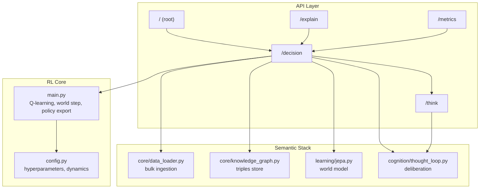
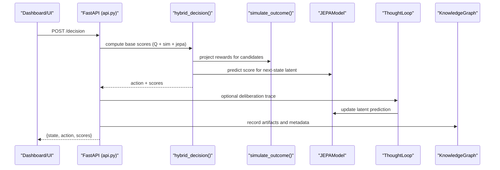
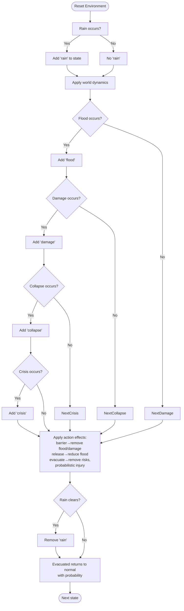
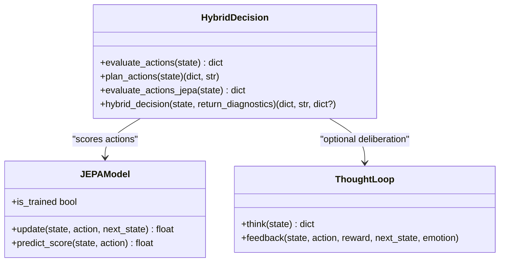
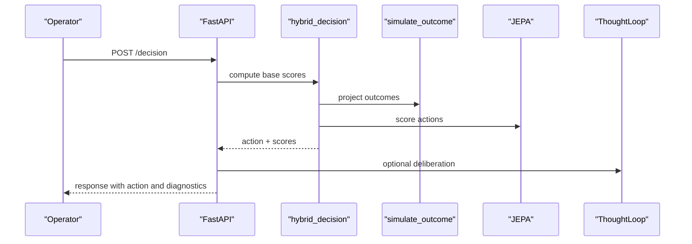
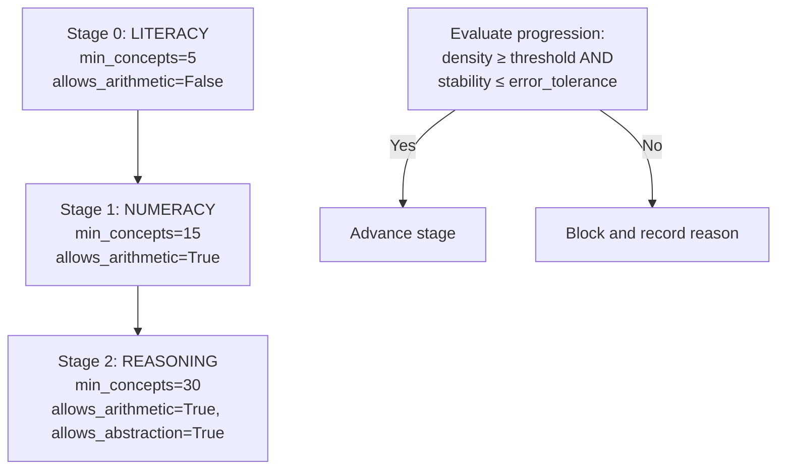
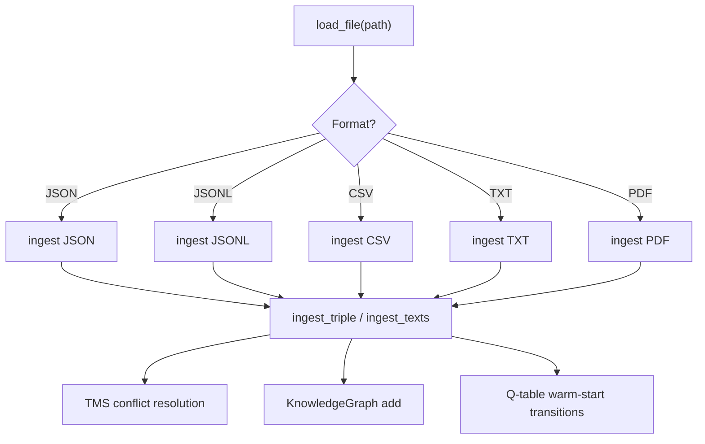
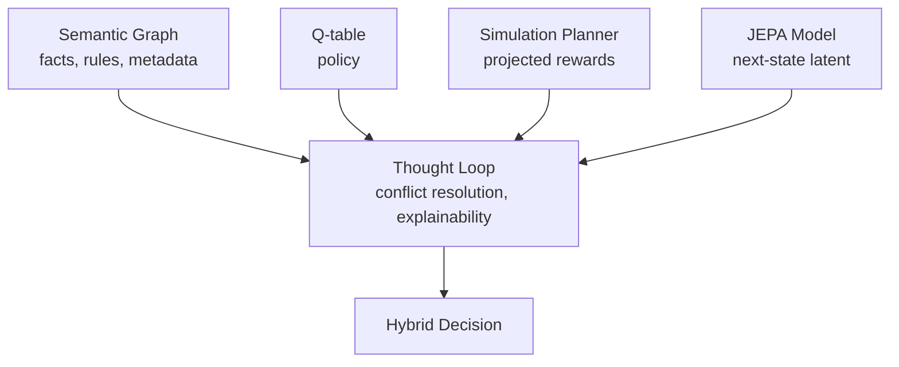
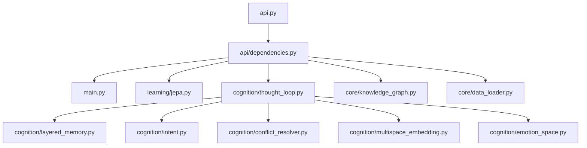

# Use Cases and Applications

<cite>
**Referenced Files in This Document**
- [README.md](file://README.md)
- [Analysis.md](file://Analysis.md)
- [main.py](file://main.py)
- [config.py](file://config.py)
- [api/dependencies.py](file://api/dependencies.py)
- [api/endpoints/root.py](file://api/endpoints/root.py)
- [api/endpoints/think.py](file://api/endpoints/think.py)
- [api/endpoints/curriculum.py](file://api/endpoints/curriculum.py)
- [core/data_loader.py](file://core/data_loader.py)
- [core/knowledge_graph.py](file://core/knowledge_graph.py)
- [cognition/thought_loop.py](file://cognition/thought_loop.py)
- [learning/jepa.py](file://learning/jepa.py)
- [learning/curriculum.py](file://learning/curriculum.py)
- [memory/graph_store.py](file://memory/graph_store.py)
</cite>

## Table of Contents
1. [Introduction](#introduction)
2. [Project Structure](#project-structure)
3. [Core Components](#core-components)
4. [Architecture Overview](#architecture-overview)
5. [Detailed Component Analysis](#detailed-component-analysis)
6. [Dependency Analysis](#dependency-analysis)
7. [Performance Considerations](#performance-considerations)
8. [Troubleshooting Guide](#troubleshooting-guide)
9. [Conclusion](#conclusion)
10. [Appendices](#appendices)

## Introduction
This document presents the Semantic AI Decision Engine’s use cases and applications, focusing on disaster response (particularly flood management), emergency decision support, and curriculum-driven learning for mathematics and primary readiness. The system combines reinforcement learning (Q-learning), a world simulator, a hybrid decision engine, a semantic knowledge graph, and a deliberative cognitive loop. It demonstrates how real-time environmental signals are processed, how policies are learned and exported, and how hybrid AI (semantic reasoning plus policy optimization) improves decision quality across domains.

## Project Structure
The system is organized around:
- A FastAPI backend exposing decision, explanation, and learning endpoints
- A CLI and training loop for Q-learning and policy export
- A semantic stack (parser, knowledge graph, truth maintenance, reasoning)
- A cognitive thought loop for deliberation and explainability
- A JEPA world model for action quality scoring and emotion-aware feedback
- A curriculum controller enabling staged, prerequisite-gated learning

**Diagram sources**
- [api/endpoints/root.py:1-45](file://api/endpoints/root.py#L1-L45)
- [api/endpoints/think.py:1-121](file://api/endpoints/think.py#L1-L121)
- [main.py:1-401](file://main.py#L1-L401)
- [config.py:1-106](file://config.py#L1-L106)
- [core/data_loader.py:1-500](file://core/data_loader.py#L1-L500)
- [core/knowledge_graph.py:1-34](file://core/knowledge_graph.py#L1-L34)
- [cognition/thought_loop.py:1-279](file://cognition/thought_loop.py#L1-L279)
- [learning/jepa.py:1-185](file://learning/jepa.py#L1-L185)

**Section sources**
- [README.md:9-425](file://README.md#L9-L425)
- [Analysis.md:6-71](file://Analysis.md#L6-L71)

## Core Components
- Reinforcement Learning and World Dynamics: Q-learning with state transitions, rewards, and action effects for flood/collapse/crisis escalation and mitigation.
- Hybrid Decision Engine: Combines Q-scores, simulation projections, and JEPA action quality to select robust actions.
- Semantic Knowledge Graph: Stores facts, metadata, and provenance; supports reasoning and cross-space relations.
- Cognitive Thought Loop: Deliberative pipeline embedding states into six cognitive spaces, resolving conflicts among sources, simulating candidates, and generating explainable traces.
- JEPA World Model: Predicts next-state latents and scores actions; integrates emotion via surprise.
- Curriculum Controller: Enforces prerequisite gates and stages for mathematics and economy curricula.

**Section sources**
- [main.py:174-253](file://main.py#L174-L253)
- [api/dependencies.py:726-758](file://api/dependencies.py#L726-L758)
- [core/knowledge_graph.py:1-34](file://core/knowledge_graph.py#L1-L34)
- [cognition/thought_loop.py:64-156](file://cognition/thought_loop.py#L64-L156)
- [learning/jepa.py:49-185](file://learning/jepa.py#L49-L185)
- [learning/curriculum.py:92-296](file://learning/curriculum.py#L92-L296)

## Architecture Overview
The system integrates a training loop (main.py) with a live API (api.py) and a dashboard. The API exposes:
- Decision endpoints for hybrid action selection
- Explanation endpoints for risk and policy insights
- Metrics and graph endpoints for observability
- Semantic endpoints for knowledge assertion and reasoning
- Curriculum endpoints for staged learning

**Diagram sources**
- [api/endpoints/think.py:28-54](file://api/endpoints/think.py#L28-L54)
- [api/dependencies.py:726-758](file://api/dependencies.py#L726-L758)
- [api/dependencies.py:631-675](file://api/dependencies.py#L631-L675)
- [api/dependencies.py:570-603](file://api/dependencies.py#L570-L603)
- [cognition/thought_loop.py:158-167](file://cognition/thought_loop.py#L158-L167)

## Detailed Component Analysis

### Disaster Response: Flood Management and Escalation Control
The system models a stochastic environment with escalating threats: rain → flood → damage → collapse → crisis. Actions include barrier construction, water release, evacuation, and inaction. Rewards reflect risk reduction and action costs; world dynamics incorporate probabilistic escalation and recovery.

**Diagram sources**
- [main.py:34-80](file://main.py#L34-L80)
- [main.py:85-111](file://main.py#L85-L111)

Key behaviors:
- Probabilistic escalation and mitigation align with real-world dynamics.
- Action tokens are transient and removed after effects to prevent leakage.
- Reward shaping encourages protective actions and discourages unnecessary risks.

**Section sources**
- [main.py:34-111](file://main.py#L34-L111)
- [config.py:25-40](file://config.py#L25-L40)

### Hybrid Decision Engine: Semantic + Policy Optimization
The hybrid decision engine computes:
- Q-scores from the learned Q-table
- Simulation scores by projecting rewards for candidate actions
- JEPA scores by predicting next-state latents and comparing to a safe reference

It resolves conflicts among sources, selects an action, and optionally consults the thought loop for explainability.

**Diagram sources**
- [api/dependencies.py:726-758](file://api/dependencies.py#L726-L758)
- [api/dependencies.py:614-629](file://api/dependencies.py#L614-L629)
- [api/dependencies.py:696-701](file://api/dependencies.py#L696-L701)
- [learning/jepa.py:49-185](file://learning/jepa.py#L49-L185)
- [cognition/thought_loop.py:50-156](file://cognition/thought_loop.py#L50-L156)

Operational highlights:
- Simulation-based planning provides robustness against model uncertainty.
- JEPA acts as a learned world model, improving action quality and detecting surprises.
- Thought loop enriches decisions with explainability and emotion-aware feedback.

**Section sources**
- [api/dependencies.py:677-758](file://api/dependencies.py#L677-L758)
- [cognition/thought_loop.py:64-156](file://cognition/thought_loop.py#L64-L156)
- [learning/jepa.py:137-148](file://learning/jepa.py#L137-L148)

### Real-Time Data Streams and Decision Workflows
The API exposes endpoints for live decision-making and simulation:
- POST /decision: Hybrid decision with scores and best action
- POST /simulate: Multi-step trajectory with rewards and next states
- GET /explain: Human-readable explanation and risk assessment
- GET /metrics and GET /graph: Observability for policy and inference

**Diagram sources**
- [api/endpoints/think.py:28-54](file://api/endpoints/think.py#L28-L54)
- [api/endpoints/root.py:12-29](file://api/endpoints/root.py#L12-L29)

**Section sources**
- [api/endpoints/root.py:1-45](file://api/endpoints/root.py#L1-L45)
- [api/endpoints/think.py:1-121](file://api/endpoints/think.py#L1-L121)

### Curriculum-Driven Learning: Mathematics and Primary Literacy
The curriculum controller manages three stages: LITERACY, NUMERACY, and REASONING. It gates tasks by concept density and stability (JEPA error), ensuring robust progression.

**Diagram sources**
- [learning/curriculum.py:32-54](file://learning/curriculum.py#L32-L54)
- [learning/curriculum.py:128-202](file://learning/curriculum.py#L128-L202)

Endpoints support:
- Phase-by-phase teaching for mathematics and economy
- Basic numeracy bootstrap
- Abstraction promotion and rule learning
- Reset and persistence of curriculum state

**Section sources**
- [api/endpoints/curriculum.py:1-211](file://api/endpoints/curriculum.py#L1-L211)
- [learning/curriculum.py:92-296](file://learning/curriculum.py#L92-L296)

### Knowledge Ingestion and Domain Seed for Flood Management
Bulk ingestion supports JSON/JSONL/CSV/TXT formats and PDFs. The system includes built-in domain seed facts and curated Q-table transitions to warm-start critical states.

**Diagram sources**
- [core/data_loader.py:53-110](file://core/data_loader.py#L53-L110)
- [core/data_loader.py:296-337](file://core/data_loader.py#L296-L337)
- [core/knowledge_graph.py:6-27](file://core/knowledge_graph.py#L6-L27)

**Section sources**
- [core/data_loader.py:1-500](file://core/data_loader.py#L1-L500)
- [core/knowledge_graph.py:1-34](file://core/knowledge_graph.py#L1-L34)

### Conceptual Overview: Hybrid AI for Decision Quality
The hybrid approach combines:
- Semantic reasoning for grounded knowledge and cross-space relations
- Policy optimization (Q-learning) for learned state-action preferences
- Simulation-based planning for robust projections
- World modeling (JEPA) for learned next-state prediction and emotion-aware feedback
- Deliberative thought loop for explainability and confidence calibration

[No sources needed since this diagram shows conceptual workflow, not actual code structure]

## Dependency Analysis
The API depends on the RL core, JEPA model, thought loop, and semantic stack. The thought loop depends on layered memory, intent engine, and emotion space. The curriculum controller coordinates with the knowledge graph and concept learners.

**Diagram sources**
- [api/dependencies.py:1-118](file://api/dependencies.py#L1-L118)
- [cognition/thought_loop.py:50-62](file://cognition/thought_loop.py#L50-L62)

**Section sources**
- [api/dependencies.py:1-118](file://api/dependencies.py#L1-L118)
- [cognition/thought_loop.py:1-62](file://cognition/thought_loop.py#L1-L62)

## Performance Considerations
- Training scalability: The RL loop uses a compact state representation and a fixed set of actions, enabling efficient Q-table updates and policy export.
- Online learning: JEPA updates are performed per decision with thread-safe locking to avoid contention.
- Simulation overhead: Simulation is bounded (default 50 steps) to prevent runaway computation.
- Memory persistence: Knowledge graph and JEPA weights are persisted to disk to minimize cold-start costs after restarts.

[No sources needed since this section provides general guidance]

## Troubleshooting Guide
Common issues and resolutions:
- Action tokens leaking into persistent state: Ensure transient tokens are discarded after effects are applied.
- JSON type mismatches: GraphStore loads JSON arrays as lists; restore tuples to maintain equality checks and rule application.
- Untrained JEPA fallback: During warm-up, a random baseline is used; verify JEPA training completes and weights are persisted.
- CORS and credentials: Wildcard origins with credentials enabled are rejected by browsers; disable credentials or restrict origins.
- Inference contention: Use locks to synchronize access to shared counters and models.

**Section sources**
- [Analysis.md:75-111](file://Analysis.md#L75-L111)
- [Analysis.md:121-142](file://Analysis.md#L121-L142)
- [Analysis.md:184-251](file://Analysis.md#L184-L251)
- [memory/graph_store.py:1-19](file://memory/graph_store.py#L1-L19)

## Conclusion
The Semantic AI Decision Engine demonstrates practical hybrid AI for disaster response and education. Its flood management scenario illustrates how Q-learning, simulation, and JEPA jointly improve decisions under uncertainty. The curriculum-driven learning enables safe, staged mastery in mathematics and primary readiness. The semantic stack and thought loop provide explainability and robust reasoning, while ingestion pipelines accelerate knowledge bootstrapping. These capabilities generalize to other domains requiring adaptive decision-making, risk assessment, and automated knowledge management.

[No sources needed since this section summarizes without analyzing specific files]

## Appendices

### Practical Scenarios and Examples
- Emergency Decision Support: Operators observe a state like “flood” and receive a hybrid recommendation with explainability. The system projects outcomes for barrier, release, and evacuate actions and selects the safest option.
- Risk Assessment: The explain endpoint aggregates risk indicators (flood, damage, collapse, crisis) and provides a concise rationale for the selected action.
- Automated Decision Workflows: Integrating with real-time sensors, the API can poll current conditions, compute a decision, and trigger mitigation actions.
- Educational Assessment: The curriculum controller gates arithmetic operations until prerequisites are met, tracks stability via JEPA error, and promotes abstractions upon validation.

**Section sources**
- [api/endpoints/think.py:57-78](file://api/endpoints/think.py#L57-L78)
- [api/dependencies.py:726-758](file://api/dependencies.py#L726-L758)
- [learning/curriculum.py:204-252](file://learning/curriculum.py#L204-L252)