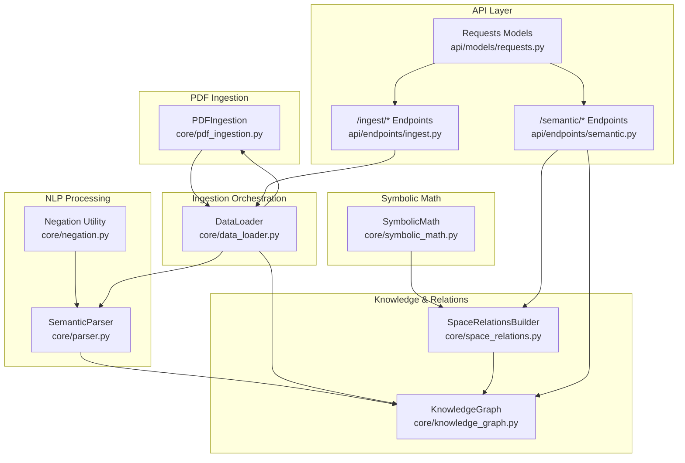
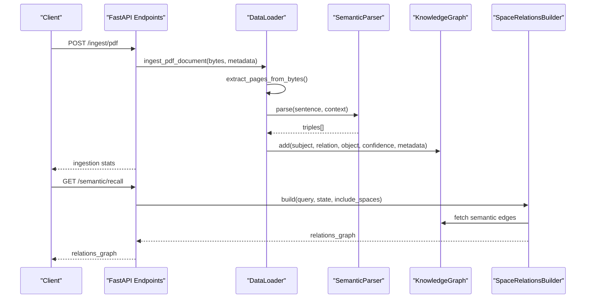
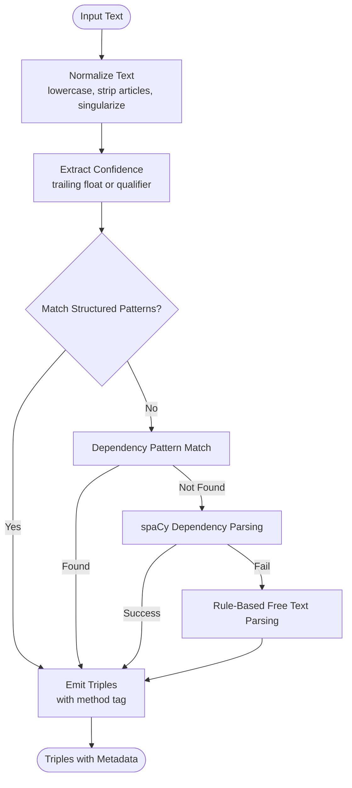
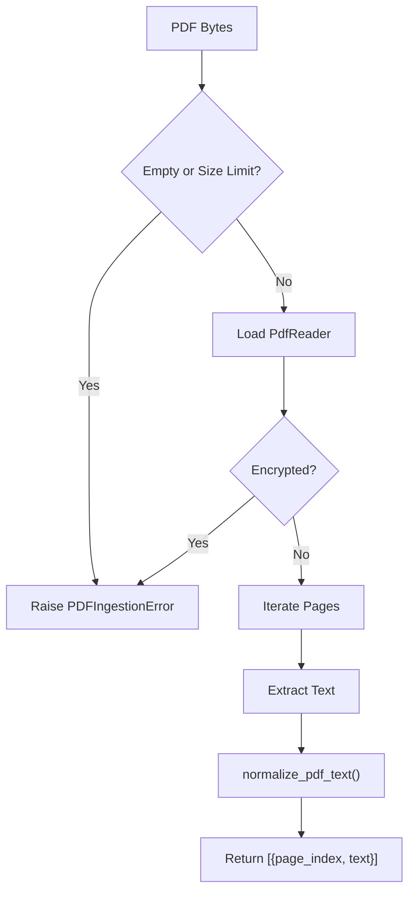
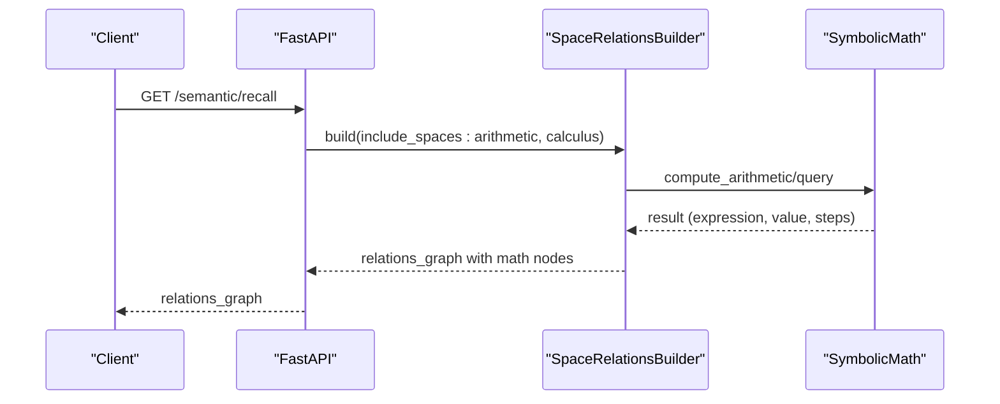
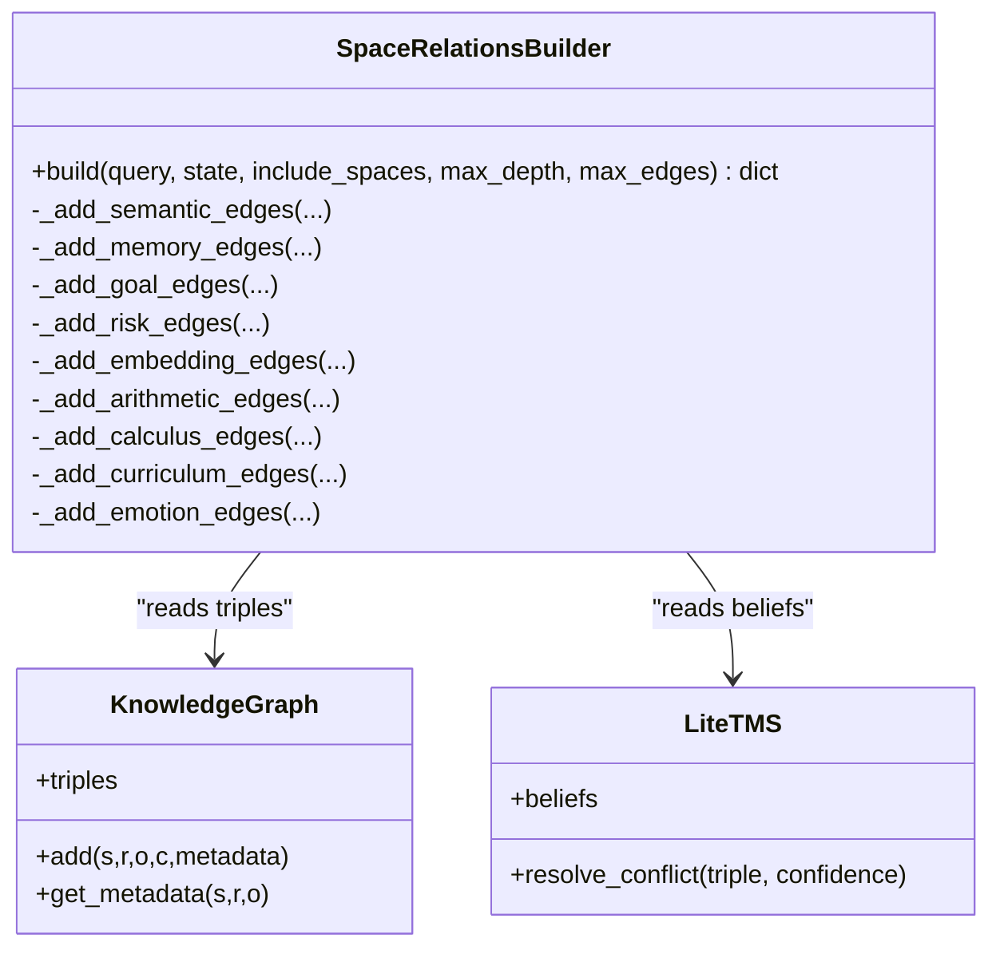
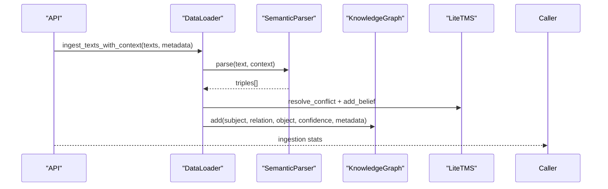
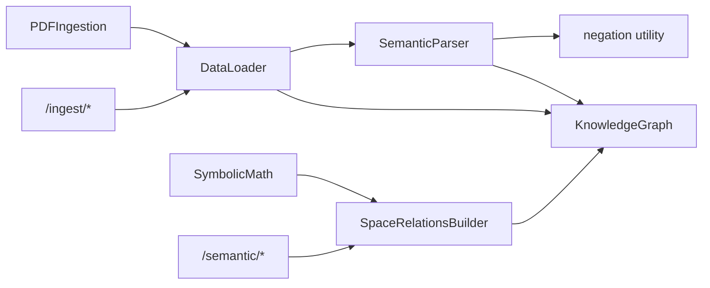

# Semantic Processing

<cite>
**Referenced Files in This Document**
- [parser.py](file://core/parser.py)
- [negation.py](file://core/negation.py)
- [pdf_ingestion.py](file://core/pdf_ingestion.py)
- [symbolic_math.py](file://core/symbolic_math.py)
- [space_relations.py](file://core/space_relations.py)
- [knowledge_graph.py](file://core/knowledge_graph.py)
- [data_loader.py](file://core/data_loader.py)
- [semantic.py](file://api/endpoints/semantic.py)
- [ingest.py](file://api/endpoints/ingest.py)
- [requests.py](file://api/models/requests.py)
- [test_parser.py](file://tests/test_parser.py)
- [test_pdf_ingestion.py](file://tests/test_pdf_ingestion.py)
- [test_symbolic_math.py](file://tests/test_symbolic_math.py)
- [test_space_relations.py](file://tests/test_space_relations.py)
- [README.md](file://README.md)
</cite>

## Table of Contents
1. [Introduction](#introduction)
2. [Project Structure](#project-structure)
3. [Core Components](#core-components)
4. [Architecture Overview](#architecture-overview)
5. [Detailed Component Analysis](#detailed-component-analysis)
6. [Dependency Analysis](#dependency-analysis)
7. [Performance Considerations](#performance-considerations)
8. [Troubleshooting Guide](#troubleshooting-guide)
9. [Conclusion](#conclusion)
10. [Appendices](#appendices)

## Introduction
This document explains the Semantic Processing capabilities of the Semantic AI Decision Engine. It covers:
- Natural language understanding: sentence parsing, dependency analysis, negation handling, and concept extraction
- PDF ingestion pipeline: document processing, text normalization, structured triple generation, and quality assurance
- Symbolic math integration: arithmetic computations, calculus operations, and mathematical reasoning support
- Space Relations Builder: multi-domain concept integration and relationship analysis across cognitive and knowledge domains
- Practical examples: sentence parsing, PDF processing workflows, mathematical expression evaluation, and semantic relationship discovery
- Integration between NLP processing and knowledge graph construction, configuration options for parsing accuracy, and performance considerations for large-scale text processing

## Project Structure
The semantic processing stack is organized into modular components:
- Natural language parsing and triple extraction
- PDF ingestion and normalization
- Symbolic math computation
- Cross-space relations graph builder
- Data loader orchestrating ingestion and provenance
- API endpoints exposing semantic search, ingestion, and relations graph construction

**Diagram sources**
- [parser.py:102-480](file://core/parser.py#L102-L480)
- [negation.py:1-8](file://core/negation.py#L1-L8)
- [pdf_ingestion.py:30-100](file://core/pdf_ingestion.py#L30-L100)
- [symbolic_math.py:245-608](file://core/symbolic_math.py#L245-L608)
- [space_relations.py:84-562](file://core/space_relations.py#L84-L562)
- [knowledge_graph.py:1-34](file://core/knowledge_graph.py#L1-L34)
- [data_loader.py:39-295](file://core/data_loader.py#L39-L295)
- [semantic.py:14-204](file://api/endpoints/semantic.py#L14-L204)
- [ingest.py:11-292](file://api/endpoints/ingest.py#L11-L292)
- [requests.py:1-90](file://api/models/requests.py#L1-L90)

**Section sources**
- [README.md:58-71](file://README.md#L58-L71)

## Core Components
- SemanticParser: Extracts (subject, relation, object) triples from natural language with support for structured patterns (if/then, when), dependency rules, arrow chains, and optional spaCy dependency parsing. Handles negation and confidence extraction.
- PDFIngestion: Validates and extracts normalized text from PDFs, with size limits and error handling.
- SymbolicMath: Computes arithmetic expressions, derivatives, integrals, logarithms, and supports advanced calculus with chain/product rules and definite integrals.
- SpaceRelationsBuilder: Builds cross-space relation graphs integrating semantic, memory, goal, risk, attention/self, arithmetic, calculus, curriculum, and emotion spaces.
- KnowledgeGraph: Stores triples with metadata and confidence, enabling provenance and retrieval.
- DataLoader: Orchestrates ingestion of facts, texts, documents, and PDFs; applies provenance metadata and candidate review workflows.

**Section sources**
- [parser.py:102-480](file://core/parser.py#L102-L480)
- [pdf_ingestion.py:30-100](file://core/pdf_ingestion.py#L30-L100)
- [symbolic_math.py:245-608](file://core/symbolic_math.py#L245-L608)
- [space_relations.py:84-562](file://core/space_relations.py#L84-L562)
- [knowledge_graph.py:1-34](file://core/knowledge_graph.py#L1-L34)
- [data_loader.py:39-295](file://core/data_loader.py#L39-L295)

## Architecture Overview
The semantic processing pipeline integrates NLP parsing, PDF ingestion, symbolic math, and cross-space relations to construct a knowledge graph and enable explainable reasoning.

**Diagram sources**
- [ingest.py:105-154](file://api/endpoints/ingest.py#L105-L154)
- [data_loader.py:200-295](file://core/data_loader.py#L200-L295)
- [parser.py:115-181](file://core/parser.py#L115-L181)
- [knowledge_graph.py:6-27](file://core/knowledge_graph.py#L6-L27)
- [semantic.py:108-149](file://api/endpoints/semantic.py#L108-L149)
- [space_relations.py:90-167](file://core/space_relations.py#L90-L167)

## Detailed Component Analysis

### Natural Language Understanding: SemanticParser
- Supported input forms:
  - Standard: “rain causes flood 0.9”
  - Negation: “barrier does not cause damage”
  - Compound objects: “flood causes damage and collapse”
  - Dependency patterns: “model is based on attention”, “encoder uses memory”
  - Logical: “if flood then evacuate”, “when crisis, evacuate”
  - Arrow chains: “rain → flood → crisis”
  - Bulk parsing: parse_bulk([...])
- Confidence handling: trailing numeric confidence or qualifier words; defaults to 0.8
- Extraction methods (priority): deterministic if/then, deterministic when, deterministic arrow, dependency pattern, spaCy dependency, rule-based free text
- Negation handling: detects 15+ patterns and strips auxiliary verbs; negation flag propagated to triples
- Normalization: lowercase, article removal, whitespace collapsing, noun singularization, verb lemmatization

**Diagram sources**
- [parser.py:115-181](file://core/parser.py#L115-L181)
- [parser.py:193-386](file://core/parser.py#L193-L386)
- [parser.py:247-309](file://core/parser.py#L247-L309)

**Section sources**
- [parser.py:102-480](file://core/parser.py#L102-L480)
- [negation.py:1-8](file://core/negation.py#L1-L8)
- [test_parser.py:14-223](file://tests/test_parser.py#L14-L223)

### PDF Ingestion Pipeline
- Validates payload size and type, checks encryption, and iterates pages
- Normalizes noisy PDF text: removes soft hyphens, dehyphenates line wraps, normalizes line endings, collapses whitespace, trims paragraph boundaries
- Emits page-indexed normalized text for downstream sentence parsing
- Quality assurance: raises explicit errors for empty payloads, size limits, invalid/corrupted PDFs, encrypted PDFs, and pages with no extractable text

**Diagram sources**
- [pdf_ingestion.py:34-74](file://core/pdf_ingestion.py#L34-L74)
- [pdf_ingestion.py:80-99](file://core/pdf_ingestion.py#L80-L99)

**Section sources**
- [pdf_ingestion.py:30-100](file://core/pdf_ingestion.py#L30-L100)
- [test_pdf_ingestion.py:21-35](file://tests/test_pdf_ingestion.py#L21-L35)

### Symbolic Math Integration
- Arithmetic: extracts and evaluates arithmetic expressions; supports localized operators; provides step-by-step column addition for integer sums
- Calculus: derivatives, integrals, logarithms; recognizes standard forms and applies rules; supports chain/product rules and definite integrals with antiderivatives
- Integration points: SpaceRelationsBuilder adds arithmetic and calculus nodes/edges to the relations graph

**Diagram sources**
- [symbolic_math.py:245-256](file://core/symbolic_math.py#L245-L256)
- [symbolic_math.py:469-607](file://core/symbolic_math.py#L469-L607)
- [space_relations.py:409-464](file://core/space_relations.py#L409-L464)
- [space_relations.py:465-508](file://core/space_relations.py#L465-L508)

**Section sources**
- [symbolic_math.py:245-608](file://core/symbolic_math.py#L245-L608)
- [test_symbolic_math.py:13-161](file://tests/test_symbolic_math.py#L13-L161)

### Space Relations Builder
- Builds a unified cross-space relation graph for recall/explain workflows
- Anchors: query tokens and state tokens; falls back to first known entity if empty
- Edges by space:
  - semantic: KG triples with confidence clamping and TMS review status propagation
  - memory: working memory and similar failures
  - goal: computed goals prioritized by IntentEngine
  - risk: inferred from KG and keyword sets
  - attention/self: embeddings weights
  - arithmetic/calculus: math computation nodes and number nodes
  - curriculum: curriculum-specific triples
  - emotion: emotion vector expressions
- Limits: max depth and max edges; meta timestamps

**Diagram sources**
- [space_relations.py:84-562](file://core/space_relations.py#L84-L562)
- [knowledge_graph.py:1-34](file://core/knowledge_graph.py#L1-L34)

**Section sources**
- [space_relations.py:84-562](file://core/space_relations.py#L84-L562)
- [test_space_relations.py:36-64](file://tests/test_space_relations.py#L36-L64)

### Integration Between NLP and Knowledge Graph Construction
- DataLoader orchestrates:
  - Sentence segmentation from documents and PDFs
  - Provenance metadata (document, page, paragraph, sentence indices, fingerprint)
  - Triple injection into TMS and KG with conflict resolution and confidence
  - Candidate review workflow for unvalidated facts
- API endpoints:
  - /semantic/assert: add triples to KG/TMS
  - /semantic/infer: forward inference via reasoner
  - /semantic/recall: semantic search + cross-space relations graph
  - /ingest/pdf: single PDF ingestion with curriculum gating and archiving

**Diagram sources**
- [data_loader.py:119-150](file://core/data_loader.py#L119-L150)
- [data_loader.py:389-405](file://core/data_loader.py#L389-L405)
- [semantic.py:14-24](file://api/endpoints/semantic.py#L14-L24)
- [requests.py:34-64](file://api/models/requests.py#L34-L64)

**Section sources**
- [data_loader.py:39-295](file://core/data_loader.py#L39-L295)
- [semantic.py:14-204](file://api/endpoints/semantic.py#L14-L204)
- [ingest.py:105-154](file://api/endpoints/ingest.py#L105-L154)

## Dependency Analysis
- Parser depends on:
  - Relation lexicon and dependency patterns
  - Optional spaCy dependency parsing (disabled by default)
- PDF ingestion depends on pypdf; raises explicit errors on validation failures
- Symbolic math depends on AST evaluation and regex-based expression extraction
- SpaceRelationsBuilder depends on:
  - KnowledgeGraph triples and metadata
  - LiteTMS for belief review status
  - EmotionSpace, IntentEngine, MultiSpaceEmbedding for cognitive spaces
  - SymbolicMath for arithmetic/calculus edges
- API endpoints depend on request models and orchestrate ingestion and relations graph building

**Diagram sources**
- [parser.py:102-480](file://core/parser.py#L102-L480)
- [pdf_ingestion.py:30-100](file://core/pdf_ingestion.py#L30-L100)
- [symbolic_math.py:245-608](file://core/symbolic_math.py#L245-L608)
- [space_relations.py:84-562](file://core/space_relations.py#L84-L562)
- [data_loader.py:39-295](file://core/data_loader.py#L39-L295)
- [semantic.py:14-204](file://api/endpoints/semantic.py#L14-L204)
- [ingest.py:11-292](file://api/endpoints/ingest.py#L11-L292)

**Section sources**
- [parser.py:102-480](file://core/parser.py#L102-L480)
- [pdf_ingestion.py:30-100](file://core/pdf_ingestion.py#L30-L100)
- [symbolic_math.py:245-608](file://core/symbolic_math.py#L245-L608)
- [space_relations.py:84-562](file://core/space_relations.py#L84-L562)
- [data_loader.py:39-295](file://core/data_loader.py#L39-L295)
- [semantic.py:14-204](file://api/endpoints/semantic.py#L14-L204)
- [ingest.py:11-292](file://api/endpoints/ingest.py#L11-L292)

## Performance Considerations
- Parser accuracy tuning:
  - Enable spaCy dependency parsing for academic PDFs via environment variables; otherwise, rule-based parsing remains robust
  - Use parse_bulk to process lists of statements efficiently
- PDF ingestion:
  - Enforce size limits and avoid encrypted PDFs
  - Normalize text to reduce noise and improve downstream parsing
- Relations graph:
  - Control max_depth and max_edges to cap traversal cost
  - Use anchors (query/state tokens) to limit search scope
- Math computations:
  - Prefer concise expressions; arithmetic evaluation uses AST with safe operators
  - Definite integrals compute antiderivatives and evaluate bounds deterministically

[No sources needed since this section provides general guidance]

## Troubleshooting Guide
- PDF ingestion errors:
  - Empty payload, size exceeded, invalid/corrupted PDF, encrypted PDF, no extractable text
- Parser failures:
  - Unparseable sentences return None; verify confidence suffix and negation patterns
  - spaCy dependency path is optional and falls back to rule-based parsing
- Relations graph issues:
  - Empty anchors: builder falls back to first known entity
  - Max edges reached: adjust max_edges query parameter
- API validation:
  - Rate limits, unsupported media types, JSON metadata decoding errors, prerequisite phase gating for curriculum

**Section sources**
- [pdf_ingestion.py:21-23](file://core/pdf_ingestion.py#L21-L23)
- [pdf_ingestion.py:43-72](file://core/pdf_ingestion.py#L43-L72)
- [parser.py:252-262](file://core/parser.py#L252-L262)
- [space_relations.py:104-109](file://core/space_relations.py#L104-L109)
- [ingest.py:114-154](file://api/endpoints/ingest.py#L114-L154)
- [ingest.py:170-171](file://api/endpoints/ingest.py#L170-L171)
- [ingest.py:177-178](file://api/endpoints/ingest.py#L177-L178)

## Conclusion
The Semantic AI Decision Engine’s Semantic Processing stack combines robust natural language understanding, reliable PDF ingestion, symbolic math computation, and cross-space relations to enable explainable knowledge graph construction. The modular design allows optional enhancement (spaCy) and strict quality controls, while the API exposes powerful endpoints for ingestion, reasoning, and relationship discovery.

[No sources needed since this section summarizes without analyzing specific files]

## Appendices

### Practical Examples Index
- Sentence parsing examples:
  - Standard: “rain causes flood 0.9”
  - Negation: “barrier does not cause damage”
  - Compound: “flood causes damage and collapse”
  - Dependency: “model is based on attention”
  - Logical: “if flood then evacuate”, “when crisis, evacuate”
  - Arrow chain: “rain → flood → crisis”
- PDF processing workflow:
  - Upload PDF with metadata; ingestion archives, validates, and segments into sentences; provenance recorded
- Mathematical expression evaluation:
  - Derivatives: “d/dx x^3 + 2*x”
  - Integrals: “integral 3*x^2 dx”
  - Definite integral: “integral from 0 to 2 x^2 dx”
  - Logarithms: “log 1000”, “ln(e)”
- Semantic relationship discovery:
  - Query “flood”; recall includes semantic edges and cross-space relations (memory, goal, risk, attention/self, arithmetic, calculus, curriculum, emotion)

**Section sources**
- [test_parser.py:34-132](file://tests/test_parser.py#L34-L132)
- [test_symbolic_math.py:14-90](file://tests/test_symbolic_math.py#L14-L90)
- [README.md:293-311](file://README.md#L293-L311)