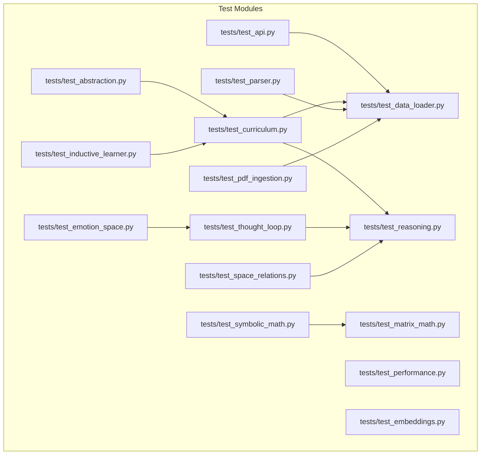
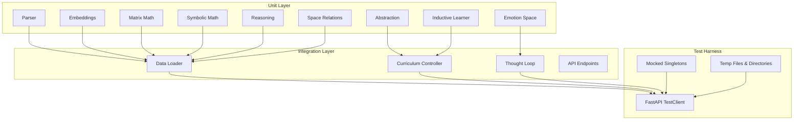
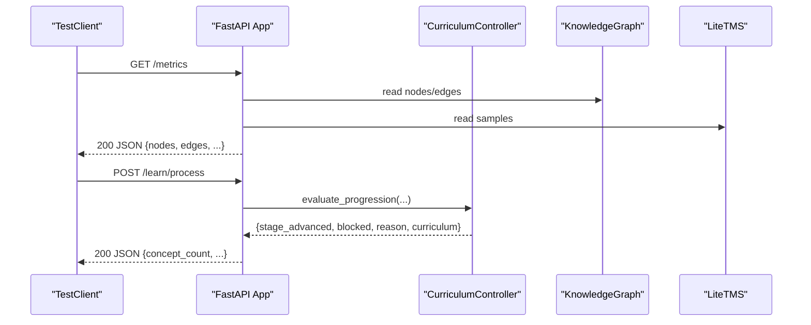
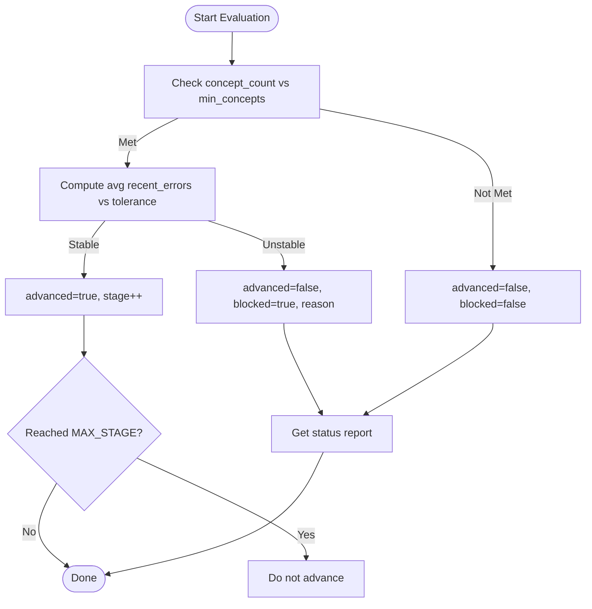
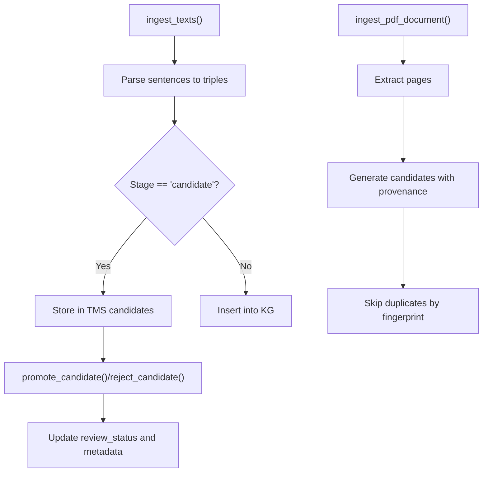
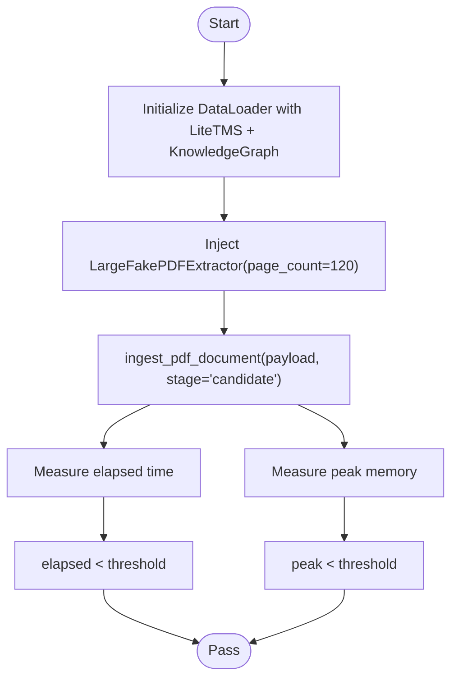
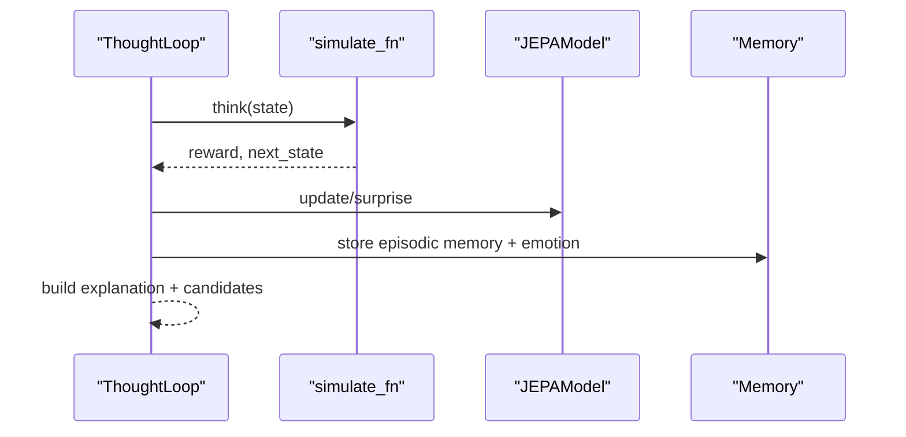
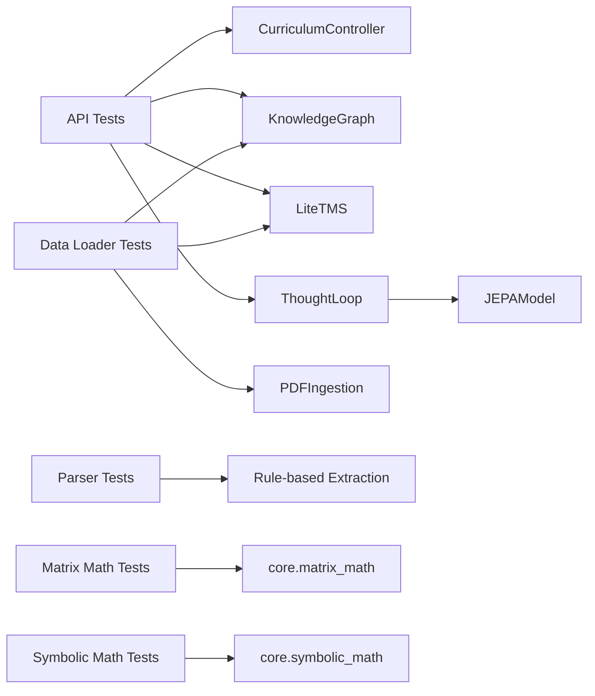

# Testing Framework

<cite>
**Referenced Files in This Document**
- [tests/test_api.py](file://tests/test_api.py)
- [tests/test_performance.py](file://tests/test_performance.py)
- [tests/test_embeddings.py](file://tests/test_embeddings.py)
- [tests/test_thought_loop.py](file://tests/test_thought_loop.py)
- [tests/test_curriculum.py](file://tests/test_curriculum.py)
- [tests/test_parser.py](file://tests/test_parser.py)
- [tests/test_pdf_ingestion.py](file://tests/test_pdf_ingestion.py)
- [tests/test_reasoning.py](file://tests/test_reasoning.py)
- [tests/test_matrix_math.py](file://tests/test_matrix_math.py)
- [tests/test_symbolic_math.py](file://tests/test_symbolic_math.py)
- [tests/test_data_loader.py](file://tests/test_data_loader.py)
- [tests/test_emotion_space.py](file://tests/test_emotion_space.py)
- [tests/test_space_relations.py](file://tests/test_space_relations.py)
- [tests/test_abstraction.py](file://tests/test_abstraction.py)
- [tests/test_inductive_learner.py](file://tests/test_inductive_learner.py)
</cite>

## Table of Contents
1. [Introduction](#introduction)
2. [Project Structure](#project-structure)
3. [Core Components](#core-components)
4. [Architecture Overview](#architecture-overview)
5. [Detailed Component Analysis](#detailed-component-analysis)
6. [Dependency Analysis](#dependency-analysis)
7. [Performance Considerations](#performance-considerations)
8. [Troubleshooting Guide](#troubleshooting-guide)
9. [Conclusion](#conclusion)
10. [Appendices](#appendices)

## Introduction
This document describes the comprehensive unit and integration test suite for the Semantic AI Decision Engine. It explains the testing methodology, organization, assertion strategies, and coverage across major components including API endpoints, curriculum systems, performance benchmarks, embeddings, thought loops, reasoning engines, parsers, PDF ingestion, mathematical operations, and cognitive systems. It also documents test execution procedures, continuous integration expectations, automated workflows, and practical guidance for writing new tests, mocking dependencies, handling asynchronous operations, and validating complex data structures. Finally, it covers testing configuration, environment setup, debugging techniques, performance and load testing approaches, regression strategies, and test data management.

## Project Structure
The test suite is organized by functional domain and mirrors the repository’s module structure. Each major subsystem has dedicated test modules that validate both unit-level contracts and integration-level workflows.

**Diagram sources**
- [tests/test_api.py](file://tests/test_api.py)
- [tests/test_curriculum.py](file://tests/test_curriculum.py)
- [tests/test_data_loader.py](file://tests/test_data_loader.py)
- [tests/test_performance.py](file://tests/test_performance.py)
- [tests/test_embeddings.py](file://tests/test_embeddings.py)
- [tests/test_thought_loop.py](file://tests/test_thought_loop.py)
- [tests/test_parser.py](file://tests/test_parser.py)
- [tests/test_pdf_ingestion.py](file://tests/test_pdf_ingestion.py)
- [tests/test_reasoning.py](file://tests/test_reasoning.py)
- [tests/test_matrix_math.py](file://tests/test_matrix_math.py)
- [tests/test_symbolic_math.py](file://tests/test_symbolic_math.py)
- [tests/test_space_relations.py](file://tests/test_space_relations.py)
- [tests/test_emotion_space.py](file://tests/test_emotion_space.py)
- [tests/test_abstraction.py](file://tests/test_abstraction.py)
- [tests/test_inductive_learner.py](file://tests/test_inductive_learner.py)

**Section sources**
- [tests/test_api.py](file://tests/test_api.py)
- [tests/test_performance.py](file://tests/test_performance.py)
- [tests/test_embeddings.py](file://tests/test_embeddings.py)
- [tests/test_thought_loop.py](file://tests/test_thought_loop.py)
- [tests/test_curriculum.py](file://tests/test_curriculum.py)
- [tests/test_parser.py](file://tests/test_parser.py)
- [tests/test_pdf_ingestion.py](file://tests/test_pdf_ingestion.py)
- [tests/test_reasoning.py](file://tests/test_reasoning.py)
- [tests/test_matrix_math.py](file://tests/test_matrix_math.py)
- [tests/test_symbolic_math.py](file://tests/test_symbolic_math.py)
- [tests/test_data_loader.py](file://tests/test_data_loader.py)
- [tests/test_emotion_space.py](file://tests/test_emotion_space.py)
- [tests/test_space_relations.py](file://tests/test_space_relations.py)
- [tests/test_abstraction.py](file://tests/test_abstraction.py)
- [tests/test_inductive_learner.py](file://tests/test_inductive_learner.py)

## Core Components
- API integration tests validate endpoint behavior, request validation, response shape, and curriculum-aware semantics.
- Curriculum controller tests verify progression rules, prerequisites, persistence, and API integration.
- Data loader tests validate ingestion pipelines for triples, texts, PDFs, and seed knowledge, including candidate staging and promotion.
- Performance tests provide smoke checks for ingestion throughput and memory footprint.
- Embeddings tests validate tokenization, normalization, and dimensionality constraints.
- Thought loop tests validate decision traces, state handling, feedback integration, and emotional trends.
- Parser tests validate extraction rules, negation, structured patterns, and provenance attachment.
- PDF ingestion tests validate normalization and size/error handling.
- Reasoning tests validate inference and conflict detection.
- Matrix and symbolic math tests validate deterministic computation and trace generation.
- Cognitive systems tests validate emotion space transformations and JEPA emotion deltas.
- Space relations builder tests validate multi-space graph construction and limits.
- Abstraction and inductive learner tests validate concept/rule abstraction, gates, and analogical transfer.

**Section sources**
- [tests/test_api.py](file://tests/test_api.py)
- [tests/test_curriculum.py](file://tests/test_curriculum.py)
- [tests/test_data_loader.py](file://tests/test_data_loader.py)
- [tests/test_performance.py](file://tests/test_performance.py)
- [tests/test_embeddings.py](file://tests/test_embeddings.py)
- [tests/test_thought_loop.py](file://tests/test_thought_loop.py)
- [tests/test_parser.py](file://tests/test_parser.py)
- [tests/test_pdf_ingestion.py](file://tests/test_pdf_ingestion.py)
- [tests/test_reasoning.py](file://tests/test_reasoning.py)
- [tests/test_matrix_math.py](file://tests/test_matrix_math.py)
- [tests/test_symbolic_math.py](file://tests/test_symbolic_math.py)
- [tests/test_space_relations.py](file://tests/test_space_relations.py)
- [tests/test_emotion_space.py](file://tests/test_emotion_space.py)
- [tests/test_abstraction.py](file://tests/test_abstraction.py)
- [tests/test_inductive_learner.py](file://tests/test_inductive_learner.py)

## Architecture Overview
The testing architecture separates concerns into unit and integration layers:
- Unit tests focus on pure functions, small classes, and isolated behaviors.
- Integration tests exercise end-to-end flows using lightweight singletons and mocked heavy dependencies to avoid long-running initialization.

**Diagram sources**
- [tests/test_api.py](file://tests/test_api.py)
- [tests/test_data_loader.py](file://tests/test_data_loader.py)
- [tests/test_curriculum.py](file://tests/test_curriculum.py)
- [tests/test_thought_loop.py](file://tests/test_thought_loop.py)
- [tests/test_parser.py](file://tests/test_parser.py)
- [tests/test_embeddings.py](file://tests/test_embeddings.py)
- [tests/test_matrix_math.py](file://tests/test_matrix_math.py)
- [tests/test_symbolic_math.py](file://tests/test_symbolic_math.py)
- [tests/test_reasoning.py](file://tests/test_reasoning.py)
- [tests/test_space_relations.py](file://tests/test_space_relations.py)
- [tests/test_emotion_space.py](file://tests/test_emotion_space.py)
- [tests/test_abstraction.py](file://tests/test_abstraction.py)
- [tests/test_inductive_learner.py](file://tests/test_inductive_learner.py)

## Detailed Component Analysis

### API Integration Tests
- Uses FastAPI TestClient to validate endpoints without starting a live server.
- Patches heavy startup dependencies and injects lightweight singletons to keep tests fast and deterministic.
- Validates response shapes, required keys, HTTP status codes, and policy-driven gating (e.g., curriculum phase order, arithmetic availability).

**Diagram sources**
- [tests/test_api.py](file://tests/test_api.py)
- [tests/test_curriculum.py](file://tests/test_curriculum.py)

**Section sources**
- [tests/test_api.py](file://tests/test_api.py)
- [tests/test_curriculum.py](file://tests/test_curriculum.py)

### Curriculum Controller Tests
- Validates stage definitions, progression evaluation, blocking reasons, monotonic advancement, and persistence via save/load.
- API integration tests validate curriculum endpoints, prerequisite enforcement, and math operation gating.

**Diagram sources**
- [tests/test_curriculum.py](file://tests/test_curriculum.py)

**Section sources**
- [tests/test_curriculum.py](file://tests/test_curriculum.py)

### Data Loader Integration Tests
- Validates triple ingestion, negation suffixes, default confidence, and candidate staging/promotion/rejection.
- Tests PDF ingestion with provenance tracking, duplicate fingerprinting, and sentence/paragraph/page indices.
- Tests loading multiple formats (JSON, JSONL, CSV, TXT) and error handling for unsupported extensions.

**Diagram sources**
- [tests/test_data_loader.py](file://tests/test_data_loader.py)

**Section sources**
- [tests/test_data_loader.py](file://tests/test_data_loader.py)

### Performance Smoke Tests
- Provides a smoke test for large PDF ingestion with time and memory constraints.
- Uses a fake PDF extractor to simulate page payloads and asserts throughput and memory usage thresholds.

**Diagram sources**
- [tests/test_performance.py](file://tests/test_performance.py)

**Section sources**
- [tests/test_performance.py](file://tests/test_performance.py)

### Embeddings Tests
- Validates tokenization behavior, dimension checks, vector normalization, and empty input handling.

**Section sources**
- [tests/test_embeddings.py](file://tests/test_embeddings.py)

### Thought Loop Tests
- Validates trace shape, required keys, action validity, confidence bounds, explanation presence, and recent traces accumulation.
- Tests feedback integration, JEPA sample growth, and emotional vectors/trends.

**Diagram sources**
- [tests/test_thought_loop.py](file://tests/test_thought_loop.py)

**Section sources**
- [tests/test_thought_loop.py](file://tests/test_thought_loop.py)

### Parser Tests
- Validates extraction correctness, negation marking, structured patterns (if/then, when, arrows), compound objects, and provenance attachment.
- Supports fallback to rule-based parsing when spaCy is unavailable.

**Section sources**
- [tests/test_parser.py](file://tests/test_parser.py)

### PDF Ingestion Tests
- Validates text normalization (soft hyphens, dehyphenation, whitespace collapsing) and error conditions (empty payload, size limit exceeded).

**Section sources**
- [tests/test_pdf_ingestion.py](file://tests/test_pdf_ingestion.py)

### Reasoning Tests
- Validates transitive inference and conflict detection with confidence tuples.

**Section sources**
- [tests/test_reasoning.py](file://tests/test_reasoning.py)

### Matrix Math Tests
- Validates determinant computation for 2x2 and 3x3 matrices, identity matrix, matrix multiplication, and addition with explicit steps.

**Section sources**
- [tests/test_matrix_math.py](file://tests/test_matrix_math.py)

### Symbolic Math Tests
- Validates calculus operations (derivatives, integrals), algebraic computations (matrix determinants), equation solving, and sequence pattern detection.

**Section sources**
- [tests/test_symbolic_math.py](file://tests/test_symbolic_math.py)

### Space Relations Builder Tests
- Validates inclusion of requested spaces, semantic edge presence, and edge count limits.

**Section sources**
- [tests/test_space_relations.py](file://tests/test_space_relations.py)

### Emotion Space Tests
- Validates threat/positive state mappings, surprise updates, confidence blending, JEPA emotion deltas, and explainability output.

**Section sources**
- [tests/test_emotion_space.py](file://tests/test_emotion_space.py)

### Abstraction and Inductive Learner Tests
- Validates concept/rule abstraction levels, abstraction gates per curriculum stage, and analogical transfer with confidence decay.

**Section sources**
- [tests/test_abstraction.py](file://tests/test_abstraction.py)
- [tests/test_inductive_learner.py](file://tests/test_inductive_learner.py)

## Dependency Analysis
- API tests depend on curriculum controller, knowledge graph, TMS, parser, and thought loop singletons injected via a factory method.
- Data loader tests depend on PDF ingestion service and TMS/KG for candidate and triple management.
- Thought loop tests depend on a minimal RL stub and a fake simulation function.
- Parser tests depend on rule-based extraction and optional spaCy dependency.
- Mathematical tests are self-contained and validate deterministic computations.

**Diagram sources**
- [tests/test_api.py](file://tests/test_api.py)
- [tests/test_curriculum.py](file://tests/test_curriculum.py)
- [tests/test_data_loader.py](file://tests/test_data_loader.py)
- [tests/test_thought_loop.py](file://tests/test_thought_loop.py)
- [tests/test_parser.py](file://tests/test_parser.py)
- [tests/test_matrix_math.py](file://tests/test_matrix_math.py)
- [tests/test_symbolic_math.py](file://tests/test_symbolic_math.py)

**Section sources**
- [tests/test_api.py](file://tests/test_api.py)
- [tests/test_curriculum.py](file://tests/test_curriculum.py)
- [tests/test_data_loader.py](file://tests/test_data_loader.py)
- [tests/test_thought_loop.py](file://tests/test_thought_loop.py)
- [tests/test_parser.py](file://tests/test_parser.py)
- [tests/test_matrix_math.py](file://tests/test_matrix_math.py)
- [tests/test_symbolic_math.py](file://tests/test_symbolic_math.py)

## Performance Considerations
- Use lightweight singletons and temporary directories to avoid IO overhead during tests.
- Prefer deterministic stubs for simulation and RL agents to eliminate randomness.
- Keep PDF payloads small in performance tests; use synthetic page generators to simulate large documents.
- Track elapsed time and peak memory to prevent regressions; adjust thresholds conservatively to reduce CI flakiness.

[No sources needed since this section provides general guidance]

## Troubleshooting Guide
Common issues and resolutions:
- Endpoint returns unexpected status codes: verify request payload and query parameters; check curriculum gating and prerequisite enforcement.
- Missing keys in responses: confirm endpoint handlers populate required fields; assert dictionary keys in tests.
- Memory leaks or timeouts: ensure tracemalloc is started/stopped and resources are closed; avoid real model training in tests.
- PDF ingestion errors: validate normalization and size limits; confirm provenance fields are attached.
- Inference failures: verify confidence thresholds and conflict detection logic.
- Asynchronous operations: use synchronous mocks and deterministic functions; avoid threading in unit tests.

**Section sources**
- [tests/test_api.py](file://tests/test_api.py)
- [tests/test_performance.py](file://tests/test_performance.py)
- [tests/test_pdf_ingestion.py](file://tests/test_pdf_ingestion.py)
- [tests/test_reasoning.py](file://tests/test_reasoning.py)

## Conclusion
The testing framework combines unit and integration tests to ensure correctness across the Semantic AI Decision Engine. It emphasizes fast, deterministic execution via mocked dependencies, validates complex workflows end-to-end, and includes performance and regression safeguards. The modular organization aligns with the codebase, enabling targeted development and maintenance of tests as the system evolves.

[No sources needed since this section summarizes without analyzing specific files]

## Appendices

### Writing New Tests: Best Practices
- Isolate behavior under test; use setUp to initialize dependencies and temporary files.
- Mock external services and heavy computations; rely on lightweight factories.
- Validate both positive and negative cases; assert response shapes and error codes.
- For asynchronous or event-driven flows, simulate callbacks or use deterministic stubs.
- Use descriptive test names and group related assertions; keep tests focused and readable.

[No sources needed since this section provides general guidance]

### Test Execution Procedures
- Run individual modules via unittest discovery or pytest.
- Use temporary directories for persisted state; clean up after each test.
- For API tests, construct a TestClient with injected singletons to avoid server startup.

[No sources needed since this section provides general guidance]

### Continuous Integration and Automated Workflows
- Configure CI to run the full test suite on push and pull requests.
- Cache Python dependencies and reuse virtual environments to speed up builds.
- Separate unit and integration tests; run performance tests in dedicated jobs.

[No sources needed since this section provides general guidance]

### Test Coverage Guidance
- Aim for high coverage of critical paths: API endpoints, curriculum progression, data ingestion, reasoning, and math computation.
- Focus on boundary conditions and error paths; ensure negative cases are covered.
- Maintain coverage reports and enforce minimum thresholds in CI.

[No sources needed since this section provides general guidance]