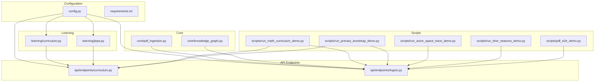
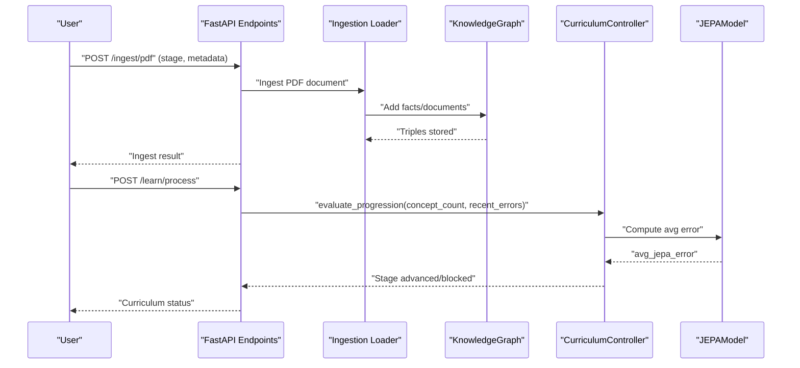
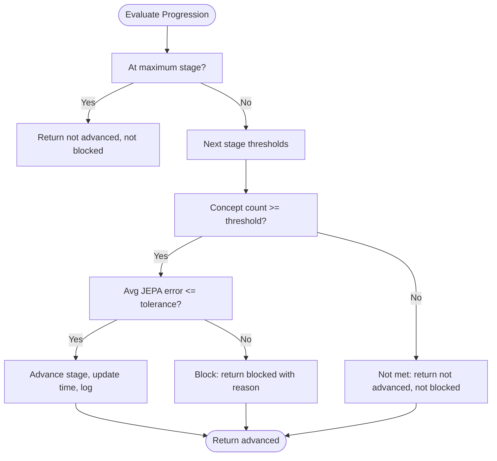
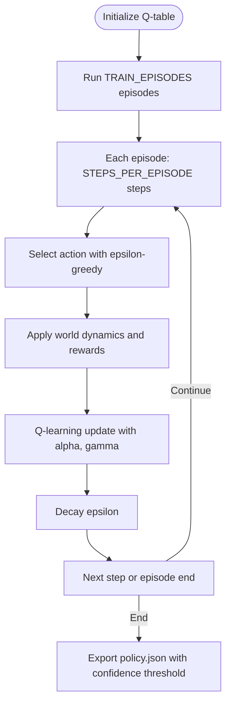
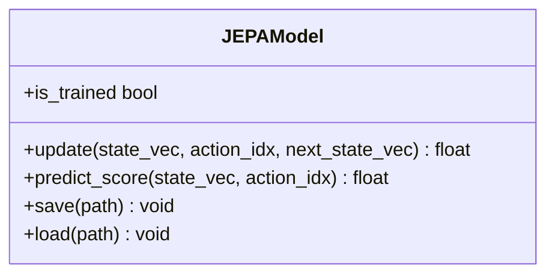
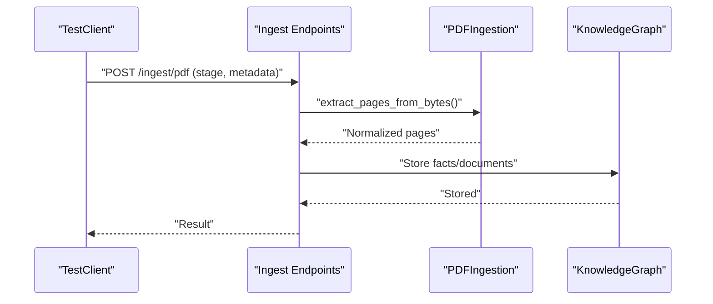
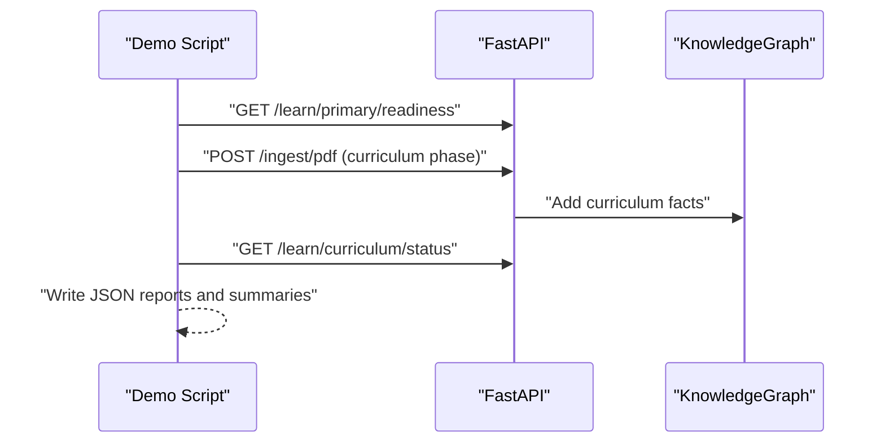
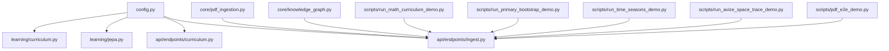

# Training Pipeline

<cite>
**Referenced Files in This Document**
- [config.py](file://config.py)
- [requirements.txt](file://requirements.txt)
- [learning/curriculum.py](file://learning/curriculum.py)
- [learning/jepa.py](file://learning/jepa.py)
- [api/endpoints/curriculum.py](file://api/endpoints/curriculum.py)
- [api/endpoints/ingest.py](file://api/endpoints/ingest.py)
- [core/pdf_ingestion.py](file://core/pdf_ingestion.py)
- [scripts/run_math_curriculum_demo.py](file://scripts/run_math_curriculum_demo.py)
- [scripts/run_primary_bootstrap_demo.py](file://scripts/run_primary_bootstrap_demo.py)
- [scripts/run_avize_space_trace_demo.py](file://scripts/run_avize_space_trace_demo.py)
- [scripts/run_time_seasons_demo.py](file://scripts/run_time_seasons_demo.py)
- [scripts/pdf_e2e_demo.py](file://scripts/pdf_e2e_demo.py)
- [core/knowledge_graph.py](file://core/knowledge_graph.py)
</cite>

## Table of Contents
1. [Introduction](#introduction)
2. [Project Structure](#project-structure)
3. [Core Components](#core-components)
4. [Architecture Overview](#architecture-overview)
5. [Detailed Component Analysis](#detailed-component-analysis)
6. [Dependency Analysis](#dependency-analysis)
7. [Performance Considerations](#performance-considerations)
8. [Troubleshooting Guide](#troubleshooting-guide)
9. [Conclusion](#conclusion)
10. [Appendices](#appendices)

## Introduction
This document describes the Training Pipeline for the Semantic AI Decision Engine’s model optimization and learning workflows. It covers the end-to-end training process including data preparation, Q-learning policy optimization, curriculum-driven learning progression, and validation methodologies. It also documents demonstration scripts for math curriculum learning, primary bootstrap processes, time seasons simulation, and AVIZE space trace learning. The PDF ingestion pipeline validation and internet PDF processing workflows are included, along with practical examples of training configurations, hyperparameter settings, convergence criteria, and performance metrics collection. Guidance is provided for training data requirements, preprocessing steps, model initialization, evaluation protocols, debugging tools, logging mechanisms, and training environment setup.

## Project Structure
The training pipeline spans several modules:
- Configuration and environment controls
- Curriculum controller and stage gating
- Q-learning policy and world dynamics
- JEPA predictive model for stability checks
- Ingestion endpoints and PDF processing
- Demonstration scripts validating workflows

**Diagram sources**
- [config.py:1-106](file://config.py#L1-L106)
- [requirements.txt:1-9](file://requirements.txt#L1-L9)
- [learning/curriculum.py:1-296](file://learning/curriculum.py#L1-L296)
- [learning/jepa.py:1-185](file://learning/jepa.py#L1-L185)
- [api/endpoints/curriculum.py:1-211](file://api/endpoints/curriculum.py#L1-L211)
- [api/endpoints/ingest.py:1-292](file://api/endpoints/ingest.py#L1-L292)
- [core/pdf_ingestion.py:1-100](file://core/pdf_ingestion.py#L1-L100)
- [core/knowledge_graph.py:1-34](file://core/knowledge_graph.py#L1-L34)
- [scripts/run_math_curriculum_demo.py:1-176](file://scripts/run_math_curriculum_demo.py#L1-L176)
- [scripts/run_primary_bootstrap_demo.py:1-184](file://scripts/run_primary_bootstrap_demo.py#L1-L184)
- [scripts/run_avize_space_trace_demo.py:1-160](file://scripts/run_avize_space_trace_demo.py#L1-L160)
- [scripts/run_time_seasons_demo.py:1-362](file://scripts/run_time_seasons_demo.py#L1-L362)
- [scripts/pdf_e2e_demo.py:1-140](file://scripts/pdf_e2e_demo.py#L1-L140)

**Section sources**
- [config.py:1-106](file://config.py#L1-L106)
- [requirements.txt:1-9](file://requirements.txt#L1-L9)

## Core Components
- Curriculum Controller: Enforces stage progression based on concept density and JEPA stability, gates tasks requiring higher stages, and persists state.
- JEPA Model: Lightweight predictive model used to compute stability metrics for curriculum advancement.
- Ingestion Endpoints: Handle structured facts, text, and PDF ingestion, including candidate review queues and promotion/rejection.
- PDF Ingestion Utilities: Validate and normalize PDF text for downstream parsing.
- Knowledge Graph: Stores triples and metadata for semantic reasoning and evaluation.
- Demonstration Scripts: End-to-end validations for curriculum teaching, primary bootstrap, concept space tracing, time/seasons lessons, and PDF pipeline.

**Section sources**
- [learning/curriculum.py:92-296](file://learning/curriculum.py#L92-L296)
- [learning/jepa.py:49-185](file://learning/jepa.py#L49-L185)
- [api/endpoints/curriculum.py:8-211](file://api/endpoints/curriculum.py#L8-L211)
- [api/endpoints/ingest.py:105-292](file://api/endpoints/ingest.py#L105-L292)
- [core/pdf_ingestion.py:30-100](file://core/pdf_ingestion.py#L30-L100)
- [core/knowledge_graph.py:1-34](file://core/knowledge_graph.py#L1-L34)

## Architecture Overview
The training pipeline integrates configuration-driven actions, Q-learning policy updates, JEPA stability checks, and curriculum progression. Ingestion feeds the knowledge graph, which informs semantic recall and concept space embeddings. Curriculum progression is gated by both concept density and model stability.

**Diagram sources**
- [api/endpoints/ingest.py:105-154](file://api/endpoints/ingest.py#L105-L154)
- [api/endpoints/curriculum.py:57-74](file://api/endpoints/curriculum.py#L57-L74)
- [learning/curriculum.py:128-202](file://learning/curriculum.py#L128-L202)
- [learning/jepa.py:93-135](file://learning/jepa.py#L93-L135)
- [core/knowledge_graph.py:6-27](file://core/knowledge_graph.py#L6-L27)

## Detailed Component Analysis

### Curriculum Controller and Stage Gating
- Monotonic stage progression with density and stability checks.
- Prerequisite gating for arithmetic and abstraction tasks.
- Status reporting with progress percentage and blocking reasons.
- Persistence of curriculum state to JSON.

**Diagram sources**
- [learning/curriculum.py:128-202](file://learning/curriculum.py#L128-L202)

**Section sources**
- [learning/curriculum.py:92-296](file://learning/curriculum.py#L92-L296)
- [api/endpoints/curriculum.py:8-74](file://api/endpoints/curriculum.py#L8-L74)

### Q-Learning Policy Optimization
- Actions, action costs, and policy export configuration define the policy surface.
- World dynamics simulate environmental probabilities for state transitions.
- Training hyperparameters include learning rate, discount factor, exploration decay, and episode settings.
- Policy export filters low-confidence entries.

**Diagram sources**
- [config.py:16-46](file://config.py#L16-L46)

**Section sources**
- [config.py:16-46](file://config.py#L16-L46)

### JEPA Stability Checks
- Lightweight predictive model trains on state-action-next_state tuples.
- Uses EMA for target encoder and early stopping criteria.
- Provides safety scores for actions by comparing predicted latents to a safe latent.

**Diagram sources**
- [learning/jepa.py:49-185](file://learning/jepa.py#L49-L185)

**Section sources**
- [learning/jepa.py:1-185](file://learning/jepa.py#L1-L185)
- [config.py:94-96](file://config.py#L94-L96)

### Ingestion and PDF Pipeline Validation
- Ingestion endpoints support structured facts, documents, and PDF uploads with candidate queues.
- PDF ingestion validates size, encryption, and extracts normalized text per page.
- Demonstrations validate end-to-end ingestion, candidate promotion, and semantic recall.

**Diagram sources**
- [api/endpoints/ingest.py:105-154](file://api/endpoints/ingest.py#L105-L154)
- [core/pdf_ingestion.py:34-73](file://core/pdf_ingestion.py#L34-L73)
- [core/knowledge_graph.py:6-27](file://core/knowledge_graph.py#L6-L27)

**Section sources**
- [api/endpoints/ingest.py:105-292](file://api/endpoints/ingest.py#L105-L292)
- [core/pdf_ingestion.py:1-100](file://core/pdf_ingestion.py#L1-L100)
- [scripts/pdf_e2e_demo.py:63-136](file://scripts/pdf_e2e_demo.py#L63-L136)

### Demonstration Workflows
- Math Curriculum Demo: Generates curriculum PDFs and teaches phases sequentially, capturing pre/post semantic search results and curriculum status.
- Primary Bootstrap Demo: Creates weekly lessons and auto-teaches them, measuring readiness coverage delta.
- Time and Seasons Demo: Teaches exposure and reinforcement facts, tracks concept confidence and space mapping.
- AVIZE Space Trace Demo: Seeds facts and traces concept relations across spaces, reporting confidence and buckets.
- PDF E2E Demo: Validates PDF ingestion, candidate listing, promotion, and semantic recall.

**Diagram sources**
- [scripts/run_math_curriculum_demo.py:100-171](file://scripts/run_math_curriculum_demo.py#L100-L171)
- [scripts/run_primary_bootstrap_demo.py:78-181](file://scripts/run_primary_bootstrap_demo.py#L78-L181)
- [scripts/run_time_seasons_demo.py:181-358](file://scripts/run_time_seasons_demo.py#L181-L358)
- [scripts/run_avize_space_trace_demo.py:51-155](file://scripts/run_avize_space_trace_demo.py#L51-L155)

**Section sources**
- [scripts/run_math_curriculum_demo.py:1-176](file://scripts/run_math_curriculum_demo.py#L1-L176)
- [scripts/run_primary_bootstrap_demo.py:1-184](file://scripts/run_primary_bootstrap_demo.py#L1-L184)
- [scripts/run_time_seasons_demo.py:1-362](file://scripts/run_time_seasons_demo.py#L1-L362)
- [scripts/run_avize_space_trace_demo.py:1-160](file://scripts/run_avize_space_trace_demo.py#L1-L160)
- [scripts/pdf_e2e_demo.py:1-140](file://scripts/pdf_e2e_demo.py#L1-L140)

## Dependency Analysis
- Configuration drives actions, RL hyperparameters, JEPA early stopping, curriculum persistence, and feature flags.
- Curriculum depends on concept counts and recent JEPA errors.
- Ingestion depends on PDF ingestion utilities and knowledge graph storage.
- Demos orchestrate API endpoints and produce artifacts for validation.

**Diagram sources**
- [config.py:1-106](file://config.py#L1-L106)
- [learning/curriculum.py:1-296](file://learning/curriculum.py#L1-L296)
- [learning/jepa.py:1-185](file://learning/jepa.py#L1-L185)
- [api/endpoints/curriculum.py:1-211](file://api/endpoints/curriculum.py#L1-L211)
- [api/endpoints/ingest.py:1-292](file://api/endpoints/ingest.py#L1-L292)
- [core/pdf_ingestion.py:1-100](file://core/pdf_ingestion.py#L1-L100)
- [core/knowledge_graph.py:1-34](file://core/knowledge_graph.py#L1-L34)
- [scripts/run_math_curriculum_demo.py:1-176](file://scripts/run_math_curriculum_demo.py#L1-L176)
- [scripts/run_primary_bootstrap_demo.py:1-184](file://scripts/run_primary_bootstrap_demo.py#L1-L184)
- [scripts/run_time_seasons_demo.py:1-362](file://scripts/run_time_seasons_demo.py#L1-L362)
- [scripts/run_avize_space_trace_demo.py:1-160](file://scripts/run_avize_space_trace_demo.py#L1-L160)
- [scripts/pdf_e2e_demo.py:1-140](file://scripts/pdf_e2e_demo.py#L1-L140)

**Section sources**
- [config.py:1-106](file://config.py#L1-L106)
- [requirements.txt:1-9](file://requirements.txt#L1-L9)

## Performance Considerations
- JEPA early stopping reduces unnecessary training when loss plateaus.
- Thread pool sizing and index cache can be tuned for knowledge graph operations.
- Rate limiting protects ingestion endpoints under load.
- PDF batch limits prevent excessive memory usage.

[No sources needed since this section provides general guidance]

## Troubleshooting Guide
Common issues and remedies:
- Encrypted or unreadable PDFs: Ensure PDFs are not encrypted and contain extractable text; verify size limits and dependencies.
- Curriculum progression blocked: Confirm concept density thresholds and reduce JEPA error by increasing training samples or adjusting tolerance.
- Prerequisite failures: Verify required stages for arithmetic and abstraction tasks.
- Ingestion candidate promotion: Ensure candidates exist and are pending review.
- Logging and debugging: Use demo scripts’ artifact outputs and endpoint logs to trace ingestion and curriculum status.

**Section sources**
- [core/pdf_ingestion.py:21-73](file://core/pdf_ingestion.py#L21-L73)
- [learning/curriculum.py:71-87](file://learning/curriculum.py#L71-L87)
- [api/endpoints/ingest.py:260-274](file://api/endpoints/ingest.py#L260-L274)
- [scripts/run_math_curriculum_demo.py:100-171](file://scripts/run_math_curriculum_demo.py#L100-L171)
- [scripts/pdf_e2e_demo.py:63-136](file://scripts/pdf_e2e_demo.py#L63-L136)

## Conclusion
The Training Pipeline integrates curriculum-driven progression, Q-learning policy optimization, and JEPA stability checks to enable robust model learning. The ingestion pipeline validates PDF processing and candidate workflows, while demonstrations provide reproducible examples for math curriculum, primary bootstrap, concept space tracing, and time/seasons lessons. Configuration and environment controls govern hyperparameters, early stopping, and feature flags, enabling reliable training and evaluation.

[No sources needed since this section summarizes without analyzing specific files]

## Appendices

### Practical Training Configurations and Hyperparameters
- Actions and action costs define policy behavior.
- RL hyperparameters: learning rate, discount factor, initial exploration, decay, episodes, and steps per episode.
- World dynamics: environmental probabilities for realistic state transitions.
- Policy export: minimum confidence threshold for inclusion.
- JEPA: warmup epochs, simulations per key, weights persistence, early stopping loss and patience.
- Curriculum: persistence file, error tolerance, stability window.
- PDF ingestion: max file size, batch file count, and batch total size.
- Feature flags: enable/disable PDF ingest, space relations, spaCy dependency parser, and enhanced negation.

**Section sources**
- [config.py:4-106](file://config.py#L4-L106)

### Training Data Requirements and Preprocessing
- Structured facts: normalized triples with confidence and metadata.
- Text and documents: ingested with optional metadata for topic/language hints.
- PDFs: validated, normalized, and split into pages; supports single and batch ingestion.
- Preprocessing: text normalization removes soft hyphens, de-hyphenates words, normalizes line endings, trims whitespace, and preserves paragraph boundaries.

**Section sources**
- [api/endpoints/ingest.py:41-103](file://api/endpoints/ingest.py#L41-L103)
- [core/pdf_ingestion.py:80-100](file://core/pdf_ingestion.py#L80-L100)

### Model Initialization Procedures
- JEPA model initializes encoders and predictor with random weights and caches a safe latent for scoring.
- Curriculum controller initializes stage, last stage-up time, and blocking reason; supports persistence to/from JSON.
- Knowledge graph maintains triples and metadata; merges higher-confidence facts.

**Section sources**
- [learning/jepa.py:52-72](file://learning/jepa.py#L52-L72)
- [learning/curriculum.py:102-113](file://learning/curriculum.py#L102-L113)
- [core/knowledge_graph.py:6-27](file://core/knowledge_graph.py#L6-L27)

### Evaluation Protocols and Metrics
- Curriculum status: current stage, progress percentage, blocking status, and stage definitions.
- Concept density: number of learned concepts; stability: average JEPA error.
- Concept space mapping: active spaces per concept, edge counts.
- Concept confidence: highest confidence for “knows_concept” triples.
- PDF ingestion metrics: documents/pages/sentences/triples/transitions/candidates.

**Section sources**
- [api/endpoints/curriculum.py:8-74](file://api/endpoints/curriculum.py#L8-L74)
- [scripts/run_time_seasons_demo.py:307-358](file://scripts/run_time_seasons_demo.py#L307-L358)
- [scripts/pdf_e2e_demo.py:106-115](file://scripts/pdf_e2e_demo.py#L106-L115)

### Debugging Tools and Logging
- Demo scripts write JSON artifacts and Markdown reports for each phase.
- Endpoint logs capture ingestion events with request parameters and outcomes.
- Curriculum debug payloads and PDF ingestion debug modes provide detailed traces.

**Section sources**
- [scripts/run_math_curriculum_demo.py:150-171](file://scripts/run_math_curriculum_demo.py#L150-L171)
- [api/endpoints/ingest.py:144-146](file://api/endpoints/ingest.py#L144-L146)
- [api/endpoints/curriculum.py:128-130](file://api/endpoints/curriculum.py#L128-L130)

### Training Environment Setup and Monitoring
- Install dependencies from requirements.
- Configure environment variables for feature flags, rate limits, thread pools, and KG cache sizes.
- Monitor curriculum status via API endpoints and demo reports.
- Track JEPA training progress by observing average error trends and early stopping behavior.

**Section sources**
- [requirements.txt:1-9](file://requirements.txt#L1-L9)
- [config.py:64-106](file://config.py#L64-L106)
- [api/endpoints/curriculum.py:8-16](file://api/endpoints/curriculum.py#L8-L16)