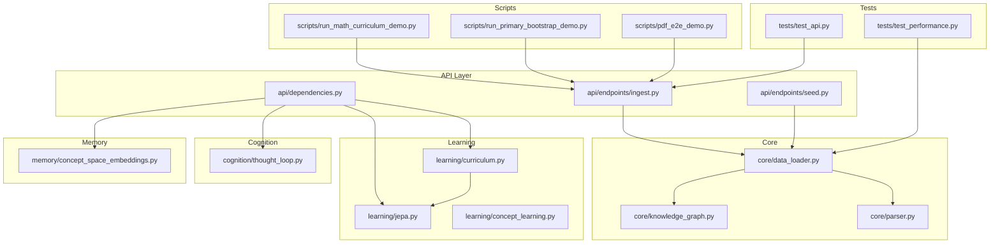
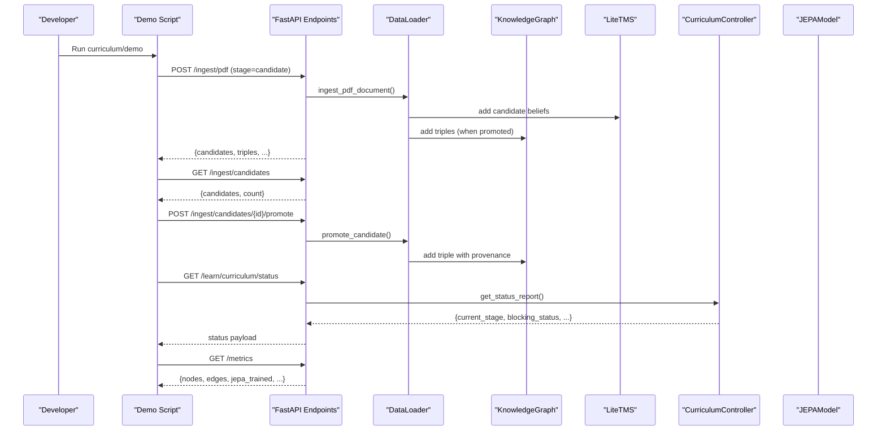
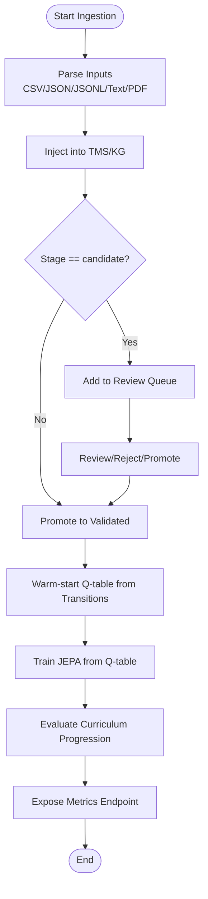
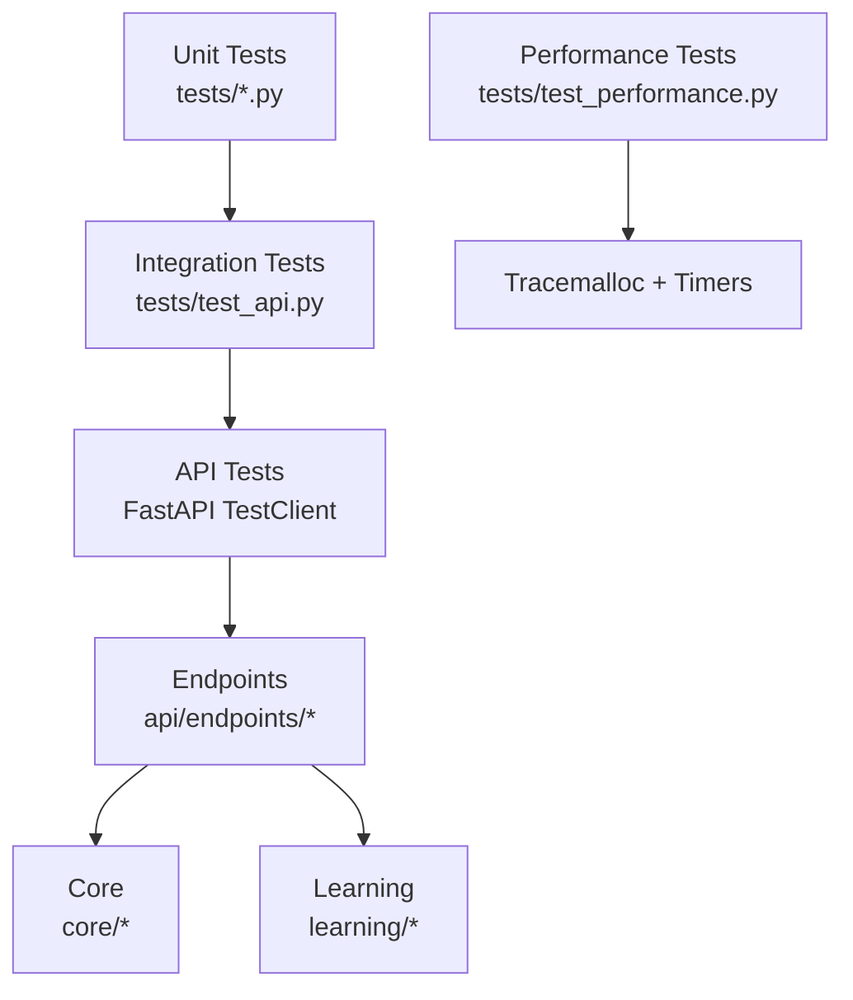
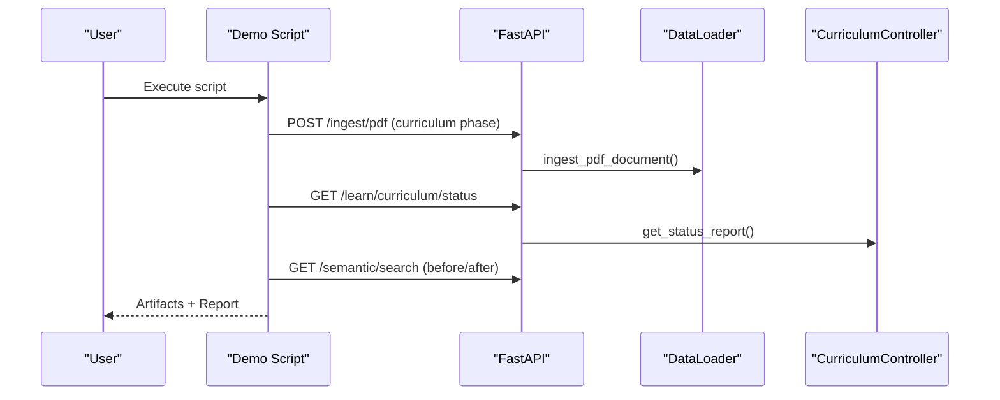
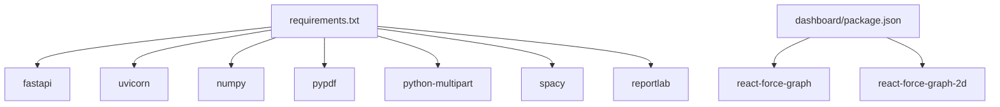

# Training and Development

<cite>
**Referenced Files in This Document**
- [run_math_curriculum_demo.py](file://scripts/run_math_curriculum_demo.py)
- [run_primary_bootstrap_demo.py](file://scripts/run_primary_bootstrap_demo.py)
- [pdf_e2e_demo.py](file://scripts/pdf_e2e_demo.py)
- [curriculum.py](file://learning/curriculum.py)
- [jepa.py](file://learning/jepa.py)
- [test_api.py](file://tests/test_api.py)
- [test_performance.py](file://tests/test_performance.py)
- [ingest.py](file://api/endpoints/ingest.py)
- [dependencies.py](file://api/dependencies.py)
- [data_loader.py](file://core/data_loader.py)
- [seed.py](file://api/endpoints/seed.py)
- [requirements.txt](file://requirements.txt)
- [package.json](file://package.json)
</cite>

## Table of Contents
1. [Introduction](#introduction)
2. [Project Structure](#project-structure)
3. [Core Components](#core-components)
4. [Architecture Overview](#architecture-overview)
5. [Detailed Component Analysis](#detailed-component-analysis)
6. [Dependency Analysis](#dependency-analysis)
7. [Performance Considerations](#performance-considerations)
8. [Troubleshooting Guide](#troubleshooting-guide)
9. [Conclusion](#conclusion)
10. [Appendices](#appendices)

## Introduction
This document describes the Training and Development workflows of the Semantic AI Decision Engine. It covers the end-to-end pipeline from data preparation and ingestion, to model training with Q-learning and JEPA, validation and curriculum progression, and performance monitoring. It also documents the testing framework (unit, integration, API, and performance), demonstration scripts for curriculum learning and primary bootstrap, and development practices including code organization, CI considerations, and release management.

## Project Structure
The repository organizes functionality by domain and lifecycle:
- api: FastAPI endpoints and runtime dependencies
- core: Data loaders, parsers, knowledge graph, and reasoning utilities
- learning: Curriculum controller, concept learning, JEPA model, and online learning
- cognition: Thought loop and conflict resolution
- memory: Concept space embeddings and graph storage
- scripts: Demonstration and validation pipelines
- tests: Unit and integration test suites
- artifacts: Training PDFs, seeds, and demo outputs

**Diagram sources**
- [ingest.py:1-292](file://api/endpoints/ingest.py#L1-L292)
- [seed.py:1-29](file://api/endpoints/seed.py#L1-L29)
- [dependencies.py:1-800](file://api/dependencies.py#L1-L800)
- [data_loader.py:1-500](file://core/data_loader.py#L1-L500)
- [curriculum.py:1-296](file://learning/curriculum.py#L1-L296)
- [jepa.py:1-185](file://learning/jepa.py#L1-L185)
- [concept_learning.py:1-38](file://learning/concept_learning.py#L1-L38)
- [thought_loop.py](file://cognition/thought_loop.py)
- [concept_space_embeddings.py](file://memory/concept_space_embeddings.py)
- [run_math_curriculum_demo.py:1-176](file://scripts/run_math_curriculum_demo.py#L1-L176)
- [run_primary_bootstrap_demo.py:1-184](file://scripts/run_primary_bootstrap_demo.py#L1-L184)
- [pdf_e2e_demo.py:1-140](file://scripts/pdf_e2e_demo.py#L1-L140)
- [test_api.py:1-800](file://tests/test_api.py#L1-L800)
- [test_performance.py:1-51](file://tests/test_performance.py#L1-L51)

**Section sources**
- [requirements.txt:1-9](file://requirements.txt#L1-L9)
- [package.json:1-7](file://package.json#L1-L7)

## Core Components
- Data Loader: Parses and ingests structured and unstructured data into the Knowledge Graph and Temporal Memory System, with support for PDFs, CSV, JSON/JSONL, and text files. Provides candidate review queues and transition warm-up for Q-learning.
- Curriculum Controller: Enforces monotonic stage progression gated by concept density and JEPA stability, with persistence and status reporting.
- JEPA Model: Lightweight I-JEPA predictive model for latent state forecasting, used to score actions and stabilize RL training.
- API Endpoints: Ingestion endpoints for facts, documents, PDFs, and candidate review; seed status; and curriculum orchestration.
- Thought Loop: Cognitive simulation and artifact generation for decision diagnostics.
- Concept Space Embeddings: Tracks concept embeddings across spaces for curriculum and readiness.

**Section sources**
- [data_loader.py:1-500](file://core/data_loader.py#L1-L500)
- [curriculum.py:1-296](file://learning/curriculum.py#L1-L296)
- [jepa.py:1-185](file://learning/jepa.py#L1-L185)
- [ingest.py:1-292](file://api/endpoints/ingest.py#L1-L292)
- [seed.py:1-29](file://api/endpoints/seed.py#L1-L29)
- [dependencies.py:1-800](file://api/dependencies.py#L1-L800)

## Architecture Overview
The training and development pipeline integrates ingestion, curriculum gating, and model training:

**Diagram sources**
- [pdf_e2e_demo.py:63-136](file://scripts/pdf_e2e_demo.py#L63-L136)
- [ingest.py:105-154](file://api/endpoints/ingest.py#L105-L154)
- [data_loader.py:200-294](file://core/data_loader.py#L200-L294)
- [dependencies.py:249-274](file://api/dependencies.py#L249-L274)
- [curriculum.py:228-252](file://learning/curriculum.py#L228-L252)

## Detailed Component Analysis

### Training Pipeline: Data Preparation, Q-learning Warm-up, JEPA Training, Validation, Metrics
- Data preparation
  - Structured ingestion: CSV/JSON/JSONL with facts, texts, transitions.
  - Natural language ingestion: sentence segmentation and parsing into triples.
  - PDF ingestion: page/paragraph/sentence chunking with provenance metadata.
  - Candidate queue: staged ingestion with review and promotion.
- Q-learning warm-up
  - Transitions are applied to the Q-table with SARSA-style updates using configured alpha and gamma.
- JEPA training
  - Online updates from simulated outcomes; early stopping by loss and patience.
  - Multispace embedding vectors for state/action contexts.
- Curriculum validation
  - Density threshold (concept count) and stability threshold (average JEPA loss) gate stage advancement.
- Metrics collection
  - Endpoint exposes KG statistics, inference counters, and JEPA training status.

**Diagram sources**
- [data_loader.py:115-198](file://core/data_loader.py#L115-L198)
- [data_loader.py:200-294](file://core/data_loader.py#L200-L294)
- [data_loader.py:305-337](file://core/data_loader.py#L305-L337)
- [dependencies.py:570-603](file://api/dependencies.py#L570-L603)
- [curriculum.py:128-202](file://learning/curriculum.py#L128-L202)
- [dependencies.py:85-106](file://api/dependencies.py#L85-L106)

**Section sources**
- [data_loader.py:1-500](file://core/data_loader.py#L1-L500)
- [dependencies.py:570-603](file://api/dependencies.py#L570-L603)
- [curriculum.py:1-296](file://learning/curriculum.py#L1-L296)
- [dependencies.py:85-106](file://api/dependencies.py#L85-L106)

### Testing Framework: Unit, Integration, API, Performance
- Unit tests
  - Concept learning, embeddings, emotion space, reasoning, symbolic math, parser, and thought loop.
- Integration tests
  - API endpoints using TestClient; mocks main’s Q-table and initializes lightweight singletons.
- API tests
  - Coverage of semantic search/recall, arithmetic unlocks, calculus/logarithms, curriculum phases, and primary readiness/drip.
- Performance tests
  - Large PDF ingestion smoke test with time and memory thresholds.

**Diagram sources**
- [test_api.py:1-800](file://tests/test_api.py#L1-L800)
- [test_performance.py:1-51](file://tests/test_performance.py#L1-L51)

**Section sources**
- [test_api.py:1-800](file://tests/test_api.py#L1-L800)
- [test_performance.py:1-51](file://tests/test_performance.py#L1-L51)

### Demonstration Scripts: Math Curriculum, Primary Bootstrap, PDF E2E
- Math Curriculum Demo
  - Generates curriculum PDFs per phase, posts to ingestion, checks semantic search improvements, and writes artifacts and reports.
- Primary Bootstrap Demo
  - Builds weekly plans, generates lessons, ingests facts/texts/PDFs, and tracks readiness coverage delta.
- PDF E2E Demo
  - Creates a simple PDF, ingests, lists candidates, promotes, and validates recall.

**Diagram sources**
- [run_math_curriculum_demo.py:100-171](file://scripts/run_math_curriculum_demo.py#L100-L171)
- [run_primary_bootstrap_demo.py:78-180](file://scripts/run_primary_bootstrap_demo.py#L78-L180)
- [pdf_e2e_demo.py:63-136](file://scripts/pdf_e2e_demo.py#L63-L136)
- [ingest.py:105-154](file://api/endpoints/ingest.py#L105-L154)
- [curriculum.py:228-252](file://learning/curriculum.py#L228-L252)

**Section sources**
- [run_math_curriculum_demo.py:1-176](file://scripts/run_math_curriculum_demo.py#L1-L176)
- [run_primary_bootstrap_demo.py:1-184](file://scripts/run_primary_bootstrap_demo.py#L1-L184)
- [pdf_e2e_demo.py:1-140](file://scripts/pdf_e2e_demo.py#L1-L140)

### Practical Examples
- Training configurations
  - Curriculum error tolerance and stability window defaults are configurable and persisted.
  - JEPA hyperparameters (learning rate, EMA decay, minimum samples) and early stopping thresholds.
- Test execution
  - Run API tests via Python unittest discovery; performance tests with tracemalloc and time profiling.
- Performance monitoring
  - Metrics endpoint exposes nodes/edges, inference counts, conflicts, and JEPA training status.

**Section sources**
- [curriculum.py:64-67](file://learning/curriculum.py#L64-L67)
- [jepa.py:38-47](file://learning/jepa.py#L38-L47)
- [dependencies.py:538-541](file://api/dependencies.py#L538-L541)
- [test_performance.py:23-47](file://tests/test_performance.py#L23-L47)
- [dependencies.py:85-106](file://api/dependencies.py#L85-L106)

## Dependency Analysis
External dependencies include FastAPI, NumPy, PyPDF, spaCy, multipart form handling, and ReportLab for demos.

**Diagram sources**
- [requirements.txt:1-9](file://requirements.txt#L1-L9)
- [package.json:1-7](file://package.json#L1-L7)

**Section sources**
- [requirements.txt:1-9](file://requirements.txt#L1-L9)
- [package.json:1-7](file://package.json#L1-L7)

## Performance Considerations
- Ingestion throughput and latency are monitored with conservative thresholds in performance tests.
- JEPA early stopping reduces unnecessary training overhead.
- Candidate review queue and deduplication minimize redundant processing.

[No sources needed since this section provides general guidance]

## Troubleshooting Guide
Common issues and approaches:
- PDF ingestion errors
  - Validate media type, size limits, and metadata JSON; handle exceptions and return structured errors.
- Candidate promotion failures
  - Ensure candidate exists and is pending; promote only valid candidates.
- Curriculum progression blocked
  - Inspect density vs. stability gating; adjust error tolerance or gather more training data.
- Rate limiting
  - Respect ingest rate limits per route window; back off and retry.
- API key enforcement
  - Provide X-API-Key header when required; otherwise expect 403.

**Section sources**
- [ingest.py:114-154](file://api/endpoints/ingest.py#L114-L154)
- [ingest.py:260-274](file://api/endpoints/ingest.py#L260-L274)
- [curriculum.py:186-202](file://learning/curriculum.py#L186-L202)
- [dependencies.py:195-208](file://api/dependencies.py#L195-L208)
- [dependencies.py:81-88](file://api/dependencies.py#L81-L88)

## Conclusion
The Training and Development workflows integrate robust ingestion, curriculum-driven progression, and model-backed decision-making. The testing and demonstration suites provide reliable validation and reproducible examples. Adhering to the documented practices ensures consistent training, accurate validation, and maintainable development.

[No sources needed since this section summarizes without analyzing specific files]

## Appendices

### Appendix A: End-to-End Pipeline Validation
- Use the PDF E2E demo to validate ingestion, candidate promotion, and recall.
- Use the Math Curriculum demo to validate phased learning and semantic search improvements.
- Use the Primary Bootstrap demo to validate readiness coverage and drip learning.

**Section sources**
- [pdf_e2e_demo.py:63-136](file://scripts/pdf_e2e_demo.py#L63-L136)
- [run_math_curriculum_demo.py:100-171](file://scripts/run_math_curriculum_demo.py#L100-L171)
- [run_primary_bootstrap_demo.py:78-180](file://scripts/run_primary_bootstrap_demo.py#L78-L180)

### Appendix B: Development Workflow and Release Management
- Code organization
  - Feature-based packages (api, core, learning, cognition, memory) with clear boundaries.
  - Centralized runtime dependencies and singletons in api/dependencies.py.
- Testing strategies
  - Unit tests for isolated components; integration tests for endpoint behavior; performance tests for ingestion.
- Continuous integration
  - Configure CI to run unit and integration tests; optionally include performance benchmarks.
- Release management
  - Tag releases; publish artifacts; keep changelog entries for curriculum and model changes.

[No sources needed since this section provides general guidance]